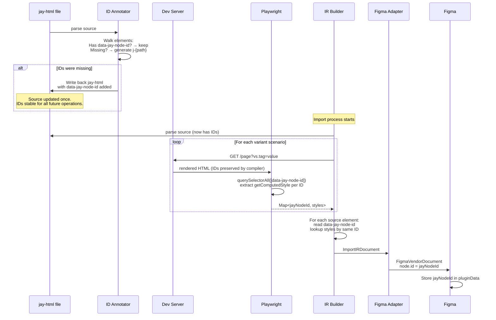
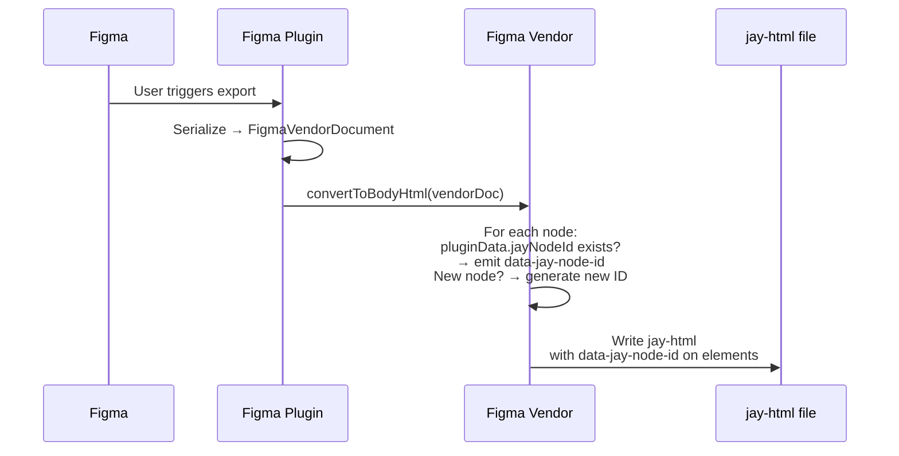
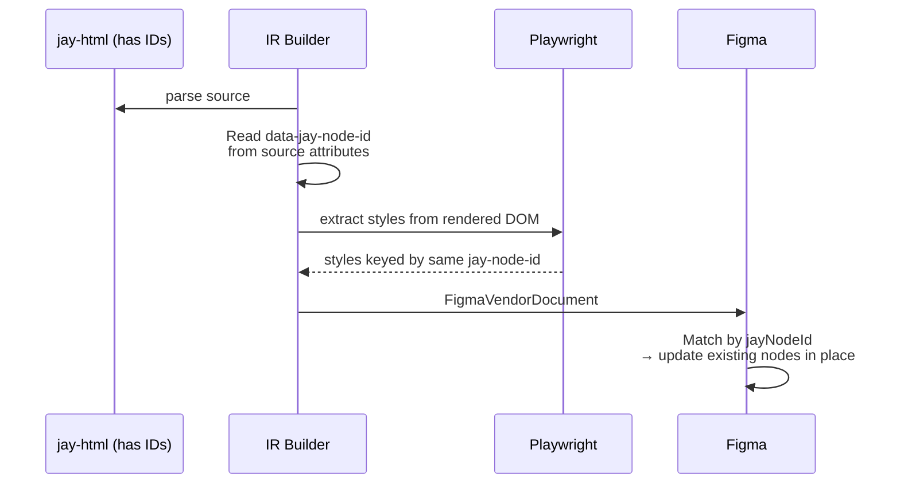

# Design Log 102: `data-jay-node-id` — Stable Element Identity for Import/Export

> Vendor-agnostic element identity that enables accurate style extraction, roundtrip stability, and multi-vendor support.

## Background

The Figma import pipeline needs to match elements across three contexts:
1. **Source jay-html** — parsed by node-html-parser (server-side)
2. **Rendered page** — served by the dev server, rendered by Playwright (browser)
3. **Vendor document** — FigmaVendorDocument (or other vendor formats)

Currently, each context generates its own keys independently:
- IR builder: `body>0>2>1` (index-based DOM path from source)
- Playwright: `div:nth-child(1) > div:nth-child(3)` (CSS selector from rendered DOM)
- Figma export: `data-figma-id="2:1619"` (Figma's internal node ID)

A brittle normalization hack converts CSS selectors to index paths. It breaks when the rendered DOM differs from source (runtime wrappers, hydration markers, `if`/`forEach` expansion).

## Problem

1. **No single identity** — three systems compute keys independently, hoping they match
2. **Vendor-coupled** — `data-figma-id` is Figma-specific
3. **Positional keys are fragile** — any DOM mutation between source and render breaks matching

## Key Insight

The jay-html is the source of truth, but **we can add IDs to it**. Adding `data-jay-node-id` to elements is metadata — like `class` or `ref`, it doesn't change the template's meaning. It just helps tools work with it.

Since `data-*` attributes survive the Jay compiler and runtime unchanged (verified: compiler emits them in SSR, runtime applies them via `setAttribute`, hydration preserves them from SSR HTML), IDs written to the jay-html source will appear in the rendered DOM exactly as-is.

## Design

### The `data-jay-node-id` Attribute

A stable ID on each jay-html element, managed by the import/export process:

- **Written to jay-html source** — lives alongside other attributes
- **Preserved by compiler** — passes through to rendered DOM unchanged
- **Readable everywhere** — source parser, Playwright, vendor adapters all see the same value
- **No compiler changes needed** — the compiler already preserves `data-*` attributes

### ID Format

```html
<!-- Readable, position-based -->
<div data-jay-node-id="j-0">
  <header data-jay-node-id="j-0-0">
    <nav data-jay-node-id="j-0-0-0">...</nav>
  </header>
  <div if="inStock" data-jay-node-id="j-0-1">In Stock</div>
  <div if="!inStock" data-jay-node-id="j-0-2">Out of Stock</div>
  <ul forEach="item in items" data-jay-node-id="j-0-3">
    <li data-jay-node-id="j-0-3-0">{item.name}</li>
  </ul>
</div>
```

Human-readable, based on element's index path in the source template. Prefixed with `j-` to avoid collisions.

### How Matching Works

All three systems read the same attribute from the same source:

```
  jay-html source file
  ┌─────────────────────────────────────┐
  │ <div data-jay-node-id="j-0-1"      │
  │      if="inStock">                  │
  │   In Stock                          │
  │ </div>                              │
  └───────┬──────────────┬──────────────┘
          │              │
          ▼              ▼
   ┌─────────────┐  ┌──────────────────┐
   │ IR Builder  │  │ Jay Compiler     │
   │             │  │                  │
   │ reads attr  │  │ preserves attr   │
   │ "j-0-1"    │  │ in rendered DOM  │
   └──────┬──────┘  └────────┬─────────┘
          │                  │
          │                  ▼
          │          ┌───────────────┐
          │          │ Dev Server    │
          │          │ rendered page │
          │          │ has "j-0-1"  │
          │          └───────┬───────┘
          │                  │
          │                  ▼
          │          ┌───────────────┐
          │          │ Playwright    │
          │          │ reads "j-0-1"│
          │          │ → styles     │
          │          └───────┬───────┘
          │                  │
          ▼                  ▼
   ┌────────────────────────────────┐
   │        MATCH: "j-0-1"         │
   │   IR node gets correct styles │
   └────────────────────────────────┘
```

### Import Flow (jay-html → Figma)



#### First import (no IDs yet):

1. **Annotator** walks parsed jay-html, generates `data-jay-node-id` for every element
2. **Writes IDs back** to the jay-html file (one-time operation)
3. Dev server hot-reloads or restarts to pick up the change
4. From this point on, IDs exist in source and rendered DOM → everything matches

### Export Flow (Figma → jay-html)



#### New Figma elements (no jayNodeId):

1. Designer added a new frame — Figma node has no `jayNodeId`
2. Export generates a new `data-jay-node-id` for it
3. Written to jay-html → stable for future roundtrips

### Re-import (roundtrip)



No computation needed — IDs are already in the source from the previous export.

### Summary: All Cases

| Scenario | What happens |
|---|---|
| **First import** (no IDs) | Annotator generates IDs, writes to jay-html, then imports |
| **Re-import** (has IDs) | IDs read from source, match rendered DOM directly |
| **First export** (new Figma design) | Export generates new IDs, writes to jay-html |
| **Re-export** (has IDs) | Preserves existing jayNodeId from pluginData |
| **Developer adds element** | No ID on new element → annotator adds one on next import |
| **Designer adds element** | No jayNodeId → export generates one |
| **Developer deletes element** | ID disappears → Figma node orphaned |
| **Designer deletes element** | Not in export → element removed from jay-html |

## Dropping `data-figma-id`

| Current | New |
|---|---|
| `data-figma-id` in exported jay-html | `data-jay-node-id` |
| `data-figma-type` in exported jay-html | removed (vendor-specific) |
| `data-figma-id` in IR builder lookup | `data-jay-node-id` |
| `data-figma-id` in Playwright extraction | `data-jay-node-id` |
| Figma node ID as element identity | `pluginData.jayNodeId` |

## Implementation Plan

### Phase 1: ID Annotator

A function that walks a parsed jay-html DOM and ensures every element has `data-jay-node-id`:

```typescript
function annotateJayNodeIds(body: HTMLElement): boolean {
    let changed = false;
    let counter = 0;

    function walk(el: HTMLElement, path: number[]) {
        if (!el.getAttribute('data-jay-node-id')) {
            el.setAttribute('data-jay-node-id', `j-${path.join('-')}`);
            changed = true;
        }
        let childIndex = 0;
        for (const child of el.childNodes) {
            if (child is element) {
                walk(child, [...path, childIndex]);
                childIndex++;
            }
        }
    }

    walk(body, [0]);
    return changed; // true if file needs rewriting
}
```

Called before enrichment. If IDs were added, writes the updated jay-html back to disk.

**File**: new `packages/jay-stack/stack-cli/lib/vendors/figma/jay-node-id-annotator.ts`

### Phase 2: Simplify Enricher

Replace the two-pass extraction + normalization hack with a single pass:

```typescript
// In browser (Playwright)
const elements = document.querySelectorAll('[data-jay-node-id]');
for (const el of elements) {
    const id = el.getAttribute('data-jay-node-id');
    const styles = window.getComputedStyle(el);
    // ... extract styles keyed by id
}
```

Remove: `generateDomPath()` in browser, CSS selector normalization, `div#target` prefix handling.

**File**: `computed-style-enricher.ts`

### Phase 3: Simplify IR Builder

```typescript
// In buildNodeFromElement
const jayNodeId = element.getAttribute('data-jay-node-id');
const enrichedStyles = jayNodeId ? computedStyleMap?.get(jayNodeId) : undefined;
const nodeId = jayNodeId || generateNodeId(domPath, anchors);
```

Remove: `figmaId || domPath` fallback chain.

**File**: `jay-html-to-import-ir.ts`, `id-generator.ts`

### Phase 4: Update Export

Replace `data-figma-id` with `data-jay-node-id` in the Figma vendor export.

**File**: `packages/jay-stack/stack-cli/lib/vendors/figma/index.ts`

## Trade-offs

| Decision | Benefit | Cost |
|---|---|---|
| IDs in jay-html source | Simple, reliable, no compiler changes | Adds attributes to source files |
| Write-back on first import | One-time, then stable forever | Modifies developer's file (must be clean) |
| Position-based IDs (j-0-1) | Human-readable, deterministic | Unstable if elements reordered |
| Vendor-agnostic naming | Works for any design tool | Migration from data-figma-id |

---

## Implementation Results

### What was done

1. **Created `jay-node-id-annotator.ts`** — walks parsed jay-html body, stamps every element with `data-jay-node-id="j-{position-path}"`, preserves existing IDs.

2. **Simplified `computed-style-enricher.ts`** — single-pass `querySelectorAll('[data-jay-node-id]')` replaces the two-pass approach (figma-id elements + DOM-path fallback + CSS-selector normalization hack). ~60 lines removed.

3. **Simplified `jay-html-to-import-ir.ts`** — reads `data-jay-node-id` directly, uses it as both the node ID and the computed style map key. No more DOM path reconstruction or fragile normalization.

4. **Updated all export converters** (text, vector, variants, repeater, rectangle, image, group, ellipse) — emit `data-jay-node-id` instead of `data-figma-id`. Dropped `data-figma-type` entirely.

5. **Integrated annotator into `convertFromJayHtml`** — runs before enrichment, writes back to source file so the dev server renders with the IDs, brief wait for hot-reload.

6. **Updated all test fixtures** — 6 expected.jay-html + 2 actual-output.jay-html files migrated.

### Test results

- **208/208 tests passing** across 9 test files (0 failures)
- Annotator unit tests: 7/7
- Scenario generation: 30/30
- Figma import fixtures: 20/20
- Figma export fixtures: 5/5
- Other: 146/146

### Deviations from design

- None. Implementation follows the design exactly.
