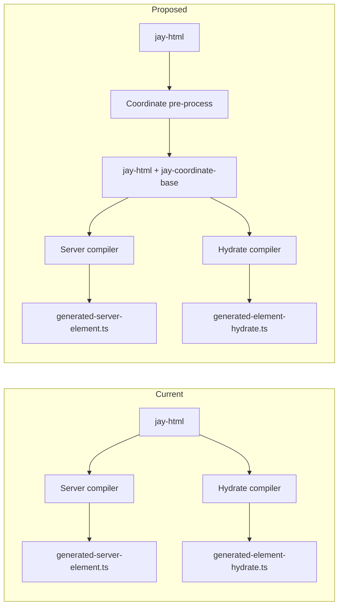

# Design Log 103 — Coordinate Pre-Processing for SSR/Hydration Consistency

## Background

DL93 (client hydration) and DL94 (SSR streaming) use `jay-coordinate` attributes to link server-rendered DOM with client hydration. DL99 fixed several coordinate alignment bugs by ensuring server and hydrate compilers use the same conventions (prefix for root children, ref names for conditionals, etc.). The fix required careful coordination between two independent compiler targets.

The root cause: **coordinate assignment logic is duplicated** in `renderServerElementContent` and `renderHydrateElementContent`. Each target independently decides when to assign coordinates, what values to use, and when to increment counters. They diverge when conventions change or edge cases appear.

Recent fix (product page duplicate add-to-cart): Server emitted flat coordinates (`"addToCart"`, `"5"`) for root children while hydrate expected hierarchical (`"0/addToCart"`, `"0/5"`). Adopt failed, createFallback ran, duplicating the conditional content.

## Problem

1. **Duplication** — Two compiler targets each implement coordinate assignment. Any change must be applied in both places.
2. **Divergence risk** — Subtle differences (e.g. `coordinate !== '0'` vs `coordinate !== null`) cause runtime bugs that unit tests miss.
3. **Smoke test fragility** — fake-shop smoke test failures may stem from coordinate changes affecting headless instance rendering or `__headlessInstances` key lookups.

## Proposed Approach: Pre-Processing Step

Assign coordinates to **all elements** in a **single pre-processing step** before either compiler runs. Add a `jay-coordinate-base` (or similar) attribute to each element. Both server and hydrate compilers **read** this attribute instead of computing coordinates.



## Design

### When to Run

- **After slow-render** — The slow-render transform (DL75) unrolls `forEach` into `slowForEach` items and evaluates slow conditions. Coordinates should be assigned on the **final DOM structure** that both targets compile. So: parse → slow-render (if SSG) → **coordinate pre-process** → server + hydrate compilation.

### Attribute Name

- `jay-coordinate-base` — Distinguishes from the runtime `jay-coordinate` in output HTML. The pre-process writes to the parsed DOM; compilers read it. Server outputs `jay-coordinate` (same value) in HTML; hydrate uses the value in `adoptElement("...", ...)`.

### Coordinate Scheme

Hierarchical, position-based:

- Root content element: `"0"`
- Children: `"0/1"`, `"0/2"`, `"0/3"` (sibling index)
- With ref: use ref name (camelCase) instead of index: `"0/addToCart"`, `"0/5"`
- Inside forEach item (trackBy `_id`): `"0/{_id}"`, `"0/{_id}/0"`, `"0/{_id}/1"`
- Inside slowForEach (jayTrackBy `p1`): `"0/p1"`, `"0/p1/0"`, `"0/p1/product-card:0"`
- Headless instance: `"product-card:0"` or `"p1/product-card:0"` (existing convention)

Refs take precedence over auto-index. Conditionals use ref when present, else index.

### Scope

Assign to **every element** that needs a coordinate (elements with refs, dynamic content, conditionals, forEach/slowForEach items, or that contain such). Assigning to all elements simplifies the algorithm and avoids special-case logic. Static leaf elements can get coordinates too — they are cheap and ensure consistency.

### Output

The pre-process mutates the parsed DOM (or produces a new DOM) with `element.setAttribute('jay-coordinate-base', value)`. Compilers read `element.getAttribute('jay-coordinate-base')` and use it directly. No coordinate counter, no prefix logic in either target.

### jay-coordinate-base is never serialized to output

- **SSR output HTML** — Emits `jay-coordinate` with the **final runtime value** (e.g. `"0/abc123/0"`), never `jay-coordinate-base`. The server compiler uses `jay-coordinate-base` only internally to know what to emit; the output attribute is `jay-coordinate`.
- **Hydration script** — `adoptElement("0/abc123/0", ...)` uses the coordinate string. The script never references or contains `jay-coordinate-base`. For dynamic coordinates (forEach), the script emits a runtime expression that produces the final string.
- **Rationale** — `jay-coordinate-base` is a compile-time artifact for consistency between targets. It must not leak into user-facing output or increase bundle size.

### Shared utilities for coordinate rendering

For coordinates with placeholders (e.g. `"0/{_id}/0"`, `"0/{trackBy}/product-card:0"`), both server and hydrate compilers need to produce the **final coordinate string** at runtime. Extract shared utility functions:

```typescript
// compiler-shared or compiler-jay-html
export function renderCoordinateTemplate(
  template: string,
  placeholders: Record<string, string | ((ctx: any) => string)>,
  ctx: any
): string;
```

- **Server**: Uses `renderCoordinateTemplate` when emitting `jay-coordinate` for forEach items. Template from `jay-coordinate-base`, placeholders from trackBy expression.
- **Hydrate**: Uses same util when emitting `adoptElement(coordExpr, ...)` — the `coordExpr` is a JS expression that calls the shared util.
- **Single source**: Both targets import from the same module. No duplication of placeholder substitution logic.

### Debug saved file after pre-processing

Write the pre-processed DOM (with `jay-coordinate-base` on each element) to a debug file for inspection. Useful when debugging coordinate mismatches or verifying the pre-process output.

- **Location**: `build/debug/coordinate-preprocess/<route-or-page>.html` (or `.jay-html` if it preserves jay-html structure)
- **When**: Only in dev/debug mode or when `JAY_DEBUG_COORDINATES=1` (or similar env)
- **Content**: Serialized HTML with `jay-coordinate-base` attributes visible. Enables diffing before/after, verifying hierarchy.

## Implementation Plan

### Phase 1: Extract coordinate assignment to shared module

- Create `assignCoordinates(dom: HTMLElement, options?)` in `compiler-jay-html` (or `compiler-shared`)
- Walks DOM, assigns `jay-coordinate-base` to each element using the scheme above
- Handles: root, children, refs, conditionals, forEach, slowForEach, headless instances
- Returns void (mutates DOM) or new DOM

### Phase 1b: Shared coordinate template utility

- Create `renderCoordinateTemplate(template, placeholders, ctx)` — runtime function used by both server (Node) and hydrate (browser)
- Package: `@jay-framework/runtime` or `@jay-framework/compiler-shared` (depending on whether it's runtime or build-time)
- Server and hydrate generated code both call this when the template has placeholders (e.g. `{_id}`)

### Phase 1c: Debug file output

- After `assignCoordinates()`, optionally write the pre-processed DOM to `build/debug/coordinate-preprocess/<path>.html`
- Gated by `JAY_DEBUG_COORDINATES=1` or dev mode
- Serialize DOM with `jay-coordinate-base` attributes for inspection

### Phase 2: Integrate into compilation pipeline

- **Server-element**: Before `renderServerNode`, run `assignCoordinates(body)`. In `renderServerElementContent`, read `element.getAttribute('jay-coordinate-base')` instead of computing.
- **Hydrate**: Same — run pre-process, then read attribute in `renderHydrateElementContent`.
- Ensure both receive the **same** DOM (after slow-render, before target-specific compilation).

### Phase 3: Remove coordinate logic from targets

- Delete `coordinateCounter`, `coordinatePrefix` from `ServerContext` and `HydrateContext` (or reduce to minimal)
- Replace all coordinate computation with attribute read
- Update `isLiteralPrefix` and related logic — no longer needed if coordinates are pre-assigned

### Phase 4: Tests and verification

- Update compiler fixtures (server + hydrate) to reflect new output
- Add/update SSR+hydration integration test (DL99 Phase 5)
- Run fake-shop smoke test, verify home page and product page

### Phase 5: Pre-processing tests

Add tests for the coordinate pre-processing step to both test suites:

- **`generate-server-element.test.ts`** — Add `describe('coordinate pre-processing')` with tests that:
  - Run `assignCoordinates()` on fixture jay-html
  - Assert expected `jay-coordinate-base` attributes on elements (by selector or structure)
  - Cover: root, children, refs, conditionals, forEach, slowForEach, headless instances

- **`generate-element-hydrate.test.ts`** — Same `describe('coordinate pre-processing')` block (or shared test file):
  - Reuse the same fixtures and assertions
  - Ensures pre-process output is identical regardless of which target runs first

- **Fixture-based**: Store expected pre-process output in `test/fixtures/<feature>/preprocessed-coordinates.json` (or similar) — map of selector → expected `jay-coordinate-base` value. Tests compare actual vs expected.

## Examples

### Before (current — computed per target)

```typescript
// Server: coordinatePrefix logic, counter
w(' jay-coordinate="' + (context.coordinatePrefix ? context.coordinatePrefix + '/' : '') + coordinate + '">');

// Hydrate: coordinatePrefix logic, counter
const coordinate = context.coordinatePrefix?.length
    ? context.coordinatePrefix.join('/') + '/' + baseCoord
    : baseCoord;
adoptElement(coordinate, ...);
```

### After (proposed — read from DOM)

```typescript
// Pre-process (once):
assignCoordinates(rootElement);

// Server: read
const coord = element.getAttribute('jay-coordinate-base');
if (coord) w(' jay-coordinate="' + coord + '">');

// Hydrate: read
const coord = element.getAttribute('jay-coordinate-base');
if (coord) adoptElement(coord, ...);
```

### ForEach / slowForEach

Pre-process runs **after** slow-render. So forEach is either:
- Still `forEach` (dynamic) — pre-process assigns `"0/{_id}"` for item root, `"0/{_id}/0"` for children (placeholder syntax)
- Unrolled to `slowForEach` — pre-process sees literal `jayTrackBy` values, assigns `"0/p1"`, `"0/p1/0"`, etc. (no placeholders)

The pre-process needs access to variable context (forEach item var, trackBy) for dynamic expressions. It may need to run in two passes or receive metadata from the parser.

### Coordinate template rendering (shared util)

```typescript
// Pre-process assigns: jay-coordinate-base="0/{_id}/0"
// Server emits (inside forEach loop):
w(' jay-coordinate="' + renderCoordinateTemplate('0/{_id}/0', { _id: vs1._id }) + '">');
// Output at runtime: jay-coordinate="0/abc123/0"

// Hydrate emits (generated code):
adoptElement(renderCoordinateTemplate('0/{_id}/0', { _id: (vs1) => vs1._id })(vs1), ...);
// At runtime: adoptElement("0/abc123/0", ...)
```

## Trade-offs

| Approach | Pros | Cons |
| -------- | ---- | ---- |
| **Pre-process** | Single source of truth, no divergence | New pipeline step, pre-process must handle all cases |
| **Shared module** (DL99 Phase 1) | Less duplication | Both targets still "compute" — must call shared fn at right time with right context |
| **Status quo** | No new infra | Repeated bugs, manual sync |

Pre-process is more invasive but eliminates the class of bugs. Shared module reduces duplication but both targets still need correct context (prefix, counter) — easier to get wrong.

## Questions and Answers

**Q: Does the pre-process need the full parse result (variables, contract refs)?**  
A: Yes — to resolve ref names, forEach trackBy, headless instance coordinates. It likely runs as a pass over the parsed `JayHtmlSourceFile` (which has body + metadata), not raw HTML.

**Q: What about async/loading content — coordinates for placeholders?**  
A: Placeholders (e.g. `when-loading`) are static structure. Pre-process assigns coordinates based on position. When resolved content replaces placeholder, the coordinate map may need to be rebuilt — or the placeholder keeps its coordinate and resolved content is adopted under it. TBD.

**Q: Performance — extra DOM walk?**  
A: One additional walk over the parsed DOM. Compilation is already multi-pass. Negligible for typical page size.

## Verification Criteria

1. All compiler tests pass (server-element, hydrate)
2. Pre-processing tests pass (new `describe` in both test files)
3. Runtime hydration tests pass
4. SSR+hydration integration test passes (if implemented)
5. fake-shop smoke test passes (home page, product page)
6. No duplicate elements after hydration (product page add-to-cart)
7. Rating stars and submit button work (product page)
8. **Output does not contain `jay-coordinate-base`** — grep SSR HTML and hydration script; attribute must not appear
