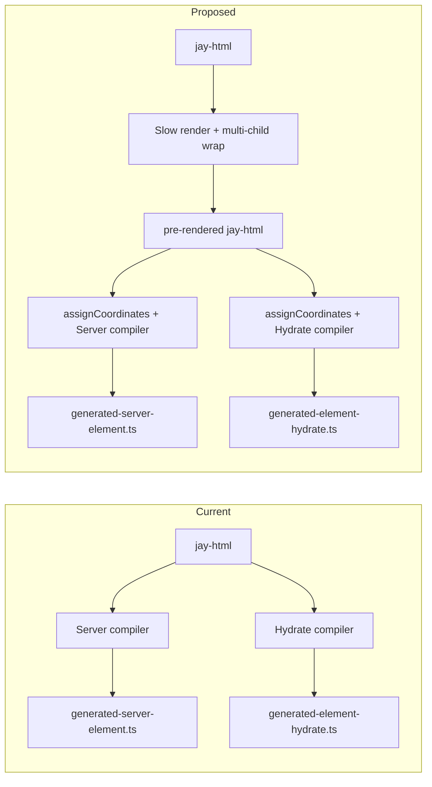

# Design Log 103 — Coordinate Pre-Processing for SSR/Hydration Consistency

## Background

DL93 (client hydration) and DL94 (SSR streaming) use `jay-coordinate` attributes to link server-rendered DOM with client hydration. DL99 fixed several coordinate alignment bugs by ensuring server and hydrate compilers use the same conventions (prefix for root children, ref names for conditionals, etc.). The fix required careful coordination between two independent compiler targets.

The root cause: **coordinate assignment logic is duplicated** in `renderServerElementContent` and `renderHydrateElementContent`. Each target independently decides when to assign coordinates, what values to use, and when to increment counters. They diverge when conventions change or edge cases appear.

Recent fix (product page duplicate add-to-cart): Server emitted flat coordinates (`"addToCart"`, `"5"`) for root children while hydrate expected hierarchical (`"0/addToCart"`, `"0/5"`). Adopt failed, createFallback ran, duplicating the conditional content.

## Problem

1. **Duplication** — Two compiler targets each implement coordinate assignment. Any change must be applied in both places.
2. **Divergence risk** — Subtle differences (e.g. `coordinate !== '0'` vs `coordinate !== null`) cause runtime bugs that unit tests miss.
3. **Smoke test fragility** — fake-shop smoke test failures may stem from coordinate changes affecting headless instance rendering or `__headlessInstances` key lookups.

## Proposed Approach: Pre-Processing Step

Assign coordinates to **all elements** in a **single pre-processing step** before rendering logic runs. Add a `jay-coordinate-base` attribute to each element. Both server and hydrate compilers **read** this attribute instead of computing coordinates.

Each generator (`generateServerElementFile`, `generateElementHydrateFile`) receives its own parsed `JayHtmlSourceFile` from the same source file. `assignCoordinates` runs at the **start of each generator**, mutating `jayFile.body` before any render logic. Since both parse the same source, the pre-processed structure is identical.



## Design

### When to Run

- **At the start of each generator** — Both `generateServerElementFile` and `generateElementHydrateFile` call `assignCoordinates(jayFile.body, headlessImports)` as their first step, before any render logic. Since both parse the same source file (pre-rendered when slow phase exists, original otherwise), the pre-processed structure is identical.
- **After slow-render** — The slow-render transform (DL75) unrolls `forEach` into `slowForEach` items, evaluates slow conditions, and wraps multi-child headless inline templates in a `<div>` (see "Multi-Child Wrapper" section). The pre-rendered output is the source file that both generators parse. So the full pipeline is: parse → slow-render (including multi-child wrap) → serialize → re-parse by each generator → **assignCoordinates** → target-specific compilation.

### Attribute Name

- `jay-coordinate-base` — Distinguishes from the runtime `jay-coordinate` in output HTML. The pre-process writes to the parsed DOM; compilers read it. Server outputs `jay-coordinate` (same value) in HTML; hydrate uses the value in `adoptElement("...", ...)`.
- **Compiler handling** — The `jay-coordinate-base` attribute must be ignored by attribute rendering in both targets (not emitted as an HTML attribute, not treated as a dynamic binding). Both compilers should filter it out when processing element attributes, similar to how `ref`, `if`, `forEach`, etc. are handled.

### Placeholder Syntax for Dynamic Coordinates

Inside `forEach`, coordinates contain dynamic segments (the trackBy value). The pre-process uses a distinct placeholder syntax to avoid collision with jay-html expression syntax `{expr}`:

- **Placeholder**: `$trackBy` — e.g., `"0/$_id/1"`, `"0/$_id/product-card:0"`
- Compilers recognize `$varName` placeholders and emit the appropriate runtime expression (string concatenation for server, JS expression for hydrate)
- This avoids ambiguity with `{_id}` which is already the jay-html data binding syntax

### Coordinate Scheme

Hierarchical, position-based:

- Root content element: `"0"`
- Children: `"0/1"`, `"0/2"`, `"0/3"` (sibling index)
- With ref: use ref name (camelCase) instead of index: `"0/addToCart"`, `"0/5"`
- Inside forEach item (trackBy `_id`): `"0/$_id"`, `"0/$_id/0"`, `"0/$_id/1"`
- Inside slowForEach (jayTrackBy `p1`): `"0/p1"`, `"0/p1/0"`, `"0/p1/product-card:0"`
- Headless instance: `"product-card:0"` or `"p1/product-card:0"` (existing convention)
- Headless instance children: `"product-card:0/0"`, `"product-card:0/1"`, `"product-card:0/addToCart"` (own scope, counter resets)

Refs take precedence over auto-index. Conditionals use ref when present, else index.

### Headless Instance Inline Template Coordinates

When the pre-process encounters a `<jay:contract-name>` tag, it enters a new coordinate scope:

1. The instance itself gets a coordinate like `"product-card:0"` (using ref or auto-counter with `contractName:N` format)
2. Inside the inline template, the counter resets to 0 and the prefix becomes the instance coordinate
3. Children get: `"product-card:0/0"`, `"product-card:0/1"`, `"product-card:0/addToCart"`, etc.
4. For forEach headless instances, the instance coordinate includes the dynamic prefix: `"$_id/product-card:0"`, children: `"$_id/product-card:0/0"`
5. For slowForEach headless instances, literal prefix: `"p1/product-card:0"`, children: `"p1/product-card:0/0"`

The pre-process needs headless import metadata to identify `<jay:xxx>` tags and their contract names.

### Multi-Child Wrapper (Part of Slow Rendering)

When a headless instance's inline template has multiple root-level children, the element, server, and hydrate targets all need a wrapper `<div>` for consistency. Currently, this wrapping is done independently in each compiler target (DL102 Issue 2).

**New approach:** Integrate the wrapping into the **slow rendering phase**, specifically in `resolveHeadlessInstances()` (`slow-render-transform.ts`), inside `walkAndResolve` when processing a `<jay:xxx>` element:

- After `transformChildren(element, ...)` returns `result.val`
- Before `element.innerHTML = ''` and `result.val.forEach((child) => element.appendChild(child))`
- If `result.val.length > 1`: create a wrapper `<div>`, append all children to it, then append the wrapper as the single child

For pages **without a slow phase**, headless instance inline templates are not resolved by slow rendering. In this case, `assignCoordinates` handles the wrapping as a normalization step: when it encounters a `<jay:xxx>` tag with multiple children, it inserts the wrapper `<div>` before assigning coordinates. This ensures consistency regardless of whether slow rendering ran.

This ensures:

- The parsed DOM already has the wrapper before coordinate assignment
- The pre-process assigns coordinates naturally (wrapper gets `product-card:0/0`, children get `product-card:0/0/0`, etc.)
- Both compilers see the same DOM structure — no per-target wrapping logic needed

### Scope

Assign to **every element** that needs a coordinate (elements with refs, dynamic content, conditionals, forEach/slowForEach items, or that contain such). Assigning to all elements simplifies the algorithm and avoids special-case logic. Static leaf elements can get coordinates too — they are cheap and ensure consistency.

### Output

The pre-process mutates the parsed DOM (or produces a new DOM) with `element.setAttribute('jay-coordinate-base', value)`. Compilers read `element.getAttribute('jay-coordinate-base')` and use it directly. No coordinate counter, no prefix logic in either target.

### jay-coordinate-base is never serialized to output

- **SSR output HTML** — Emits `jay-coordinate` with the **final runtime value** (e.g. `"0/abc123/0"`), never `jay-coordinate-base`. The server compiler uses `jay-coordinate-base` only internally to know what to emit; the output attribute is `jay-coordinate`.
- **Hydration script** — `adoptElement("0/abc123/0", ...)` uses the coordinate string. The script never references or contains `jay-coordinate-base`. For dynamic coordinates (forEach), the script emits a runtime expression that produces the final string.
- **Rationale** — `jay-coordinate-base` is a compile-time artifact for consistency between targets. It must not leak into user-facing output or increase bundle size.

### Coordinate template compilation (build-time only)

For coordinates with placeholders (e.g. `"0/$_id/0"`), both server and hydrate compilers need to produce the **final coordinate string** at runtime. Extract a **build-time** shared utility that compiles a coordinate template into a code expression:

```typescript
// compiler-shared or compiler-jay-html
// Build-time: compiles template to a JS expression string
export function compileCoordinateExpr(
  template: string,
  varMappings: Record<string, string>, // e.g. { _id: 'vs1._id' }
): string;
// Example:
// compileCoordinateExpr("0/$_id/0", { _id: "vs1._id" })
// → "'0/' + escapeAttr(String(vs1._id)) + '/0'"
```

- **Server**: Uses `compileCoordinateExpr` to emit `w(' jay-coordinate="' + <expr> + '">');`
- **Hydrate**: Uses same util to emit `adoptElement(<expr>, ...)`
- **No runtime dependency** — the function runs at compile time and outputs a JS string concatenation expression. No `renderCoordinateTemplate` function in the browser bundle.
- **Single source**: Both targets call the same build-time function, eliminating duplication of placeholder substitution logic.

### `__headlessInstances` Key — Shared Utility

The `__headlessInstances` map uses keys with a **different format** from DOM coordinates:
- Static: `"product-card:0"` (same as DOM coordinate)
- forEach: `"1,stock-status:0"` (comma-separated, not slash-separated)
- slowForEach: `"p1/product-card:0"` (slash-separated, same as DOM)

The DOM coordinate and instance key diverge only for forEach (slash in DOM, comma in instance key). This is a **runtime concern** — the server puts data in `__headlessInstances[key]` and the client looks it up with the same key format.

Extract a shared utility for computing instance keys, usable by both server runtime and client compiler:

```typescript
// compiler-shared
export function computeInstanceKey(
  coordinateSuffix: string,  // e.g. "stock-status:0"
  context: 'static' | 'forEach' | 'slowForEach',
  prefix?: string,  // e.g. "p1" for slowForEach, or variable expr for forEach
): string;
// Static: "stock-status:0"
// forEach: compiles to expression like `String(vs1._id) + ',stock-status:0'`
// slowForEach: "p1/stock-status:0"
```

This ensures the server-side key computation (in `renderFastChangingDataForForEachInstances`) and the client-side key function (in `makeHeadlessInstanceComponent`) use the same logic.

### Element Target — Out of Scope

The element target's coordinates are used at runtime for the security package (sandbox isolation). They have no dependency on SSR or hydration coordinates. Changing them risks breaking the security package for no benefit. The element target's coordinate logic is **not** modified in this design.

### Debug Output

The compiler writes the pre-processed DOM to a debug file after coordinate assignment:

- **Location**: `build/debug/<route-or-page>.coordinate-preprocess.jay-html`
- **Content**: Serialized HTML with `jay-coordinate-base` attributes visible. Enables diffing before/after, verifying hierarchy.
- **Always emitted** in dev mode. Cheap to produce and valuable for debugging.
- **Mechanism**: `generateServerElementFile` accepts an optional `debugCoordinatePreprocessPath?: string` in its options. When provided, it writes the serialized DOM after `assignCoordinates`. The dev server passes `path.join(buildFolder, 'debug', ...)` through `generateSSRPageHtml` → `compileAndLoadServerElement` → compiler options. Only the server target writes the debug file (hydrate produces identical output).

## Implementation Plan

### Phase 1: Multi-child wrapper + coordinate pre-process + build-time template utility

**Multi-child wrapper in slow rendering:**
- In `resolveHeadlessInstances()` (`packages/compiler/compiler-jay-html/lib/slow-render/slow-render-transform.ts`), inside `walkAndResolve` when processing `<jay:xxx>`:
  - After `transformChildren` returns `result.val`, before appending children
  - If `result.val.length > 1`: create wrapper `<div>`, append children to it, use wrapper as sole child
- Remove per-target wrapping logic from `renderServerHeadlessInstance` and `renderHydrateHeadlessInstance` in `jay-html-compiler.ts`

**Coordinate pre-process:**
- Create `assignCoordinates(dom, headlessImports, options?)` in `packages/compiler/compiler-jay-html/lib/jay-target/assign-coordinates.ts`
- Walks DOM, assigns `jay-coordinate-base` to each element using the coordinate scheme
- Handles: root, children, refs, conditionals, forEach, slowForEach, headless instances (with scoped children)
- For non-slow pages: also wraps multi-child headless inline templates (normalization fallback)
- Returns void (mutates DOM)

**Build-time template utility:**
- Create `compileCoordinateExpr(template, varMappings)` in `packages/compiler/compiler-shared/lib/coordinates.ts`
- Compiles `$placeholder` templates to JS string concatenation expressions at build time
- No runtime dependency in the browser bundle

### Phase 1b: `__headlessInstances` key utility

- Create `computeInstanceKey(coordinateSuffix, context, prefix?)` in `packages/compiler/compiler-shared/lib/coordinates.ts`
- Server runtime and client compiler both use this to ensure key format consistency
- Update `renderFastChangingDataForForEachInstances` (stack-server-runtime) and compiler's `makeHeadlessInstanceComponent` coordinate key generation to use the shared function

### Phase 1c: Debug file output

- Add optional `debugCoordinatePreprocessPath?: string` to `generateServerElementFile` options
- When provided, serialize DOM after `assignCoordinates` and write to the path
- Dev server passes `path.join(buildFolder, 'debug', pageName + '.coordinate-preprocess.jay-html')` through `generateSSRPageHtml` → `compileAndLoadServerElement` → compiler options
- Only server target writes debug file (hydrate produces identical output)

### Phase 2: Integrate and remove old logic — Server target

- At the start of `generateServerElementFile` (`jay-html-compiler.ts`), call `assignCoordinates(jayFile.body, headlessImports)`
- In `renderServerElementContent`, read `element.getAttribute('jay-coordinate-base')` instead of computing
- For forEach placeholders, use `compileCoordinateExpr` to emit runtime expressions
- Delete `coordinateCounter`, `coordinatePrefix`, `rawCoordinatePrefix` from `ServerContext`
- Remove `isLiteralPrefix` and related logic
- Filter `jay-coordinate-base` from attribute rendering (same as `ref`, `if`, etc.)
- Update server-element fixtures and tests

### Phase 3: Integrate and remove old logic — Hydrate target

- At the start of `generateElementHydrateFile`, call `assignCoordinates(jayFile.body, headlessImports)`
- In `renderHydrateElementContent`, read `element.getAttribute('jay-coordinate-base')` instead of computing
- For forEach placeholders, use same `compileCoordinateExpr` utility
- Delete coordinate computation from `HydrateContext` (`coordinateCounter`, `coordinatePrefix`, `headlessCoordinateCounters`)
- Filter `jay-coordinate-base` from attribute rendering
- Update hydrate fixtures and tests

### Phase 4: Pre-processing tests

Create a dedicated test file for the coordinate pre-processing step:

- **`packages/compiler/compiler-jay-html/test/jay-target/coordinate-preprocess.test.ts`**:
  - Run `assignCoordinates()` on fixture jay-html files
  - Assert expected `jay-coordinate-base` attributes on elements
  - Cover: root, children, refs, conditionals, forEach, slowForEach, headless instances, headless inline template children, nested headless, multi-child wrapper normalization
- **Fixture-based**: Store expected pre-process output in `test/fixtures/<feature>/preprocessed-coordinates.json` — map of element path → expected `jay-coordinate-base` value
- Run fake-shop smoke test, verify home page and product page

## Examples

### Before (current — computed per target)

```typescript
// Server: coordinatePrefix logic, counter
w(' jay-coordinate="' + (context.coordinatePrefix ? context.coordinatePrefix + '/' : '') + coordinate + '">');

// Hydrate: coordinatePrefix logic, counter
const coordinate = context.coordinatePrefix?.length
    ? context.coordinatePrefix.join('/') + '/' + baseCoord
    : baseCoord;
adoptElement(coordinate, ...);
```

### After (proposed — read from DOM)

```typescript
// Pre-process (once):
assignCoordinates(rootElement, headlessImports);

// Server: read and emit
const coord = element.getAttribute('jay-coordinate-base');
if (coord) w(' jay-coordinate="' + coord + '">');

// Hydrate: read and emit
const coord = element.getAttribute('jay-coordinate-base');
if (coord) adoptElement(coord, ...);
```

### ForEach with placeholder

```typescript
// Pre-process assigns: jay-coordinate-base="0/$_id/0"
// compileCoordinateExpr("0/$_id/0", { _id: "vs1._id" })
// → "'0/' + escapeAttr(String(vs1._id)) + '/0'"

// Server emits (inside forEach loop):
w(' jay-coordinate="' + '0/' + escapeAttr(String(vs1._id)) + '/0' + '">');
// Output at runtime: jay-coordinate="0/abc123/0"

// Hydrate emits (generated code):
adoptElement('0/' + escapeAttr(String(vs1._id)) + '/0', ...);
// At runtime: adoptElement("0/abc123/0", ...)
```

### Headless Instance Inline Template

```html
<!-- jay-html source -->
<jay:product-card productId="prod-hero">
  <article class="hero-card">
    <h2>{name}</h2>
    <button ref="addToCart">Add to Cart</button>
  </article>
</jay:product-card>
```

Pre-process assigns:
- `<jay:product-card>` → (no coordinate on the tag itself — it's a compiler directive)
- `<article>` → `jay-coordinate-base="product-card:0/0"`
- `<h2>` → `jay-coordinate-base="product-card:0/1"`
- `<button ref="addToCart">` → `jay-coordinate-base="product-card:0/addToCart"`

### slowForEach Headless Instance

```html
<div slowForEach="products" trackBy="_id" jayIndex="0" jayTrackBy="p1">
  <jay:product-card productId="prod-123">
    <article class="hero-card">
      <h2>Product A</h2>
      <span class="price">{price}</span>
    </article>
  </jay:product-card>
</div>
```

Pre-process assigns:
- `<div>` (slowForEach container) → `jay-coordinate-base="p1"`
- `<article>` → `jay-coordinate-base="p1/product-card:0/0"`
- `<h2>` → (static text, no dynamic content — may or may not get coordinate)
- `<span>` → `jay-coordinate-base="p1/product-card:0/1"`

## Trade-offs

| Approach | Pros | Cons |
| -------- | ---- | ---- |
| **Pre-process** | Single source of truth, no divergence | New pipeline step, pre-process must handle all cases |
| **Shared module** (DL99 Phase 1) | Less duplication | Both targets still "compute" — must call shared fn at right time with right context |
| **Status quo** | No new infra | Repeated bugs, manual sync |

Pre-process is more invasive but eliminates the class of bugs. Shared module reduces duplication but both targets still need correct context (prefix, counter) — easier to get wrong.

## Questions and Answers

**Q: Does the pre-process need the full parse result (variables, contract refs)?**
A: Yes — to resolve ref names, forEach trackBy, headless instance coordinates. It runs as a pass over the parsed `JayHtmlSourceFile` (which has body + metadata), not raw HTML. It also needs `headlessImports` to identify `<jay:xxx>` tags.

**Q: What about async/loading content — coordinates for placeholders?**
A: `when-loading` / `when-resolved` are conditionals. The pre-process handles them the same as any other conditional — assign coordinates based on position, use ref when present, else index.

**Q: Performance — extra DOM walk?**
A: One additional walk over the parsed DOM. Compilation is already multi-pass. Negligible for typical page size.

**Q: Does the element target change?**
A: No. The element target's coordinates are used at runtime for the security package. They have no dependency on SSR/hydration and are not modified.

**Q: What about `__headlessInstances` keys?**
A: Instance keys use a different format (comma-separated for forEach) from DOM coordinates. A shared `computeInstanceKey` utility ensures server and client compute the same keys. This is separate from the coordinate pre-process but part of the same consistency effort.

## Verification Criteria

1. All compiler tests pass (server-element, hydrate)
2. Pre-processing tests pass (new `coordinate-preprocess.test.ts`)
3. Runtime hydration tests pass
4. SSR+hydration integration test passes (if implemented)
5. fake-shop smoke test passes (home page, product page)
6. No duplicate elements after hydration (product page add-to-cart)
7. Rating stars and submit button work (product page)
8. **Output does not contain `jay-coordinate-base`** — grep SSR HTML and hydration script; attribute must not appear

---

## Implementation Readiness (Codebase Exploration)

### Pipeline — Verified ✓

Both server and hydrate compile from the same content (pre-rendered when slow phase exists, original otherwise). No pipeline changes needed. Key path: `sendResponse` → `generateSSRPageHtml` → `compileAndLoadServerElement` → `generateServerElementFile`. Hydration: Vite resolves `${jayHtmlPath}${JAY_QUERY_HYDRATE}` → `generateElementHydrateFile`. Both parse the same source file.

### DOM Structure — Verified ✓

- `parseJayFile` uses `node-html-parser` (`HTMLElement`)
- `assignCoordinates` operates on `HTMLElement`: `setAttribute`, `getAttribute`, `childNodes`, `appendChild`
- Slow-render uses same parser; `root.toString()` serializes

### Entry Points — Incorporated into Design ✓

| Caller | Function |
|--------|----------|
| `generate-ssr-response.ts` | `generateServerElementFile(parsedJayFile)` |
| Rollup plugin (`generate-code-from-structure.ts`) | `generateElementHydrateFile(jayFile, mode)` |

### Multi-Child Wrapper — Incorporated into Phase 1 ✓

Location: `resolveHeadlessInstances()` in `slow-render-transform.ts`, inside `walkAndResolve`. Use `parse('<div></div>')` to create wrapper element.

### Debug File Output — Incorporated into Phase 1c ✓

`debugCoordinatePreprocessPath?: string` in compiler options. Dev server passes path through `generateSSRPageHtml` → `compileAndLoadServerElement` → compiler.

### Open Questions — None

All questions resolved. Async/loading content handled as regular conditionals.
