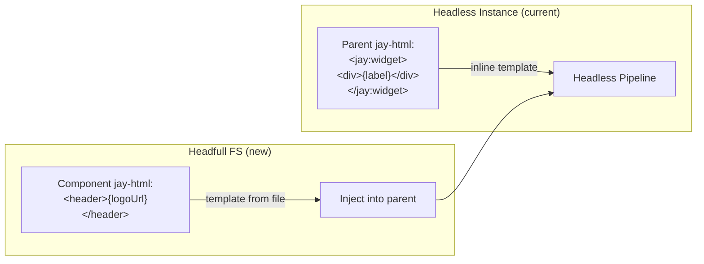

# Nested Headfull Full-Stack Components

## Background

Jay-stack supports three-phase rendering: **slow** (build/SSG), **fast** (SSR per-request), **interactive** (client).

**Current component landscape:**

| Layer  | Type     | Builder               | Slow/Fast | Interactive | Import type             |
| ------ | -------- | --------------------- | --------- | ----------- | ----------------------- |
| Page   | Headfull | makeJayStackComponent | ✓         | ✓           | route (page.ts)         |
| Page   | Headless | makeJayStackComponent | ✓         | ✓           | `jay-headless` with key |
| Nested | Headless | makeJayStackComponent | ✓         | ✓           | `jay-headless`          |
| Nested | Headfull | makeJayComponent      | —         | ✓           | `jay-headfull`          |

Without a contract, headfull, headless, and page components default to interactive-only.

Headless nested components have complete full-stack support — including instance-based rendering (`<jay:contract-name>`), slow/fast phase execution, SSR server-element compilation, hydration, and interactive client composition. This was built through DL#84, DL#102, DL#107, DL#109.

**Headfull nested** (imported via `<script type="application/jay-headfull">`) use `makeJayComponent` — they are client-only. They have no slow/fast phases and no SSR. They can also import CSS files which need to be included in the page.

On the client, headless and page-level full-stack components are all compiled to headfull components — headfull nested components are the client-side implementation target for all component types.

### Prior Attempt (Failed Branch)

DL#102 from the `jay-stack-headfull-components` branch attempted to add headfull full-stack support **before** headless instance support was complete. That approach proposed:

- Adding a `contract` attribute to `application/jay-headfull`
- A "post-slow merge" step that injects the headfull component's compiled jay-html into the page after slow render
- Treating the merged result like headless from that point on

That approach was abandoned. Since then, headless instances gained complete SSR and hydration support (DL#102 on main, DL#106, DL#109). We now need to revisit headfull full-stack design with the mature headless infrastructure in mind.

## Problem

We need **nested headfull full-stack components** — components that:

1. **Include their own UI** (headfull = have a jay-html file)
2. **Can render on the server** (slow and/or fast phases)
3. **Continue interactively** on the client
4. **Can be reused** across multiple pages (shared layout: header, footer, sidebar)

**Example use case**: A site header shared across pages. Today you either duplicate the header markup in every page's jay-html, or accept that the header is client-only and won't SSR.

**Key difference from headless**: Headless components delegate their UI to the parent page's jay-html (inline template inside `<jay:xxx>`). Headfull components **bring their own jay-html** — the UI is part of the component, not the page.

## Questions and Answers

**Q: How does this differ from nested headless?**
A: Headless provides data + behavior; the parent provides the UI template inline. Headfull brings its own jay-html file. A header/footer/sidebar has fixed UI that belongs to the component, not the page.

**Q: Can a nested headfull full-stack component be in a plugin/package?**
A: Not initially. Plugins provide headless components. Headfull FS components are project-local only, because they bundle UI.

**Q: Does this affect existing client-only nested headfull?**
A: No. Existing `makeJayComponent` nested headfull components (no `contract` attribute) stay as-is.

**Q: Does a headfull FS component have its own contract?**
A: Yes. Like headless, it needs a `.jay-contract` for phase annotations. The contract defines what data is slow vs fast vs interactive. The jay-html provides the UI.

**Q: Can headfull FS components be nested inside forEach?**
A: Yes, following the same patterns as headless instances (DL#84, DL#90).

**Q: Can the page pass props to a headfull FS component?**
A: Yes, via attributes on `<jay:Name itemId="1">`, same as headless instances.

## Design

### Approach: Reuse the Headless Instance Pipeline

The key insight: **a headfull full-stack component is a headless component whose inline template comes from its own jay-html file instead of the parent page's markup.**

Instead of inventing a new rendering pipeline, we compile the headfull component's jay-html into the same structure as a headless inline template, and then the existing headless instance pipeline (slow render → fast render → SSR server-element → hydration → interactive) handles everything.



### Import Format

Reuse `application/jay-headfull`. Add optional `contract` attribute:

- **`contract` present** → full-stack headfull (three-phase rendering, SSR)
- **`contract` absent** → client-only (current behavior, `makeJayComponent`)

```html
<script
  type="application/jay-headfull"
  src="./header/header"
  contract="./header/header.jay-contract"
  names="Header"
></script>

<body>
  <jay:Header logoUrl="/logo.png" />
  <main>{content}</main>
</body>
```

Attributes:

- `src` — path to component module (as today)
- `contract` — path to `.jay-contract` file (new, optional)
- `names` — component export name (as today)

When `contract` is present, `<jay:Header>` is instance-based (position = where tag appears). No key-based pattern for headfull.

### Template Injection: From File to Inline

The critical new step: **before compilation**, read the headfull component's jay-html and inject its `<body>` content as the inline template of the `<jay:Name>` tag in the parent.

**Before injection:**

```html
<!-- page.jay-html -->
<jay:Header logoUrl="/logo.png" />
```

**After injection (what the compiler sees):**

```html
<jay:Header logoUrl="/logo.png">
  <!-- injected from header.jay-html body -->
  <header>
    
    <nav>
      <a forEach="navItems" trackBy="id" href="{item.url}">{item.label}</a>
    </nav>
  </header>
</jay:Header>
```

From this point, the existing headless instance pipeline handles everything:

- `parseHeadlessImports` creates `JayHeadlessImports` with contract info
- `renderHeadlessInstance` compiles the inline template
- `renderServerHeadlessInstance` generates SSR server-element code
- `renderHydrateHeadlessInstance` generates hydration code
- `discoverHeadlessInstances` discovers instances for slow/fast phases
- The dev server pipeline orchestrates phases via `__headlessInstances`

### Data Flow

Phase information comes from the contract (same as headless):

```yaml
# header.jay-contract
data:
  slow:
    navItems: array
    logoUrl: string
  fast:
    timestamp: number
```

The component implementation uses `makeJayStackComponent`:

```typescript
export const header = makeJayStackComponent<HeaderContract>()
  .withProps<{ logoUrl: string }>()
  .withSlowlyRender(async (props) => {
    const nav = await cms.getNav();
    return partialRender({ navItems: nav, logoUrl: props.logoUrl }, {});
  })
  .withFastRender(async (props, cf) => partialRender({ timestamp: Date.now() }, {}))
  .withInteractive((props, refs) => ({ render: () => ({}) }));
```

### What Changes vs What's Reused

**Reused (no changes):**

- Headless instance compilation (element target, server-element, hydrate)
- `discoverHeadlessInstances` — finds `<jay:xxx>` tags, builds coordinates
- `slowRenderInstances` / fast render pipeline
- `__headlessInstances` ViewState merging
- `makeHeadlessInstanceComponent` client runtime
- Hydration adopt/create pattern
- Phase-aware binding filtering

**New:**

1. **Parser change**: `parseHeadfullImports` — when `contract` is present, treat as headless import (load contract, create `JayHeadlessImports` entry) instead of headfull import
2. **Template injection**: Before headless instance compilation, read the headfull component's jay-html file and inject its body content into `<jay:Name>` tags that are empty (self-closing)
3. **Import resolver extension**: `JayImportResolver` needs a method to read a component's jay-html file content given its module path

### Parser Changes

In `parseJayFile()`, headfull imports with `contract` should produce `JayHeadlessImports` entries (not `JayImportLink`). This means:

1. Parse `application/jay-headfull` with `contract` attribute
2. Load the contract (same as `parseHeadlessImports`)
3. Resolve the component module path
4. Read the component's jay-html file (new step — resolve `src` path → find adjacent `.jay-html`)
5. Inject the jay-html body content into matching `<jay:Name>` tags in the parent
6. Create `JayHeadlessImports` entry with contract, codeLink, contractLinks
7. The rest of the pipeline treats it as a headless instance

Headfull imports **without** `contract` continue through the current path (type analysis, `JayImportLink`).

### Resolving the Component's jay-html

Given `src="./header/header"`, the component module is `./header/header.ts`. The jay-html file is conventionally at `./header/header.jay-html` (same base name).

The resolver should:

1. Take the `src` path
2. Resolve it to an absolute path
3. Look for `<baseName>.jay-html` adjacent to the module
4. Return the jay-html content

### Template Injection Details

The injection transforms the parsed DOM before headless instance compilation:

1. Find all `<jay:Name>` tags that match a headfull FS import
2. For each, if the tag is self-closing or empty:
   - Read the component's jay-html
   - Extract `<body>` children
   - Insert as children of `<jay:Name>`
3. If the tag already has children → validation error (headfull FS owns its template)

CSS from the component's jay-html:

- `<link>` and `<style>` tags from the component's `<head>` should be collected and added to the page's CSS pipeline
- This follows the existing CSS extraction pattern

### Jay-html of a Headfull FS Component

The component's jay-html follows the standard format but:

- Has `<script type="application/jay-data">` with the ViewState shape (as today)
- Has a `<body>` with the UI template
- Does **not** need `<script type="application/jay-headfull">` or `<script type="application/jay-headless">` (it IS the component)
- May have `<link>` / `<style>` in `<head>` for component-specific CSS

```html
<!-- header/header.jay-html -->
<html>
  <head>
    <script type="application/jay-data">
      data:
        navItems: array
        logoUrl: string
        timestamp: number
    </script>
    <link rel="stylesheet" href="./header.css" />
  </head>
  <body>
    <header>
      
      <nav>
        <a forEach="navItems" trackBy="id" href="{item.url}">{item.label}</a>
      </nav>
      <span>{timestamp}</span>
    </header>
  </body>
</html>
```

## Implementation Plan

### Phase 1: Parser — Headfull FS Recognition

1. In `parseHeadfullImports`, detect the `contract` attribute
2. When `contract` is present: skip type analysis, return a marker indicating this is a headfull FS import
3. In `parseJayFile`, handle headfull FS markers: load the contract, create `JayHeadlessImports` entries (same structure as headless)
4. Tests: unit tests for parser recognizing headfull FS imports

### Phase 2: Template Injection

1. Add `resolveJayHtmlContent(modulePath)` to `JayImportResolver` — reads the `.jay-html` adjacent to a component module
2. After parsing headfull FS imports, inject jay-html body content into matching `<jay:Name>` tags
3. Handle CSS extraction from the component's jay-html `<head>`
4. Validation: error if `<jay:Name>` already has children, error if jay-html not found
5. Tests: template injection with various content shapes

### Phase 3: End-to-End Dev Server Test

1. Create dev-server test fixture (e.g., `5g-page-headfull-fs/`)
   - `header/header.jay-contract` — slow navItems + fast timestamp
   - `header/header.jay-html` — header UI
   - `header/header.ts` — makeJayStackComponent with slow/fast/interactive
   - `page.jay-html` — imports header as headfull FS, uses `<jay:Header>`
   - `page.ts` — page component
   - `expected-ssr.html` — SSR output with header rendered
   - `expected-hydrate.ts` — hydrate code with headless instance pattern
2. Run through full dev server pipeline: slow → fast → SSR → hydrate → interactive
3. Verify SSR output includes header HTML with resolved slow data
4. Verify hydration adopts header DOM correctly

### Phase 4: Multiple Pages with Shared Component

1. Test fixture with two pages using the same headfull FS header
2. Verify each page independently renders and hydrates the header
3. Verify different prop values produce different rendered output

## Examples

### ✅ Shared header across pages

```html
<!-- src/components/header/header.jay-contract -->
data: slow: navItems: array logoUrl: string fast: cartCount: number
```

```html
<!-- src/components/header/header.jay-html -->
<html>
  <head>
    <script type="application/jay-data">
      data:
        navItems: array
        logoUrl: string
        cartCount: number
    </script>
  </head>
  <body>
    <header>
      
      <nav><a forEach="navItems" trackBy="id" href="{item.url}">{item.label}</a></nav>
      <span>Cart: {cartCount}</span>
    </header>
  </body>
</html>
```

```typescript
// src/components/header/header.ts
export const header = makeJayStackComponent<HeaderContract>()
  .withProps<{ logoUrl: string }>()
  .withSlowlyRender(async (props) => {
    const nav = await getNavItems();
    return partialRender({ navItems: nav, logoUrl: props.logoUrl }, {});
  })
  .withFastRender(async () => partialRender({ cartCount: getCartCount() }, {}))
  .withInteractive((props, refs) => ({ render: () => ({}) }));
```

```html
<!-- src/pages/page.jay-html -->
<script
  type="application/jay-headfull"
  src="../components/header/header"
  contract="../components/header/header.jay-contract"
  names="Header"
></script>
<body>
  <jay:Header logoUrl="/logo.png" />
  <main>{pageContent}</main>
</body>
```

### ✅ Footer with dynamic year

```html
<script
  type="application/jay-headfull"
  src="../components/footer/footer"
  contract="../components/footer/footer.jay-contract"
  names="Footer"
></script>
<body>
  <main>{content}</main>
  <jay:Footer />
</body>
```

### ❌ No plugin/package support

Headfull FS components are project-local. Plugins provide headless components.

### ❌ Headfull FS should not define key

Headfull FS is instance-based only (`<jay:Name>` positioning). No `key` attribute — headfull components own their UI and don't contribute to page-level data bindings.

## Trade-offs

| Approach                                               | Pros                                                                 | Cons                                                                               |
| ------------------------------------------------------ | -------------------------------------------------------------------- | ---------------------------------------------------------------------------------- |
| **Template injection into headless pipeline** (chosen) | Reuses entire headless infra; minimal new code; proven SSR/hydration | Requires jay-html reading at parse time; component jay-html is flattened into page |
| **Separate headfull compilation pipeline**             | Clean separation of headfull vs headless                             | Duplicates significant compilation logic; two SSR paths to maintain                |
| **Post-slow merge** (failed branch approach)           | Conceptually clean                                                   | Too early — headless infra wasn't ready; complex merge step; timing issues         |

**Decision**: Template injection into the headless pipeline. The headless instance infrastructure is mature and handles all the hard problems (coordinates, SSR, hydration, phases). We just need to source the inline template from a file instead of from inline markup.

## Verification Criteria

1. Headfull FS component renders in SSR (slow + fast data visible in HTML output)
2. Hydration correctly adopts headfull FS DOM (no flicker, no re-creation)
3. Interactive phase works (events, state updates) on headfull FS component
4. Same headfull FS component works on multiple pages with different props
5. Existing client-only headfull components (`makeJayComponent`, no `contract`) unchanged
6. Component-specific CSS from headfull FS jay-html is included in page
7. Headfull FS inside forEach works (per-item rendering)
8. Phase-aware bindings work (slow-only data static after SSR, interactive data dynamic)

### Dev Server Hydration Test Cases

Add test fixtures in `packages/jay-stack/dev-server/test/` mirroring the headless cases (5a–5f, 7), following the same two-layer validation (HTTP SSR HTML + Playwright browser) and three execution modes (SSR disabled, SSR first request, SSR cached):

| Fixture                              | Scenario                                                       | Mirrors |
| ------------------------------------ | -------------------------------------------------------------- | ------- |
| `8a-page-headfull-fs-static`         | Single headfull FS component in static placement               | 5a      |
| `8b-page-headfull-fs-conditional`    | Headfull FS under condition                                    | 5b      |
| `8c-page-headfull-fs-foreach`        | Headfull FS inside forEach with wrapper                        | 5c      |
| `8d-page-headfull-fs-slow-foreach`   | Headfull FS inside slowForEach                                 | 5d      |
| `8e-page-headfull-fs-foreach-nested` | Headfull FS in forEach with preceding sections + carry-forward | 5e      |
| `8f-page-headfull-fs-two-instances`  | Two headfull FS instances with different props                 | 5f      |
| `8g-page-headfull-fs-fast-only`      | Fast-only page with headfull FS instance (no slow phase)       | 7       |
| `8h-page-headfull-fs-with-css`       | Headfull FS with component CSS (`<link>` in head)              | —       |

Each fixture contains: component jay-html, component jay-contract, component ts, page jay-html, page ts, expected-ssr.html, expected-hydrate.ts.

## Implementation Results

### Phase 1+2: Parser + Template Injection (completed)

**Files changed:**

- `packages/compiler/compiler-jay-html/lib/jay-target/jay-import-resolver.ts` — Added `readJayHtml(importingModuleDir, src)` method to `JayImportResolver` interface and `JAY_IMPORT_RESOLVER` implementation
- `packages/compiler/compiler-jay-html/lib/jay-target/jay-html-parser.ts` — Added `parseHeadfullFSImports()` function; modified `parseJayFile()` to split headfull elements by contract attribute, merge results

**Implementation:**

- `parseJayFile` splits `application/jay-headfull` elements into regular (no `contract`) and FS (with `contract`)
- Regular elements go through existing `parseHeadfullImports` → `JayImportLink[]`
- FS elements go through new `parseHeadfullFSImports` → `JayHeadlessImports[]` + CSS
- Template injection: reads component jay-html via `readJayHtml`, injects `<body>` content into matching `<jay:Name>` tags
- CSS merging: extracts CSS from component jay-html `<head>`, merges with page CSS
- Contract name: lowercased `names` attribute value, matching `<jay:xxx>` tag convention

**Tests:** 8 new tests in `parse-jay-file.unit.test.ts` (49 total, all passing):

- Headfull FS recognition and JayHeadlessImports creation
- Template injection into `<jay:Name>` tags
- Regular headfull imports unaffected
- Error: jay-html file not found
- Error: `<jay:Name>` already has children
- CSS extraction from component jay-html
- Case-insensitive tag matching
- Merging with headless imports

**No regressions:** 607/607 tests pass across all compiler-jay-html test files.

**Deviations from design:**

- `<jay:Name>` with existing children: changed from error to silent skip. Needed because pre-rendered HTML re-enters `parseJayFile` with templates already injected. Skipping preserves the pre-rendered content.

### Phase 3: Dev Server Integration (completed)

**Additional files changed:**

- `packages/compiler/compiler-jay-html/lib/jay-target/jay-html-parser.ts` — Added `injectHeadfullFSTemplates(html, sourceDir, resolver)` exported function; added `projectRoot` fallback for contract/module resolution from cache directories
- `packages/compiler/compiler-jay-html/lib/slow-render/slow-render-transform.ts` — Added `application/jay-headfull` to script type skip list in `resolveRelativePaths`
- `packages/compiler/compiler-jay-html/lib/jay-target/jay-html-compiler.ts` — Exclude component's code link name from `importedSymbols` in headless instance child context, preventing HTML tags (e.g., `<header>`) from colliding with the component import name
- `packages/jay-stack/dev-server/lib/dev-server.ts` — Added `injectHeadfullFSTemplates` calls in `preRenderJayHtml` and `sendResponse`

**Discoveries:**

1. `slowRenderTransform` resolves `src` attributes on script tags to absolute paths — headfull FS scripts need to be excluded
2. `sendResponse` uses the pre-rendered directory for compilation — template injection must use the source directory
3. `preRenderJayHtml` reads original HTML — templates must be injected before `slowRenderTransform` so instance bindings resolve in Pass 2
4. Contract/module resolution from cache directories: relative paths from `build/pre-rendered/` don't exist. Added `projectRoot` fallback for contract loading and `moduleResolveDir` for code link
5. Element target name collision: component export `header` + HTML tag `<header>` in template. Fixed by excluding the code link name from the child context's `importedSymbols`

**8a test results:** 9/9 pass (SSR disabled, SSR first, SSR cached — page loads, hydration, interactivity)

**No regressions:** 609/609 compiler-jay-html tests pass.

## Related Design Logs

- #84 — Headless component props and repeater support (instance-based `<jay:xxx>`)
- #102 (main) — Headless instance SSR and hydration compilation
- #106 — Hydrate dynamic elements with Kindergarten
- #107 — Dev server consistency and phase optionality
- #109 — Unified dev server phase pipeline
- #90 — Headless instances in interactive forEach
