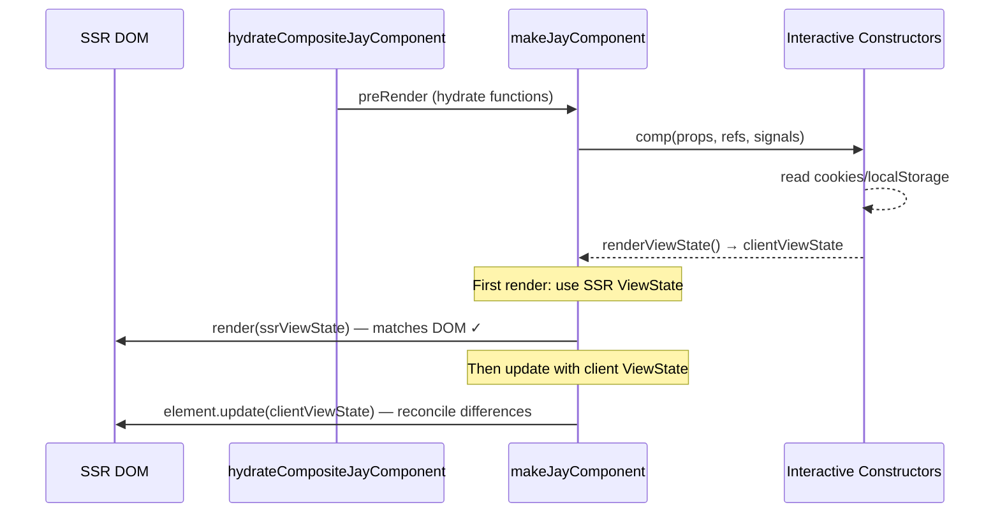

# Hydration ViewState Consistency

## Background

Jay-stack hydration assumes the ViewState used during hydration matches the DOM produced by SSR. This invariant is critical for:

- `hydrateConditional`: checks `condition(currData)` to decide whether to adopt (element exists) or skip (element absent)
- `hydrateForEach`: uses the array from the ViewState to match existing DOM items by trackBy
- `adoptText`/`adoptElement`: resolves coordinates expecting specific DOM structure

The current flow in `makeJayComponent` (component.ts:170-181):

```
1. preRender()         → [refs, render]     (sets up hydrate functions)
2. comp(props, refs)   → interactive core   (runs interactive constructors)
3. renderViewState()   → viewState          (materializes from signals)
4. render(viewState)   → element            (hydrates DOM with THIS viewState)
```

Step 2 runs interactive constructors which receive the SSR ViewState as signals. But constructors can modify these signals based on client-local data (localStorage, cookies, client-only API calls). By step 3, the ViewState may differ from what SSR produced.

Step 4 hydrates using the modified ViewState — breaking the invariant.

## Problem

Components that use client-local data produce a different initial ViewState than the server:

- **Cart indicator**: server has `hasItems: false` (no cookie access), client reads cookie → `hasItems: true`
- **User preferences**: server has defaults, client reads localStorage → different values
- **Auth state**: server has anonymous, client checks session → logged in

When the client ViewState differs from SSR:

- `hydrateConditional` with `wasTrue = true` tries to adopt an element that doesn't exist (SSR rendered false)
- `hydrateConditional` with `wasTrue = false` skips adoption of an element that DOES exist
- `hydrateForEach` tries to adopt items with trackBy values that don't match the DOM
- Warnings, broken positioning, orphaned DOM nodes

## Design

### Approach: Hydrate with SSR ViewState, then update

The SSR ViewState (`defaultViewState`) is already serialized in the HTML and passed to `hydrateCompositeJayComponent`. Use it for the hydration render, then immediately update with the client's actual ViewState.



### Implementation

The change is in `hydrateCompositeJayComponent`. Currently it passes `preRender` directly to `makeJayComponent`:

```typescript
const preRender = (options?) => hydratePreRender(rootElement, options);
return makeJayComponent(preRender, comp, ...contextMarkers);
```

`makeJayComponent`'s reaction (line 170-181) calls `render(viewState)` with whatever `renderViewState()` returns — which is the client ViewState.

**Fix**: Intercept in `hydrateCompositeJayComponent`. The `preRender` wrapper can call `hydratePreRender` to get `[refs, render]`, then return a modified `render` that:

1. On first call: runs `render(defaultViewState)` (SSR ViewState, matches DOM)
2. Immediately after: calls `element.update(viewState)` with the actual client ViewState
3. On subsequent calls: delegates to `element.update(viewState)` normally

```typescript
const preRender = (options?: RenderElementOptions) => {
  const [refs, render] = hydratePreRender(rootElement, options);
  let element: JayElementT | undefined;
  const wrappedRender = (viewState: ViewState) => {
    if (!element) {
      // First call: hydrate with SSR ViewState (matches DOM)
      element = render(defaultViewState);
      // Then reconcile with the actual client ViewState
      if (viewState !== defaultViewState) {
        element.update(viewState);
      }
    } else {
      element.update(viewState);
    }
    return element;
  };
  return [refs, wrappedRender];
};
```

### What this fixes

| Scenario                                              | Before (broken)                                              | After (fixed)                                                   |
| ----------------------------------------------------- | ------------------------------------------------------------ | --------------------------------------------------------------- |
| SSR: `hasItems=false`, client: `hasItems=true`        | `hydrateConditional` tries to adopt absent element → warning | Hydrates with false (correct), then update shows element        |
| SSR: 0 cart items, client: 3 items                    | `hydrateForEach` can't match DOM items                       | Hydrates with 0 items (correct), then update adds 3             |
| SSR: default theme, client: dark theme (localStorage) | Attribute mismatch during adoption                           | Hydrates with default (correct), then update applies dark theme |

### What doesn't change

- `makeJayComponent` — no changes needed
- `hydrateConditional`, `hydrateForEach`, `adoptText`, `adoptElement` — unchanged
- SSR serialization (`generate-ssr-response.ts`) — already serializes `defaultViewState`
- The update path — already handles all transitions correctly

### Performance: the update is essentially free when ViewState hasn't changed

The SSR ViewState is decomposed into signals (`makeSignals(partViewState)`). If the interactive constructor doesn't modify a signal, `renderViewState()` returns the exact same reference for that property (`VS_SSR[prop] === VS_Comp[prop]`). All update functions (adoptText, hydrateConditional, etc.) start with an equality check assuming immutable data — so they skip the DOM update when the reference is unchanged. The reconciliation update will always run (the root ViewState objects are different references), but each individual binding short-circuits immediately for unchanged properties.

## Implementation Plan

### Phase 1: Core fix

1. Modify `hydrateCompositeJayComponent` to wrap the render function
2. First render uses `defaultViewState` (SSR), subsequent renders use client ViewState
3. Verify with existing dev-server hydration tests (208 tests)

### Phase 2: Test

1. Add dev-server test fixture with a component that produces different client ViewState
   - Component reads a mock service that returns different data on client
   - Conditional element visible on client but not on SSR (or vice versa)
2. Verify no hydration warnings and correct final DOM

## Implementation Results

### Files changed

| File                                                      | Change                                                     |
| --------------------------------------------------------- | ---------------------------------------------------------- |
| `stack-client-runtime/lib/hydrate-composite-component.ts` | Wrapped render function; fixed `defaultViewState` mutation |
| `dev-server/test/9a-page-client-viewstate-mismatch/`      | New test fixture with keyed headless component             |
| `dev-server/test/hydration.test.ts`                       | Added test group "9. Client ViewState mismatch (DL#112)"   |

### Implementation details

Two changes in `hydrateCompositeJayComponent`:

**1. Prevent `defaultViewState` mutation (root cause fix):**
Changed `let viewState = defaultViewState` to `let viewState = {...defaultViewState}` in the `comp`'s `render()` function. Previously, `viewState[key] = deepMergeViewStates(...)` for keyed parts mutated `defaultViewState` directly (same reference). The shallow copy prevents this. `deepMergeViewStates` never mutates its inputs (creates a new `result` object), so shallow copy is sufficient.

**2. Wrap render for SSR/client reconciliation (design fix):**
The `preRender` wrapper intercepts the first `render(viewState)` call: hydrates with `defaultViewState` (now guaranteed to have original SSR values), then reconciles with the client ViewState via `element.update(viewState)`.

### Deviation from design

The design proposed snapshotting `defaultViewState` via `JSON.parse(JSON.stringify(...))` inside `preRender()`. The actual implementation is simpler: fix the mutation at the source (`{...defaultViewState}` in render) and use `defaultViewState` directly in the wrapper. No deep copy needed.

### Test fixture: 9a-page-client-viewstate-mismatch

Uses a **keyed** headless component (`key="status"`) — critical because the mutation only occurs for keyed parts (`viewState[key] = ...`). Non-keyed parts reassign `viewState` to a new object from `deepMergeViewStates`, leaving `defaultViewState` untouched.

- Keyed headless component fast phase: `showBanner=false, bannerText='Server Default', counter=0`
- Client interactive constructor: sets `showBanner=true, bannerText='Client Banner', counter=5`
- Validates: banner appears after hydration (not present in SSR HTML), counter shows 5, interactivity works (increment to 6)
- Test verified to FAIL without the fix (4 failures in SSR modes)
- 12 test cases (SSR disabled + first request + cached, each with page load + hydration + interactivity + viewstate)

### Tests: 220/220 passing (208 existing + 12 new)

## Verification Criteria

1. No hydration warnings when client ViewState differs from SSR
2. DOM correctly reflects client ViewState after hydration (not SSR ViewState)
3. Existing 208 dev-server hydration tests pass unchanged
4. `hydrateConditional` correctly adopts elements from SSR DOM (not client state)
5. `hydrateForEach` correctly adopts items from SSR DOM
6. Interactive updates after hydration work normally
