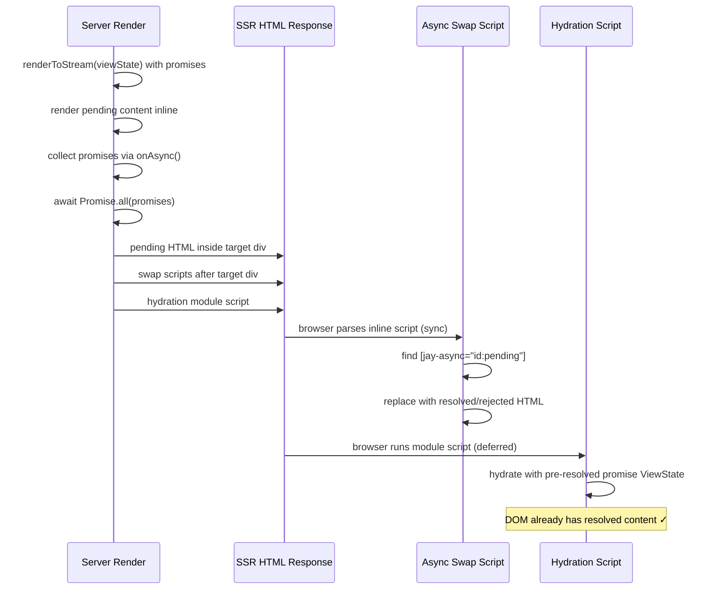

# Async Data SSR and Hydration

## Background

Jay contracts support async data tags (`async: true`) which generate `Promise<T>` types in ViewState. The jay-html template uses `when-loading`, `when-resolved`, and `when-rejected` directives to render different UI for each promise state.

The **client-side runtime** handles async elements correctly — `pending()`, `resolved()`, `rejected()` in `element.ts` react to promise state changes. The **compiler** generates correct code for the standard element target and the server element target. The **SSR pipeline** (`generate-ssr-response.ts`) awaits all promises before sending the response.

However, **no integration test exists for async data flowing through SSR → swap → hydration**. Creating one (test `11a-async-data`) revealed three gaps that prevent async data from working end-to-end.

## Problem

### Gap 1: SSR swap scripts not generated

`generate-ssr-response.ts` collects resolved template HTML via `onAsync()` but never wraps it with `asyncSwapScript()`. The resolved HTML is appended as raw text after `<div id="target">`:

```
Current output:
  <div id="target">
    <div jay-coordinate="0">
      <h1>Async Data Test</h1>
      <div jay-async="message:pending">        ← pending placeholder stays
        <p class="loading">Loading...</p>
      </div>
    </div>
  </div>
  <div jay-coordinate="0/1">                   ← resolved HTML dumped outside target
    <p class="resolved">Hello from async!</p>
  </div>
```

`asyncSwapScript()` exists in `ssr-runtime` and is unit-tested, but is never called by the SSR pipeline.

### Gap 2: Hydrate compiler doesn't generate async elements

The hydrate compiler uses `checkAsync()` only to decide `de()` vs `e()` for parent elements. It does NOT generate `pending()`, `resolved()`, `rejected()` runtime calls. Instead, it generates `adoptText` for coordinates inside `when-resolved` and `when-rejected` elements:

```typescript
// Current hydrate output — tries to adopt text at coordinates that don't exist
adoptElement('0', {}, [
  adoptText('0/1/0', (vs) => vs), // resolved text — not in DOM
  adoptText('0/3/0', (vs) => `Error: ${vs.message}`), // rejected text — not in DOM
]);
```

Hydration warnings:

```
[jay hydration] adoptText coordinate "0/1/0" not found in DOM
[jay hydration] adoptText coordinate "0/3/0" not found in DOM
```

### Gap 3: Promise values lost in hydration script serialization

The hydration script serializes ViewState via `JSON.stringify(defaultViewState)`. Promises serialize to `{}`:

```javascript
// Generated hydration script
const viewState = { title: 'Async Data Test', message: {} }; // Promise → {}
```

Even if the hydrate compiler generated `resolved(vs => vs.message, ...)`, calling `.then()` on `{}` would throw.

## Design

### Intended data flow



### Fix 1: Wrap resolved HTML with asyncSwapScript

**File**: `packages/jay-stack/stack-server-runtime/lib/generate-ssr-response.ts`

Import `asyncSwapScript` from `@jay-framework/ssr-runtime` and wrap each resolved/rejected template result:

```typescript
import { asyncSwapScript } from '@jay-framework/ssr-runtime';

onAsync: (promise, id, templates) => {
    const asyncPromise = promise.then(
        (val) => templates.resolved ? asyncSwapScript(id, templates.resolved(val)) : '',
        (err) => templates.rejected ? asyncSwapScript(id, templates.rejected(err)) : '',
    );
    asyncPromises.push(asyncPromise);
},
```

After this fix, the SSR output becomes:

```html
<div id="target">
  <div jay-coordinate="0">
    <h1>Async Data Test</h1>
    <div jay-async="message:pending">
      <p class="loading">Loading...</p>
    </div>
  </div>
</div>
<script>
  (function () {
    var t = document.querySelector('[jay-async="message:pending"]');
    if (t) {
      var d = document.createElement('div');
      d.innerHTML = '<div jay-coordinate="0/1"><p class="resolved" ...>Hello from async!</p></div>';
      t.replaceWith(d.firstChild);
    }
    window.__jay && window.__jay.hydrateAsync && window.__jay.hydrateAsync('message');
  })();
</script>
```

The swap script executes synchronously before the module hydration script, so by the time hydration runs, the DOM has the resolved content at the correct coordinates.

### Fix 2: Hydrate compiler async element generation

**File**: `packages/compiler/compiler-jay-html/lib/jay-target/jay-html-compiler-hydrate.ts`

The hydrate compiler needs to generate `pending()`, `resolved()`, `rejected()` runtime elements for async directives, similar to the standard element compiler. When the hydrate compiler encounters `when-loading="message"`, `when-resolved="message"`, or `when-rejected="message"`, it should:

1. Group async directives by property name (same as standard compiler)
2. Generate `pending(vs => vs.message, () => adoptElement(...))` instead of trying to adopt the loading element directly
3. Generate `resolved(vs => vs.message, () => adoptElement(...))` with resolved type scope
4. Generate `rejected(vs => vs.message, () => adoptElement(...))` with Error type scope

The parent element must use `de()` (dynamicElement) — this already works via the existing `checkAsync()` detection.

**Key difference from standard target**: Inside each async branch, the hydrate compiler still uses `adoptElement`/`adoptText` (not `createElement`/`element`), since the DOM already has the correct content from the swap scripts.

### Fix 3: Promise reconstruction in hydration script

**File**: `packages/jay-stack/stack-server-runtime/lib/generate-ssr-response.ts` (in `generateHydrationScript`)

After awaiting all promises, collect their outcomes (resolved value or rejection error) keyed by property name. Generate Promise reconstruction code in the hydration script:

```javascript
const viewState = { title: 'Async Data Test' };
// Reconstruct pre-resolved promises
viewState.message = Promise.resolve('Hello from async!');
```

This requires:

1. In `generateSSRPageHtml`: track promise outcomes alongside the swap script results
2. In `generateHydrationScript`: emit `Promise.resolve(val)` or `Promise.reject(err)` assignments

Since the promises are pre-resolved, the runtime behavior is:

- `resolved()` fires on the next microtask, matching the already-swapped DOM
- `pending()` shows after 1ms timeout, but `promise.finally()` cancels it before that (microtask beats macrotask)
- No visual flash — the resolved content is already in the DOM

### Async property tracking in onAsync

The `onAsync` callback currently takes `(promise, id, templates)`. The `id` is the property name. We need to also capture the resolved/rejected value for ViewState reconstruction:

```typescript
interface AsyncOutcome {
    id: string;
    status: 'resolved' | 'rejected';
    value: any;
}
const asyncOutcomes: AsyncOutcome[] = [];

onAsync: (promise, id, templates) => {
    const asyncPromise = promise.then(
        (val) => {
            asyncOutcomes.push({ id, status: 'resolved', value: val });
            return templates.resolved ? asyncSwapScript(id, templates.resolved(val)) : '';
        },
        (err) => {
            asyncOutcomes.push({ id, status: 'rejected', value: { message: err.message } });
            return templates.rejected ? asyncSwapScript(id, templates.rejected(err)) : '';
        },
    );
    asyncPromises.push(asyncPromise);
},
```

Then pass `asyncOutcomes` to `generateHydrationScript` to emit reconstruction code.

## Implementation Plan

### Phase 1: SSR swap script integration

1. Import `asyncSwapScript` in `generate-ssr-response.ts`
2. Wrap `onAsync` template results with `asyncSwapScript(id, html)`
3. Track async outcomes for ViewState reconstruction
4. Update `generateHydrationScript` to emit promise reconstruction code
5. Update test `11a-async-data` expected-ssr.html fixture

### Phase 2: Hydrate compiler async support

1. Add async directive grouping to the hydrate compiler (collect `when-loading`/`when-resolved`/`when-rejected` elements per property)
2. Generate `pending()`, `resolved()`, `rejected()` calls wrapping `adoptElement`/`adoptText`
3. Add proper type scoping for resolved (unwrapped Promise type) and rejected (Error type)
4. Update test `11a-async-data` expected-hydrate.ts fixture
5. Add compiler-level fixture tests for hydrate target with async elements

### Phase 3: Test suite

Add remaining test fixtures (see Test Plan below).

## Test Plan

All tests in dev-server hydration test infrastructure. Each test validates:

- SSR HTML fixture (expected-ssr.html)
- Hydrate code fixture (expected-hydrate.ts)
- No page errors on load
- No hydration warnings
- DOM content after hydration (hydrationChecks)

### 11a. Simple async data — resolved promise

Contract: `async message: string` (fast phase)
Component: `withFastRender` returns `{ message: Promise.resolve('Hello from async!') }`
Jay-html: `when-loading`, `when-resolved`, `when-rejected` blocks

**Validates:**

- SSR renders pending, swap script replaces with resolved
- Hydration adopts resolved content
- Resolved text visible, loading/error hidden

### 11b. Async data — rejected promise

Contract: `async message: string` (fast phase)
Component: returns `{ message: Promise.reject(new Error('Failed to load')) }`

**Validates:**

- SSR swap replaces pending with rejected content
- Error text visible, resolved/loading hidden
- Error properties (message) accessible in template

### 11c. Async sub-contract (object)

Contract: `async userProfile: { name: string, email: string }` (fast phase)
Component: returns `{ userProfile: Promise.resolve({ name: 'Alice', email: 'alice@test.com' }) }`
Jay-html: `when-resolved="userProfile"` with `{name}` and `{email}` bindings

**Validates:**

- Resolved object properties rendered correctly
- Nested data binding inside async scope works

### 11d. Async repeated sub-contract (array)

Contract: `async items: [{ title: string }]` (fast phase, repeated)
Component: returns `{ items: Promise.resolve([{ title: 'A' }, { title: 'B' }]) }`
Jay-html: `when-resolved="items"` with forEach inside

**Validates:**

- Resolved array rendered as list
- forEach inside async resolved scope works

### 11e. Multiple async properties

Contract: two async properties — one resolves, one rejects
Component: `{ data1: Promise.resolve('ok'), data2: Promise.reject(new Error('fail')) }`

**Validates:**

- Each async property independently resolves/rejects
- Multiple swap scripts execute correctly
- Mixed resolved/rejected state in same page

### 11f. Async with fast+interactive phase

Contract: `async message: string` with `phase: fast+interactive`
Component: `withFastRender` returns promise, `withInteractive` can set new promises

**Validates:**

- SSR renders resolved value
- Client can set a new promise via interactive update
- UI transitions: resolved → pending → resolved (new value)

### 11g. Async with delayed resolution (setTimeout)

Contract: `async message: string` (fast phase)
Component: returns `{ message: new Promise(resolve => setTimeout(() => resolve('delayed'), 100)) }`

**Validates:**

- SSR waits for promise to resolve (buffered mode)
- Response includes swap script with resolved content
- No loading flash on client

## Verification Criteria

1. All `11a`–`11g` tests pass in all three modes (SSR disabled, SSR first request, SSR cached)
2. Zero hydration warnings for all async test fixtures
3. `asyncSwapScript` is called for every resolved/rejected async property in SSR
4. Hydrate compiler generates `pending()`/`resolved()`/`rejected()` for async directives
5. Pre-resolved promises in hydration ViewState don't cause pending flash (microtask resolves before 1ms timeout)

## Implementation Results

### Deviation from design: Hydrate compiler skips async elements

The design proposed generating `pending()`/`resolved()`/`rejected()` runtime elements in the hydrate compiler. During implementation, I discovered that `When<>` objects (returned by `pending/resolved/rejected`) can only be children of `de()` (dynamicElement), NOT `adoptDynamicElement`. The hydrate runtime's `adoptDynamicElement` expects `BaseJayElement` or `STATIC` sentinels, not `When<>` objects.

**Actual approach**: The hydrate compiler skips async elements entirely (`checkAsync(element).isAsync → return RenderFragment.empty()`). The swap scripts handle the DOM replacement before hydration, and the resolved content stays in the DOM as static content. This is correct for fast-phase async data (which doesn't change after SSR).

**Limitation**: Fast+interactive async properties (test 11f) would need a different approach — possibly extending `adoptDynamicElement` to accept `When<>` children, or using a wrapper pattern. This is deferred to a future implementation.

### Changes made

1. **`packages/jay-stack/stack-server-runtime/lib/generate-ssr-response.ts`**

   - Import `asyncSwapScript` from `@jay-framework/ssr-runtime`
   - Wrap `onAsync` template results with `asyncSwapScript(id, html)` for DOM swap
   - Track async outcomes (`asyncOutcomes` array) for ViewState reconstruction
   - Generate `Promise.resolve(val)` / `Promise.reject(err)` in hydration script

2. **`packages/compiler/compiler-jay-html/lib/jay-target/jay-html-compiler-hydrate.ts`**

   - Skip async directive elements in `renderHydrateElement` (return `RenderFragment.empty()`)

3. **`packages/jay-stack/dev-server/test/11a-async-data/`** — New test fixture

   - Contract with `async message: string` (fast phase)
   - Jay-html with `when-loading`, `when-resolved`, `when-rejected` blocks
   - Component returning `Promise.resolve('Hello from async!')`

4. **`packages/jay-stack/dev-server/test/hydration.test.ts`** — New test case
   - Tests SSR first request and SSR cached modes (SSR-disabled skipped — async needs server pipeline)
   - Validates resolved text visible, loading/error hidden, no hydration warnings

### Additional fix: SSR-disabled mode promise resolution

SSR-disabled (client-only) mode initially failed with `promise.then is not a function` because `generateClientScript` serialized Promises as `{}` via `JSON.stringify`.

Fix: Made `generateClientScript` async. It resolves all Promise values in ViewState, then reconstructs them as `Promise.resolve(val)` / `Promise.reject(err)` in the generated script — same pattern as the hydration script. The element target's `pending()/resolved()/rejected()` calls then work correctly with pre-resolved Promise objects.

Also added `resolveViewStatePromises()` and `generatePromiseReconstruction()` as shared utilities in `generate-client-script.ts`, used by both client and hydration scripts.

### Test fixtures implemented

| Test | Scenario                                                  | Status                                              |
| ---- | --------------------------------------------------------- | --------------------------------------------------- |
| 11a  | Resolved promise (simple string)                          | Pass (all 3 modes)                                  |
| 11b  | Rejected promise                                          | Pass (all 3 modes)                                  |
| 11c  | Async sub-contract (resolved object with {name}, {email}) | Pass (all 3 modes)                                  |
| 11d  | Async sub-contract (resolved object, non-repeated)        | Pass (all 3 modes)                                  |
| 11e  | Multiple async properties (data1 resolves, data2 rejects) | Pass (all 3 modes)                                  |
| 11f  | Fast+interactive async                                    | Deferred (needs adoptDynamicElement When<> support) |
| 11g  | Delayed resolution (100ms setTimeout)                     | Pass (all 3 modes)                                  |

### Test results

- 536/536 hydration tests pass (471 existing + 65 new async tests)
- 617/617 compiler-jay-html tests pass
- 93/93 stack-server-runtime tests pass (updated for async generateClientScript)
- 22/22 ssr-runtime tests pass
