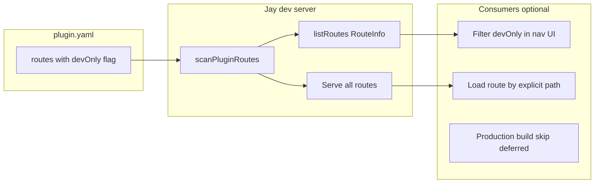

# Design Log #163 — Dev-Only Plugin Routes

## Background

Design Log #130 introduced plugin routes — full pages (jay-html + page component) declared in `plugin.yaml` and served by the Jay dev server. Plugins use them for admin dashboards, internal tools, and builder UIs that are not end-user site pages.

A short-lived `embedOnly` flag blocked direct HTTP access and hid routes from `listRoutes()`. That was the wrong model: dev-tooling routes should remain **reachable on the dev server** (direct URL, debugging, standalone tabs). The framework should expose metadata; **each consumer** (design tools, CLIs, production build) decides what to do with it.

Related: #130 (plugin routes), #128 (iframe embed mode / `_jay_embed` — client behavior only, not route access control).

## Problem

1. Plugin authors need a **declarative way** to mark routes as dev-server tooling, distinct from public site pages.
2. **Consumers** of `DevServerService.listRoutes()` need `devOnly` on `RouteInfo` to filter navigation UI without the framework hiding routes.
3. **Production builds** should eventually skip dev-only plugin routes (deferred — see backlog task in consuming projects).
4. Plugin authors should know dev-only pages remain directly reachable on the dev server; standalone UX is the plugin's choice (documented in agent-kit `plugin-routes.md`).

## Questions and Answers

**Q: Should dev-only routes block direct browser access on the dev server?**
A: **No.** Dev server serves them normally. Consumers may filter; the framework does not enforce access.

**Q: Should `devOnly` auto-imply from other plugin metadata?**
A: **No.** Plugin author sets `devOnly: true` explicitly on the `routes[]` entry. `plugin-validator` may warn in AIditor-specific contexts (see validator only — not core manifest).

**Q: Does `listRoutes()` hide dev-only routes?**
A: **No.** `listRoutes()` returns all routes with `devOnly?: boolean` set. Callers filter if needed.

**Q: Production builds?**
A: **Deferred.** Exclude `devOnly` routes from production manifest and bundles in a follow-up task.

## Design

### `devOnly` on plugin routes

```yaml
# plugin.yaml
routes:
  - path: /my-plugin/admin
    jayHtml: ./lib/pages/admin/page.jay-html
    component: adminPage
    devOnly: true
    description: Dev-server admin UI
```

| Layer                            | Behavior                                                                                  |
| -------------------------------- | ----------------------------------------------------------------------------------------- |
| `plugin.yaml`                    | Optional `devOnly: boolean` on `routes[]`                                                 |
| `JayRoute`                       | `devOnly?: boolean` propagated from manifest                                              |
| `RouteInfo` (`DevServerService`) | Includes `devOnly?: boolean`; **no filtering**                                            |
| Dev server HTTP                  | All routes served                                                                         |
| Production server (today)        | Still bundles dev-only routes (deferred)                                                  |
| `plugin-validator`               | Validates `devOnly` is boolean; AIditor-specific template warnings live in validator only |

### Type signatures

```typescript
// compiler-shared PluginManifest routes[]
{ path: string; jayHtml: string; component: string; devOnly?: boolean; ... }

// route-scanner JayRoute
{ ..., devOnly?: boolean }

// dev-server RouteInfo
{ path: string; jayHtmlPath: string; compPath: string; devOnly?: boolean }
```

### Rollback: remove `embedOnly`

Deleted in implementation:

- `embedOnly` field
- `resolveRouteEmbedOnly` helper
- HTTP 404 gating on `_jay_embed` in dev-server and production `fetch-page-handler`
- `listRoutes()` filter that hid embed-only routes

DL#128 `_jay_embed` iframe client behavior (cookie, postMessage freeze) lives in `generate-client-script.ts` only — no server-side helper.

### Plugin developer guidance (agent-kit)

Document in `plugin-routes.md`:

1. **`devOnly: true`** — route is dev-server tooling; **future:** excluded from production builds.
2. **Direct access allowed** — dev server serves the URL; plugin may handle standalone visitors (gate, redirect copy, or intentional standalone mode).
3. **Consumers** — tools that build page pickers from `listRoutes()` should filter `devOnly` routes; tools that load a route by explicit path (e.g. embedded settings iframe) are unaffected.

### Diagram



## Implementation Plan

### Phase 1 — Framework

1. `devOnly` on manifest `routes[]`, `JayRoute`, `RouteEntry`
2. Propagate in `scanPluginRoutes` (dev + production builder)
3. `RouteInfo.devOnly` in `listRoutes()` / `refreshRoutes()` — no filtering
4. Remove `embedOnly` and HTTP embed gating
5. `plugin-validator`: boolean check on `devOnly`; AIditor settings template validation stays validator-only
6. Agent-kit `plugin-routes.md` — dev-only semantics and standalone access

### Phase 2 — Deferred

Production build excludes `devOnly` plugin routes from manifest and client bundles.

## Examples

✅ Dev-only plugin route:

```yaml
routes:
  - path: /my-plugin/admin
    jayHtml: ./lib/pages/admin/page.jay-html
    component: adminPage
    devOnly: true
```

✅ Consumer filters navigation (pattern — not framework code):

```typescript
const navigableRoutes = routes.filter((route) => !route.devOnly);
```

❌ Framework blocking dev-only routes on HTTP:

```typescript
if (route.devOnly) return res.status(404).end();
```

## Trade-offs

- **No HTTP gate on dev server** — matches "dev tooling" semantics; production exclusion is the real ship boundary (later).
- **Explicit flag** — no inference from other metadata; plugin author opts in.
- **Consumer responsibility** — `listRoutes()` is complete; each tool filters or not.

## Verification Criteria

- [ ] `devOnly: true` routes served at direct URL on dev server
- [ ] `listRoutes()` returns entries with `devOnly: true` where declared
- [ ] No `embedOnly` references remain in jay packages
- [ ] Agent-kit `plugin-routes.md` documents dev-only semantics and standalone access
- [ ] Production exclusion tracked as separate backlog task

## Consumer notes

AIditor-specific behavior (Pages dropdown filter, Project settings iframe, materialized settings discovery) is documented in the **AIditor** design log for Project settings tabs — not in this log.
