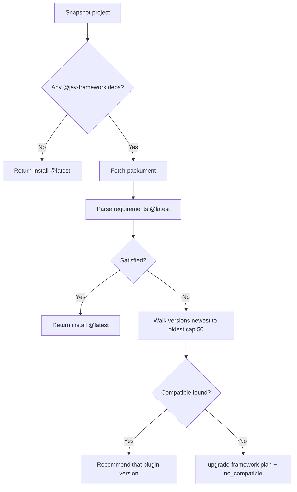

# Design Log #164 — Plugin ↔ Framework Version Compatibility (CLI)

## Background

Jay Stack projects install plugins via `yarn add` + `jay-stack setup` + `jay-stack agent-kit`. Today, tooling that triggers install (including `npm create jay` and downstream UIs) often resolves **registry latest** with no check against the project's existing `@jay-framework/*` line.

That worked while plugin and framework versions moved together. It breaks when they diverge — e.g. a project on `^0.20.0` installing a plugin whose `package.json` requires `@jay-framework/stack-server-runtime@^0.22.2`. Yarn can install **two framework trees**, causing subtle runtime failures.

**Future:** Wix integration packages (`wix-media`, `wix-stores`, …) may ship on a **different cadence** than core Jay. **Plugin version numbers must not be assumed equal to framework version numbers.**

Related: Design Log **#86** (lifecycle), **#87** (setup), **#153** (`npm create jay`), **#66** (transitive plugin deps). Orchestrated install + structured reports are specified in a separate consumer design (AIditor DL#35); this log owns **compatibility resolution** in `stack-cli`.

## Problem

1. **Latest ≠ compatible** — install picks newest publish without reading framework requirements.
2. **Requirements live in registry metadata** — each plugin version's `package.json` declares what it needs; that must be fetched and compared to the project snapshot.
3. **Today's plugins use `dependencies`, not `peerDependencies`** — on `@jay-framework/*` (see wix-media). The resolver must read **`dependencies` in v1** (see §7). Longer term, plugins should migrate to peers.
4. **No machine-readable compat report** — consumers cannot offer "install older plugin" vs "upgrade framework" without duplicating logic.
5. **No post-install doctor signal** — duplicate `@jay-framework/*` versions in the lockfile go undetected.

## Questions and Answers

**Q: Should we assume plugin version === framework version?**
A: **No.** Resolve from packument metadata at a specific plugin version vs project snapshot.

**Q: Read `dependencies` or `peerDependencies`?**
A: **Both.** Any `@jay-framework/*` entry in either field is a framework requirement. v1 must read **`dependencies`** because published plugins today declare framework packages there (see §7).

**Q: If latest plugin needs framework 0.22 but project is on 0.20?**
A: Default: install the **newest plugin version that fits**. Offer a structured **upgrade-framework** plan for latest — never silent full-project bump.

**Q: Greenfield project (no `@jay-framework/*`)?**
A: Latest plugin is fine; no compat walk.

**Q: Local monorepo / `plugin-sources.yaml` overrides?**
A: Unchanged; compat applies to registry installs only.

## Design

### 1. Project framework snapshot

```typescript
// packages/jay-stack/stack-cli/lib/plugins/framework-snapshot.ts

type FrameworkPackageRef = {
  packageName: string; // @jay-framework/stack-server-runtime
  declaredRange: string; // ^0.20.0
  resolvedVersion?: string; // from yarn.lock / package-lock when available
};

type ProjectFrameworkSnapshot = {
  dominantLine: string | null; // e.g. "0.20" — mode of major.minor
  packages: FrameworkPackageRef[];
  packageManager: 'yarn' | 'npm' | 'pnpm';
};
```

### 2. Plugin requirements at a version

```typescript
// packages/jay-stack/stack-cli/lib/plugins/plugin-requirements.ts

type PluginFrameworkRequirements = {
  pluginPackage: string;
  pluginVersion: string;
  frameworkRequirements: Record<string, string>;
};
```

Fetch from npm packument. Merge requirements from:

| Source                                  | Priority                                   |
| --------------------------------------- | ------------------------------------------ |
| `peerDependencies` (`@jay-framework/*`) | Preferred                                  |
| `dependencies` (`@jay-framework/*`)     | **Required in v1** (current publish shape) |
| `engines.jay` (optional future)         | Single semver range string                 |

### 3. Compatibility report

```typescript
// packages/jay-stack/stack-server-runtime/lib/plugin-compat-report.ts
// (shared type — CLI emits, consumers parse --json)

type CompatibilityStatus =
  | 'compatible'
  | 'plugin_requires_newer_framework'
  | 'plugin_requires_older_framework'
  | 'no_compatible_plugin_version'
  | 'registry_unavailable';

type CompatibilityOption =
  | {
      kind: 'install-plugin';
      installSpec: string;
      pluginVersion: string;
      recommended: boolean;
    }
  | {
      kind: 'upgrade-framework';
      bumps: Array<{ package: string; from: string; to: string }>;
      requiresRestart: boolean;
    }
  | {
      kind: 'install-latest-anyway';
      installSpec: string;
      warning: string;
    }
  | { kind: 'cancel' };

interface PluginCompatibilityReport {
  pluginPackage: string;
  project: ProjectFrameworkSnapshot;
  status: CompatibilityStatus;
  evaluatedLatest?: PluginFrameworkRequirements;
  recommended?: CompatibilityOption;
  options: CompatibilityOption[];
  issues: PluginIssue[];
}
```

Extend `PluginIssueCode` (install report schema):

| Code                           | When                                                     |
| ------------------------------ | -------------------------------------------------------- |
| `FRAMEWORK_VERSION_MISMATCH`   | Latest plugin needs newer framework                      |
| `DUAL_FRAMEWORK_TREE`          | Doctor: two resolved versions of same `@jay-framework/*` |
| `NO_COMPATIBLE_PLUGIN_VERSION` | No publish fits project                                  |

### 4. Resolution algorithm

`resolveCompatiblePluginInstall(projectRoot, pluginPackage)`:



**Satisfaction:** project resolved (or declared) version must satisfy **every** `frameworkRequirements` range (semver).

### 5. CLI commands

```bash
# Preflight — no yarn add
jay-stack plugins compat <package> [--json]

# Install runs compat first unless overridden
jay-stack plugins install <package> [--json] [--version <spec>] [--force-latest]

# Optional: apply framework bumps from compat report
jay-stack deps upgrade-framework --from-report <path> [--json]
```

- `compat --json` → `PluginCompatibilityReport`
- `install` without flags → uses `recommended` installSpec; exit 1 + report if no default without `--force-latest`
- Wire into `npm create jay` plugin selection (DL#153)

### 6. Doctor

`jay-stack plugins doctor` adds:

- `DUAL_FRAMEWORK_TREE` — scan lockfile for duplicate `@jay-framework/*` resolved versions
- Suggest `plugins compat` when adding a new plugin package

### 7. Why v1 reads `dependencies` (not only peers)

Published Jay plugins today list framework packages under **`dependencies`**:

```json
"dependencies": {
  "@jay-framework/stack-server-runtime": "^0.21.0",
  "@jay-framework/wix-server-client": "^0.22.2"
}
```

**Meaning of "v1 still reads `dependencies` so existing packages work without republish":**

- The **ideal** signal is `peerDependencies` — the consumer project supplies one copy of each framework package.
- **Today's packages do not use peers yet.** If the resolver only looked at `peerDependencies`, it would see **nothing** and could not judge compatibility.
- v1 therefore also reads `dependencies` on `@jay-framework/*` from the **registry copy** of each plugin version's `package.json`.
- Plugin authors can migrate to peers **later**; the resolver already checks both fields, so no forced republish before compat works.

**Long-term plugin authoring** (document in plugin agent-kit, not blocking v1):

- Move `@jay-framework/*` to `peerDependencies`
- Optional `"engines": { "jay": ">=0.20.0 <0.23.0" }`

### Examples

✅ Project `^0.20.0`, install `wix-media`:

```
compat → latest 0.22.2 requires stack-server-runtime ^0.22.2 → mismatch
       → walk → recommend wix-media@0.20.x
```

❌ Avoid:

```typescript
installSpec = `@jay-framework/wix-media@${project.dominantLine}.0`; // version coupling
```

## Implementation Plan

**Phase 1 — Types + resolver (~5 files in `stack-cli` / `stack-server-runtime`)**

1. `framework-snapshot.ts`
2. `plugin-requirements.ts` (packument fetch + parse)
3. `resolve-compatible-plugin-version.ts`
4. `plugin-compat-report.ts` (shared types)
5. Unit tests with fixture packuments (no network)

**Phase 2 — CLI**

1. `plugins compat` command
2. Integrate into `plugins install` (coordinate with install orchestration in consumer specs)
3. `plugins doctor` → `DUAL_FRAMEWORK_TREE`

**Phase 3 — `npm create jay`**

1. Call compat before adding selected plugins

## Trade-offs

- **Packument fetch** — network at install time; cache per run. Correctness over offline heuristic.
- **Reading `dependencies`** — reflects what Yarn will nest today; peers migration reduces duplicate trees later.
- **`--force-latest`** — escape hatch; must emit explicit warning in report.

## Verification Criteria

- [ ] Golf on `^0.20.0`: `plugins compat @jay-framework/wix-media` recommends **0.20.x**, not 0.22.x
- [ ] `plugins install` → single `wix-server-client` version in lockfile
- [ ] Greenfield: latest allowed
- [ ] Unit tests use fixture packuments only
- [ ] `plugins doctor` flags dual framework tree after deliberate mismatch install
