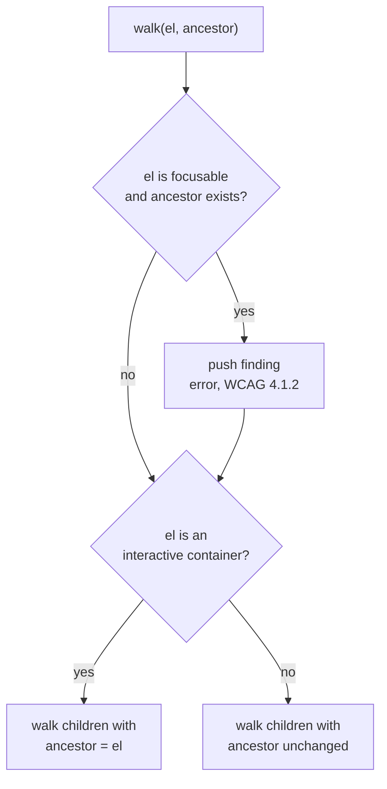

# Design Log #167 — a11y: Nested Interactive Elements

## Background

DL#145 introduced pluggable jay-html validation; DL#147 catalogs the rules shipped by `wix-media`, `seo-validator`, and `a11y-validator`. The a11y plugin (`packages/plugins/a11y-validator`) currently ships 8 rules (img alt, form labels, button name, autoplay, ARIA role, viewport zoom, positive tabindex, focusable without role) plus a duplicate-adjacent-text heuristic.

This log adds the next statically checkable, high-impact rule: **nested interactive elements** — `<a>` inside `<a>`, `<button>` inside `<a>`, and the reverse.

## Problem

Nesting focusable/interactive elements produces broken accessibility trees: the browser's HTML parser silently restructures nested `<a>` elements, screen readers announce ambiguous names, and keyboard users get unreachable or duplicated tab stops (WCAG 4.1.2 Name, Role, Value). This is `axe-core`'s `nested-interactive` rule and it is purely structural — fully checkable from the parsed jay-html body.

`node-html-parser` (used by the validator) preserves the authored nesting rather than auto-closing like a browser, so the invalid structure is visible to the validator:

```
parse('<a href="/a">out <a href="/b">in</a></a>').toString()
// '<a href="/a">out <a href="/b">in</a></a>'
```

## Questions and Answers

**Q1: Severity?**
A: `error` (WCAG 4.1.2). The markup is invalid HTML, not a style preference.

**Q2: Which elements count as "interactive"?**
A: Two sets, to keep false positives low.

- **Containers** (the outer element): `<a href>`, `<button>`, `[role="button"]`, `[role="link"]`. An `<a>` without `href` is not interactive and is not a container.
- **Focusable descendants** (the inner element): `<a href>`, `<button>`, `<input>` (excluding `type="hidden"`), `<select>`, `<textarea>`, `<summary>`, any element with `tabindex >= 0`, and elements with a widget `role` (`button`, `link`, `checkbox`, `radio`, `switch`, `tab`, `menuitem`, `option`, `textbox`).

**Q3: Does the rule apply inside headless component instances (`<jay:xxx>`)?**
A: Yes. The rule walks the parsed body, which includes instance template children. Nesting is a structural DOM fact regardless of which component supplies the data.

**Q4: One finding per pair, or per element?**
A: One finding per inner element, naming the nearest interactive ancestor. A triple nest (`a > a > button`) yields two findings — each is a separate fix site.

## Design

A dedicated recursive pass, `checkNestedInteractive(root, findings)`, run alongside `checkDuplicateAdjacentText` after the main `walkElements` pass. It carries the nearest interactive ancestor down the tree rather than walking `parentNode` upward per element, so the whole check is a single O(n) traversal.



Finding shape:

```typescript
{
    severity: 'error',
    message: 'Interactive <button> is nested inside <a> (WCAG 4.1.2)',
    suggestion:
        'Interactive elements cannot be nested — browsers restructure the DOM and screen ' +
        'readers announce an ambiguous control. Move the <button> outside the <a>, or make ' +
        'the outer element a non-interactive container such as <div>.',
    element: '<button>',
}
```

## Implementation Plan

1. Add `INTERACTIVE_CONTAINER_ROLES`, `WIDGET_ROLES`, `FOCUSABLE_ELEMENTS` sets and `checkNestedInteractive` to `packages/plugins/a11y-validator/lib/validators/a11y-validator.ts`.
2. Tests in `test/validators/a11y-validator.test.ts` under `describe('nested interactive elements')`.
3. Scan existing `.jay-html` content in the repository — an `error`-severity rule must not break examples, templates, or fixtures.
4. Update the a11y table in DL#147.

## Examples

❌ Nested anchors — browsers restructure this into siblings:

```html
<a href="/product">
  Product name
  <a href="/product/reviews">See reviews</a>
</a>
```

❌ Button inside an anchor — two overlapping activation targets:

```html
<a href="/product">  <button>Add to cart</button> </a>
```

✅ Siblings inside a non-interactive container:

```html
<div class="product-card">
  <a href="/product">Product name</a>
  <button>Add to cart</button>
</div>
```

✅ Non-interactive content inside a link is fine:

```html
<a href="/product"><span>Product name</span></a>
```

## Trade-offs

- **Containers limited to links/buttons and their ARIA equivalents.** A `<div tabindex="0" role="checkbox">` wrapping an `<input>` is a real violation this rule misses. Widening the container set risks flagging legitimate composite widgets (toolbars, listboxes, `role="tab"` in a `tablist`), so the narrow set trades recall for precision.
- **`error`, not `warning`.** It fails `jay-stack validate`, which is deliberate: the markup is invalid HTML that browsers silently rewrite, so the rendered result never matches the author's intent.

## Verification Criteria

1. `<a href>` containing `<a href>`, `<button>`, `<input>`, or `[tabindex="0"]` produces exactly one `error` per inner element, mentioning WCAG 4.1.2.
2. `<button>` containing `<a href>` produces one error.
3. `<a>` without `href` containing a `<button>` produces no finding.
4. A link containing only `` / `<span>` / text produces no finding.
5. The "clean page" test in the existing suite still returns zero findings.
6. Full a11y-validator suite passes.
7. No existing `.jay-html` in the repository is flagged.

---

## Implementation Results

`packages/plugins/a11y-validator/lib/validators/a11y-validator.ts`:

- Added `INTERACTIVE_CONTAINER_ROLES`, `WIDGET_ROLES`, `FOCUSABLE_ELEMENTS` sets.
- Added `hasHref`, `isInteractiveContainer`, `isFocusable`, `checkNestedInteractive`.
- `checkNestedInteractive(ctx.body, findings)` runs after `checkDuplicateAdjacentText`, as a single O(n) traversal carrying the nearest interactive ancestor downward.

`test/validators/a11y-validator.test.ts`: 12 tests under `describe('nested interactive elements')` — 6 flagging cases (a-in-a, button-in-a, a-in-button, input-in-a, `tabindex="0"` in a, focusable in `role="button"`), the multi-level case, and 5 passing cases (`<a>` without href, link with only img/span, interactive siblings in a `<div>`, image in a button, hidden input in a link).

**Tests: 52/52 passing** in `@jay-framework/a11y-validator` (40 before, 12 added).

### Regression check on existing content

Because the rule is `error` severity, it can fail `jay-stack validate` on existing projects. Scanned every `.jay-html` in the repository (examples, templates, test fixtures, component libraries) with the rule's logic: **0 violations**. No example, `create-jay` template, or fixture needed changes.

### Deviations from the design

**`isInteractiveContainer` treats an explicit `role` as authoritative.** The design implied checking role and tag independently. As implemented, if an element has any `role`, only that role decides whether it is a container — so `<a href="/x" role="presentation">` is not treated as a container. This matches ARIA semantics, where an explicit role overrides the implicit one, and avoids flagging the common "link stripped of semantics" pattern.

### Verification against criteria

| #   | Criterion                                                    | Result                                        |
| --- | ------------------------------------------------------------ | --------------------------------------------- |
| 1   | Nested focusables in `<a href>` → one error each, WCAG 4.1.2 | ✅ covered by 5 tests, exact message asserted |
| 2   | `<a href>` inside `<button>` → one error                     | ✅                                            |
| 3   | `<a>` without `href` wrapping a button → no finding          | ✅                                            |
| 4   | Link containing only img/span/text → no finding              | ✅                                            |
| 5   | Existing "clean page" test still returns zero findings       | ✅                                            |
| 6   | Full a11y-validator suite passes                             | ✅ 52/52                                      |
| 7   | No existing `.jay-html` in the repository is flagged         | ✅ 0 violations across the repo               |
