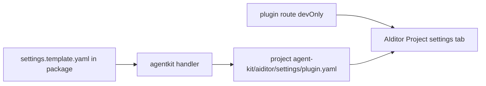

# Design Log #170 — AIditor Settings Plugin Contributions

## Background

AIditor **Project settings** tabs are discovered from materialized YAML under `agent-kit/aiditor/settings/*.yaml` after `jay-stack agent-kit`. Plugins opt in by shipping a template in the npm package and copying (or generating) project-local discovery files from the `agentkit` handler.

Related: Design Log **#130** (plugin routes), **#168** (`devOnly` on routes), **#154** (shipping `agent-kit/` in package `files`), plugin-validator `validateAiditorSettings`.

A production bug in `design-system-validator` showed that **fixed parent-directory hops** from `import.meta.url` fail when handler code is bundled to `dist/index.js` — the template was never materialized and the tab never appeared.

## Problem

1. No **canonical agent-kit guide** for plugin authors — settings steps were scattered in aiditor-add-menu.md and DL#168 consumer notes.
2. **Inconsistent path resolution** — `wix-media` used one `..`; `design-system-validator` used two `..` (broken when bundled).
3. AI agents and humans need a **checklist** (template path, `files`, agentkit, route + `devOnly`, resolver pattern) to ship tabs consistently.

## Questions and Answers

**Q: Should settings YAML be written in `setup`?**  
A: **No.** Materialize in **`agentkit`** — same lifecycle as Add Menu catalogs.

**Q: Where does the template live?**  
A: **`agent-kit/aiditor/settings.template.yaml`** in the plugin package (validator-enforced path).

**Q: Where does materialized YAML live?**  
A: **`<projectRoot>/agent-kit/aiditor/settings/<plugin>.yaml`** — project-owned discovery, not inside `node_modules`.

**Q: Must the route be `devOnly`?**  
A: **Yes** for settings UIs — `plugin-validator` warns otherwise (Design Log #168). Dev server still serves the URL; AIditor loads by explicit path.

**Q: Shared npm utility for `resolvePackagedAgentKitPath`?**  
A: **Deferred.** Copy the ~15-line walk-up helper into each plugin until a third consumer needs changes (design-system-validator, wix-media today). No new package.

## Design

### Materialization flow



### Path resolution convention

Handlers MUST use **walk-up** from `import.meta.url` until `agent-kit/aiditor/settings.template.yaml` exists (max 4 levels). Do NOT assume `dist/` vs `lib/` depth.

Documented in agent-kit: `plugin/aiditor-settings-guide.md`.

### Schema (validator-owned)

Types in `@jay-framework/plugin-validator`: `AiditorSettingsFile`, `validateAiditorSettingsFile`.

| Field        | Required | Notes                                    |
| ------------ | -------- | ---------------------------------------- |
| `label`      | yes      | Tab title                                |
| `route`      | yes      | Must match `plugin.yaml` `routes[].path` |
| `pluginName` | no       | Defaults from output filename            |
| `requires`   | no       | `{ plugin, status: "configured" }[]`     |

### Settings page boundaries

- Actions / jay-commands for mutations
- Project-generated paths only (`*.generated.yaml`, `agent-kit/references/`)
- `postMessage` for catalog refresh and optional agent handoff
- No secrets in forms — `setup` owns credentials

## Implementation Plan

1. Add `aiditor-settings-guide.md` to stack-cli agent-kit-template
2. Cross-link from `INSTRUCTIONS.md`, `setup-guide.md`, `add-menu-guide.md`, `plugin-routes.md`
3. Expand aiditor `aiditor-add-menu.md` Project settings section with resolver link
4. Update `validate-aiditor-settings` suggestions to point at new guide
5. Reference implementations: `design-system-validator`, `wix-media`

## Examples

✅ Materialize with walk-up resolver (see guide).

✅ Route declaration:

```yaml
routes:
  - path: /my-plugin/settings
    jayHtml: ./lib/pages/settings/page.jay-html
    component: settingsPage
    devOnly: true
```

❌ Fixed hop from bundled module:

```typescript
path.join(dirname(fileURLToPath(import.meta.url)), '..', '..', 'agent-kit', ...);
```

## Trade-offs

- **Per-plugin copy of resolver** — avoids premature shared package; duplicate ~15 lines acceptable until pattern stabilizes.
- **Validator warnings not errors** for `devOnly`/route mismatch — allows gradual adoption; AIditor-facing plugins should treat warnings as blocking.
- **Consumer runtime spec** stays in AIditor docs (`aiditor-add-menu.md`); jay owns plugin author materialization.

## Verification Criteria

- [ ] `aiditor-settings-guide.md` in agent-kit-template with checklist and resolver
- [ ] Plugin INSTRUCTIONS workflow mentions settings surface
- [ ] DL#168 consumer notes reference DL#170
- [ ] `validate-plugin` suggestions reference `aiditor-settings-guide.md`
- [ ] design-system-validator materializes settings after `yarn agent-kit` in a consumer project
