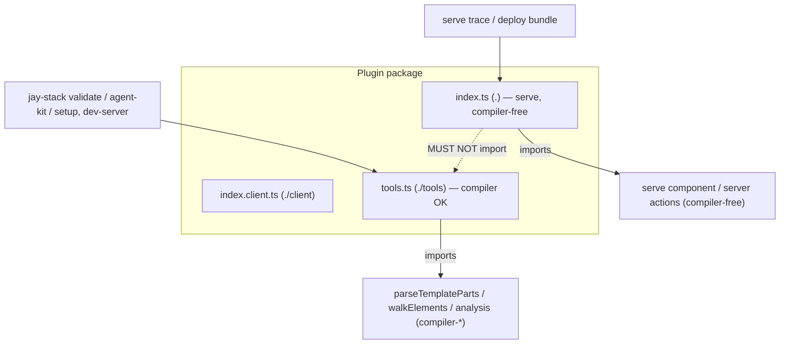

# Design Log #179 — Compiler-Free Plugin Runtime (runtime vs tools entry split)

> **Part 1** — Runtime/tools entry split: keep compiler deps out of a plugin's serve (`.`) bundle by
> moving all tools-time capabilities (validators, agent-kit, setup, tools-actions) behind a `./tools`
> entry.
> **Part 2** — Capability-aware `validate-plugin`: stop assuming every plugin renders components.

## Background

DL#178 removed compiler dependencies from the production **serve/rebuild** path by splitting
runtime vs build packages. This log addresses the same problem one layer out: **plugins**.

A plugin package ships code that runs in two very different phases:

- **Serve-time (runtime)** — the headless component, production routes, **server actions**, client
  bundle, global `init`. Loaded on the production request path. Must stay **compiler-free** (DL#178
  goal: small Wix BaaS deploy bundle).
- **Tools-time** — validators (DL#145), **CLI commands**, agent-kit generators, `jay-stack setup`
  handlers, and dev-only route components. Run only under the Jay toolchain (`jay-stack
  validate`/`agent-kit`/`setup`/`run`, dev-server). These legitimately use compiler APIs
  (`parseTemplateParts`, `walkElements`, `compileContractFile`, …).

The two phases share one npm package but must **not** share one module graph.

### Actions vs commands — the load-bearing distinction

The framework already has the right two primitives; we just used them interchangeably because both
can be triggered from the CLI:

- **Actions** are the **serving** primitive — request-time handlers that run in production. They
  live in `index.js` and **must be compiler-free**.
- **CLI commands** are the **tools** primitive — invoked under the toolchain (`jay-stack run …`).
  They live in `./tools` and **may use the compiler**.

So the rule is simple and non-ambiguous: *if a handler needs the compiler, it is a command, not an
action.* This replaces the earlier "actions try `./tools` then `.`" fallback with a clean split.

## Problem

Every tools-time handler is currently loaded from the plugin's **main entry (`.` → `dist/index.js`)**,
the same entry the serve path imports. So any tools handler that touches the compiler drags the
compiler into the serve bundle. This is systemic across three loaders, not specific to validators:

| Capability | Loader | Current entry | Target entry |
| ---------- | ------ | ------------- | ------------ |
| `validators` | `stack-cli/lib/validate.ts:903` | `import(plugin.packageName)` — `.` | `./tools` |
| `commands` | `stack-server-build/lib/plugin-commands.ts:213` (`loadCommandHandler`) | `import(command.packageName)` — `.` | `./tools` |
| `agentkit` / `setup` | `stack-server-build/lib/plugin-setup.ts:315` (`loadHandler`) | `import(plugin.packageName)` — `.` | `./tools` |
| `actions` | `stack-server-build/lib/action-discovery.ts` (`registerNpmPluginActions`) | package main module — `.` | **`.` (unchanged; compiler-free)** |

Because these handlers are named exports of the plugin, `index.ts` re-exports them:

```ts
// index.ts (main / serve entry) — design-system-validator, abbreviated
export { validateTokens } from './validators/design-tokens.js';        // compiler-shared
export { generateDesignSystemAgentKit } from './generate-add-menu.js'; // agentkit
export { runDesignSystemAnalysis } from './settings-actions.js';       // → run-design-analysis → compiler-jay-html
export { designSystemSettingsPage } from './pages/settings/page.js';   // devOnly route → compiler-jay-html
```

Now `import('@jay-framework/design-system-validator')` (the serve-time entry) transitively loads
`compiler-jay-html`. The compiler enters the deploy trace and becomes a runtime `dependency`.

**Key correction from the first draft of this log:** the leak is *not* the validator. In the
in-repo mixed plugin (`design-system-validator`) the validator only uses `compiler-shared`
(`walkElements` + erased `import type`s); the real `compiler-jay-html` leak comes through
`run-design-analysis.ts`, reached via the **actions, agent-kit, and dev-only page** — all exported
from `.`. Splitting only the validator would leave `index.js` still importing the compiler. The fix
must move **all** tools-time handlers off `.`.

### In-repo reality check

- `a11y-validator`, `seo-validator` — **validator-only**. They never serve anything, so today's
  compiler import in their `index.js` is never in a production trace. The split is correctness/hygiene
  (and consistency), not a bundle win.
- `design-system-validator` — **tools plugin** (agentkit + actions + validators + `devOnly` route).
  Its entire public surface is tools-time; it has no production serve component. After the split its
  `.` entry is empty (or near-empty) and therefore compiler-free.
- The plugin that motivated this log — a genuine **serve component + validator in one package** —
  lives in the external Wix repo. In-repo we can prove the mechanism + loaders; the pure serve-mixed
  bundle win is demonstrated by the Wix owners.

## Questions and Answers

**Q1. One extra entry, or per-capability entries?**
A: One **`./tools`** entry for all tools-time handlers (source `lib/tools.ts` → `dist/tools.js`),
parallel to the existing `./client` (`index.client.ts`). Reuses a proven mechanism; one boundary for
plugin authors to reason about ("does this run at serve or under the toolchain?").

**Q2. Do `compiler-*` packages stay plugin dependencies?**
A: Declared as **`peerDependency`** (provided by the toolchain / stack-cli at tools time), plus a
`devDependency` so the plugin's own build/test resolve them. Keeps runtime installs lean. The
decisive win is the **bundle trace**: `index.js` no longer imports any tools handler, so the serve
trace never reaches the compiler regardless of what's installed.

**Q3. Keep backward-compat with handlers exported off `.`?**
A: **No — clean cut for all tools capabilities.** Validators, commands, agent-kit, and setup load
**only** from `./tools`; no `.`-fallback. Any plugin declaring one of these must expose a `./tools`
export (Part 2 enforces it). This keeps the loaders trivial and the boundary unambiguous: tools
handlers always live in `tools.ts`, serve handlers in `index.ts`. **Actions stay on `.`** and must be
compiler-free (a compiler-using "action" is really a command).

**Q4. Where does `handler` point now?**
A: `handler` keeps its meaning — the **export name** within the loaded module. Only the module we
import changes. plugin.yaml is unchanged.

## Design

Three source entries per plugin (validator-only plugins may have an empty `.`):

```
lib/index.ts         →  dist/index.js         (".")         serve-time,  compiler-free
lib/index.client.ts  →  dist/index.client.js  ("./client")  client,      compiler-free
lib/tools.ts         →  dist/tools.js         ("./tools")   tools-time,  compiler OK
```

- `index.ts` must **not** import `tools.ts`. Compiler imports live only behind `./tools`.
- `tools.ts` re-exports the plugin's validators, agent-kit generator, setup handler, and any
  compiler-dependent actions.

### Capability → entry routing

| Capability (manifest field)    | Phase       | Loaded from            |
| ------------------------------ | ----------- | ---------------------- |
| `contracts` / `dynamic_contracts` | serve    | `.` (+ subpaths)       |
| production `routes` component   | serve       | route `component`/`compPath` (compiler-free) |
| `contexts`, `init`/global       | serve       | `.` / `./client`       |
| `actions`                       | serve       | **`.` (compiler-free)** |
| `validators`                    | tools       | **`./tools`** |
| `commands`                      | tools       | **`./tools`** |
| `agentkit`, `setup`             | tools       | **`./tools`** |
| `devOnly` / setup `routes`      | tools       | route path (excluded from deploy; compiler OK) |

### Loader changes

`stack-cli/lib/validate.ts` (published branch, ~line 903) — hard cut:

```ts
} else {
    handlerModule = await import(`${plugin.packageName}/tools`);
}
```

`stack-server-build/lib/plugin-setup.ts` `loadHandler` (agent-kit/setup, npm branch ~line 315) and
`stack-server-build/lib/plugin-commands.ts` `loadCommandHandler` (npm branch ~line 213) — load
directly from `./tools` (clean cut, no fallback):

```ts
// npm branch
module = viteServer
    ? await viteServer.ssrLoadModule(`${packageName}/tools`)
    : await import(`${packageName}/tools`);
```

`action-discovery.ts` `registerNpmPluginActions` is **unchanged** — actions keep loading from `.` and
must be compiler-free (the leak scan enforces it).

(Local-plugin paths are file-based and unaffected.)

### Plugin package.json

```json
"exports": {
    ".":            "./dist/index.js",
    "./client":     "./dist/index.client.js",
    "./tools":      "./dist/tools.js",
    "./plugin.yaml": "./plugin.yaml"
}
```

### Plugin vite.config (add tools SSR entry, externalize compiler)

```ts
lib: {
    entry: isSsrBuild
        ? {
              index: resolve(__dirname, 'lib/index.ts'),
              tools: resolve(__dirname, 'lib/tools.ts'),
          }
        : { 'index.client': resolve(__dirname, 'lib/index.client.ts') },
},
rollupOptions: {
    external: [/* runtime externals */, /^@jay-framework\/compiler-/],
}
```

Because the build externalizes `@jay-framework/compiler-*`, any leak into `.` surfaces as a **literal
`import '@jay-framework/compiler-…'` string in `dist/index.js`** — which makes leak detection a text
scan, no bundler/graph tracing (see Part 2).

### plugin-validator enforcement — prevention first

Per CLAUDE.md prevention order, catch the leak at validation time:

- **New lint rule (error):** `dist/index.js` must contain no `@jay-framework/compiler-` import.
  Implemented as a text scan of the built `.` bundle (plugins build with `minify: false`), naming the
  offending re-export. This is now *achievable* for `design-system-validator` because all its
  compiler-using handlers move to `./tools`.
- **New lint rule (error):** if `plugin.yaml` declares `validators`, the package must expose a
  `./tools` export (Part 2 rule 2).

## Diagram



## Implementation Plan

### Phase 1 — Loaders
1. `validate.ts`: published validators load from `${packageName}/tools` (hard cut).
2. `plugin-setup.ts` `loadHandler` (agent-kit/setup) + `plugin-commands.ts` `loadCommandHandler`:
   load npm handlers from `./tools` (clean cut). `action-discovery.ts` unchanged (actions stay `.`).

### Phase 2 — Plugin template + in-repo plugins

For each plugin: add `lib/tools.ts` (re-export tools handlers), remove those re-exports from
`index.ts`, add the `./tools` export + vite tools entry + `build:types` entry, and move `compiler-*`
to `peerDependencies` (keep a `devDependency`).

**In-repo plugin inventory** (all under `packages/plugins/`):

| Plugin                    | Declared capabilities                | Action for #179 |
| ------------------------- | ------------------------------------ | --------------- |
| `a11y-validator`          | `validators`                         | Move validator → `./tools`; `.` becomes empty. Uses `compiler-shared`. |
| `seo-validator`           | `validators`                         | Same as a11y. |
| `design-system-validator` | `agentkit, actions, routes, validators` | **In-repo mixed case.** `fontFallback` stays a genuine (compiler-free) **action** on `.`. The compiler-using analysis handlers (`runDesignSystemAnalysis`, …, via `run-design-analysis.ts` → `parseJayFile`/`JAY_IMPORT_RESOLVER`) become **`devOnly` actions** with handlers in `./tools` (**DL#180**) — kept as actions so the settings page's browser RPC still works — together with validators + `generateDesignSystemAgentKit`. Split `settings-actions.ts` so compiler-free actions stay in `.` (see module-taint note). `index.js` then ends compiler-free. Verify with the leak scan. |
| `data-files`              | `dynamic_contracts, commands`        | `commands` → `./tools` (clean cut, even if compiler-free). Verify interactive gating. |
| `markdown`                | `contracts`                          | Verify interactive gating; keeps `./client` iff interactive. |
| `ui-kit`                  | `contracts, agentkit`                | `agentkit` → `./tools`. Verify interactive gating. |
| `gemini-agent`            | `contracts, actions, setup`          | `setup` → `./tools`; `actions` stay `.`. Verify interactive gating. |
| `webmcp`                  | `global: true` (no manifest fields)  | Must **not** false-warn — `global`+`init` export counts (Part 2 rule 1). |

**External plugin inventory** (scanned 2026-09-03; fixed by their owners, but they set the migration
scope and confirm the mechanism). Two repos: `../wix/packages/wix-*` and `../aiditor/packages/*`.

| Plugin (repo)                | Leaks compiler into `.`? | Via                                                                 | #179 action |
| ---------------------------- | ------------------------ | ------------------------------------------------------------------- | ----------- |
| `wix-media` (wix)            | **Yes**                  | `validate` re-export → `media-validator.ts` value-imports `walkElements`,`resolveBinding` (compiler-shared), `parseTemplateParts` (compiler-jay-html) | validator → `./tools`; commands → `./tools`. Settings actions are compiler-free. |
| `wix-deploy` (wix)           | **Yes**                  | `validate` re-export → `static-filename-validator.ts` value-imports `walkElements` (compiler-shared), `parseTemplateParts` (compiler-jay-html) | validator → `./tools`; commands → `./tools`. (`build-entry.ts` compiler refs are string stubs, not runtime imports.) |
| `wix-members` (wix)          | No (`import type` only)   | validator uses type-only compiler imports (erased); runtime uses `node:fs`/`path` | validator → `./tools` for consistency; no dep change needed. |
| `wix-bookings/stores/stores-v1/data/forms/cart/server-client` (wix) | No | actions/setup/contracts only; no compiler imports | no leak; `compiler-jay-stack` stays devDep. Nothing to move. |
| `aiditor` (aiditor)          | **Yes**                  | `getContractInspectorTagsAction` (re-exported **and** imported by page) → `resolve-contract-tags-server.ts` value-imports `parseContract`,`ContractTagType` (compiler-jay-html), `checkValidationErrors` (compiler-shared) | Leak is via an **action + page**, not a validator → **DL#180** devOnly action + devOnly route in `./tools`. aiditor assumes a **full dev environment**, so its `/aiditor` route should be marked `devOnly: true` and `getContractInspectorTagsAction` becomes a `devOnly` action (handlers in `./tools`). Squarely in #180's scope — the whole tool is a dev/tools surface, so its compiler use is fine there and never reaches a production serve bundle. |
| `aiditor-quill` (aiditor)    | No                       | index only re-exports the `agentkit` handler; no compiler imports  | `agentkit` → `./tools`. |

**Two distinct leak shapes, cleanly separated across #179/#180:**

1. **Validator leaks** — the common case. `wix-media`, `wix-deploy` (and in-repo `a11y`/`seo`/
   `design-system` validators) all pull the compiler through a `validate` re-export. **Fully fixed by
   #179's validator → `./tools` split** — no `devOnly` needed.
2. **Settings-page-with-compiler-action leaks** — the rare case. Only `design-system-validator`
   (in-repo) and `aiditor` (external) route the compiler through a *browser-callable action / page*.
   This is what **DL#180** (`devOnly` actions in `./tools`) exists for.

**Key confirmation from the scan:** **no wix or aiditor-quill action imports a compiler package.** The
entire wix compiler pressure is validators (→ #179). `wix-media`'s settings page (`/wix-media/settings`
`devOnly:true` + 5 settings actions) is the reference *shape* for #180, but its actions happen to be
compiler-free — so #180's `devOnly`-action mechanism is driven solely by `design-system-validator` and
`aiditor`, validating that the two DLs carve the problem at the right joint. Nobody has a `./tools` or
`./validator` export yet; `design-system-validator` is our in-repo equivalent for the leak scan.

**Resolved via DL#180 — design-system-validator's dev-only page.** Its `devOnly` settings page invokes
the analysis via *actions* from the browser. Rather than reclassify those as commands (which would
break the browser RPC), **DL#180** introduces `devOnly` **actions** whose handlers live in `./tools`
(compiler-OK) and are excluded from production. The settings page keeps calling them as actions in the
dev server; production build strips both the `devOnly` route and the `devOnly` actions (finishing
DL#171 Phase 2). Note: `devOnly` routes are **not** excluded from the production build today
(`build-pipeline.ts:274` still compiles them; only sitemap skips them) — DL#180 implements that
exclusion.

**Module-taint note.** A compiler import taints the *whole module*, not just the function that uses
it: `settings-actions.ts` imports `run-design-analysis.ts` at module top, so *every* handler exported
from `settings-actions.ts` drags in the compiler even if it never calls the analysis. Migration must
therefore **split modules** — keep compiler-free handlers (e.g. `fontFallback`) in modules reachable
from `index.ts`, and move compiler-using handlers into modules reachable only from `tools.ts`. The
leak scan (literal `@jay-framework/compiler-` in `dist/index.js`) catches an incomplete split.

### Phase 3 — Capability-aware validation (Part 2)
3. `validate-plugin`: replace the two unconditional checks (`:330`, `:1055`) with the capability →
   required-export table.
4. Add the **at-least-one-capability** warning with a `suggestion` link to
   `agent-kit/plugin/plugin-structure.md`.
5. `./client` **error** iff a provided component has an interactive phase (static scan for
   `withInteractiveMark(`) or `contexts` declared. `./tools` **error** iff any tools capability
   (`validators`/`commands`/`agentkit`/`setup`) declared.
6. Leak scan: `dist/index.js` text contains no `@jay-framework/compiler-`.

### Phase 4 — Agent-kit guides (Part 3)
7. Update `validation.md` (validators export from `./tools`, never from `index.ts`),
   `plugin-structure.md` (three-entry model + capability matrix + runtime/tools split),
   `contracts-guide.md` (interactive → `./client`).

### Phase 5 — Verify
8. `jay-stack validate` runs `a11y`/`seo`/`design-system` validators loaded via `./tools`.
9. Leak scan on `design-system-validator` `dist/index.js`: zero `@jay-framework/compiler-` imports.
10. `validate-plugin` on `a11y`/`seo`: no false "no contracts" / "missing ./client" warnings;
    **error** if `./tools` missing while `validators` declared.
11. `validate-plugin` on `webmcp` (`global: true`): no "declares no capabilities" warning.
12. `validate-plugin` on `data-files`/`markdown`/`ui-kit`/`gemini-agent`: `./client` required only
    where a component is interactive; no new false errors.
13. `yarn confirm` green (all 8 in-repo plugins build + validate).

## Verification Criteria

- A plugin with a serve component + tools handlers ships an `index.js` whose text contains no
  `@jay-framework/compiler-` import.
- `jay-stack validate` loads validators via `./tools` and reports findings.
- `validate-plugin` fails a plugin that re-exports a compiler-using handler from `index.ts`.

## Part 2 — Capability-Aware Plugin Validation

### Problem

`validate-plugin` assumes every plugin is a "standard component plugin" and applies two checks
unconditionally, producing false warnings for validator-only (and action-only, service-only) plugins:

```
# design-system-validator, seo-validator (no serve component):
Plugin has no contracts or dynamic_contracts defined      # validate-plugin.ts:330
package.json exports missing "./client" entry point        # validate-plugin.ts:1055
```

Neither is a real problem: such plugins correctly have no contracts and no client bundle. The checks
encode "a plugin must render components," which is only true for *some* plugins.

### Design — validate against declared capabilities

Key off the manifest fields the plugin actually declares. Capability → what it needs:

| Capability (manifest field)   | Needs `./client`?          | Required package.json export(s)          |
| ----------------------------- | -------------------------- | ---------------------------------------- |
| `contracts`                   | only if interactive phase  | `.`, `./<contract>` per item; `./client` iff interactive |
| `dynamic_contracts`           | only if interactive phase  | `.`; `./client` iff interactive          |
| `routes`                      | only if interactive phase  | `.`, `./<jayHtml>` (+`./<css>`); `./client` iff interactive |
| `contexts`                    | ✅ always (client by def)  | `.`, `./client`                          |
| `validators`                  | ❌ no                      | `./tools`  *(Part 1)*                    |
| `commands`                    | ❌ no                      | `./tools` (tools; compiler OK)           |
| `agentkit` / `setup`          | ❌ no                      | `./tools`                                |
| `actions`                     | ❌ no                      | `.` (compiler-free)                      |
| `services`                    | ❌ no                      | `.`                                      |
| `init` / global               | ❌ no                      | `.`                                      |

### Error vs warning principle

Single rule (consistent with DL#176 — every warning must be suppressible):

- **Error** — the plugin *does not work*: a declared capability cannot function. Not suppressible.
  (e.g. `validators` declared but no `./tools`; interactive component but no `./client`.)
- **Warning** — advisory the author *can suppress*: works but likely unintended. (e.g. declares no
  capabilities.)

Rules:

1. **At-least-one-capability.** A plugin declaring *none* → single warning:
   `Plugin declares no capabilities (contracts, dynamic_contracts, actions, validators, routes,
   services, contexts, init, setup, agentkit, commands)`. **Include a `suggestion` linking to**
   `agent-kit/plugin/plugin-structure.md`. Replaces the contracts-specific warning at line 330.
   - **`global: true` counts.** A global plugin (`webmcp`) runs on every page via its `init`/`setup`
     export even with no contracts/actions — treat `global: true` (paired with a resolvable
     `init`/`setup` export) as satisfying the rule; `global: true` with no such export is an **error**.

2. **`./tools` is required iff any tools capability is declared** — `validators`, `commands`,
   `agentkit`, or `setup` (Part 1). Error, not a warning: these load only from `./tools`, so a missing
   export means the handler can't be loaded.

3. **`./client` is required iff a provided component has an interactive phase**, or the plugin
   declares `contexts`. Server-only (slow/fast) component plugins need no `./client`. Replaces the
   unconditional check at line 1055.

   - *Detection = static text scan.* `validate-plugin` is a purely static analyzer today
     (`fs.readFileSync` + regex; it does not import plugin code). Keep it that way: scan the built,
     un-minified server `.` bundle for the interactive mark `withInteractiveMark(`. Jay's
     runtime-mode code-deletion transform swaps `withInteractive` → `withInteractiveMark` for the
     server build (verified: `compiler-jay-stack/.../check-method-should-remove.ts`, DL#72a; both set
     `hasInteractive = true`), so the mark is reliably present in the server bundle when — and only
     when — a component declared an interactive phase. No dynamic import, no side effects.
   - *Precondition:* the plugin must be built (`dist/`) before validate. In-repo `validate` runs as
     the last `build` step, so `dist/` exists.
   - *Caveat:* never infer interactivity from the client bundle — it may be absent (the very thing
     we're checking).
   - *Degrade:* if interactivity can't be determined, warn, don't error.

4. **Contract/route sub-exports** stay as-is (already conditional on `contracts`/`routes`).

Table-driven: derive the required export set from the union of declared capabilities (plus the
interactive scan), then diff against `package.json.exports`.

### Verification (Part 2)

- `validate-plugin` on `seo-validator` / `design-system-validator`: **no** "no contracts" and **no**
  "missing ./client" warnings; still requires the `./tools` export.
- `validate-plugin` on an empty plugin: exactly one "declares no capabilities" warning.
- A component plugin with an interactive phase but no `./client` still errors.

## Part 3 — Agent-Kit Guide Updates (plugin developer)

The guides currently teach the pattern that *causes* this bug and assume a component-shaped plugin.

### `agent-kit-template/plugin/validation.md`
- **`Plugin Validators` (~line 142):** currently *"The function must be exported from
  `lib/index.ts`."* — the exact instruction that leaks the compiler. Replace: validators live in
  `lib/tools.ts`, exported via the **`./tools`** subpath; **never re-export a tools handler from
  `index.ts`** (compiler APIs must not enter the serve entry). `handler` = export name within
  `./tools`.
- **`What It Checks` / `Plugin Structure` (~line 39):** document the capability-aware rules —
  `./client` only when a component has an interactive phase; `./tools` when `validators` (or any
  compiler-using handler) declared; the at-least-one-capability warning.

### `agent-kit-template/plugin/plugin-structure.md`
- **`Dual Entry Points` → `Entry Points` (~line 266):** add `lib/tools.ts` → `dist/tools.js`
  (`./tools`), compiler-allowed, toolchain-only. Update the entry table (~278).
- **Build scripts (~292) + vite config (~317):** add the `tools` SSR entry with `compiler-*`
  externalized; add `lib/tools.ts` to `build:types`.
- **`package.json Exports` (~334):** add `"./tools": "./dist/tools.js"`.
- **New `Capabilities` overview** near the top: the runtime-vs-tools split + the actions-vs-commands
  distinction (actions serve/compiler-free on `.`; commands tools/compiler on `./tools`) + the
  capability → required-export matrix; a plugin needs ≥1 capability; `./client` is interactive-gated.

### `agent-kit-template/plugin/contracts-guide.md`
- Note the interactive-phase → `./client` requirement.

Documentation (tier 2) paired with the `validate-plugin` rules (tier 1) so guidance is enforced.

## Trade-offs

- **+** Reuses the established `./client` split; one runtime/tools boundary for authors.
- **+** Fixes the *systemic* leak (all tools handlers), not just validators.
- **+** Leak detection is a cheap text scan (compiler externalized), no bundler graph tracing; keeps
  `validate-plugin` fully static.
- **+** Prevention rule stops regressions instead of relying on discipline.
- **−** Every plugin with tools handlers needs a build-config change (one-time; mitigated by template).
- **−** Three entries per plugin is more boilerplate.
- **Alternative rejected:** rely on consumer-side tree-shaking of unused tools exports — fragile
  (side-effectful import chains; `compiler-*` can still be traced into the bundle).

## Resolved Decisions

- **Runtime vs tools split (supersedes the validator-only framing).** `index.js` (`.`) is
  serve-time and compiler-free; all tools-time handlers (validators, **commands**, agent-kit, setup)
  move behind a single **`./tools`** entry (`lib/tools.ts` → `dist/tools.js`), which may depend on the
  compiler.
- **Actions vs commands.** Actions are the serving primitive (`.`, compiler-free); CLI commands are
  the tools primitive (`./tools`, compiler OK). A handler that needs the compiler must be a command,
  not an action.
- **OQ1 → peerDependency.** `compiler-*` used by `./tools` is a `peerDependency` (provided by the
  toolchain at tools time) + `devDependency` for the plugin's own build/test.
- **OQ2 → clean cut for all tools.** No `.`-fallback anywhere. Validators, commands, agent-kit, and
  setup load only from `./tools`; any plugin declaring one must expose `./tools`. Actions stay on `.`.
- **Detection = static text scan.** Interactivity via `withInteractiveMark(` in the server bundle;
  leak via `@jay-framework/compiler-` in `dist/index.js`. No dynamic import of plugin code.
