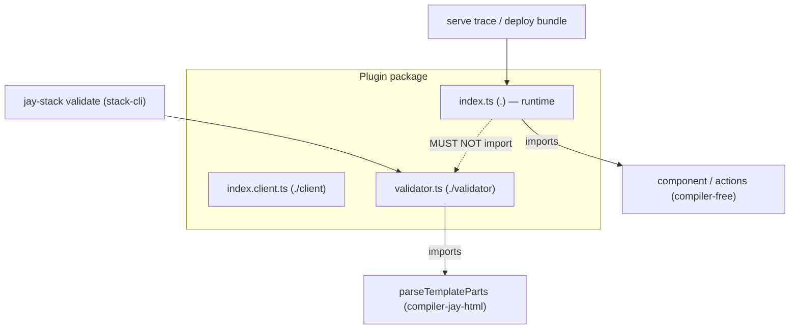

# Design Log #179 — Compiler-Free Plugin Runtime & Capability-Aware Plugin Validation

> **Part 1** — Validator entry split: keep compiler deps out of a plugin's runtime bundle.
> **Part 2** — Capability-aware `validate-plugin`: stop assuming every plugin renders components.

## Background

DL#178 removed compiler dependencies from the production **serve/rebuild** path by splitting
runtime vs build packages. This log addresses the same problem one layer out: **plugins**.

A plugin can legitimately ship two very different kinds of code in one package:

- **Runtime code** — the headless component, actions, client bundle. Loaded at serve time. Must
  stay compiler-free (DL#178 goal: small Wix BaaS deploy bundle).
- **Validators** (DL#145) — jay-html lint rules that run only under `jay-stack validate`. These
  legitimately use compiler APIs like `parseTemplateParts` from `@jay-framework/compiler-jay-html`.

## Problem

In the Wix repo, a plugin has **both** a runtime component and a validator. The validator imports
`parseTemplateParts`. Because of how validators are loaded, the compiler dependency leaks into the
plugin's runtime bundle.

Root cause is in `stack-cli/lib/validate.ts` (~line 903), the **published-plugin** load path:

```ts
if (plugin.isLocal) {
    const handlerPath = path.resolve(plugin.pluginPath, validatorDef.handler);
    handlerModule = await import(handlerPath);          // imports the handler FILE — fine
} else {
    handlerModule = await import(plugin.packageName);   // imports the plugin MAIN entry (".")
}
validatorFn = plugin.isLocal
    ? (handlerModule.validate ?? handlerModule.default)
    : handlerModule[validatorDef.handler];              // validator = named export off index.js
```

For a published plugin the validator must be a **named export of the plugin's main entry** (`.` →
`dist/index.js`). So `index.ts` re-exports the validator:

```ts
// index.ts (main runtime entry)
export { MyComponent } from './component.js';
export { validate } from './validators/my-validator.js'; // ← pulls parseTemplateParts into index.js
```

Now `import('@my/plugin')` (the serve-time entry) transitively loads `compiler-jay-html`. The
compiler enters the deploy trace and `compiler-jay-html` becomes a runtime `dependency`.

This is invisible in a **validator-only** plugin like `a11y-validator` (its `index.ts` is *only*
`export { validate }`, so there's nothing else to pollute). It only bites plugins that mix runtime
+ validator code — exactly the Wix case.

## Questions and Answers

**Q1. Separate entry file (like `index.client.ts`), or something else?**
A: Separate entry — matches the existing, proven `./client` (`index.client.ts`) split every plugin
already uses to keep client-only code out of the SSR bundle. A `./validator` entry is the same
mechanism applied to compiler-only code. (User's instinct was correct.)

**Q2. Does `compiler-jay-html` stay a plugin dependency?**
A: It still must resolve when the validator entry runs, but validators only ever run under
`jay-stack validate` (stack-cli), which already carries the full compiler. Declaring it as a
`peerDependency` (provided by the toolchain) keeps it out of the runtime install. The critical win
is the **bundle trace**: since `index.js` no longer imports the validator, the serve trace never
reaches the compiler regardless of the manifest — so the deploy bundle is clean either way.

**Q3. Keep backward-compat with validators exported off `.`?**
A: No (per project policy). Switch `validate.ts` to load the `./validator` subpath and migrate all
in-repo validator plugins. A one-line fallback to `.` is noted as an option if external plugins
need a grace period.

**Q4. Where does `handler` point now?**
A: `handler` keeps its current meaning — the **export name** within the validator module. Only the
module we import changes (from `.` to `./validator`). plugin.yaml is unchanged.

## Design

Introduce a dedicated, compiler-carrying **validator entry** per plugin, parallel to `./client`.

```
lib/index.ts         →  dist/index.js         (".")          runtime, compiler-free
lib/index.client.ts  →  dist/index.client.js  ("./client")   client, compiler-free
lib/validator.ts     →  dist/validator.js     ("./validator") compiler OK, tools-only
```

- `index.ts` must **not** import `validator.ts`. The validator's compiler imports live only behind
  `./validator`.
- `validate.ts` loads published validators from `${packageName}/validator` instead of the main
  entry.

### Loader change (`stack-cli/lib/validate.ts`)

```ts
} else {
    handlerModule = await import(`${plugin.packageName}/validator`);
}
```

(Local-plugin path is already file-based and unaffected.)

### Plugin package.json

```json
"exports": {
    ".":            "./dist/index.js",
    "./client":     "./dist/index.client.js",
    "./validator":  "./dist/validator.js",
    "./plugin.yaml": "./plugin.yaml"
}
```

### Plugin vite.config (add third entry)

The validator builds as an SSR lib entry with compiler packages externalized (resolved from the
toolchain at validate time), so `dist/validator.js` never inlines the compiler:

```ts
lib: {
    entry: isSsrBuild
        ? {
              index: resolve(__dirname, 'lib/index.ts'),
              validator: resolve(__dirname, 'lib/validator.ts'),
          }
        : { 'index.client': resolve(__dirname, 'lib/index.client.ts') },
},
rollupOptions: {
    external: [/* runtime externals */, '@jay-framework/compiler-jay-html', '@jay-framework/compiler-shared'],
}
```

### plugin-validator (`validate-plugin`) enforcement — prevention first

Per CLAUDE.md prevention order, catch the leak at validation time rather than relying on docs:

- **New lint rule**: if `plugin.yaml` declares `validators`, assert the package exposes a
  `./validator` export **and** that `dist/index.js`'s import graph does not reach any
  `@jay-framework/compiler-*` package. Emit a clear error naming the offending re-export.

### Agent-kit docs

Update the plugin-developer guide with the three-entry model (`.` / `./client` / `./validator`) and
the rule: *validators import compiler APIs; never re-export a validator from `index.ts`.*

## Diagram



## Implementation Plan

### Phase 1 — Loader
1. `validate.ts`: published validators load from `${packageName}/validator`.

### Phase 2 — Plugin template + in-repo plugins

For each validator plugin: add `lib/validator.ts`, remove the validator re-export from `index.ts`,
add the `./validator` export + vite validator entry, and move `compiler-*` to `peerDependencies`.

**In-repo plugin inventory** (all under `packages/plugins/`) and required action:

| Plugin                    | Declared capabilities                | Action for #179                                                        |
| ------------------------- | ------------------------------------ | --------------------------------------------------------------------- |
| `a11y-validator`          | `validators`                         | **Validator split** — `./validator`, drop re-export from `index.ts`. Currently uses `compiler-shared`. |
| `seo-validator`           | `validators`                         | **Validator split**.                                                  |
| `design-system-validator` | `agentkit, actions, routes, validators` | **The in-repo mixed case** (validator + runtime). Split validator to `./validator`; verify `index.js` stays compiler-free. |
| `data-files`              | `dynamic_contracts, commands`        | Verify capability-aware `./client` rule (interactive gating) — no change expected. |
| `markdown`                | `contracts`                          | Verify interactive gating; keeps `./client` if interactive.           |
| `ui-kit`                  | `contracts, agentkit`                | Verify interactive gating.                                            |
| `gemini-agent`            | `contracts, actions, setup`          | Verify interactive gating.                                            |
| `webmcp`                  | `global: true` (no manifest fields)  | Must **not** false-warn — `global`+`init` export counts (rule 1).      |

Note: the external Wix plugin that motivated this log lives outside this monorepo and is fixed
separately by its owners; `design-system-validator` is our in-repo equivalent to validate against.

### Phase 3 — Capability-aware validation (Part 2)
5. `validate-plugin`: replace the two unconditional checks (`:330`, `:1055`) with the capability →
   required-export table.
6. Add the **at-least-one-capability** warning with a `suggestion` link to
   `agent-kit/plugin/plugin-structure.md`.
7. `./client` **error** iff a provided component has an interactive phase (`hasInteractive` probe) or
   `contexts` declared. `./validator` **error** iff `validators` declared.
8. Assert `dist/index.js` import graph has no `@jay-framework/compiler-*`.

### Phase 4 — Agent-kit guides (Part 3)
9. Update `validation.md` (validators export from `./validator`, never from `index.ts`),
   `plugin-structure.md` (three-entry model + capability matrix), `contracts-guide.md`
   (interactive → `./client`).

### Phase 5 — Verify
10. `jay-stack validate` still runs `a11y`/`seo`/`design-system` validators via `./validator`.
11. Trace `dist/index.js` of `design-system-validator` (mixed): zero `compiler-*` imports.
12. `validate-plugin` on `a11y-validator`/`seo-validator`: no false "no contracts" / "missing
    ./client" warnings; **errors** if `./validator` missing.
13. `validate-plugin` on `webmcp` (`global: true`): no "declares no capabilities" warning.
14. `validate-plugin` on `data-files`/`markdown`/`ui-kit`/`gemini-agent`: `./client` required only
    where a component is interactive; no new false errors.
15. `yarn confirm` green (all 8 in-repo plugins build + validate).

## Verification Criteria

- A plugin with a runtime component + validator ships an `index.js` whose import graph contains no
  `@jay-framework/compiler-*`.
- `jay-stack validate` loads that plugin's validator via `./validator` and reports findings.
- `validate-plugin` fails a plugin that re-exports a validator from `index.ts`.

## Part 2 — Capability-Aware Plugin Validation

### Problem

`validate-plugin` assumes every plugin is a "standard component plugin" and applies two checks
unconditionally, producing false warnings for validator-only (and action-only, service-only) plugins:

```
# design-system-validator, seo-validator (validator-only plugins):
Plugin has no contracts or dynamic_contracts defined      # validate-plugin.ts:330
package.json exports missing "./client" entry point        # validate-plugin.ts:1055
```

Neither is a real problem: a validator plugin correctly has no contracts and no client bundle. The
checks encode "a plugin must render components," which is only true for *some* plugins.

### Design — validate against declared capabilities

A plugin's `plugin.yaml` declares its capabilities via manifest fields. Validation should key off
those fields, not assume a fixed shape. Capability → what it needs:

| Capability (manifest field)   | Needs `./client`?          | Required package.json export(s)          |
| ----------------------------- | -------------------------- | ---------------------------------------- |
| `contracts`                   | only if interactive phase  | `.`, `./<contract>` per item; `./client` iff interactive |
| `dynamic_contracts`           | only if interactive phase  | `.`; `./client` iff interactive          |
| `routes`                      | only if interactive phase  | `.`, `./<jayHtml>` (+`./<css>`); `./client` iff interactive |
| `contexts`                    | ✅ always (client by def)  | `.`, `./client`                          |
| `validators`                  | ❌ no                      | `.`, `./validator`  *(Part 1)*           |
| `actions`                     | ❌ no                      | `.`                                      |
| `services`                    | ❌ no                      | `.`                                      |
| `init` / `setup` / `agentkit` | ❌ no                      | `.`                                      |
| `commands`                    | ❌ no                      | `.`                                      |

### Error vs warning principle

Classification follows a single rule (consistent with DL#176 — every warning must be suppressible):

- **Error** — the plugin *does not work*: a declared capability cannot function. Not suppressible.
  (e.g. `validators` declared but no `./validator`; interactive component but no `./client`.)
- **Warning** — advisory the author *can suppress*: the plugin works but something is likely
  unintended. (e.g. declares no capabilities.)

Rules:

1. **At-least-one-capability.** A plugin declaring *none* of the above does nothing → single warning:
   `Plugin declares no capabilities (contracts, dynamic_contracts, actions, validators, routes,
   services, contexts, init, setup, agentkit, commands)`. **Include a `suggestion` linking to the
   agent-kit guide** `agent-kit/plugin/plugin-structure.md` (reused, not new). Replaces the
   contracts-specific warning at line 330.
   - **`global: true` counts as a capability.** A global plugin (e.g. `webmcp`) runs on every page
     via its `init`/`setup` export even when it declares no contracts/actions. The check must treat
     `global: true` (paired with an `init` or `setup` export) as satisfying the rule — otherwise it
     false-warns on `webmcp`. If `global: true` but no `init`/`setup` export resolves, that *is* an
     error (a global plugin that can't do anything).

2. **`./validator` is required iff `validators` is declared** (Part 1). Hard requirement (error), not
   a warning — a declared validator with no `./validator` export cannot be loaded.

3. **`./client` is required iff a provided component has an interactive phase**, or the plugin
   declares `contexts`. "Interactive phase" is detected from the built stack component: the exported
   component (a `makeJayStackComponent` builder object) carries `hasInteractive === true` exactly when
   `.withInteractive(...)` / `.withInteractiveMark()` was used (the headfull no-op interactive path
   does **not** set it). Server-only (slow/fast) component plugins therefore need no `./client`.
   Replaces the unconditional check at line 1055.

   - *Detection mechanism.* Read `hasInteractive` from the **server `.` entry** — not the client
     build. Jay's runtime-mode code-deletion transform (`MainTrusted`/`MainSandbox`/`Worker*`,
     `?jay-*`) produces **different backend and frontend bundles from the same `lib/index.ts`**: the
     server build keeps the interactive *mark* (`withInteractiveMark()`), while the client build keeps
     the real interactive component. So the server `.` bundle is the reliable, always-available place
     to see whether a component declared an interactive phase — and it's the compiler-free entry we
     can safely load. (Verified: `compiler-jay-stack/.../check-method-should-remove.ts` — DL#72a —
     `getReplacementMethod` swaps `withInteractive` → `withInteractiveMark` only for
     `environment === 'server'`; both set `hasInteractive = true`.)
   - *Load vs static scan.* Importing only evaluates the component **definition** (the builder
     object), not any render — so reading `hasInteractive` is cheap and side-effect-light. Preference:
     avoid loading if a static signal suffices (scan the un-minified `.` bundle for the interactive
     mark; plugins build with `minify: false`); fall back to import when needed. Either way, if
     interactivity cannot be determined, degrade to a **warning**, not an error.
   - *Caveat to encode:* never infer interactivity from the client bundle — it may be absent (the very
     thing we're checking) or shaped differently by the transform.

4. **Contract/route sub-exports** stay as-is (already conditional on `contracts`/`routes`).

This turns the validator into a table-driven check: derive the required export set from the union of
declared capabilities (plus the interactive probe), then diff against `package.json.exports`.

### Verification (Part 2)

- `validate-plugin` on `seo-validator` / `design-system-validator` (validator-only): **no**
  "no contracts" and **no** "missing ./client" warnings; still validates the `./validator` export.
- `validate-plugin` on an empty plugin (no capabilities): exactly one "declares no capabilities"
  warning.
- A component plugin missing `./client` still warns.

## Part 3 — Agent-Kit Guide Updates (plugin developer)

The guides currently teach the pattern that *causes* this bug and assume a component-shaped plugin.
They must be updated alongside the code.

### `agent-kit-template/plugin/validation.md`

- **`Plugin Validators` section (line ~142):** currently says *"The function must be exported from
  `lib/index.ts`."* — this is the exact instruction that leaks the compiler. Replace with: validators
  live in `lib/validator.ts`, exported via the **`./validator`** subpath; **never re-export a
  validator from `index.ts`** (compiler APIs like `parseTemplateParts` must not enter the runtime
  entry). Show `handler` = export name within the validator entry.
- **`What It Checks` / `Plugin Structure` (line ~39):** document the capability-aware rules —
  `./client` only when a component has an interactive phase; `./validator` when `validators` declared;
  the at-least-one-capability warning.

### `agent-kit-template/plugin/plugin-structure.md`

- **`Dual Entry Points` → `Entry Points` (line ~266):** add the third entry `lib/validator.ts` →
  `dist/validator.js` (`./validator`), compiler-allowed, tools-only. Update the entry table (~278).
- **Build scripts (~292) + vite config (~317):** add the `validator` SSR entry with `compiler-*`
  externalized; add `lib/validator.ts` to `build:types`.
- **`package.json Exports` (~334):** add `"./validator": { ... "./dist/validator.js" }`.
- **New `Capabilities` overview** near the top: the manifest-field → required-export matrix from
  Part 2, stating a plugin needs ≥1 capability and that `./client` is interactive-gated.

### `agent-kit-template/plugin/contracts-guide.md`

- Note the interactive-phase → `./client` requirement so contract authors know when the client entry
  is (and isn't) needed.

These are documentation changes (prevention tier 2), paired with the `validate-plugin` rules
(prevention tier 1) so the guidance is enforced, not just written.

## Trade-offs

- **+** Reuses the established `./client` split; no new concept for plugin authors.
- **+** Prevention rule stops regressions instead of relying on discipline.
- **−** Every validator plugin needs a build-config change (one-time).
- **−** Three entries per plugin is slightly more boilerplate; mitigated by the plugin template.
- **Alternative rejected:** rely on consumer-side tree-shaking of the unused validator export —
  fragile (side-effectful import chains + `compiler-*` stays a hard `dependency`, so it ships in
  node_modules and can still be traced into the bundle).

## Resolved Decisions

- **OQ1 → peerDependency.** `compiler-*` used by a plugin's validator entry is declared as a
  `peerDependency` (provided by the toolchain / stack-cli at validate time). Keeps runtime installs
  lean; version skew is acceptable since validation always runs inside the Jay toolchain.
- **OQ2 → hard cut.** No `.`-fallback in `validate.ts`. Published validators load only from
  `./validator`. In-repo validator plugins are migrated in the same change.
