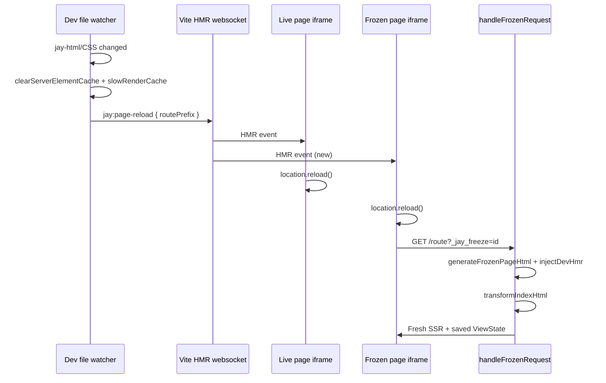

# Design Log #179 — Frozen Page Hot Reload on Template Change

## Status

**Approved** (2026-09-06) — architecture review incorporated. Ready for implementation.

**Parent:** [Design Log #128 — Page Freeze](128%20-%20unfolded%20variant%20view.md) (freeze capture, `?_jay_freeze` rendering, ViewState-only snapshot). See DL#128 addendum (dev full-page HMR).

**Motivation:** AIditor dogfood report (2026-09-06): multi-artboard canvas with live + frozen views of `/demo/freeze`. Agent changed heading CSS in `page.jay-html`. Live views updated via Hot Module Replacement (HMR); frozen views stayed on the old design. **Fix belongs in the Jay dev server** — frozen pages must self-reload on template change without any host application (AIditor, design board, etc.) wiring.

## Background

### What freeze is (unchanged)

Freeze captures **ViewState only** (contract data + interactive client state) to `build/freezes/<id>.json`. A frozen page is served at:

```
/route?_jay_freeze=<id>                    # full page (iframe / tab)
/route?_jay_freeze=<id>&format=fragment    # shadow DOM fragment
```

On each request, `handleFrozenRequest` SSR-renders the **current** jay-html template with the **saved** ViewState (`generateFrozenPageHtml` in `stack-server-build/lib/generate-ssr-response.ts`). Design is correct: template is not frozen — only data is.

### What live pages do today

Live dev pages are sent through `vite.transformIndexHtml` before the response (see `sendResponse` in `dev-server/lib/dev-server.ts`). That transform injects `/@vite/client` in `<head>` and rewrites inline `<script type="module">` blocks into Vite html-proxy modules — which is what makes `import.meta.hot` available.

Live pages also include this listener (from `buildFreezeScript` in `stack-server-build/lib/generate-client-script.ts`):

```typescript
if (import.meta.hot) {
  import.meta.hot.on('jay:page-reload', (data) => {
    const prefix = data.routePrefix;
    const pathname = window.location.pathname;
    if (pathname === prefix || pathname.startsWith(prefix + '/')) {
      window.location.reload();
    }
  });
}
```

When jay-html, CSS, `page.ts`, or linked files change, `setupSlowRenderCacheInvalidation` in `dev-server/lib/dev-server.ts` clears caches and calls `sendPageReload()` — a Vite custom HMR event `jay:page-reload` with a route prefix. Matching live pages reload and pick up the new template.

**Linked files (DL#74):** CSS and component jay-html files watched via `fileToRoutes` already emit targeted `jay:page-reload` for affected routes. Frozen full pages benefit from this path with no extra invalidation work — they only need to subscribe to the same HMR event.

### What frozen pages do today

`generateFrozenPageHtml` returns **pure static HTML** — no Vite client, no `import.meta.hot`, no scripts (DL#128 Phase 1: "no client scripts"). Frozen responses are sent **without** `vite.transformIndexHtml`. The frozen document never subscribes to `jay:page-reload`, so it **never reloads** after the initial load even though the server would serve fresh HTML on the next request.

### `freezeChanged` socket event (documented, not shipped)

Design Log #128 Phase 3 and agent-kit `dev-server-service.md` describe a Socket.IO `freezeChanged` event for design boards to re-fetch fragments. That was implemented only in the **deprecated** `editor-server` package. The current `jay-stack` dev server does **not** emit `freezeChanged`.

That design pushed refresh responsibility to the **host app** for fragment embedders. This log supersedes that approach for **dev full-page** frozen views: they refresh themselves via the same HMR channel live pages use. Host apps (AIditor) require no freeze-specific reload logic. `freezeChanged` remains the fragment/embedder story (Phase 2).

## Problem

When a developer (or AI agent) edits page template files while frozen views are open:

| View                                     | Observed            | Expected                    |
| ---------------------------------------- | ------------------- | --------------------------- |
| Live (`/demo/freeze`)                    | Updates via HMR     | Updates                     |
| Frozen (`/demo/freeze?_jay_freeze=<id>`) | Stays on old design | **Same data, new template** |

Freeze is about **data snapshot**, not **design snapshot**. Users must see frozen slider/table/plan values rendered with the latest jay-html/CSS without manual iframe refresh.

### Reproduction

1. Open `/demo/freeze` in dev server; set budget slider, plan tier, table rows.
2. Freeze (Alt+S or `POST /_jay/freeze`) → open `?_jay_freeze=<id>` in a second tab/iframe.
3. Edit `.freeze-header h1 { color: red; }` in `page.jay-html` (or any template/CSS change).
4. **Live tab** shows red heading; **frozen tab** does not until manual reload.

## Questions and Answers

**Q1: Should frozen pages hydrate or run component logic after reload?**  
**A:** **No.** Reload still serves pure SSR from `generateFrozenPageHtml`. HMR only triggers `location.reload()` — same model as live pages on `jay:page-reload`. ViewState comes from the freeze file on the server, not from client state.

**Q2: Does the server already produce fresh HTML on reload?**  
**A:** **Yes**, when caches are cleared. `setupSlowRenderCacheInvalidation` already calls `clearServerElementCache()` and invalidates/clears `SlowRenderCache` on jay-html/CSS/`page.ts`/contract changes before `sendPageReload()`. The gap is **client-side reload**, not server rendering.

**Q3: Implement `freezeChanged` socket event instead?**  
**A:** **Not for this fix.** Socket events require a connected host app. Requirement: frozen pages HMR **without AIditor**. Reuse existing `jay:page-reload` HMR path. Optional follow-up: emit `freezeChanged` for fragment-embedding hosts that cannot use full-page reload (out of scope v1).

**Q4: Full page vs fragment format?**  
**A:** **v1: full `page` format only** — inject dev HMR listener script, then run through `transformIndexHtml`. Fragment format has no `window` navigation context when embedded in shadow DOM; fragment refresh stays a host responsibility until a separate design (fetch-and-swap protocol).

**Q5: Production builds?**  
**A:** **Dev only.** Pass explicit `injectDevHmr: true` only from `handleFrozenRequest` in the dev server. Do not infer dev mode from the `vite` parameter alone — keeps production/static paths safe if freeze serving expands later. Production and fragment responses remain script-free.

**Q6: Preserve query params on reload?**  
**A:** **`window.location.reload()`** preserves the full URL including `?_jay_freeze=<id>`, `_jay_embed=true`, and other query params. No custom URL builder needed.

**Q7: Route prefix matching for param routes?**  
**A:** Reuse the same prefix logic as live pages (`getRoutePrefix` + pathname check). `getRoutePrefix` stops at the first dynamic segment (`[param]`). Example: `pages/products/[category]/page.jay-html` → prefix `/products`; frozen URL `/products/electronics?_jay_freeze=abc` matches because `pathname.startsWith('/products/')`. A literal route `pages/products/electronics/page.jay-html` → prefix `/products/electronics` (only that path matches).

**Q8: Why not inject `import '/@vite/client'` manually in frozen HTML?**  
**A:** Inline `<script type="module">` served as-is does **not** get `import.meta.hot` — Vite must process the HTML via `transformIndexHtml` (same as live pages). Manual `/@vite/client` import alone would likely fail silently (`import.meta.hot` undefined).

## Design

### Approach: dev-only HMR listener + `transformIndexHtml` (match live pages)

Two steps in `handleFrozenRequest` for `format === 'page'` when `injectDevHmr: true`:

1. **Inject** a `<script type="module">` containing only `buildPageReloadHmrScript()` before `</body>` (via `generateFrozenPageHtml` option).
2. **Transform** the HTML through `vite.transformIndexHtml(requestUrl, html)` before `res.send()` — same pipeline as live dev pages.

**Do not** add an explicit `import '/@vite/client'` in the injected script. `transformIndexHtml` injects the Vite client in `<head>` automatically.



### Shared helper

**File:** `packages/jay-stack/stack-server-build/lib/generate-client-script.ts`

```typescript
/** Dev-only: subscribe to jay:page-reload and reload when route prefix matches. */
export function buildPageReloadHmrScript(): string {
  return `
      if (import.meta.hot) {
        import.meta.hot.on('jay:page-reload', (data) => {
          const prefix = data.routePrefix;
          const pathname = window.location.pathname;
          if (pathname === prefix || pathname.startsWith(prefix + '/')) {
            window.location.reload();
          }
        });
      }`;
}
```

Refactor `buildFreezeScript` to call `buildPageReloadHmrScript()` instead of inlining the same block (single source of truth).

### Frozen page script injection

**File:** `packages/jay-stack/stack-server-build/lib/generate-ssr-response.ts` — `generateFrozenPageHtml`

Add optional parameter:

```typescript
options?: { injectDevHmr?: boolean }
```

When `format === 'page'` and `options.injectDevHmr === true`, append before `</body>`:

```html
<script type="module">
  /* buildPageReloadHmrScript() body only — no import '/@vite/client' */
</script>
```

**JSDoc update (same PR):** DL#128 stated "pure SSR, no client scripts." Clarify:

| Context                              | Scripts                                                                    |
| ------------------------------------ | -------------------------------------------------------------------------- |
| Production / `format=fragment`       | None (unchanged)                                                           |
| Dev full-page (`injectDevHmr: true`) | Minimal reload listener only — no hydration, automation, or freeze capture |

### `handleFrozenRequest` transform step

**File:** `packages/jay-stack/dev-server/lib/dev-server.ts`

Add a `url` parameter to `handleFrozenRequest` — pass the same value live pages use: `req.originalUrl` with `publicBaseUrlPath` stripped (path + query, e.g. `/demo/freeze?_jay_freeze=abc`). The route handler already computes this as `url` before the freeze branch; thread it through.

After `generateFrozenPageHtml(..., { injectDevHmr: true })` for `format === 'page'`:

```typescript
const compiledHtml = await vite.transformIndexHtml(url || '/', html);
res.status(200).set(headers).send(compiledHtml);
```

Fragment responses (`format === 'fragment'`) skip both `injectDevHmr` and `transformIndexHtml` — send raw HTML as today.

### No changes to `sendPageReload`

Existing invalidation + `sendPageReload` already fires on the right file changes. Frozen pages become subscribers once transformed; no new server event type required.

### Documentation updates (same PR)

| Doc                                                    | Change                                                                                                |
| ------------------------------------------------------ | ----------------------------------------------------------------------------------------------------- |
| `stack-cli/agent-kit-template/*/dev-server-service.md` | Dev full-page frozen views self-reload via HMR; `freezeChanged` is optional/legacy for fragment hosts |
| DL#128 trade-offs                                      | Addendum: dev full-page HMR supersedes socket-only refresh for iframe/tab case (see #179)             |

## Implementation Plan

### Phase 1 — Frozen full-page HMR (ship)

1. Add `buildPageReloadHmrScript()` to `generate-client-script.ts`; refactor `buildFreezeScript` to use it.
2. Add `injectDevHmr?: boolean` to `generateFrozenPageHtml`; when true and `format === 'page'`, append `<script type="module">` with listener only.
3. Thread `url` from the route handler into `handleFrozenRequest`; pass `injectDevHmr: true` for `format === 'page'`; run result through `vite.transformIndexHtml(url, html)` before `res.send()`.
4. Update `generateFrozenPageHtml` JSDoc (dev vs production script policy).
5. **Unit tests:**
   - `buildPageReloadHmrScript()` emits the `jay:page-reload` listener string.
   - `generateFrozenPageHtml` with `injectDevHmr: true` includes the `<script type="module">` tag (raw HTML, pre-transform).
6. **Integration test (optional, same PR):** dev-server requests `?_jay_freeze=<id>` and asserts **post-`transformIndexHtml`** output contains `/@vite/client` and an html-proxy script URL (mirror `dev-server.test.ts` live-page expectations).
7. Manual verification on `/demo/freeze` reproduction above.
8. DL#128 addendum + agent-kit doc correction.

### Phase 2 — Optional polish (defer)

1. Fragment format: `freezeChanged` or `postMessage` protocol for shadow-DOM embedders.
2. Playwright integration test: two tabs, edit jay-html, assert frozen tab DOM updates without manual reload.

## Examples

✅ **Good — frozen view picks up CSS change**

- Frozen: `/demo/freeze?_jay_freeze=abc` showing 65% budget, Starter plan, 3 table rows.
- Agent sets `.freeze-header h1 { color: red; }`.
- Frozen iframe reloads automatically; heading is red; slider still 65%, rows unchanged.

✅ **Good — unrelated route does not reload**

- Frozen: `/demo/freeze?_jay_freeze=abc`.
- Edit `/about/page.jay-html`.
- Frozen iframe does **not** reload (`routePrefix` mismatch).

✅ **Good — linked component CSS change reloads frozen page**

- Frozen page uses a linked component jay-html or CSS file (DL#74 watching).
- Edit the linked file → targeted `jay:page-reload` → frozen iframe reloads (no extra dev-server work).

❌ **Avoid — push reload responsibility to AIditor**

- Listening for file changes in the host and calling `iframe.src = ...` per frozen artboard. Duplicates dev-server knowledge; violates "fix in framework" requirement.

❌ **Avoid — manual `import '/@vite/client'` without `transformIndexHtml`**

- `import.meta.hot` is typically `undefined` on non-Vite-processed inline modules. Would fail silently.

❌ **Avoid — full Vite app bootstrap on frozen pages**

- Do not add hydration, `page.ts` client bundle, or automation on frozen pages. Reload + SSR only.

## Trade-offs

| Choice                                                                | Gain                                             | Cost                                         |
| --------------------------------------------------------------------- | ------------------------------------------------ | -------------------------------------------- |
| Reuse `jay:page-reload` + `transformIndexHtml` vs new `freezeChanged` | Same code path as live pages; no host wiring     | Fragment embedders still need separate story |
| `location.reload()` vs DOM swap                                       | Simple; guaranteed fresh SSR + correct ViewState | Brief flash on reload (acceptable in dev)    |
| Explicit `injectDevHmr` flag                                          | Safe for production/fragment paths               | One extra parameter                          |
| Full page only in v1                                                  | Covers iframe/tab case (AIditor, manual compare) | Shadow DOM fragment hosts unchanged          |

## Verification Criteria

- [ ] Reproduction: live + frozen tabs of `/demo/freeze`; edit `page.jay-html` CSS; **both** show new design without manual reload.
- [ ] Frozen ViewState unchanged after reload (slider %, table row count, select value).
- [ ] Unrelated route edit does not reload frozen page.
- [ ] `?_jay_freeze=<id>` and `_jay_embed=true` preserved after auto-reload.
- [ ] Frozen full-page response is passed through `vite.transformIndexHtml` (dev only); fragment responses are not.
- [ ] Frozen `format=fragment` responses unchanged (no HMR script, no transform).
- [ ] Unit test: `buildPageReloadHmrScript()` and `generateFrozenPageHtml` with `injectDevHmr: true` (pre-transform).
- [ ] Integration test (optional): post-transform frozen HTML contains `/@vite/client` + html-proxy script URL.
- [ ] No new AIditor code required for frozen template refresh.
