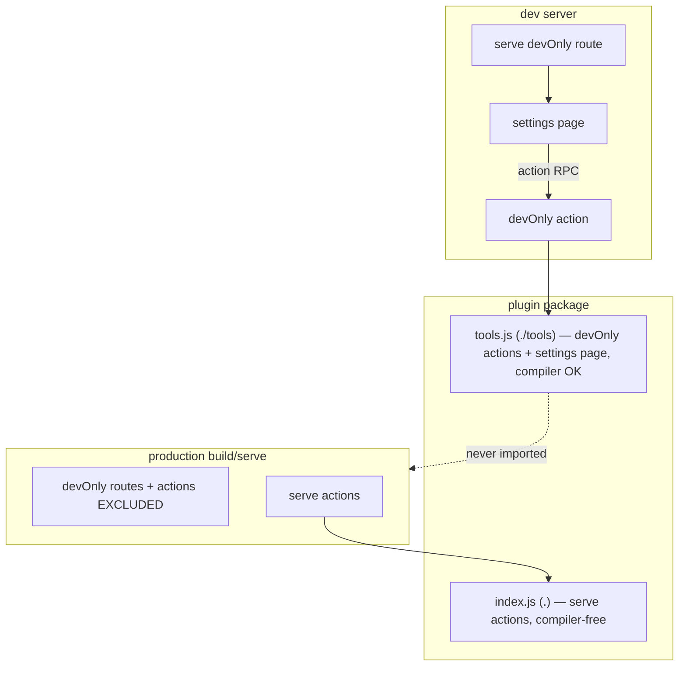

# Design Log #180 — Dev-Only Actions & Production Exclusion of Dev-Only Surfaces

> Enables plugin **settings pages**: a `devOnly` route whose interactive form calls plugin
> **`devOnly` actions**, where the action handlers may use the compiler and are fully excluded from
> production. Completes DL#171's deferred production-exclusion, and is the mechanism that lets
> DL#179's compiler-free `index.js` invariant hold for compiler-using settings UIs.

## Background

- **DL#130** — plugins can provide full pages (routes: jay-html + page component), served by the dev
  server (admin dashboards, builder UIs).
- **DL#171** — `routes[].devOnly` marks a route as dev-server tooling. Production-build exclusion was
  **explicitly deferred** ("Phase 2 — Deferred: Production build excludes `devOnly` plugin routes from
  manifest and client bundles"). Today `devOnly` is metadata only: the dev server serves it, sitemap
  skips it (`generate-sitemap.ts:17`), and production-build still compiles it into `allRoutes`
  (`build-pipeline.ts:274`). production-server has **no** `devOnly` handling.
- **DL#179** — runtime (`.`, compiler-free) vs tools (`./tools`, compiler-OK) entry split. Actions are
  the _serving_ primitive (`.`, compiler-free); commands are the _tools_ primitive (`./tools`).
- **DL#173 / #142 / #145** — AIditor settings contributions, CLI commands, validators.

## Problem

A plugin like `design-system-validator` wants a **settings page**: a `devOnly` route with an
interactive UI whose buttons run analysis (`runDesignSystemAnalysis`, catalog regeneration, …). That
analysis **needs the compiler** (`run-design-analysis.ts` → `parseJayFile`, `JAY_IMPORT_RESOLVER`
from `compiler-jay-html`).

Two forces collide:

1. **Settings pages need actions, not commands.** The page runs in the browser and invokes server
   handlers via the **action RPC**. CLI commands (`jay-stack run …`) can't be called from a page. So
   the analysis handlers must be _actions_.
2. **DL#179 forbids compiler in serve actions.** A normal action loads from `.` (compiler-free). A
   compiler-using action would poison `index.js` and the deploy bundle.

There is no way today to have a browser-callable server handler that (a) may use the compiler and
(b) never ships to production. `devOnly` exists for routes but does nothing at build time, and there
is no `devOnly` for actions at all.

### Real-world cases (scanned 2026-09-03)

The pattern is rare but real — only **two** plugins across the in-repo, wix, and aiditor repos route
the compiler through a browser-callable action/page (everything else that leaks does so through a
_validator_, handled by DL#179 alone):

- **`design-system-validator`** (in-repo) — the driving case. Settings page → `runDesignSystemAnalysis`
  action → `run-design-analysis.ts` → `parseJayFile`/`JAY_IMPORT_RESOLVER` (compiler-jay-html).
- **`aiditor`** (`../aiditor/packages`) — `getContractInspectorTagsAction` (re-exported from `index.ts`
  **and** imported by the `/aiditor` page component) → `resolve-contract-tags-server.ts` →
  `parseContract`/`ContractTagType` (compiler-jay-html) + `checkValidationErrors` (compiler-shared).
  aiditor assumes a **full dev environment** (it's a design tool), so its `/aiditor` route should be
  marked `devOnly: true` and `getContractInspectorTagsAction` becomes a `devOnly` action with its
  handler in `./tools`. This is the second real driving case for this DL, not an edge case: the entire
  surface is dev/tools-only, so the compiler stays in `./tools` and never enters a production serve
  bundle.

**Reference shape (but compiler-free):** `wix-media` (`../wix/packages`) already ships the exact
settings-page _structure_ this DL formalizes — `/wix-media/settings` (`devOnly: true`, component
`mediaSettingsPage`) backed by 5 settings actions (`getMediaSettingsStatus`, `rebuildMediaCatalog`, …).
Its actions **don't** use the compiler, so it doesn't need the `devOnly`-action mechanism for #179
reasons — but it does benefit from Phase 3's production exclusion so its admin handlers stop shipping.
It's the proof that the settings-page pattern is already in use and worth first-classing.

## Questions and Answers

**Q1. Why not make the analysis handlers CLI commands (DL#179's "compiler ⇒ command" rule)?**
A: Commands are CLI-triggered; a settings page can't invoke them via the action RPC. Reclassifying
would break the page UX. Settings pages need _actions_. `devOnly` is the missing axis — orthogonal to
action-vs-command: it says _"this handler exists only under the toolchain / dev server."_

**Q2. Where do dev-only action handlers live?**
A: In **`./tools`** (DL#179's compiler-allowed entry). Regular (production) actions stay in `.` and
must be compiler-free. This reuses the exact split DL#179 already establishes — no new entry.

**Q3. How are dev-only surfaces kept out of production?**
A: Two levers, both already feasible because production **externalizes plugin packages** and
dispatches actions/routes through the plugin's `.` entry (`server-code-build.ts:176`):

- devOnly action handlers live only in `./tools`, so production's `import(plugin)` (`.`) never
  reaches them; and production action registration **skips** `devOnly` actions so they aren't
  dispatchable.
- devOnly routes are **filtered out before compilation** in production-build (finishing DL#171
  Phase 2), so the compiler-using page component is never compiled or bundled.

**Q4. Does the dev server change how it serves these?**
A: No behavior change for the author: the dev server registers **all** actions (devOnly from
`./tools`, regular from `.`) and serves **all** routes (DL#171: no HTTP gate). The settings page works
end-to-end in dev with the compiler present.

**Q5. Is `devOnly` inferred?**
A: No — explicit, consistent with DL#171. Author sets `devOnly: true` on the `routes[]` and
`actions[]` entries.

**Q6. Does a `devOnly` action have to use the compiler?**
A: No — `devOnly` is orthogonal to compiler use. Its meaning is _"admin/tooling surface, excluded from
production"_, not _"compiler-using."_ `wix-media`'s settings actions are compiler-free yet still want
production exclusion so admin handlers (`rebuildMediaCatalog`, …) never ship to a live site. A
compiler-free `devOnly` action still lives in `./tools` (that's where devOnly surfaces are excluded
from production), it just doesn't _need_ to for #179 leak reasons.

**Q7. Should there be a plugin-level `devOnly` for whole-tool plugins?**
A: No — per-surface only (`routes[].devOnly` + `actions[].devOnly`). The scan of the in-repo, wix, and
aiditor repos found **exactly one** plugin that is fully dev-only _and_ has browser surfaces:
`aiditor` (route + 37 actions). Every other fully-tools-only plugin (`a11y-validator`, `seo-validator`,
`wix-deploy`, `aiditor-quill`) has no routes/actions at all — DL#179's move-to-`./tools` handles them
with no `devOnly` flag. With n=1 benefiting, a plugin-level flag isn't worth the second axis every
consumer (dev-server, production-build, validator) must reason about alongside per-surface `devOnly`.
aiditor marks its route + actions individually.

## Design

### `devOnly` as a cross-cutting "dev/tools-only runtime surface" flag

| Surface | Flag                          | Handler/component entry       | Production         | Dev server |
| ------- | ----------------------------- | ----------------------------- | ------------------ | ---------- |
| Route   | `routes[].devOnly` (existing) | `./tools` when compiler-using | **excluded** (new) | served     |
| Action  | `actions[].devOnly` (**new**) | `./tools`                     | **excluded** (new) | registered |

Rule: **a `devOnly` action's handler must be exported from `./tools`; a non-`devOnly` action's handler
must be compiler-free on `.`** (DL#179 leak scan enforces the latter). A `devOnly` route whose page
component uses the compiler resolves its component from `./tools`.

### Schema

`compiler-shared/lib/plugin-resolution.ts`:

```ts
// ActionManifestEntry gains a devOnly flag on the object form
export type ActionManifestEntry = string | { name: string; action?: string; devOnly?: boolean };
```

`normalizeActionEntry` returns `devOnly` alongside `{ name, action }`.

`plugin.yaml`:

```yaml
routes:
  - path: /design-system/settings
    jayHtml: ./dist/pages/settings/page.jay-html
    component: designSystemSettingsPage
    devOnly: true
actions:
  - name: runDesignSystemAnalysis
    action: run-analysis.jay-action
    devOnly: true # ← handler in ./tools, excluded from production
  - name: fontFallback
    action: font-fallback.jay-action # normal production action, stays on `.`
```

### Loading & registration

- **Dev server** (`dev-server/lib/service-lifecycle.ts` → `action-discovery.ts`): register every
  action. For `devOnly` actions, import the handler from `${packageName}/tools` (npm) or the tools
  module (local); regular actions load from `.` as today. devOnly route components resolve from
  `./tools`.
- **Production build**:
  - `production-build/.../plugin-routes.ts` + `build-pipeline.ts`: **filter `devOnly` routes** out of
    `allRoutes` before `compileRouteServerElement` / `compileRouteHydrateScript`. (Currently only
    sitemap skips them.)
  - Plugin action registration for the deploy: **skip `devOnly` actions** — they are neither
    dispatched nor traced (their handlers aren't on `.`).
- **Production server**: devOnly routes/actions are absent from the manifest → naturally unserved. No
  special-casing needed once the build excludes them.

### Validation (`plugin-validator`)

- `actions[].devOnly` must be a boolean (mirror the existing `routes[].devOnly` check at
  `validate-plugin.ts:477`).
- A `devOnly: true` action requires a `./tools` export (same rule DL#179 adds for other tools
  capabilities).
- Advisory: a `devOnly` route paired with compiler-using code but **no** `devOnly` actions likely
  means the analysis runs inline in the page component — fine for dev, but flag if the same component
  is reachable from a non-devOnly route.

### Diagram



## Implementation Plan

### Phase 1 — Schema

1. `ActionManifestEntry` gains `devOnly?: boolean`; `normalizeActionEntry` surfaces it.

### Phase 2 — Dev server

2. `action-discovery.ts`: load `devOnly` action handlers from `./tools` (npm) / tools module (local);
   thread `devOnly` from the manifest through discovery.
3. devOnly route component resolution from `./tools` when present.

### Phase 3 — Production exclusion (finishes DL#171 Phase 2)

4. `plugin-routes.ts` / `build-pipeline.ts`: exclude `devOnly` routes from compiled `allRoutes` and
   the route manifest.
5. Plugin action registration for deploy: skip `devOnly` actions.
6. Confirm production-server serves nothing devOnly (manifest-driven; add a guard test).

### Phase 4 — Validation + agent-kit

7. `validate-plugin`: boolean check on `actions[].devOnly`; require `./tools` when any `devOnly`
   action declared.
8. Agent-kit `plugin/plugin-routes.md` + a settings-page guide: document the settings-page pattern
   (devOnly route + devOnly actions in `./tools`), and that devOnly actions may use the compiler and
   never ship to production.

### Phase 5 — Migrate design-system-validator (the driving case)

9. Mark the analysis actions `devOnly: true`; move their handlers to `./tools` (keep `fontFallback` a
   normal action on `.`); mark the settings route `devOnly: true` (already is).
10. Verify: `dist/index.js` compiler-free (DL#179 leak scan); settings page + analysis work on the dev
    server; production build excludes the route + devOnly actions.

## Examples

✅ Settings page backed by a dev-only, compiler-using action:

```yaml
routes:
  - {
      path: /design-system/settings,
      jayHtml: ./dist/pages/settings/page.jay-html,
      component: designSystemSettingsPage,
      devOnly: true,
    }
actions:
  - { name: runDesignSystemAnalysis, action: run-analysis.jay-action, devOnly: true }
```

```ts
// tools.ts (./tools) — compiler allowed, excluded from production
export { runDesignSystemAnalysis } from './actions/run-analysis.js'; // uses parseJayFile
export { designSystemSettingsPage } from './pages/settings/page.js';
```

❌ Compiler-using action left as a normal production action:

```yaml
actions:
  - { name: runDesignSystemAnalysis, action: run-analysis.jay-action } # no devOnly → must be on `.` → DL#179 leak-scan error
```

## Trade-offs

- **+** Settings pages get first-class support: browser-callable handlers that may use the compiler
  and never ship to production.
- **+** Reuses DL#179's `./tools` entry; `devOnly` becomes one coherent flag across routes and
  actions.
- **+** Finishes DL#171's long-deferred production exclusion; production stops compiling dev tooling.
- **−** New manifest field + touches dev-server, production-build, production-server, validator.
- **−** `devOnly` is now load-bearing for correctness (production exclusion), not just a UI hint —
  needs solid tests so a regression can't silently ship dev tooling.
- **Alternative rejected:** reclassify settings handlers as CLI commands — breaks the browser action
  RPC the settings page depends on.

## Verification Criteria

- [ ] `actions[].devOnly: true` handler loads from `./tools` on the dev server and is callable from a
      plugin page via the action RPC.
- [ ] Production build excludes `devOnly` routes (not compiled/bundled) and `devOnly` actions (not
      registered/dispatchable).
- [ ] `design-system-validator` `dist/index.js` contains no `@jay-framework/compiler-` import
      (DL#179 scan) while its settings page + analysis work in dev.
- [ ] `plugin-validator` errors on a non-boolean `devOnly` and on a `devOnly` action with no `./tools`
      export.
- [ ] production-server serves no devOnly route/action (manifest-driven).

## Relationship to other logs

- **Depends on / pairs with DL#179** (the `./tools` entry is where devOnly handlers live).
- **Completes DL#171** Phase 2 (production exclusion of devOnly routes).
- **Supports DL#173** settings contributions (AIditor settings pages become production-safe).

## Implementation Results

Implemented on branch `dl179-180-compiler-free-runtime` (paired with DL#179). `yarn confirm` passes
clean.

### `actions[].devOnly` schema

`compiler-shared/lib/plugin-resolution.ts` — `ActionManifestEntry` is now
`string | { name; action?; devOnly? }` and `normalizeActionEntry` carries `devOnly` through. A
`devOnly` action's handler lives in the plugin's `./tools` entry (DL#179), so it may use the compiler;
regular actions stay compiler-free on `.`.

### Dev server serves devOnly surfaces normally

- `dev-server/lib/dev-server.ts` — `resolvePluginModule` gained an `exportKey` param; a route with
  `devOnly: true` resolves its component from `./tools` instead of `.`.
- `stack-server-build/lib/action-discovery.ts` — both the NPM path (`registerNpmPluginActions`) and
  the local path (`discoverPluginActions`) lazily load a tools module (`<pkg>/tools`, or a sibling
  `tools.ts`/`tools.js` for local plugins) **only** when a declared action is `devOnly`; plugins
  without devOnly actions never require a `./tools` export. Local plugins missing the tools module get
  a clear warning.

### Production excludes devOnly routes + actions

- `production-build/lib/builder/build-pipeline.ts` — devOnly routes are filtered out of `allRoutes`
  before compilation/bundling/manifest, with an info log naming the excluded routes. (Finishes DL#171
  Phase 2.)
- `production-build/lib/builder/route-manifest.ts` — `discoverActions` filters devOnly actions out of
  the deploy manifest via `normalizeActionEntry`, logging the excluded count. A plugin whose actions
  are all devOnly contributes no action entry.

### validate-plugin devOnly rules (Phase 4)

`validate-plugin.ts` — non-boolean `devOnly` → `schema` error; a `devOnly` action's handler is
checked against `./tools` (regular actions against `.`); route components resolve against `./tools`
when `route.devOnly`. Requirement of a `./tools` export when any devOnly action exists is folded into
DL#179's `needsToolsEntry`. Tests cover the boolean check and the routing.

### Migration

`design-system-validator`'s settings-page action is marked `devOnly` and its handler moved to
`lib/tools.ts`; the settings route is already `devOnly`. Result: `dist/index.js` is compiler-free
(DL#179 scan) while the settings page + analysis still work under the dev server.

### Deviations from the original design

- **Skipped the optional advisory rule.** The design floated an advisory: warn when a plugin has a
  `devOnly` route whose (compiler-using) component is reachable, yet declares no `devOnly` actions,
  and the component is also reachable from a non-devOnly route. This is genuinely advisory, requires
  route-reachability analysis, and has low value now — the two required Phase-4 rules (boolean
  validation + `./tools` requirement) plus the DL#179 leak scan already prevent the failure mode.
  Not implemented.
