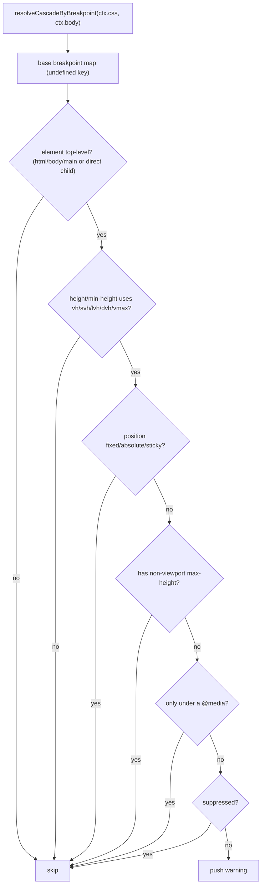

# Design Log #188 — Validator: Unconstrained Viewport-Height Units Break Google Search Console Rendering

Status: **Design — awaiting approval**

> A validator rule that flags viewport-relative **height** units (`vh`/`svh`/`lvh`/`dvh`, and
> height-driven `vmax`) on **top-level layout containers** when they are not bounded, because they blow up
> Googlebot's tall-viewport render and distort Search Console screenshots / mobile-usability reports.
> Detection lives in the validator; the *fix decision* lives in the agent-kit guide — we never auto-cap.

## Background

- Jay is design-to-code: the designer's layout ships as `.jay-html` + merged CSS (`ctx.css`). Build-time
  validation (`jay-stack validate`) is the right place to catch layout hazards before deploy (DL#145
  pluggable validation, DL#147 rules catalog).
- Existing CSS-string rules already exist in **design-system-validator** (postcss-based): DL#174
  (undefined css vars, `design-undefined-vars.ts`), design-tokens, font-fallbacks. That package also owns
  `css-cascade.ts` — `resolveCascade(cssSources, root)` and `resolveCascadeByBreakpoint(...)` — which maps
  CSS selectors back to jay-html elements (via `root.querySelectorAll(selector)`), resolves specificity,
  inline styles, `var()`, and groups by media query. **This is the key reuse: it lets us tie a CSS rule to
  the element's position in the document tree instead of guessing class names.**

## Problem

`Googlebot`'s Web Rendering Service (WRS) does **not** render at a normal phone height. To capture
lazy-loaded and below-the-fold content in a single pass, it renders the page once into a **very tall
viewport** (historically cited at ~9,000–12,000px tall, ~412px wide on mobile). Any element sized to a
fraction of viewport height resolves against that tall value:

```css
.hero { min-height: 100vh; }   /* Chrome on a phone: ~800px.  Googlebot WRS: ~12,000px. */
```

The hero (or `<body>`/`<main>`) becomes enormous in the crawler's render. **Impact:** distorted GSC
screenshots, spurious mobile-usability / layout flags, and skewed visual-rendering signals.

> **The mechanism is a one-shot tall render, not a resize loop.** It is tempting to describe this as an
> iterative feedback loop where the frame resizes and `100vh` recomputes repeatedly — that is *not* how WRS
> works. WRS renders **once** into a very tall viewport; viewport units simply resolve against that tall
> value. The symptom (a `100vh` section becoming enormous) is real and worth catching; stating the accurate
> mechanism keeps the rule's rationale correct.

## Questions and Answers

**Q1. Where does the rule live — seo-validator or design-system-validator?**
A: **design-system-validator**, as a new sub-validator (handler e.g. `validate-viewport-height`,
manifest name `design-viewport-height`). Rationale: all CSS-string + postcss + `css-cascade` infra already
lives there, so **no cross-package export** of `css-cascade.ts` is needed (it is package-internal today).
The *message* frames it as a Googlebot/Search-Console concern, so SEO discoverability is preserved without
splitting the CSS tooling. (Alternative: seo-validator, but that forces exporting css-cascade — rejected as
more surface for no benefit.)

**Q2. Scope — top-level containers only, or every element?**
A: **Top-level only** (`html`/`body`/`main` + direct children of `body`/`main`). A deeply nested
`.card { height: 100vh }` is a different, lower-impact problem and firing on it would flood the report.
Document this as a deliberate scope limit; revisit if real cases show nested offenders matter.

**Q3. Include `height: 100%`?**
A: **No.** `height: 100%` is a bounded-inheritance pattern — the *cure*, not the disease (a bare
`body { height: 100% }` with no `html` height even computes to `auto`, no effect). Detect viewport-height
units only.

**Q4. Threshold on magnitude — only `100vh`, or any `vh`?**
A: **Any viewport-height unit on `height`/`min-height`** (even `50vh` → ~6,000px on WRS). Do not gate on a
numeric threshold; gate on the boundedness/structure conditions instead. (Open to a `≥ Nvh` floor if noise
proves high — flagged in Trade-offs.)

**Q5. Suppression shape?**
A: Page-level YAML, consistent with the a11y/seo pattern we already use:
`design-system: { allow-viewport-height: true }` inside `<script type="application/jay-validations">`.
Optionally also an inline `/* design-system: allow */` on the declaration (matches
`design-undefined-vars.ts`). Recommend page-level first; inline is a cheap add if requested.

**Q6. Should it auto-fix?**
A: **No.** The correct fix depends on content type (text vs hero vs overlay) and target breakpoint —
context the validator cannot know. Detection + agent-kit guidance only.

## Design

### Rule definition

Fire a **warning** for a CSS declaration when **all** hold:

1. Property is `height` or `min-height`.
2. Value contains a viewport-height unit: `vh`, `svh`, `lvh`, `dvh`, or `vmax`.
3. The declaration applies (unconditionally — **base breakpoint**, not inside a `@media`) to an element
   that is **top-level**: `<html>`, `<body>`, `<main>`, or a **direct child** of `<body>`/`<main>`.
4. The element is **in normal flow**: resolved `position` is not `fixed`/`absolute`/`sticky`.
5. The element is **unbounded**: no resolved `max-height` on the same element **in a non-viewport unit**.
   A `max-height` that *also* uses a viewport-height unit (`max-height: 100vh`, `svh`, `dvh`, `vmax`, …) is
   **not** a bound — it caps against WRS's ~12,000px viewport, i.e. no cap at all — so the rule **still
   fires**. Only an absolute/bounded `max-height` (`px`, `rem`, `ch`, or `%` of a bounded ancestor)
   constrains the WRS render and clears the warning.

Explicitly **do not** fire when:

- The viewport-height rule only appears inside a `@media` query (author has already scoped it —
  `resolveCascadeByBreakpoint` keys by media query; presence only under a non-`undefined` breakpoint ⇒
  intentional).
- The element is out of flow, bounded by a **non-viewport** `max-height`, or nested below the top level.
- The page suppresses `design-system: allow-viewport-height`.

### Detection flow



### Framework change — teach `css-cascade` about the root container (preferred over a per-rule pass)

`ctx.body` is the `<body>` element (`jay-html-parser.ts:1699`). `css-cascade` cannot see it today, for two
reasons: (1) both `resolveCascade` and `resolveCascadeByBreakpoint` start their walk at `root.childNodes`
(`css-cascade.ts:252`, `:309`), so the `<body>` node is **never** assigned resolved styles; and
(2) `buildSelectorCache` uses `root.querySelectorAll(selector)` (`:147`), which is descendants-only, so a
`body { … }` rule never maps onto `<body>`, and `html`/`:root` sit *above* `ctx.body`, out of reach.

Rather than reimplement a `html`/`body`/`:root` postcss scan in this rule (which every future root-aware
rule would then duplicate), **close the gap once in the shared helper:**

1. **Visit the root** — call `walk(root)` before recursing children in both functions, so the top-level
   container gets resolved styles.
2. **Match root-targeting selectors onto it** — in `buildSelectorCache`, after `querySelectorAll`, add
   `root` to the selector's set when the selector targets the root. node-html-parser's `root.closest(sel)`
   is a self-or-ancestor test (root has no ancestors ⇒ a self-match) for `body`; `html`/`:root` are treated
   as aliases for the same top-level container node.

**Delivery — unconditional (chosen).** Root inclusion is simply part of what `css-cascade` does; there is
no flag. The cascade genuinely *should* cover the `<body>` container, so every consumer benefits at once and
no future root-aware rule has to remember to opt in. This rule then just reads
`resolveCascadeByBreakpoint(...)` and finds `<body>`/top-level entries normally — no separate postcss pass,
no dedupe.

**Blast radius — acknowledged and re-baselined.** The other design-system sub-validators (undefined-vars,
tokens, font-fallbacks) will now also see `<body>`/`html`/`:root` declarations. This is a *correctness gain*
— e.g. undefined-vars currently never checks a body-level `var()`, a real (silent) gap this closes — but it
can surface new, legitimate findings in existing projects. So the framework change ships with:
(a) updated/added unit tests in the design-system package proving each sub-validator now resolves root-level
declarations correctly; and (b) a re-run of the example projects' validations to confirm any newly surfaced
findings are genuine (fix them) rather than false positives (adjust the rule). The rejected alternative was
an opt-in `{ includeRoot: true }` flag that leaves existing consumers untouched — rejected because it
preserves the latent gap for every other rule and adds a flag the correct default should not need.

### Finding shape

```ts
findings.push({
    severity: 'warning',
    message:
        `Top-level container "${selector}" sets ${property}: ${value}. ` +
        `Googlebot renders into a very tall viewport (~12,000px), so viewport-height units expand this ` +
        `section and distort Search Console screenshots / mobile-usability reports.`,
    suggestion:
        `Choose a fix by content type — text: chain height from a bounded ancestor; ` +
        `hero/visual: cap with max-height inside a mobile @media; overlay: this is safe, suppress with ` +
        `design-system: { allow-viewport-height: true }. See: agent-kit/designer/jay-html-styling.md ` +
        `(and agent-kit/designer/validation-guide.md for suppression).`,
    element: `<${tagName}>`,
});
```

## Implementation Plan

0. **Framework — `css-cascade` root support (unconditional)** — in `resolveCascade` /
   `resolveCascadeByBreakpoint` (`css-cascade.ts`): `walk(root)` before recursing children, and in
   `buildSelectorCache` add `root` to a selector's set when the selector targets the root
   (`root.closest(selector)` for `body`; `html`/`:root` aliased to the same node). No flag — root inclusion
   is the default. **Re-baseline:** run the design-system suite + example-project validations and reconcile
   any newly surfaced root-level findings from undefined-vars / tokens / font-fallbacks (fix genuine ones;
   tighten the rule for false positives). Add unit tests asserting root-level declarations resolve for each
   sub-validator.
1. **Rule module** — `packages/plugins/design-system-validator/lib/validators/design-viewport-height.ts`,
   `export const validateViewportHeight: JayHtmlValidatorFn`. Read `resolveCascadeByBreakpoint(css, body)`
   — the `<body>`/top-level entries are now present, no direct postcss pass needed. Skip non-`/pages/` files
   (components inherit layout context — mirror `design-undefined-vars.ts:47`).
2. **Register** — add to `design-system-validator/lib/tools.ts` and `plugin.yaml` `validators:` list
   (name `design-viewport-height`, description). Add `isSuppressed(ctx, 'allow-viewport-height')` under the
   `design-system` namespace.
3. **Agent-kit guide** — add a "Viewport height & Google Search Console" section to
   `agent-kit-template/designer/jay-html-styling.md` with the three-path fix framework (text / hero /
   overlay), and the explicit note that `vh → dvh` is not a fix. This is where the decision logic lives.
4. **Catalog** — add the rule to DL#147 (rules catalog) and note the new suppression key in DL#176.
5. **Tests** — fixture-based (`test/fixtures/…`), full `toEqual` on the findings array (no `toContain`).

## Examples

| Case | CSS (base) | Element | Fires? |
|---|---|---|---|
| Classic hero | `main { min-height: 100vh }` | `<main>` | ✅ warn |
| Body full-height | `body { height: 100vh }` | `<body>` (postcss path) | ✅ warn |
| Fractional | `.hero { height: 60vh }` (direct child of body) | top-level | ✅ warn |
| dvh swap | `main { min-height: 100dvh }` | `<main>` | ✅ warn (unit swap ≠ fix) |
| Bounded (px) | `main { min-height: 100vh; max-height: 900px }` | `<main>` | ❌ bounded |
| max-height also vh | `main { min-height: 100vh; max-height: 100vh }` | `<main>` | ✅ warn (vh cap ≠ bound) |
| Media-scoped | `@media (min-width:769px){ .hero{min-height:100vh} }` | — | ❌ intentional |
| Overlay | `.modal { position: fixed; height: 100vh }` | out of flow | ❌ safe |
| Nested card | `.grid .card { height: 100vh }` | deep | ❌ out of scope |
| `height:100%` | `html, body { height: 100% }` | — | ❌ not a trigger |
| Suppressed | `main { min-height: 100vh }` + YAML allow | `<main>` | ❌ suppressed |

## Trade-offs

- **False positives remain possible.** A legitimately capped hero using a JS/`clamp()` bound we can't see
  statically will still warn. Mitigation: warning (non-blocking) + one-line suppression. Acceptable per
  DL#170 posture.
- **Top-level-only misses nested offenders.** Deliberate, to keep the signal high. Revisit if data shows
  otherwise.
- **We can't verify against real Googlebot in CI.** Verification is by CSS/jay-html fixtures encoding the
  documented behavior, not live GSC. The value is catching the pattern early + routing to the right fix.
- **css-cascade is package-internal** — hosting in design-system-validator avoids exporting it. If we later
  want this in seo-validator, css-cascade must move to `compiler-shared`.
- **Root inclusion changes existing validators.** Making `css-cascade` cover the `<body>`/`html`/`:root`
  container (unconditional) is simpler and more correct, but undefined-vars / tokens / font-fallbacks now
  also see root-level declarations and may surface new (legitimate) findings. Accepted deliberately;
  handled by the re-baseline in Plan step 0.

## Verification Criteria

**How we know it solves the original problem:**

- [ ] Fires on `body`/`main`/top-level `min-height:100vh` (and `vh`/`svh`/`lvh`/`dvh`/`vmax`), unconditional
      + in-flow + unbounded.
- [ ] Silent on: `max-height`-bounded, `position:fixed/absolute/sticky`, media-query-scoped, nested,
      `height:100%`, and suppressed pages.
- [ ] Suppression `design-system: { allow-viewport-height: true }` silences it.
- [ ] The `html, body { ... }` postcss path catches root-targeting selectors that `querySelectorAll` misses.
- [ ] Agent-kit `jay-html-styling.md` documents the three-path fix + the "unit-swap is not a fix" note.
- [ ] Rule added to DL#147 catalog and DL#176 suppression list.
- [ ] All tests full-string `toEqual` (no `toContain`); design-system-validator suite green; `yarn confirm`
      green.

## Relationship to Other Logs

- **DL#145** (pluggable validation) / **DL#147** (rules catalog) — framework + where to register/catalog.
- **DL#174** (undefined css var) — closest precedent: CSS-string, postcss, per-`/pages/` scoping, inline
  suppression comment.
- **DL#170** (seo false positives) — posture for a heuristic rule: warning + suppression, avoid over-firing.
- **DL#176** (suppression audit) — register the new suppression key here.
- **DL#164** (inline style in body) / **DL#44** (css support) — CSS handling background.
