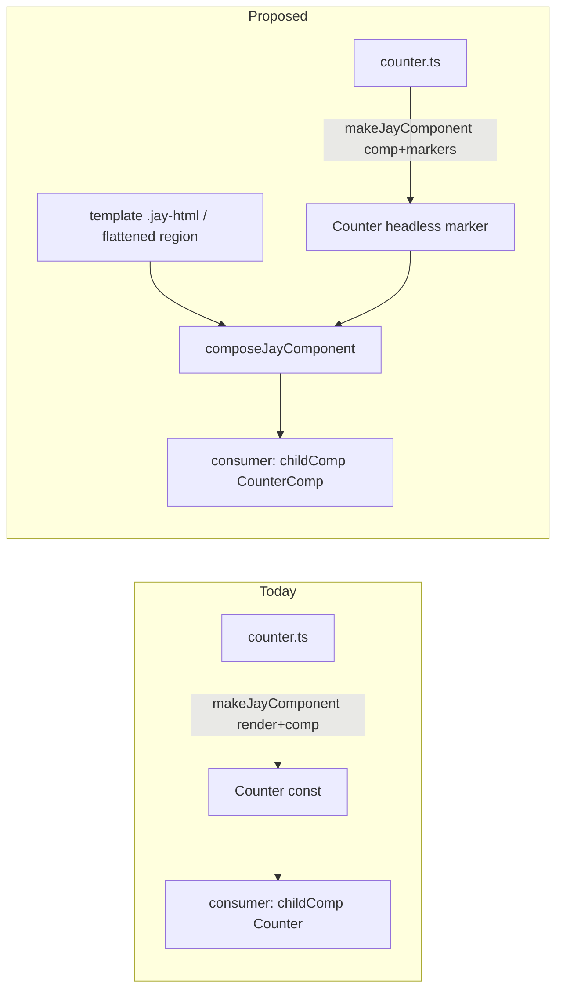

# 197 - `makeJayComponent` as a headless component (template bound by the consumer)

Status: **REJECTED** (2026-10-01) — not implemented, and will not be. The draft below is kept for the
record; the rejection rationale is at the top (see **Rejection**), the original draft follows unchanged.
Related: [[196 - validated inline composition]] (the jay-stack collapse this generalizes),
DL#20 (component compiler), DL#193 (`$parent` / synthetic parent context).

---

## Rejection (2026-10-01)

**Decision: do not proceed. Jay keeps two distinct component models, by design.**

DL197's sole motivation (see Problem) was to remove the "component `.ts` couples its own template"
divergence so the [[196 - validated inline composition]] *flatten* story would apply to regular Jay too —
"one component model across Jay." On review, that goal is not worth pursuing, because unifying the two
models loses on **both** branches:

- **Keep regular Jay by-reference (don't flatten).** Splitting `makeJayComponent` into a definition marker +
  `composeJayComponent` binder decouples a template import that *nothing needs decoupled* — the only
  beneficiary of that decoupling was the flatten story. The result is a large migration (26+ component
  `.ts`, three compile targets, regenerated goldens) for a cosmetic reshape with no behavioral gain.
- **Move regular Jay to flattened.** This is semantically wrong for **code-first, encapsulated** components:
  the consumer would own a copy of the component's private UI, needing `sync` to receive upstream template
  fixes, which breaks "import and use." It also collides at the import syntax: `application/jay-headless` +
  `template=` would *look* like the jay-stack import but mean the opposite on every provenance dimension.

**The divergence DL197 treated as a defect is not one.** The two models encode two genuinely different
relationships, and both should remain first-class:

| | regular Jay — `application/jay-headfull` | jay-stack — `application/jay-headless` |
| --- | --- | --- |
| discriminator | `src=` + `names=` | `contract=` (+ optional `src=`) + `template=` |
| identity source | **code-first** (types via `analyzeExportedTypes` of the `.ts`) | **contract-first** (`.jay-contract` is source of truth) |
| what's imported | a **finished component** (logic + its own template, bundled) | a contract + a template to **flatten** |
| template ownership | **component-owned** (coupled in the `.ts`, used by reference) | **consumer-owned** (flattened copy in the page; `validate`/`sync`) |
| compose site | by reference (`childComp(Component)`) | flattened region; loader composes |

Two honest syntaxes for two real meanings is clearer than one overloaded tag whose meaning flips on whether
`contract=` or `src=` is present. Note also that the DL195/196 pain was jay-stack's *internal* Tier-2
inlining apparatus — regular Jay was never the source of it, so there is no independent problem here to fix.

**Net positioning (now documented in the agent-kit):** **jay-stack supports headless components only**
(contract-first, `<jay:X>` regions, flatten/validate/sync). The lower-level **Jay** runtime
(`makeJayComponent`, `childComp`) is where **headfull** components live; it is used to *author* headless
component logic and for standalone client-only apps, but a jay-stack page never composes a headfull
component directly.

**Rescued separately (if real):** DL197 claimed regular Jay has no prop type-checking at the
`<jay:X>`/`childComp` call site. If that gap is real it is worth closing — but it is a pure compiler/type
concern (`analyzeExportedTypes` already recovers the component type) and needs **neither** the
`makeJayComponent` split **nor** any component-model change. Track it on its own, not here.

---

## Decisions for the Implementer (TL;DR)

- **Two functions, split by responsibility.** Today `makeJayComponent` is _both_ the component
  **definition** (logic + markers) and its **implementation** (bind to a template). This change splits them:
  - **`makeJayComponent` — the definition (user-facing, name kept).** The developer keeps writing
    `makeJayComponent(comp, ...contextMarkers)` in the component's own `.ts`. The signature changes (no
    `preRender`); it now returns a **headless component marker** carrying `{ comp, contextMarkers }` +
    the phantom `Props/ViewState/Refs/CompCore` types, and does **not** create the reactive factory.
  - **`composeJayComponent` — the implementation (runtime, compiler-emitted).** A new runtime function
    `composeJayComponent(preRender, headless): (props) => ConcreteJayComponent` binds the definition to a
    template/element. It is the current factory body (`component.ts:143-267`) relocated verbatim, and is
    only ever emitted by the consuming `.jay-html`'s **generated code** — developers never call it by hand.
- **The template↔logic bind moves to the consumer.** `composeJayComponent` runs consumer-side; regular
  jay does **not** need the `makeHeadlessInstanceComponent` indirection (that wrapper exists only for the
  stack runtime's instance-context/coordinate plumbing).
- **`makeJayComponent` keeps its name; the binder gets a new one.** (Q1, resolved.) The user-facing
  definition function stays `makeJayComponent` so authored component `.ts` reads unchanged apart from
  dropping the template import; the _implementation_ half becomes the distinctly-named
  `composeJayComponent`. `makeJayComponent`'s signature change is a compile-time type error at every old
  call site (a better migration signal than a runtime throw) — no deprecated stub.
- **Detection stays by-symbol; props become recoverable.** `analyzeExportedTypes` still finds the
  component via `functionType.symbol === MAKE_JAY_COMPONENT.symbol` (`analyze-exported-types.ts:299-302`)
  — **zero new detection surface**. Only the type-**extraction** walk changes: it currently reads
  `getResolvedSignature().getReturnType().getCallSignatures()[0].getReturnType()` (`:303-309`), which
  breaks once the return type is no longer a `(props)=>Concrete` factory. It re-reads the new
  `JayHeadlessComponent<PropsT, ViewState, Refs, …, CompCore>` type arguments instead — and can now also
  surface **props** (from `PropsT`), which regular jay never had.
- **The context-markers problem is solved by the marker object.** Agent analysis flagged that a naive
  "export the bare constructor" model forces the consumer to know the constructor's ordered
  `...contextMarkers`. Capturing them **in** the headless marker means the generated binder reads them off
  the object — the consumer needs no component-internal knowledge.
- **Template source for the consumer — converge on the DL#196 flatten (Q2, recommended).** The consumer
  can obtain the template either by (a) flattening it inline as a source-owned region (DL#196) or (b)
  importing a separate `.jay-html`. Recommendation: **(a)** — it makes regular-jay headfull and jay-stack
  the _same_ model (one instance path, one composition story).
- **Sequencing: this is Phase 2.** Land [[196 - validated inline composition]]'s jay-stack `contract=`
  deletion first (proven two-import/flatten model), then apply this. The two touch independent code paths
  (`parseHeadfullImports` vs `parseHeadfullFSImports`; `composeJayComponent` vs
  `makeHeadlessInstanceComponent`), so nothing forces them together.

---

## Background

In Jay today a **headfull** component is a `.ts` that imports the `render` (preRender) function from its
**own** compiled `.jay-html` and calls `makeJayComponent(render, Constructor)`:

```ts
// counter.ts (today)
import { render, CounterElementRefs } from './counter.jay-html';
import { makeJayComponent, Props } from '@jay-framework/component';

function CounterConstructor({ initialValue }: Props<CounterProps>, refs: CounterElementRefs) {
  let [count, setCount] = createSignal(initialValue);
  refs.adderButton.onclick(() => setCount(count() + 1));
  return { render: () => ({ count }), onChange, reset };
}
export const Counter = makeJayComponent(render, CounterConstructor); // ← template+logic coupled here
```

The consumer imports the finished `Counter` const and the compiler emits `childComp(Counter, getProps,
ref)` — one import, component pre-built (`jay-html-compiler.ts:931-977`, `jay-html-compile-imports.ts`).

`makeJayComponent`'s factory (`component.ts:143-267`) is already fully self-contained: from `(preRender,
comp, ...markers)` it builds the reactive, props proxy, refs, lifecycle, events, viewState, and
provideContext wiring. The entire coupling is two lines:

- `component.ts:170` — `let [refs, render] = preRender({ eventWrapper });` (template supplies refs + renderFn)
- `component.ts:177` — `let coreComp = comp(propsProxy, refs, ...contexts);` (logic consumes refs, returns render())

## Problem

We want **one** component model across Jay: logic (`.ts`) and template (`.jay-html`) are separate
artifacts, and the **consumer** composes them — exactly what jay-stack + [[196 - validated inline
composition]] already do for `contract=` components. Headfull's "component `.ts` couples its own
template" is the last place two models diverge. It also blocks the DL#196 flatten story for regular jay:
if the template lives inside the component's `makeJayComponent` call, the consumer cannot own/flatten it.

Concretely, three things are currently private to the component `.ts` and must be surfaced:

1. the constructor (only the wrapped const is exported today);
2. the **ordered `...contextMarkers`** the constructor depends on (`component.ts:172-177`);
3. component identification + props for type-checking (regular jay has **no** prop validation today).

## Prior Art / Adjacent Mechanisms

| Mechanism                                                                       | Where                                                        | Solves / constrains                                                                                                                                             |
| ------------------------------------------------------------------------------- | ------------------------------------------------------------ | --------------------------------------------------------------------------------------------------------------------------------------------------------------- |
| `makeJayComponent` factory                                                      | `component.ts:131-267`                                       | Already consumer-callable given `(preRender, comp, markers)`. Its body becomes `composeJayComponent` (relocated verbatim). **Nothing runtime-new is required.** |
| `makeJayStackComponent` + `makeHeadlessInstanceComponent(render, logic, coord)` | stack-client-runtime                                         | The working template/logic-separated model. But its binder adds instance-context + coordinate indirection regular jay does not need.                            |
| DL#196 flatten / passthrough                                                    | jay-html parser + `makePassthroughHeadlessInstanceComponent` | The consumer-owns-the-template story. Regular jay should reuse it (Q2), not invent a second one.                                                                |
| `parseHeadfullImports` (no `contract=`)                                         | `jay-html-parser.ts:585-631`                                 | The regular path. Reads `src=`+`names=`, **rejects** fullStack exports (`:608`), emits one import + `childComp`. This is what changes.                          |
| `parseHeadfullFSImports` (`contract=`)                                          | `jay-html-parser.ts:1134`                                    | Already reads `src=` + the `.jay-html` template + emits a binder. The reader/emitter split to copy.                                                             |
| `analyzeExportedTypes` detection                                                | `analyze-exported-types.ts:290-327`                          | Detection is by **symbol identity** (survives unchanged); the return-type **extraction** walk (`:303-309`) must change.                                         |
| `plugin-validator` `analyzeBuilderChains`                                       | `check-component-contract.ts:208-255`                        | Already reads a `.withProps<T>()` type arg to validate props — precedent for typing props off a marker call rather than the constructor param.                  |

**Null-hypothesis check:** the runtime needs **no new mechanism** — we _subtract_ the `preRender` argument
from `makeJayComponent` and _relocate_ (not rewrite) its body into a binder. The only genuinely new
type-level work is `analyzeExportedTypes` recovering `PropsT` — and even that reuses the existing
imported-symbol-identity resolution.

## Questions and Answers

**Q1. What are the two function names?**
_Resolved: `makeJayComponent` stays the user-facing **definition**; the new **implementation** binder is
`composeJayComponent`._ The developer keeps authoring `makeJayComponent(comp, ...markers)` in the
component `.ts` — the name that already means "define my component" — and the compiler emits
`composeJayComponent(preRender, headless)` to bind that definition to a template/element ("compose the
component with its element"). Splitting the name makes the two responsibilities legible: today one call
does both; after this, the definition and the implementation are distinct functions with distinct names.
`makeJayComponent`'s signature still changes (drops `preRender`), so every existing call site becomes a
**compile error** the moment the package rebuilds — a stronger, earlier migration signal than a runtime
throw, and Jay carries no backcompat obligation (experimental). No throwing stub: old and new never
coexist (the regular-jay migration is a single compiler-wide pass).

**Q2. How does the consumer obtain the template — flatten inline (DL#196) or import a separate `.jay-html`?**
_Recommendation: flatten inline (DL#196), so headfull and jay-stack are one model._ Under flatten, the
consuming `.jay-html` owns the `<jay:X>` region body as its template and imports only the component
**logic**; the compiler binds the page-compiled region render to the logic. The alternative — a `template=`
attribute pointing at the component's `.jay-html` — is simpler to land incrementally but perpetuates two
composition models. _Open._

**Q3. Is the regular-jay binder distinct from `makeHeadlessInstanceComponent`, or do they converge?**
_Answer for now: distinct._ Regular jay's binder (`composeJayComponent`) = today's `makeJayComponent` body
(plain factory, no coordinates). The stack binder keeps its instance-context/coordinate wrapping. Converging them is a
possible later subtraction (Trade-offs), not required here.

**Q4. What carries the ordered context markers to the consumer?**
_Answer: the headless marker object._ `makeJayComponent(comp, m1, m2)` stores `contextMarkers: [m1, m2]`;
the generated binder spreads them. The consumer never names them.

**Q5. Does anything read `JayComponentType.api` for regular-jay headfull today, and does it survive?**
The new `JayHeadlessComponent` return type still exposes `CompCore`, so `getComponentType` can recover the
api from the type args. _Verify during implementation that no consumer breaks_ (see
`analyze-exported-types.test.ts`).

## Design

### Runtime (`packages/runtime/component`)

**New `makeJayComponent` — headless marker, no template:**

```ts
export interface JayHeadlessComponent<PropsT, ViewState, Refs, Contexts extends any[], CompCore> {
  readonly comp: ComponentConstructor<PropsT, Refs, ViewState, Contexts, CompCore>;
  readonly contextMarkers: ContextMarkers<Contexts>;
  // phantom types for analyze + type-checking; no runtime cost
}

export function makeJayComponent<
  PropsT extends object,
  ViewState extends object,
  Refs extends object,
  Contexts extends Array<any>,
  CompCore extends JayComponentCore<PropsT, ViewState>,
>(
  comp: ComponentConstructor<PropsT, Refs, ViewState, Contexts, CompCore>,
  ...contextMarkers: ContextMarkers<Contexts>
): JayHeadlessComponent<PropsT, ViewState, Refs, Contexts, CompCore> {
  return { comp, contextMarkers };
}
```

**New implementation binder `composeJayComponent` — the relocated factory body (unchanged logic,
`component.ts:143-267`):**

```ts
export function composeJayComponent<…>(
    preRender: PreRenderElement<ViewState, Refs, JayElementT>,
    headless: JayHeadlessComponent<PropsT, ViewState, Refs, Contexts, CompCore>,
): (props: PropsT) => ConcreteJayComponent<PropsT, ViewState, Refs, CompCore, JayElementT> {
    const { comp, contextMarkers } = headless;
    return (props) => { /* exactly today's makeJayComponent factory: :143-267 */ };
}
```

The two coupling lines (`:170` `preRender(...)`, `:177` `comp(propsProxy, refs, ...contexts)`) are
untouched — they just now live in the binder, sourcing `comp`/`contextMarkers` from the marker.

### Compiler codegen (consumer side)

Generated consuming `.jay-html` code emits, per instance (illustrative — exact shape depends on Q2):

```ts
import { Counter } from '../counter/counter'; // logic (headless marker, from makeJayComponent)
import { render as counterRender } from './counter.jay-html'; // OR the page-flattened region render (Q2)
const CounterComp = composeJayComponent(counterRender, Counter);
// …
childComp(CounterComp, (vs) => ({ initialValue: vs.count1 }), refCounter1());
```

This mirrors the FS path's `makeHeadlessInstanceComponent(render, logic, coord)`
(`jay-html-compiler.ts:1425-1441`) minus the coordinate/instance-context argument.

### `analyzeExportedTypes`

- **Detection unchanged** (`:299-302`): still `functionType.symbol === MAKE_JAY_COMPONENT.symbol`.
- **Extraction changed** (`:303-311`): the resolved signature's return type is now
  `JayHeadlessComponent<PropsT, …, CompCore>`, not a call signature. Read the type arguments: `CompCore`
  → api (via existing `getComponentType`), `PropsT` → **props** (new; unwrap like `Props<T>` /
  `getInterfaceJayType`). Add the new symbol nowhere — `MAKE_JAY_COMPONENT` already resolves.
- Extend `JayComponentType` (or a sibling record) to carry props/refs if a consumer needs them
  (`compiler-shared/lib/jay-type.ts:97-104` currently has only `{name, api, fullStack}`).



## Implementation Plan

1. **Runtime, additive:** add `JayHeadlessComponent` + `composeJayComponent` (copy of the factory body);
   keep the old `makeJayComponent` temporarily as `makeJayComponentLegacy` internally so tests stay green.
2. **Flip `makeJayComponent`** to the headless definition signature; update `component` unit tests to bind
   via `composeJayComponent`.
3. **`analyzeExportedTypes`:** update the extraction walk (`:303-311`), add a two-step-builder-free unit
   fixture for the marker shape, assert props recovery.
4. **Compiler:** rework `parseHeadfullImports` + `renderNestedComponent` (+ `jay-html-compile-imports`) to
   the chosen template model (Q2). Emit `composeJayComponent` + the logic/template imports. Ensure all
   three targets (main-trusted, secure, react) emit correctly.
5. **Migrate component `.ts` fixtures** (26 files found across runtime/secure, jay-4-react, rollup-plugin,
   compiler-jay-html, compiler) to export the marker; regenerate expected output.
6. **Delete** `makeJayComponentLegacy`.

## Trade-offs

- **(+)** One component model; regular jay gains prop type-checking it never had; DL#196 flatten applies
  uniformly. Net runtime **subtraction** (an argument removed; body relocated).
- **(−)** Large migration: every component `.ts` + regenerated fixtures across three compile targets. This
  is why it is **Phase 2**, after the jay-stack `contract=` deletion proves the model.
- **(−/open)** Two binders (`composeJayComponent` vs `makeHeadlessInstanceComponent`) until/unless Q3
  converges them.

## Verification criteria

- A regular-jay component authored as `export const X = makeJayComponent(Constructor, ...markers)` (no
  template import in the `.ts`) composes into a consuming `.jay-html` and renders + hydrates identically to
  today (fixture diff shows only the import/bind reshape, not behavior).
- `analyzeExportedTypes` returns the component **with** its props type; a props mismatch at a `<jay:X>`
  usage is now a reportable error (new capability).
- Context-consuming components (with `...contextMarkers`) work without the consumer naming the markers.
- All three targets (main-trusted, secure, react) green.
