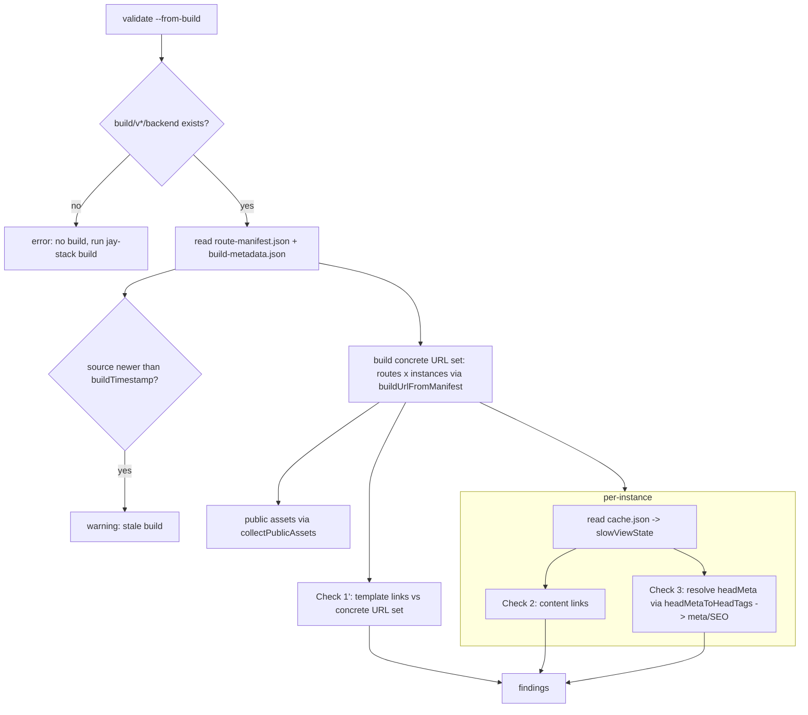

# Design Log #211 — Build-Output Validation (de-parked Check 2)

## Decisions for the Implementer (TL;DR)

- **What**: a second, **opt-in** validation tier — `jay-stack validate --from-build` — that validates against an
  **existing build's artifacts** (`build/v<version>/backend/`). It does **not** run any render; it reads what the
  **slow** phase already produced (`route-manifest.json` + per-instance `*.cache.json`) and how the server
  renders it (the `headMeta` templates), resolving bindings against the slow ViewState.
- **Why now**: DL#210 parked "Check 2" because enumerating concrete slugs is **slow** and a second slow gate in
  the hot `validate` loop has a high price. **The build already paid that cost.** Reading build JSON is cheap, so
  the objection dissolves — as long as it stays a _separate_ tier, not folded into plain `validate`.
- **Tiering (the "right pattern" DL#210 asked for)**: plain `validate` stays the fast, template-only,
  always-run gate. `validate --from-build` is the deeper, pre-deploy / CI gate that depends on a recent build.
- **Three checks in v1** (all per **concrete instance**, not per route):
  1. **Enumerated-URL link resolution** — turn DL#210's dynamic _matchers_ into a concrete _URL set_ from
     `routes × instances`. A link to a dynamic route with a **nonexistent slug** is now an **error** (this is the
     original `/design-log/wix/index` 404). Also catches links to dynamic routes generally.
  2. **Rendered-content links** — extract `<a href>` from each instance's rendered **slow ViewState**
     (markdown/body content invisible to template-only validation), resolve relatives against the instance's own
     URL, check against the URL set + public assets. Closes the dynamic-content + relative-href blind spots.
  3. **Per-instance meta/SEO** — resolve `route.headMeta` against `cache.slowViewState` via
     `headMetaToHeadTags` → concrete `<title>`/`<meta>` per URL. **Error** on an unresolved `{binding}` leftover;
     **warning** on empty/over-length title/description.
- **Reuse, don't rebuild**: `RouteManifest` type (`production-server/lib/types.ts:3`) ✅,
  `buildUrlFromManifest` (`generate-sitemap.ts:55`) ✅, `headMetaToHeadTags` (`head-tags.ts:111`) ✅, and
  DL#210's `classifyHref` / `normalizePath` / `collectPublicAssets` / finding+suppression plumbing ✅.
- **No fast render — on purpose.** We validate only what slow materialized. A field that is **fast/interactive**
  bound is unresolved at slow (DL#189 → `''`); meta emptiness is therefore a **warning**, never an error, and a
  literal `{...}` leftover (definitely never resolved) is the only meta **error**.
- **Staleness is a warning, never a hard fail.** `build-metadata.json.sourceHash` is a hash of the **build
  output**, not source (`build-pipeline.ts:107-116` ✅) — useless for "is the build behind source?". Compare
  `buildTimestamp` to the newest source mtime instead and _warn_ if source is newer.
- **Bonus**: the manifest includes **NPM-plugin-contributed routes** (markdown-pages etc.) that Check 1's
  `scanRoutes` oracle structurally misses — so this tier is strictly more complete for route resolution.

---

## Background

DL#210 shipped **Check 1**: a template-only, always-on pass in `jay-stack validate` that resolves every
`<a href>` against the project's **concrete static routes + public assets**, erroring on anything unresolvable
(`#` placeholders, typos, missing static pages). It deliberately **defers** any href that matches a _dynamic_
route pattern (`/blog/[slug]`): at validate time we don't know which concrete slugs exist without running
`loadParams`, so matching the pattern is accepted rather than flagged.

DL#210's "Check 2" — validating that residue — was **parked** with an explicit reason: enumeration is
inherently slow (whether via `loadParams` at validate time or via a build), and _"adding a second gate that
takes more time to feedback the agent has a high price."_ The park note also anticipated the generalization:
_"we can extend it to check real-world dynamic pages — validate meta tags represent the page the right way, full
SEO including dynamic content."_

This DL de-parks Check 2 by changing the input: instead of **computing** the enumeration, **read it from a
build that already computed it.**

## Problem

Two concrete bugs from jay-website motivated DL#210; Check 1 solved the first, this DL targets the second plus a
whole class Check 1 cannot see:

1. ✅ (DL#210) Footer `href="#"` placeholders — caught by Check 1.
2. ❌ `https://www.jay-framework.dev/design-log/wix/index` 404 — a hardcoded link to `/design-log/wix/index`.
   `index` is not a generated slug, but the href **matches** `/design-log/wix/[slug]`, so Check 1 defers it. It
   ships broken. **Only a concrete slug set catches this.**
3. ❌ **Dynamic-content links** — links rendered _inside_ slow content (markdown bodies, descriptions) never
   appear in the `.jay-html` template, so Check 1 cannot see them at all. Verified: a wix design-log
   `cache.json` body contains `<a href>`s like `/design-log` and relative `../jay-aiditor/...`.
4. ❌ **Relative hrefs** — Check 1 skips relative hrefs (`../x`, `./x`) as a documented blind spot because it
   has no per-page URL. A build-output pass _does_ have each instance's concrete URL, so it can resolve them.
5. ❌ **Per-instance meta/SEO** — Check 1 sees `<title>{post.title}</title>` as an unresolvable binding. Against
   the build it can resolve `post.title` per instance and validate the _actual_ title that ships.

## Prior Art / Adjacent Mechanisms

Enumerate what already exists in this area and whether it solves/constrains the problem (null-hypothesis first):

| Mechanism                                                                                              | File:line                                                                                           | Solves? / Constrains?                                                                                                                                                                                                                       |
| ------------------------------------------------------------------------------------------------------ | --------------------------------------------------------------------------------------------------- | ------------------------------------------------------------------------------------------------------------------------------------------------------------------------------------------------------------------------------------------- |
| **DL#210 Check 1** oracle (`buildRouteOracle`, `classifyHref`, `normalizePath`, `collectPublicAssets`) | `stack-cli/lib/check-internal-links.ts`                                                             | **Reused.** `classifyHref`/`normalizePath`/`collectPublicAssets` are input-agnostic; only the _oracle source_ changes (manifest vs. `scanRoutes`). ✅                                                                                       |
| **`RouteManifest`** type                                                                               | `production-server/lib/types.ts:3` (`RouteEntry.headMeta?`, `InstanceEntry {params, cachePath}:47`) | **The enumeration.** `routes[].instances[].params` = concrete slugs; `cachePath` → slow output. ✅ verified 309 instances / 8 dynamic routes on jay-website.                                                                                |
| **`buildUrlFromManifest(pattern, params)`**                                                            | `production-server/lib/builder/generate-sitemap.ts:55`                                              | **Reused** to turn each instance into a concrete URL — identical to how the sitemap is built (`generate-sitemap.ts:31-33`). ✅                                                                                                              |
| **`headMetaToHeadTags(headMeta, viewState)`**                                                          | `stack-server-runtime/lib/head-tags.ts:111` (resolver `resolveParts:98`)                            | **This is the "render without fast" primitive.** Resolves `{post.title}`-style `headMeta` template parts against a ViewState → concrete `HeadTag[]`. Feed it `cache.slowViewState`. Unresolved → literal `{value}` (`resolveParts:103`). ✅ |
| **slow-render cache** (`*.cache.json` = `{slowViewState, carryForward}`)                               | produced by `stack-server-build/lib/slow-render-cache.ts`                                           | **The slow output.** Keyed by headless `key` (e.g. `post.{title,content,description,date,tags,frontmatter}`). ✅ verified.                                                                                                                  |
| **`build-metadata.json`** (`sourceHash`, `buildTimestamp`, `instanceCount`)                            | type `production-server/lib/types.ts:72`; written `build-pipeline.ts:658-672`                       | `sourceHash` = **output** hash (`computeBuildHash` over `buildDir`, `build-pipeline.ts:107-116`), **not** source — ⚠️ cannot detect source drift. `buildTimestamp` **can** (compare to source mtimes).                                      |
| **`generate-sitemap`** full URL-set builder                                                            | `generate-sitemap.ts:12-52`                                                                         | Proves the pattern: iterate `routes × instances` → URL set. We build the same set as our resolution oracle. ✅                                                                                                                              |
| Fast-changing runner                                                                                   | `stack-server-runtime/lib/fast-changing-runner.ts`                                                  | **Deliberately NOT used.** Running it would mean per-request data + the slow gate we're avoiding. Constrains scope: we validate the slow layer only.                                                                                        |

**Null hypothesis**: can plain `validate` (Check 1) be extended instead of adding a tier? No — Check 1 has no
concrete slugs and no rendered content by construction; getting them means either the slow enumeration DL#210
rejected, or reading a build. Reading a build is new input, hence a new (opt-in) tier. Minimal new surface: one
new oracle source + one new cache reader + reuse of everything else.

## Questions and Answers

**Q1. Command surface — new command or a flag?**
A: A **flag on `validate`**: `jay-stack validate --from-build [--build-dir <dir>]`. It runs the normal pass and
then the build-output pass. Rationale: same findings model, same printer, same suppression; a separate command
would duplicate wiring. (Verify the exact CLI arg plumbing against `stack-cli` command defs before coding — per
the standing "verify CLI commands" note.)

**Q2. Which build does it read?**
A: Auto-discover the highest `v*` under the build root (config build root or `./build`), i.e.
`build/v<max>/backend/`. Allow `--build-dir` override. If none exists → a single **error** finding: _"no build
found; run `jay-stack build` first (or omit --from-build)."_ Do not silently pass.

**Q3. How do we "render without running fast render"?**
A: We don't render the body at all — the slow body HTML is already in `cache.slowViewState`. For `<head>`, we
resolve the `headMeta` _template_ (static in the manifest) against the instance's `slowViewState` using the
existing `headMetaToHeadTags`. No runner, no per-request data.

**Q4. Won't empty meta produce false errors (fast-bound fields are empty at slow)?**
A: Yes, that's the key trap. DL#189: a fast/interactive binding is `''` at slow. `resolveParts` returns `''`
(not `{...}`) for a present-but-empty field. So **emptiness ≠ broken**. Rules: a **literal `{binding}` leftover**
in resolved output ⇒ the field was never produced at any phase ⇒ **error**. **Empty** resolved value ⇒
**warning** (could be fast-filled). Over/under-length ⇒ **warning**.

**Q5. Is this still "a slow second gate" the park note warned about?**
A: No. The slowness the park note feared was _enumeration/render_. Here that already happened during build;
this tier only **reads JSON + parses HTML strings**. And it's **opt-in** — plain `validate` (the hot agent-loop
gate) is untouched and stays fast. This is exactly the two-tier pattern the park note asked us to find.

**Q6. Staleness — the build may lag source, or the live server may have mutated pages post-build.**
A: Treat as a **warning**, never a hard fail (the tier is _defined_ as "validate a point-in-time build"). Detect
by comparing `build-metadata.buildTimestamp` to the newest mtime across source inputs (`src/`, `content/`,
config). Emit _"validated against a build from <ts>; source has changed since — re-run `jay-stack build` for
accurate results."_ `sourceHash` cannot help (it hashes output). Post-build live mutations by the production
server are out of scope and noted as a known gap.

**Q7. Severity + suppression model?**
A: Reuse DL#210's `allow-broken-links` per-page key for link findings. Add `jay-stack: allow-meta-issues: true`
for the meta warnings. Link-to-nonexistent-URL = **error**; unresolved meta `{binding}` = **error**; empty/
over-length meta = **warning**; staleness = **warning**; no-build = **error**.

**Q8. Keyed/relative content links — how to resolve relatives?**
A: Each instance has a concrete URL (`buildUrlFromManifest`). Resolve a relative href with
`new URL(raw, 'https://x' + instanceUrl + '/')` semantics (or `path.posix.resolve` on the dirname) → normalized
pathname → check against the URL set/assets. Fragments/query handled by the existing `normalizePath`.

**Q9. Does the manifest oracle differ from Check 1's `scanRoutes` oracle?**
A: Yes, and better: the manifest includes **NPM-plugin-contributed routes** (e.g. `@jay-framework/markdown`
pages) that `scanRoutes` (filesystem-only, local `page.jay-html`) does not. So `--from-build` resolves links
Check 1 would wrongly treat as unknown. ✅ verified (jay-website design-log routes come from the markdown
plugin).

**Q10. Catch-all / optional params in `buildUrlFromManifest`?**
A: It already substitutes `[[opt]]`, `[...all]`, `[p]` from `params` (`generate-sitemap.ts:57-60`). Reuse as-is;
add tests for empty optional/absent catch-all producing the expected normalized URL.

## Design

### Flow



### New module: `stack-cli/lib/check-build-output.ts`

Pure, testable functions mirroring `check-internal-links.ts`:

```ts
export interface BuildOracle {
  /** Every concrete URL the build produces (routes × instances). */
  urls: Set<string>;
  /** route pattern → its JayHtmlHeadMeta template (for meta resolution). */
  headMetaByPattern: Map<string, JayHtmlHeadMeta>;
  /** concrete URL → { cacheAbsPath, pattern } for per-instance loading. */
  instanceByUrl: Map<string, { cachePath: string; pattern: string }>;
}

export async function loadBuildManifest(
  buildBackendDir: string,
): Promise<{ manifest: RouteManifest; metadata: BuildMetadata } | null>; // null ⇒ no build

export function buildBuildOracle(manifest: RouteManifest): BuildOracle; // reuses buildUrlFromManifest

export interface BuildLinkFinding {
  url: string;
  file?: string;
  message: string;
  suggestion?: string;
  severity: 'error' | 'warning';
}

/** Check 2: links inside an instance's rendered slow content. */
export function checkContentLinks(args: {
  instanceUrl: string;
  slowViewState: object;
  oracle: BuildOracle;
  assetUrls: Set<string>;
}): BuildLinkFinding[];

/** Check 3: resolve headMeta against slowViewState and validate the concrete tags. */
export function checkInstanceMeta(args: {
  instanceUrl: string;
  headMeta: JayHtmlHeadMeta | undefined;
  slowViewState: object;
}): BuildLinkFinding[]; // error on `{...}` leftover; warning on empty/length

export function isBuildStale(metadata: BuildMetadata, newestSourceMtimeMs: number): boolean;
```

- **Extract content links**: walk `slowViewState` for string fields, parse with `node-html-parser`, collect
  `a[href]`. (Alternatively parse only known HTML fields; v1 may parse any string field containing `<a `.) Feed
  each href through the existing `classifyHref`; resolve relatives against `instanceUrl`.
- **Meta resolution**: `headMetaToHeadTags(headMeta, slowViewState)` → inspect `title`/`meta[name=description]`/
  `og:*`. Flag `{` + `}` leftovers (error), empty (warning), length bounds (warning).

### Wiring in `validate.ts`

Behind `options.fromBuild`. After the normal pass:

```ts
if (options.fromBuild) {
  const loaded = await loadBuildManifest(buildBackendDir);
  if (!loaded) errors.push({ ...noBuildError, source: 'build-output' });
  else {
    if (isBuildStale(loaded.metadata, newestSourceMtimeMs))
      warnings.push({ ...staleWarning, source: 'build-output' });
    const oracle = buildBuildOracle(loaded.manifest);
    // Check 1': re-run template-link resolution against oracle.urls (not scanRoutes)
    // Check 2 + 3: per instance, read cache.json, run checkContentLinks + checkInstanceMeta
    // push findings with source: 'build-output'
  }
}
```

Findings use `source: 'build-output'` (distinct from `'internal-links'`) so they print in their own group and
are test-filterable.

## Implementation Plan

1. **Manifest reader + oracle** — `loadBuildManifest`, `buildBuildOracle` (reuse `buildUrlFromManifest`). Export
   `RouteManifest`/`BuildMetadata` types from `production-server` or copy the minimal shape into stack-cli
   (decide: dependency vs. structural type — prefer importing the type if the dependency graph allows, else a
   local `interface` matching the JSON).
2. **Check 1′** — resolve the DL#210 template-link pass against `oracle.urls` instead of `scanRoutes`; this is
   the same `checkInternalLinks` body with a different oracle. Refactor `checkInternalLinks` to accept a URL set
   - matchers abstraction so both tiers share it.
3. **Check 2** — `checkContentLinks` over each instance's `slowViewState`; relative-href resolution + tests.
4. **Check 3** — `checkInstanceMeta` via `headMetaToHeadTags`; leftover/empty/length rules + tests.
5. **Staleness** — `isBuildStale` + newest-source-mtime walk (`src/`, `content/`, config), warning finding.
6. **CLI** — add `--from-build` / `--build-dir` to the `validate` command (verify arg plumbing first); default
   build-root from config.
7. **Docs** — agent-kit `designer/validation-guide.md`: a "Deep validation against a build" section; new
   suppression rows (`allow-meta-issues`); explain the two-tier model.
8. **Live verify on jay-website** — confirm `/design-log/wix/index` is now an **error**; spot-check resolved
   titles for a dynamic design-log route; confirm zero false meta errors from fast-bound fields.

## Examples

✅ **Caught now (was deferred by Check 1)** — `/design-log/wix/index`:

```
error  build-output  Broken internal link "/design-log/wix/index" — not among the 309 URLs this build produces.
       Create the page/slug, fix the path, or remove the link.
```

✅ **Dynamic-content link** (inside a rendered markdown body):

```
error  build-output  Broken link "../jay-aiditor/design-log/19 - aiditor-add-menu" in rendered content of
       /design-log/wix/20-... — resolves to /jay-aiditor/design-log/... which this build does not produce.
```

✅ **Unresolved meta binding** (slow never produced the field):

```
error  build-output  <title> for /docs/plugin/foo resolves to "{post.title} — Plugin | Jay Framework" —
       the binding {post.title} was not produced by slow render.
```

⚠️ **Meta length** (warning, suppressible):

```
warning  build-output  <meta name="description"> for /design-log/wix/01-... is 412 chars (recommend ≤ 160).
         Suppress with jay-stack: allow-meta-issues: true.
```

❌ **Not flagged** (correct silence) — an empty `<title>` whose binding is a _fast_ field: emitted at most as a
warning, never an error, because slow legitimately leaves it `''` (DL#189).

## Scope Pre-Mortem (what this will NOT handle in v1)

| Gap                                                             | Decision                                                                                                                                 |
| --------------------------------------------------------------- | ---------------------------------------------------------------------------------------------------------------------------------------- |
| **Fast/interactive-only content** validation (per-request data) | **Defer.** Requires running the fast runner — the exact cost we're avoiding. Own DL if ever needed.                                      |
| **Post-build live mutations** (production server re-renders)    | **Defer / document.** Point-in-time snapshot is the tier's definition; surfaced via the staleness warning.                               |
| **a11y / heading-order / img on rendered content**              | **Defer to a follow-up** that reuses the same per-instance `slowViewState` loader (the plumbing here is the enabler). Note, don't build. |
| **Cross-version builds** (multiple `v*`)                        | v1 validates the **highest** version; `--build-dir` overrides.                                                                           |
| **Source-staleness precision** (mtime is coarse)                | Accept mtime heuristic; warning-only, so false "stale" is cheap.                                                                         |
| **Non-HTML string fields** wrongly parsed for links             | Guard: only parse fields containing `<a `; document the heuristic.                                                                       |

## Verification Criteria

1. On jay-website, `validate --from-build` emits an **error** for `/design-log/wix/index` (the original 404),
   while plain `validate` still defers it.
2. At least one real dynamic-content broken/relative link in a design-log body is reported (or a clean pass is
   demonstrably correct against a spot-checked instance).
3. Per-instance `<title>`/description resolve to concrete strings for a dynamic route (spot-check against the
   cache); **zero** false meta _errors_ from fast-bound empty fields.
4. Plain `validate` runtime is unchanged (the new work runs only under `--from-build`).
5. Fixture tests: a mock `build/vX/backend` tree (manifest + 2–3 cache.json) drives `buildBuildOracle`,
   `checkContentLinks`, `checkInstanceMeta`, and staleness — exact-finding assertions (no `toContain`).
6. Missing build → single actionable error, not a crash or silent pass.

## Trade-offs

- **(+)** Dissolves the park objection: the expensive enumeration is amortized into the build; the tier only
  reads it. Two clean tiers — fast always-on template gate, deep opt-in build gate.
- **(+)** Closes four blind spots at once (dynamic slugs, dynamic-content links, relative hrefs, per-instance
  meta) and is more complete than Check 1 (includes NPM-plugin routes).
- **(+)** Near-total reuse: oracle URL builder, meta resolver, and DL#210 href machinery already exist.
- **(−)** Correctness is only as fresh as the last build; mitigated by a staleness warning, not solved.
- **(−)** Reads/parses up to hundreds of cache files (jay-website: 309) — acceptable for an opt-in/CI gate,
  not for the hot loop (hence the tiering).
- **(−)** Meta validation must stay conservative (warnings for emptiness) to avoid false positives on
  fast-bound fields — it cannot, by design, judge fast content.

---

_Prior Art ties:_ DL#210 (Check 1, the always-on tier this extends), DL#156 (inferredParams / static
overrides), DL#189 (unresolved fast bindings → `''` at slow — the meta false-positive constraint), DL#163
(`jay.*` built-in bindings), DL#144 (per-route server/hydrate artifacts in the manifest).

---

## Implementation Results

**Status: Implemented.** Landed as `stack-cli/lib/check-build-output.ts` + wiring in `validate.ts`, the
`--from-build` / `--build-dir` CLI flags, and `run-validate.ts` plumbing. 24 new fixture-based tests
(`test/check-build-output.test.ts`) + full suite green (170/170).

### What landed (matches the design)

- **Check 1′ — deferred dynamic-slug links** (`checkTemplateLinksAgainstBuild`): re-evaluates only the
  template links Check 1 _deferred_ (matched a `dynamicMatcher`) against the concrete `buildUrls` set.
  Static-broken links stay Check 1's job (no double-report). Severity **error**.
- **Check 2 — rendered-content links** (`checkContentLinks` + `collectContentHrefs` + `resolveContentHref`):
  walks each instance's `slowViewState`, parses any string containing `<a `, resolves root-relative and
  genuinely-relative hrefs (against the instance URL), flags targets the build doesn't produce. Deduped per
  instance. Severity **warning** (see deviation below).
- **Check 3 — per-instance meta** (`checkInstanceMeta` via `headMetaToHeadTags`): resolves the route's
  `headMeta` against each instance's slow ViewState; literal `{binding}` leftover → **error**, empty /
  over-length title (>60) or description (>160) → **warning** (DL#189 keeps emptiness a warning).
- **Oracle + discovery**: `discoverBuildBackendDir` (highest `v*` or explicit dir / build root),
  `loadBuildManifest`, `buildBuildOracle` (static routes → pattern URL; dynamic → per-instance URL via the
  replicated `buildUrlFromManifest`), `loadSlowViewState`.
- **Staleness**: `isBuildStale` + `newestSourceMtime(src, content)` → warning only.
- **Missing build** → single actionable error (not a crash). ✅ Verification criterion 6.

### Deviations from the design

1. **Content-link severity: error → warning.** The design left Check 2 severity open. Live run against
   jay-website surfaced 35 content-link hits, **all genuine 404s (zero false positives)** but dominated by
   design-log markdown linking to repo source (`../packages/.../*.ts`), URL-encoded `../` residue, wrong-case
   (`GUIDE`), and cross-repo paths. Since that markdown doubles as GitHub docs where repo-relative links are
   correct, these are **warnings** (suppressible via `allow-broken-links`), while hand-authored template links
   (Check 1 / Check 1′) remain **errors**. User-confirmed.
2. **Dedicated output section.** Build-output findings print under their own `📦 build-output (--from-build)`
   group. Required two `printJayValidationResult` fixes: (a) exclude `source: 'build-output'` from the core
   section, and (b) add the group — otherwise `source`-tagged _warnings_ were counted but never printed (they
   fell through both the core filter `!w.source` and the plugin filter `w.source === validatorName`).

### Live verification (jay-website, build v0.1.0 — 14 routes w/ headMeta, 309 instances)

- ✅ Crit 1: `/design-log/wix/index` reported as an **error** by Check 1′; plain `validate` still defers it.
- ✅ Crit 2: 35 real dynamic-content broken links reported (Check 2), categorized: 10 source-file links,
  8 URL-encoded, 6 wrong-case, 6 cross-repo.
- ✅ Crit 3: all 14 routes' meta resolved to concrete strings; the only meta findings were empty-description
  **warnings** on design-log pages — **zero false meta errors** from fast-bound fields.
- ✅ Crit 4: plain `validate` unchanged (the tier runs only under `--from-build`).
- ✅ Crit 5: 24 fixture tests over a mock `build/v{0.1.0,0.2.0}/backend` tree (manifest + metadata + 2
  cache.json) drive discovery, oracle, content-link, meta, staleness, and a full `validateJayFiles`
  integration — exact-finding assertions, no `toContain`.

### Docs

`agent-kit-template/designer/validation-guide.md` gained a "Two validation tiers" section (Tier 1 always-on,
Tier 2 `--from-build` with the three checks), the `--from-build` / `--build-dir` flags, and a "Suppressing
Tier-2 findings" subsection documenting `allow-broken-links` + the new `allow-meta-issues` key.

### Post-implementation refinement — "Tier" naming + flag rename + doc split

Follow-up feedback settled the tier terminology and reorganized the surface (the `--from-build` mentions above
are superseded by this note):

- **Flag renamed `--from-build` → `--tier-2`** (canonical), with a hidden short alias `--t2`. `--build-dir`
  unchanged. Internal option renamed `fromBuild` → `tier2` (`ValidateOptions`, `cli.ts`, `run-validate.ts`).
  No shim kept (unreleased). All user-facing finding/section strings now read "Tier 2".
- **Output: Tier labels + a Tier 2 nudge.** Core section header is now `📦 Tier 1 — jay-stack (core)`; the
  build-output section is `📦 Tier 2 — build-output validation (--tier-2)`. When a run is Tier 1 only
  (`!options.tier2`), the footer prints an `ℹ` hint that Tier 2 exists and points at its guide.
- **Docs split for focus.** The full Tier 2 content moved to a dedicated
  `agent-kit-template/designer/validation-tier-2-guide.md`; `validation-guide.md` now keeps only a short Tier 1
  description + a pointer to the Tier 2 guide. `cli-commands.md` gained the `--tier-2` example + pointer.
- Tests updated to `tier2: true`; full suite still green (170/170), types clean.
