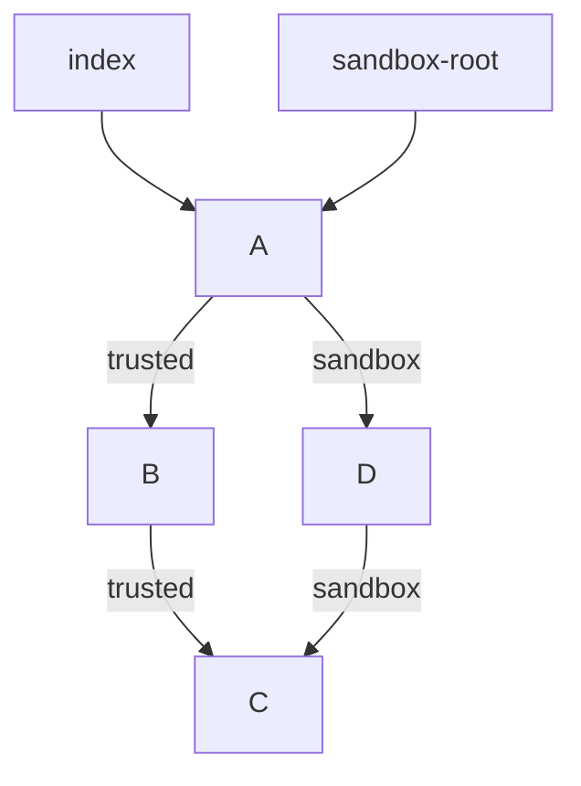
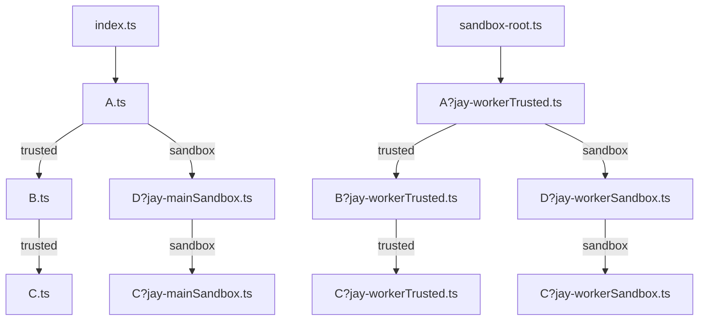

# Runtime compiler

## Intro

Runtime compiler is one of the most different aspects of Jay compared to other web frameworks.
It does not only transforms code to JavaScript, but also splits the logic into main and worker flows.
The first version of Jay runtime compiler only handles client side, it does not tackle SSR and SSG yet.
On high level, the compiler splits trusted code from secure - one to be run on the browser thread, the other on the worker thread.

It's a first version of the compiler, so the implementation details will change.
Currently, compilation is done by a single plugin.
It's simple to reason about, but it does not provide the ability to scan all the imported dependencies code
and use the collected information in the transformation step.
Multiple plugins will be introduced to solve this problem.
They will be packaged as a single plugin for the user convenience.

## Implementation details

Let's take the counter application example.
It defines typescript config, and Vite build.
Typescript config is required, as Jay only supports typescript.

### Bundler

Vite is used as a bundler: it's easy to configure and supports HMR out of the box.
Currently, Jay runtime compiler supports Rollup and Vite.

Vite configuration:

```typescript
import { resolve } from 'path';
import Inspect from 'vite-plugin-inspect';
import { defineConfig } from 'vitest/config';
import { JayRollupConfig, jayRuntime } from 'vite-plugin-jay';
import { rimrafSync } from 'rimraf';

const root = resolve(__dirname);
const jayOptions: JayRollupConfig = {
  tsConfigFilePath: resolve(root, 'tsconfig.json'),
  // outputs generated code for each file, to analyze if the changes made by compiler
  outputDir: 'build/jay-runtime',
};

export default defineConfig(({ mode }) => {
  // exclude jay packages in the development bundle to speed up the build
  const external =
    mode === 'production' ? [] : ['jay-component', 'jay-reactive', 'jay-runtime', 'jay-secure'];
  // clean the generated code directory
  rimrafSync(resolve(root, 'build'));

  return {
    plugins: [
      Inspect(), // allows to see the transformations made by the Vite plugins
      jayRuntime(jayOptions), // compiles Jay main thread code
    ],
    worker: {
      plugins: () => [jayRuntime(jayOptions)], // compiles Jay worker thread code
    },
    root,
    // skips Vite dep scan to prevent the following error: Failed to scan for dependencies from entries:
    // ✘ [ERROR] ENOENT: no such file or directory, open 'jay/examples/counter/src/app.jay-html.ts' [plugin vite:dep-scan]
    // app.jay-html.ts is a virtual file, generated by Jay runtime compiler. It does not exist during the dep scan.
    optimizeDeps: { entries: [] },
    build: {
      emptyOutDir: true,
      minify: false,
      target: 'es2020',
      rollupOptions: { external },
    },
  };
});
```

### Source code


#### Generated definition files

The `*.jay-html.d.ts` files are generated by Jay definitions compiler.
`*.jay-html` files define the DOM structure of the application.
`*.ts` files are the logic of the application.
To reduce the risk of defining an invalid type in the application logic,
the Jay definitions compiler analyses source code and exports a definition for each `*.jay-html` element.

#### Application HTML entry point

`index.html` is the entry point of the application.
It imports `src/index.ts` module.

```html
<!doctype html>
<html lang="en">
  <head>
    <meta charset="utf-8" />
    <title>Jay Counter Example</title>
  </head>
  <body>
    <div class="title">Jay Counter Example</div>
    <div>
      <div class="stage" id="target"></div>
      <script type="module" src="src/index.ts"></script>
    </div>
  </body>
</html>
```

#### Application JavaScript entry point

`src/index.ts`

```typescript
// Imports a trusted Jay component - it's code is run in the main thread
import { render } from './app.jay-html';
import { JayPort, setMainPort, HandshakeMessageJayChannel } from 'jay-secure';
import './index.css';

// Imports the worker. Worker file starts with `jay-sandbox:` prefix to indicate the worker root of Jay worker.
const jayWorker = new Worker(new URL('jay-sandbox:./sandbox-root', import.meta.url), {
  type: 'module',
});

window.onload = function () {
  // Sets up the communication of Jay in main thread and worker
  setMainPort(new JayPort(new HandshakeMessageJayChannel(jayWorker)));
  let target = document.getElementById('target');
  let app = render({});
  target.innerHTML = '';
  target.appendChild(app.dom);
};
```

#### Jay Element

`src/app.jay-html.ts` element defines application DOM

```html
<html>
  <head>
    <!-- Imports Counter Jay component to be run in a sandbox -->
    <link rel="import" href="./counter" names="Counter" sandbox="true" />
    <script type="application/yaml-jay">
      data:
    </script>
  </head>
  <body>
    <div>
      <Counter initialValue="12" ref="a"></Counter>
    </div>
  </body>
</html>
```

When a trusted component (`app.jay-html`) imports other trusted component, it's run in the main thread.
When a trusted component imports a sandbox component (`./counter`), it's sandbox code is run in a worker thread.
When a sandbox component imports another component, it's sandbox code is run in a worker thread.

#### Jay Component

`src/counter.ts` component defines counter logic

```typescript
// imports counter element for DOM rendering
import { render, CounterElementRefs } from './counter.jay-html';
import { createState, makeJayComponent, Props } from 'jay-component';

export interface CounterProps {
  initialValue: number;
}

function CounterConstructor({ initialValue }: Props<CounterProps>, refs: CounterElementRefs) {
  let [count, setCount] = createState(initialValue);

  // defines the logic - click handlers
  refs.subtracter.onclick(() => setCount(count() - 1));
  refs.adderButton.onclick(() => setCount(count() + 1));

  return {
    render: () => ({ count }),
  };
}

// exports a Jay component
export const Counter = makeJayComponent(render, CounterConstructor);
```

#### Jay Component imported as sandbox

`src/counter.jay-html` defines counter DOM

```html
<html>
  <head>
    <script type="application/yaml-jay">
      data:
        count: number
    </script>
  </head>
  <body>
    <div>
      <button ref="subtracter">-</button>
      <span style="margin: 0 16px">{count}</span>
      <button ref="adder-button">+</button>
    </div>
  </body>
</html>
```

#### Worker entry point

`src/sandbox-root.ts` is the entry point of the worker thread

```typescript
// imports application element. It imports sandbox counter, which makes app.jay-html a sandbox root
import './app.jay-html';
```

### Runtime modes

Compiler uses four runtime modes to understand the context of the file being compiled.

```typescript
export enum RuntimeMode {
  MainTrusted = 'mainTrusted', // trusted element, runs all the logic in the main thread
  MainSandbox = 'mainSandbox', // sandbox element, runs secure logic in the main thread
  WorkerTrusted = 'workerTrusted', // trusted element, does nothing, only imports dependencies
  WorkerSandbox = 'workerSandbox', // sandbox element, runs logic in the worker thread
}
```

During Jay code transformation, virtual files are created for each runtime mode.
Jay compiler adds virtual module `?jay-[runtimeMode]` extension to compiled files.
Main trusted files don't add the `?jay-mainTrusted` extension, as it's the default mode.
This allows importing the same component both as sandobx and trusted.
The import graph:



Is compiled to:



### Virtual files

Virtual files allow creating different versions of the same file for a single compilation.
For example, `counter.ts`, imported in sandbox mode, has the following files generated:

- `counter.ts` - component bridge element for the main thread responsible for communicating events and state to the worker thread
- `counter?jay-mainSandbox.ts` - component bridge for the worker responsible for executing `counter.ts` logic in the worker thread

When a file is imported, it's resolved and then loaded by the bundler.
If two modules import the same file, and the loaded files are the same,
then the compiler does not need to transform it once more and uses the cached transformation result.
It helps to reduce the initial compilation time, and greatly improves the incremental compilation time.

### Generated code

Virtual files can be inspected in the browser using Vite inspect plugin.
Load the dev server, you'll see the inspect link.
You can see the generated file list, as well as the transformation diff of each plugin.


Jay runtime compiler accepts an option to provide the generated files output directory.


#### Main thread code

##### Trusted element

`app.jay-html.ts` is generated from `app.jay-html` file.

```typescript
import {
  JayElement,
  element as e,
  ConstructContext,
  compRef as cr,
  RenderElementOptions,
} from 'jay-runtime';
import { mainRoot as mr, secureChildComp } from 'jay-secure';
import { CounterRef } from './counter-refs';
// imports sandbox component - identifies the sandbox import with the runtime mode posfix
import { Counter } from './counter?jay-mainSandbox';

export interface AppViewState {}

export interface AppElementRefs {
  a: CounterRef<AppViewState>;
}

export type AppElement = JayElement<AppViewState, AppElementRefs>;

export function render(viewState: AppViewState, options?: RenderElementOptions): AppElement {
  return ConstructContext.withRootContext(
    viewState,
    () =>
      mr(viewState, () =>
        e('div', {}, [
          secureChildComp(Counter, (vs: AppViewState) => ({ initialValue: 12 }), cr('a')),
        ]),
      ),
    options,
  );
}
```

##### Sandbox component

`counter?jay-mainSandbox.ts` is generated from `counter.ts` file, it defines a component bridge for the worker thread.

```typescript
import { render } from './counter.jay-html?jay-mainSandbox';
import { makeJayComponentBridge } from 'jay-secure';
export interface CounterProps {
  initialValue: number;
}
export const Counter = makeJayComponentBridge(render);
```

##### Sandbox element

`counter.jay-html?jay-mainSandbox.ts` is generated from `counter.jay-html` file.
Defines DOM rendering based on state.

```typescript
import {
  JayElement,
  element as e,
  dynamicText as dt,
  ConstructContext,
  HTMLElementProxy,
  elemRef as er,
  RenderElementOptions,
} from 'jay-runtime';

export interface CounterViewState {
  count: number;
}

export interface CounterElementRefs {
  subtracter: HTMLElementProxy<CounterViewState, HTMLButtonElement>;
  adderButton: HTMLElementProxy<CounterViewState, HTMLButtonElement>;
}

export type CounterElement = JayElement<CounterViewState, CounterElementRefs>;

export function render(
  viewState: CounterViewState,
  options?: RenderElementOptions,
): CounterElement {
  return ConstructContext.withRootContext(
    viewState,
    () =>
      e('div', {}, [
        e('button', {}, ['-'], er('subtracter')),
        e('span', { style: { cssText: 'margin: 0 16px' } }, [dt((vs) => vs.count)]),
        e('button', {}, ['+'], er('adderButton')),
      ]),
    options,
  );
}
```

#### Worker thread code

##### Sandbox entry point

Imports the sandbox root element.

```typescript
import './app.jay-html?jay-workerTrusted';
```

It is imported in `index.ts` as worker:

```typescript
const jayWorker = new Worker(new URL('jay-sandbox:./sandbox-root', import.meta.url), {
  type: 'module',
});
```

##### Sandbox root element

`app.jay-html?jay-workerTrusted.ts` is generated from `app.jay-html` file.
It is the first Jay element, and imports a sandbox component. So it becomes a sandbox root.

```typescript
import {
  sandboxRoot,
  sandboxChildComp as childComp,
  compRef as cr,
  HandshakeMessageJayChannel,
  JayPort,
  setWorkerPort,
} from 'jay-secure';
import { Counter } from './counter?jay-workerSandbox';

export interface AppViewState {}

export function initializeWorker() {
  sandboxRoot(() => [childComp(Counter, (vs: AppViewState) => ({ initialValue: 12 }), cr('a'))]);
}

setWorkerPort(new JayPort(new HandshakeMessageJayChannel(self)));
initializeWorker();
```

##### Sandbox component

`counter?jay-workerSandbox.ts` is generated from `counter.ts` file, it defines the logic to be run in worker thread.

```typescript
import { render, CounterElementRefs } from './counter.jay-html?jay-workerSandbox';
import { createState, makeJayComponent, Props } from 'jay-component';
export interface CounterProps {
  initialValue: number;
}
function CounterConstructor({ initialValue }: Props<CounterProps>, refs: CounterElementRefs) {
  let [count, setCount] = createState(initialValue);
  refs.subtracter.onclick(() => setCount(count() - 1));
  refs.adderButton.onclick(() => setCount(count() + 1));
  return {
    render: () => ({ count }),
  };
}
export const Counter = makeJayComponent(render, CounterConstructor);
```

##### Sandbox element bridge

`counter.jay-html?jay-workerSandbox.ts` is generated from `counter.jay-html` file.

It renders an element bridge used to receive handlers from the main thread and send state updates to the main thread.

```typescript
import { JayElement, HTMLElementProxy } from 'jay-runtime';
import { elementBridge, sandboxElement as e, elemRef as er } from 'jay-secure';

export interface CounterViewState {
  count: number;
}

export interface CounterElementRefs {
  subtracter: HTMLElementProxy<CounterViewState, HTMLButtonElement>;
  adderButton: HTMLElementProxy<CounterViewState, HTMLButtonElement>;
}

export type CounterElement = JayElement<CounterViewState, CounterElementRefs>;

export function render(viewState: CounterViewState): CounterElement {
  return elementBridge(viewState, () => [e(er('subtracter')), e(er('adderButton'))]);
}
```
