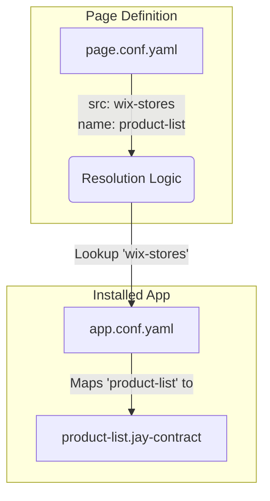

# Jay Stack - Headless Component Resolution

## Context

In Jay Stack, pages can be composed of "headless" components provided by installed applications (e.g., a "Product List" from a "Store" app). These components bring their own data contracts and behavior.

We support two ways to define which components are used on a page:

1.  **Standard:** Explicitly in the view template (`page.jay-html`) using `<script type="application/jay-headless">`.
2.  **Headless/Configuration-driven:** In a configuration file (`page.conf.yaml`) when the view template does not exist.

## Problem

When using `page.conf.yaml` (the headless approach), we define _what_ we want to use, but we don't point directly to the file system paths of the contracts. The system needs a robust way to resolve the actual `.jay-contract` files to generate correct types and valid projects.

## Solution: Indirect Resolution via `app.conf.yaml`

The resolution uses a "Foreign Key" style relationship. The page configuration (or HTML) defines the **Usage**, while the installed application's configuration defines the **Implementation Details** (including paths).

### The Resolution Flow

1.  **Usage Definition (The Pointer)**
    Inside `src/pages/.../page.conf.yaml`, the developer defines the need for a component:

    ```yaml
    used_components:
      - name: product-list # References the component name
        src: wix-stores # References the installed app module
        key: products # The data key for the page contract
    ```

2.  **Lookup (The Link)**
    The system uses the `src` value (`wix-stores`) to look up the application in the project's `installedApps` registry.

3.  **Definition (The Source of Truth)**
    The system reads the `app.conf.yaml` of the installed application (e.g., inside `node_modules/@wix/stores/` or `src/config/installedApps/wix-stores/`).

    This file contains the mapping between the public component name and its internal file path:

    ```yaml
    # app.conf.yaml
    name: wix-stores
    module: @wix/stores
    pages:
      - name: ProductPage
        headless_components:
          - name: product-list  # Match Found!
            key: products
            contract: ./contracts/product-list.jay-contract  # <--- The actual path
    ```

4.  **Path Resolution**
    The system resolves the relative path (`./contracts/product-list.jay-contract`) relative to the application's root.

### Why this design?

- **Decoupling:** The page doesn't need to know the internal file structure of the installed app. It only needs to know the public name (`product-list`).
- **Consistency:** Both `page.conf.yaml` and `page.jay-html` use the exact same resolution mechanism.
  - In `jay-html`: `<script type="application/jay-headless" src="wix-stores" name="product-list" ... />` relies on the same lookup in `app.conf.yaml` to find the contract.
- **Refactoring Safety:** The installed app can move its contract files around without breaking the consumer pages, as long as it updates its own `app.conf.yaml`.

### Diagram



## Example Scenarios

### Scenario A: Standard HTML

**File:** `src/pages/home/page.jay-html`

```html
<script
  type="application/jay-headless"
  src="wix-stores"
  name="product-list"
  key="products"
></script>
```

- **Resolution:** Uses `src="wix-stores"` to find `app.conf.yaml`, then looks up `product-list` to find the contract.

### Scenario B: Headless Config

**File:** `src/pages/home/page.conf.yaml`

```yaml
used_components:
  - name: product-list
    src: wix-stores
    key: products
```

- **Resolution:** Identical to Scenario A. Uses `src` and `name` to query `app.conf.yaml`.
