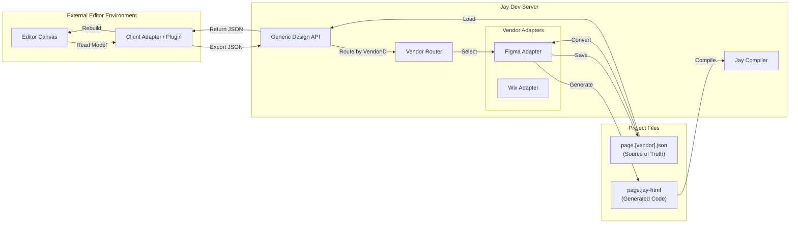

# 59 - Server-Side Editor Integration (Vendor Architecture) and Bi-directional Sync

## Context
We are architecting a solution for bi-directional synchronization between visual editors (like Figma, Wix, etc.) and the Jay framework. While the immediate implementation focus is on **Figma**, the architecture is designed to be **Vendor-Agnostic**, allowing any external editor to serve as a design source for Jay projects.

Previously, the conversion logic resided entirely within the Figma plugin. We are shifting this responsibility to the **Jay Dev Server**, turning it into a central hub for design processing.

## New Approach: Vendor Adapter Architecture
The Jay Dev Server will expose a generic "Design API" and implement a **Vendor Adapter Pattern**.

1.  **Vendor Client (e.g., Figma Plugin):** Acts as a "dumb" client. Its role is to serialize the editor's specific document structure into a JSON payload (The Interchange Doc) and send it to the server.
2.  **Dev Server (The Hub):** 
    *   Exposes generic endpoints: `/api/design/:vendorId/export` and `/api/design/:vendorId/import`.
    *   Loads the appropriate **Vendor Adapter** (e.g., `figma-adapter`) based on the request.
    *   Saves the raw JSON as the "Source of Truth" (e.g., `page.figma.json`).
    *   Invokes the Adapter's **Conversion Engine** to generate `jay-html`.
3.  **Bi-directionality:** The Server stores the source-of-truth. Clients can request this data back to re-hydrate the design in the editor.

## Architecture Diagram

## Workflow Details

### 1. Export (Publish) from Editor
*   **User Action:** Click "Publish" in the Editor (e.g., Figma Plugin).
*   **Client:** Serializes the design into a vendor-specific JSON (e.g., `FigmaInterchangeDoc`).
*   **Request:** `POST /api/design/figma/export`
*   **Server:**
    *   Receives payload.
    *   Resolves file path from `pageUrl`.
    *   Saves `page.figma.json`.
    *   Calls `FigmaAdapter.convert(json)`.
    *   Writes `page.jay-html`.

### 2. Import (Restore) to Editor
*   **User Action:** Click "Load" in the Editor.
*   **Request:** `GET /api/design/figma/import?url=home`
*   **Server:** Reads `home/page.figma.json` and returns it.
*   **Client:** Deserializes the JSON and reconstructs the native editor nodes.

## Pros and Cons

### Pros
1.  **Extensibility:** We can support Wix, Penpot, or a custom internal tool by simply writing a new Server Adapter and a simple Client Plugin. The API surface remains constant.
2.  **Testability:** Conversion logic runs on Node.js. We can unit test the "Figma to Jay" conversion with static JSON fixtures, independent of the Figma environment.
3.  **Source Control:** Raw vendor files (`.figma.json`, `.wix.json`) are committed to Git, enabling version history for the *design* source.
4.  **Separation of Concerns:** Editors handle UI/Interaction. The Server handles Logic/Code Generation.

### Cons
1.  **Payload Size:** serialized design documents can be large.
2.  **Adapter Complexity:** Writing the "Rebuilder" (Import logic) for each vendor is non-trivial and requires deep knowledge of that vendor's API.

## Design Considerations

### 1. Vendor Specific Schemas
*   We will NOT attempt to create a single "Universal UI Schema" (like a standardized AST) that all editors must map to before sending to the server.
*   **Reasoning:** Editors are too different. Figma has AutoLayout; others might use Constraint Layout or Flexbox directly. Converting to a generic intermediate format on the client adds massive complexity and potential data loss.
*   **Decision:** The "Shared Schema" is shared *between the specific Vendor Client and its corresponding Server Adapter*. 
    *   Figma Client <-> Figma Adapter share `FigmaInterchangeDoc`.
    *   Wix Client <-> Wix Adapter share `WixInterchangeDoc`.

### 2. Co-location of Logic
*   Jay Binding metadata (e.g., `j-text="user.name"`) should be stored within the Vendor's native storage (e.g., Figma `pluginData`) and serialized as a distinct field in the JSON (e.g., `jayData` object). This keeps the design "pure" and the logic separable.

## High-Level Implementation Plan

### 1. Vendor Schema Definitions
*   Define the data contract for the specific vendor (e.g., `@jay-framework/figma-interchange`).

### 2. Generic Dev Server API
*   Implement the routing layer: `/api/design/:vendorId/*`.
*   Define a `VendorAdapter` interface that all adapters must implement (e.g., `convert(data: any): string`).

### 3. Client Export Engine (Vendor Implementation)
*   Implement the serializer in the specific editor (e.g., Figma Plugin) to match its schema.

### 4. Server-Side Adapter Logic
*   Implement the `VendorAdapter` for the specific tool (e.g., `FigmaAdapter`).
*   This contains the core conversion logic (JSON -> jay-html).

### 5. Client Import Engine (Vendor Implementation)
*   Implement the reconstruction logic in the editor to support bi-directionality.

### 6. Verification
*   Test suites for the generic API.
*   Specific test suites for the Figma Adapter (using JSON fixtures).
