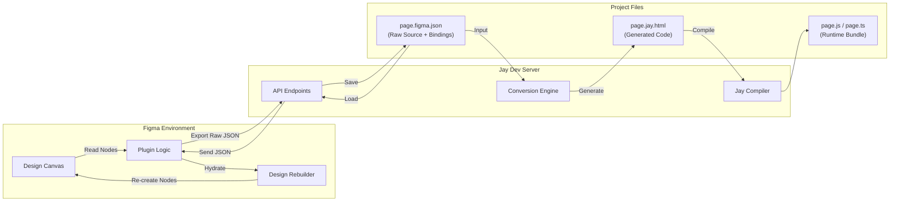

# 59 - Server-Side Figma Conversion and Bi-directional Sync

## Context
Currently, the conversion logic from Figma design to Jay framework code (`jay-html`) resides within the Figma plugin (`@jay-desktop-poc/plugin`). The workflow involves the plugin traversing the Figma node tree, generating the final `jay-html` string, and sending it to the dev server merely for file saving.

## New Approach
We are shifting the conversion responsibility from the Figma Plugin to the **Jay Dev Server**.

In this new architecture:
1.  **The Plugin** acts as a "dumb" client. Its primary role is to extract the raw Figma document structure (nodes, components, variants, styles) and the user-defined binding metadata.
2.  **The Dev Server** receives this raw data, saves it as a "Source of Truth" (`.figma.json`), and then executes the conversion logic to generate the `jay-html` files.
3.  **Bi-directionality**: The Dev Server serves as a repository for design state. The Plugin can request the raw design data back from the server to reconstruct/rehydrate a design on the Figma canvas.

## Architecture Diagram

The following diagram illustrates the flow of data between Figma, the Dev Server, and the File System.



## Workflow Details

### 1. Export (Publish)
*   **User Action:** Click "Publish" in the Figma Plugin.
*   **Plugin:** Serializes the selected Figma Frame(s) or Page into a JSON representation. This includes:
    *   Visual properties (layout, stroke, fill, effects).
    *   Hierarchy structure.
    *   Jay Binding metadata (which layer maps to which contract property).
*   **Server:** Receives the payload.
    *   Saves `[name].figma.json` (The raw dump).
    *   Triggers the `Conversion Engine`.
    *   Generates `[name].jay.html` based on the raw dump.

### 2. Import (Restore)
*   **User Action:** Click "Load from Code" or "Restore Version" in the Figma Plugin.
*   **Server:** Reads the requested `[name].figma.json`.
*   **Plugin:** Receives the JSON.
    *   Clears the specific frame or creates a new page.
    *   Iteratively recreates the Figma nodes (Rectangles, Text, AutoLayouts) based on the JSON data.
    *   Re-applies the Jay Bindings to the `pluginData` of the new nodes.

## Pros and Cons

### Pros

1.  **Testability & Robustness (Major)**
    *   **Headless Testing:** We can write unit tests for the `Conversion Engine` in the Dev Server (Node.js) environment. We can capture edge-case Figma JSONs and add them to a test suite to ensure the generator never breaks, without needing to spin up Figma manually.
    *   **faster Iteration:** Fixing a bug in the generator doesn't require reloading the Figma plugin. We can just run the server test suite.

2.  **Version Control & History**
    *   Since the raw `page.figma.json` is saved to the file system, it can be committed to Git.
    *   This provides a history of the *design itself*, not just the generated code.
    *   Developers can diff changes in the design data (structure changes, binding updates).

3.  **Design Restoration (Time Travel)**
    *   Because we save the raw source, we can revert to an older commit in Git, reload the Dev Server, and "Import" that version back into Figma. This effectively gives us "Time Travel" for Figma designs relative to the project codebase.

4.  **Separation of Concerns**
    *   **Plugin:** Focuses on UI interaction and Figma API quirks.
    *   **Server:** Focuses on Logic, Code Generation, and File I/O.
    *   This allows the conversion logic to become more complex (e.g., deeper optimization, better code structure) without bloating the plugin bundle or slowing down the Figma UI thread.

5.  **Single Source of Truth**
    *   The file system becomes the master record. The Figma file is just a "View" into that record. This prevents "Drift" where the Figma file and the code involve into two completely different states.

### Cons

1.  **Payload Size & Performance**
    *   Figma documents can be very large. Serializing a complex page into JSON might result in large payloads sent over the local network.
    *   *Mitigation:* Only send diffs or use efficient binary serialization formats if JSON becomes a bottleneck.

2.  **Import Complexity**
    *   Writing the "Rebuilder" (JSON -> Figma Node) is complex. Figma's API handles node creation differently than reading. Ensuring that a restored design is 1:1 pixel-perfect with the original requires significant effort.

3.  **Dependency on Dev Server**
    *   The plugin becomes strictly dependent on the Dev Server being running to perform any meaningful export/import action. (Though this is consistent with the general Jay workflow).

4.  **Asset Handling**
    *   Images and Vectors need to be handled carefully. The JSON payload needs to decide whether to inline binary data (base64) or reference external files that the server manages.

## Design Considerations & Architectural Decisions

### 1. Parity with Figma & The "Interchange Schema"
*   **The Problem:** It is impossible to achieve 100% parity with Figma's internal document state via the Plugin API (proprietary features, prototyping links, etc. are not fully exposed).
*   **The Decision:** We will not attempt to mirror the internal Figma state. Instead, we define a **High-Fidelity Interchange Schema**.
    *   This schema represents the *subset* of Figma attributes that Jay supports and requires for UI reconstruction.
    *   It will closely mirror the Figma Plugin API interfaces (`SceneNode`, `FrameNode`, etc.) to minimize translation friction.
    *   This schema acts as the "Contract" between the Plugin (Export/Import) and the Server (Converter).

### 2. Separation of Design & Logic (Co-location Strategy)
*   **The Problem:** While Design and Logic (Bindings) are conceptually distinct, `pluginData` in Figma is physically attached to the Nodes.
*   **The Goal:** We want to support "Pure Design" use cases where a user might export/import a design without any Jay bindings, or where the bindings can be stripped easily.
*   **The Decision:** We will use a **Co-location Strategy** within the JSON structure.
    *   Standard Figma properties (fills, strokes, layout) will sit at the root of the Node object.
    *   Jay-specific metadata (Bindings, Tags) will be encapsulated in a specific isolated field (e.g., `jayData` or `pluginData`).
    *   *Benefit:* This allows the "Rebuilder" to simply ignore the `jayData` field if it wants to restore just the visual design, or for the "Converter" to strip it out if converting to a non-Jay target in the future.

#### Example JSON Structure
```json
{
  "type": "FRAME",
  "name": "MyComponent",
  "id": "1:2",
  "children": [...],
  // --- Pure Design Props ---
  "fills": [{ "type": "SOLID", "color": {...} }],
  "layoutMode": "AUTO",
  "itemSpacing": 16,
  
  // --- Jay Specific Metadata ---
  "jayData": {
    "bindings": [
      { "property": "viewModel.title", "target": "characters" }
    ],
    "semanticTag": "article"
  }
}
```

## High-Level Implementation Plan

### 1. Shared Schema Definition (The Contract)
*   **Action:** Create a shared TypeScript library/package or file that defines the `FigmaInterchangeSchema`.
*   **Details:** This schema should include:
    *   Recursive Node definitions (`Frame`, `Text`, `Rectangle`, etc.).
    *   Style definitions (`Paint`, `Effect`, `TextStyles`).
    *   The `JayMetadata` interface for bindings and tags.
*   **Goal:** Establish a single source of truth for the data structure that both the Plugin and Server will depend on.

### 2. Dev Server API Infrastructure
*   **Action:** Extend `jay-dev-server` with new endpoints.
*   **Details:**
    *   `POST /api/figma/export`: Endpoint to receive the JSON dump and write it to disk as `[page].figma.json`.
    *   `GET /api/figma/import/:pageId`: Endpoint to read the JSON file from disk and return it to the client.
*   **Goal:** Create the communication channel and storage mechanism.

### 3. Plugin Export Engine (Serialization)
*   **Action:** Implement the "Serializer" in the Figma Plugin.
*   **Details:**
    *   Traverse the Figma Node tree.
    *   Map `FigmaNode` -> `InterchangeNode` (Schema).
    *   Extract `pluginData` and map it to `jayData`.
    *   Send the result to the Export API.
*   **Goal:** Enable "Saving" the design to the server.

### 4. Server-Side Conversion Logic
*   **Action:** Port and Refactor the Converter.
*   **Details:**
    *   Move the existing conversion logic from `@jay-desktop-poc/plugin` to a new server-side package/module.
    *   Update the logic to consume `InterchangeNode` (JSON) instead of `FigmaNode` (API Object).
    *   Implement the file generation: `InterchangeNode` -> `jay-html`.
*   **Goal:** Enable code generation from the saved JSON files.

### 5. Plugin Import Engine (Rehydration)
*   **Action:** Implement the "Rebuilder" in the Figma Plugin.
*   **Details:**
    *   Fetch data from the Import API.
    *   Clear the target frame/page.
    *   Recursively create Figma nodes based on the schema types (`createFrame`, `createRect`, etc.).
    *   Restore visual properties and `pluginData`.
*   **Goal:** Enable "Loading" the design back into Figma.

### 6. Verification & Round-Trip Testing
*   **Action:** Verify the loop.
*   **Details:**
    *   Test: Design -> Export -> Verify File.
    *   Test: File -> Convert -> Verify Code.
    *   Test: File -> Import -> Verify Visuals.
*   **Goal:** Ensure data integrity throughout the cycle.
