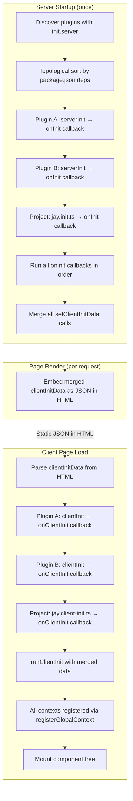
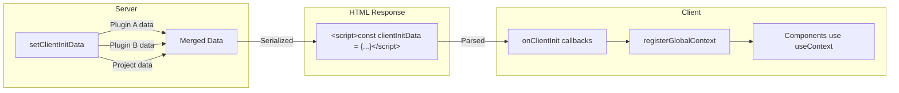

# Client Context Initialization and Plugin Init Files

## Background

Jay Stack has a server-side initialization pattern via `jay.init.ts`:
- Uses `onInit()` / `onShutdown()` hooks to register services
- Services are global singletons available during server rendering
- Dev-server loads and executes `jay.init.ts` on startup

Currently, client-side contexts are:
- Created inside component constructors via `provideReactiveContext()`
- Cannot receive data from the server (like access tokens)
- Must be initialized inline, no centralized initialization

Plugins can declare:
- `actions` - server-side actions auto-registered
- `contracts` - component contracts for pages
- No client or server init files

## Problem

1. **No client context initialization pattern** - Unlike server services, there's no `jay.client-init.ts` equivalent for initializing client-side contexts before components render.

2. **No server-to-client data passing** - For auth tokens, user info, config, etc., there's no standard pattern to pass server-computed data to client contexts.

3. **No plugin init files** - Plugins cannot define their own initialization logic that runs automatically when the plugin is used.

## Questions and Answers

### Q1: What data needs to flow from server to client for context initialization?
**Answer:** Static/slowly-changing application configuration:
- Configuration values (e.g., items per page in product search)
- OAuth client IDs
- Feature flags
- A/B test information

**Key constraints:**
- Data is set at build/application initialization time (slowly changing)
- Data does NOT change during the lifecycle of a client page
- NOT per-request or per-page dynamic data

### Q2: Should client init run before or after component tree creation?
**Answer:** Before - contexts must be available when components construct.

### Q3: How do plugins declare init dependencies on other plugins?
**Answer:** Use `package.json` dependencies. The framework reads dependency graph from package.json to determine init order.

### Q4: Should there be separate init files for server and client in plugins, or one file with both?
**Answer:** Separate files - different concerns with different dependencies (server code should never reach client bundle).

### Q5: What's the lifecycle of client contexts - per page load or per SPA navigation?
**Answer:** Per page for now. Future SPA support may change this.

## Design

### 1. Client Initialization File: `jay.client-init.ts`

Similar to `jay.init.ts` for server, projects can create a `jay.client-init.ts` file:

```typescript
// src/jay.client-init.ts
import { onClientInit, registerGlobalContext } from '@jay-framework/stack-client-runtime';
import { APP_CONFIG_CONTEXT } from './contexts/app-config';
import { THEME_CONTEXT, createThemeContext } from './contexts/theme';

// Called with only the 'project' namespace data from server
onClientInit('project', (serverData) => {
  // Register app-wide contexts using server config
  registerGlobalContext(APP_CONFIG_CONTEXT, {
    itemsPerPage: serverData.itemsPerPage,
    features: serverData.featureFlags,
  });
  registerGlobalContext(THEME_CONTEXT, createThemeContext(serverData.defaultTheme));
});
```

### 2. Server-to-Client Data via `setClientInitData`

The server provides static application-level data for client initialization. This data is:
- Set once at application startup (not per-request)
- Slowly changing (configuration, feature flags)
- Serializable to JSON
- **Namespaced by key** so each client init receives only its own data

```typescript
// src/jay.init.ts
import { onInit, setClientInitData } from '@jay-framework/stack-server-runtime';

onInit(async () => {
  // Set static client init data with namespace key
  setClientInitData('project', {
    oauthClientId: process.env.OAUTH_CLIENT_ID,
    itemsPerPage: 20,
    featureFlags: await loadFeatureFlags(),
    abTestVariants: await loadABTestConfig(),
  });
});
```

The data is serialized once and embedded in all page HTML. Each `onClientInit` callback receives only the data matching its namespace key.

### 3. Client Context Registry

The Jay runtime library already has a context registry infrastructure. We extend it to support pre-registered contexts that are available before component tree construction:

```typescript
// In @jay-framework/runtime (existing infrastructure)
// We add functions to register contexts at the app level

export function registerGlobalContext<T>(
  marker: ContextMarker<T>,
  context: T
): void {
  // Registers context in existing runtime infrastructure
  // Available to all components via useContext(marker)
}
```

Components continue to use the standard `useContext` API - registered global contexts are found automatically.

### 4. Plugin Init Files

Plugins declare init capability in `plugin.yaml`. The schema supports both simple boolean flags (use defaults) and detailed override objects:

```yaml
# plugin.yaml - Simple form (use all defaults)
init:
  server: true   # Convention: export "serverInit" from "./init/server"
  client: true   # Convention: export "clientInit" from "./init/client"
```

```yaml
# plugin.yaml - Override form (customize names/paths)
init:
  server:
    export: myServerInit        # Override export name (default: "serverInit")
    module: ./custom/setup      # Override module path (default: "./init/server")
  client:
    export: initializeClient    # Override export name (default: "clientInit")
    module: ./bootstrap/client  # Override module path (default: "./init/client")
```

```yaml
# plugin.yaml - Mixed form
init:
  server: true                  # Use defaults
  client:
    export: setupClient         # Custom export name, default module path
```

**Schema definition:**
```typescript
interface PluginInitConfig {
  server?: boolean | {
    export?: string;   // Default: "serverInit"
    module?: string;   // Default: "./init/server"
  };
  client?: boolean | {
    export?: string;   // Default: "clientInit"  
    module?: string;   // Default: "./init/client"
  };
}
```

**Defaults (convention over configuration):**
- `init.server: true` → `{ export: "serverInit", module: "./init/server" }`
- `init.client: true` → `{ export: "clientInit", module: "./init/client" }`
- Declaration allows framework to know which plugins have init without importing

**Build approach:** Plugins use the existing `isSsrBuild` pattern with two entry points:

```typescript
// vite.config.ts (existing pattern)
export default defineConfig(({ isSsrBuild }) => ({
  build: {
    ssr: isSsrBuild,
    lib: {
      entry: isSsrBuild
        ? { index: resolve(__dirname, 'lib/index.ts') }           // Server
        : { 'index.client': resolve(__dirname, 'lib/index.client.ts') },  // Client
      formats: ['es'],
    },
  },
}));
```

Build commands:
- `vite build` → Client bundle from `lib/index.client.ts`
- `vite build --ssr` → Server bundle from `lib/index.ts`

**Entry point structure:**

```typescript
// lib/index.ts (server entry point)
export * from './components';
export * from './stores-actions';

// Export server init function (convention name)
export { serverInit } from './init/server';
```

```typescript
// lib/index.client.ts (client entry point)
export * from './components';
export * from './stores-actions';  // Transformed to action callers

// Export client init function (convention name)
export { clientInit } from './init/client';
```

**Dependency ordering:** Uses `package.json` dependencies. If `wix-stores` depends on `wix-auth` in package.json, then `wix-auth`'s init runs before `wix-stores`'s init.

**Init uses typed markers for type-safe server-to-client data passing:**

```typescript
// lib/init-marker.ts (shared - no server/client deps)
import { createInitMarker } from '@jay-framework/fullstack-component';

export interface StoresInitData {
  storesApiEndpoint: string;
  defaultCurrency: string;
}

export const STORES_INIT = createInitMarker<StoresInitData>('wix-stores');
```

```typescript
// lib/init/server.ts
import { serverInit, getService, registerService } from '@jay-framework/stack-server-runtime';
import { AUTH_SERVICE } from '@wix/auth';
import { STORES_SERVICE, createStoresService } from '../services/stores';
import { STORES_INIT } from '../init-marker';

serverInit(STORES_INIT, async (setClientData) => {
  const auth = getService(AUTH_SERVICE);  // Available because wix-auth init ran first
  const stores = await createStoresService(auth);
  registerService(STORES_SERVICE, stores);
  
  // setClientData is typed: (data: StoresInitData) => void
  setClientData({
    storesApiEndpoint: process.env.STORES_API_URL || '/api',
    defaultCurrency: 'USD',
  });
});
```

```typescript
// lib/init/client.ts
import { clientInit, registerGlobalContext } from '@jay-framework/stack-client-runtime';
import { STORES_CONTEXT, createStoresContext } from '../stores-client/stores-context';
import { STORES_INIT } from '../init-marker';

clientInit(STORES_INIT, (data) => {
  // data is typed as StoresInitData!
  registerGlobalContext(STORES_CONTEXT, createStoresContext({
    apiEndpoint: data.storesApiEndpoint,
    currency: data.defaultCurrency,
  }));
});
```

**Benefits of typed markers:**
- ✅ Type-safe data passing - data is typed end-to-end
- ✅ No string duplication - marker encapsulates the key
- ✅ Same pattern as other markers (`createJayContext`, `createJayService`)
- ✅ No server deps in client code - marker is in shared file

### 5. Initialization Order

**Key principle:** Plugins initialize first, project last. This allows the project to extend, override, or depend on plugin-provided services and contexts.

1. **Server startup:**
   - Discover plugins with `init.server` in `plugin.yaml`
   - Topologically sort plugins by `package.json` dependencies
   - For each plugin (in order):
     - Import plugin's server bundle
     - Call exported `serverInit()` function (registers `onInit` callbacks)
   - Import project `jay.init.ts` (registers `onInit` callbacks)
   - Run all registered `onInit` callbacks in order
   - Collect all `setClientInitData` contributions into merged object

2. **Page render (server):**
   - Embed merged client init data in page HTML (static, same for all pages)

3. **Client page load:**
   - Parse embedded client init data from HTML
   - For each plugin with `init.client` (in dependency order):
     - Import plugin's client bundle
     - Call exported `clientInit(serverData)` with the plugin's namespaced data
   - Import project `jay.client-init.ts` (registers `onClientInit` callbacks)
   - Run all `onClientInit` callbacks with their namespaced server data
   - Mount component tree (all contexts now available)

**Note:** Plugin client init receives its data directly via function parameter. Project init uses `onClientInit('project', callback)` to register callbacks that receive the `'project'` namespaced data. This keeps plugin client code free of server dependencies.

### Data Flow Diagram





### 6. Generated Client Script Updates

The `generateClientScript` function adds client init imports and execution:

```html
<script type="module">
  import { runClientInit } from "@jay-framework/stack-client-runtime";
  
  // Plugin client bundles - import and call clientInit (convention name, dependency order)
  import { clientInit as authClientInit } from "@wix/auth/client";
  import { clientInit as storesClientInit } from "@wix/stores/client";
  authClientInit();   // Registers onClientInit callbacks
  storesClientInit(); // Registers onClientInit callbacks
  
  // Project client init (last)
  import "./jay.client-init";  // Top-level onClientInit calls register callbacks
  
  // Server-generated init data (static, merged from all plugins + project)
  const clientInitData = {"itemsPerPage":20,"storesApiEndpoint":"https://api.wix.com/stores","defaultCurrency":"USD"};
  
  // Run all registered onClientInit callbacks with merged data
  await runClientInit(clientInitData);
  
  // Then mount component tree (existing code)
  import { makeCompositeJayComponent } from "@jay-framework/stack-client-runtime";
  // ... component mounting ...
</script>
```

**Init function patterns:**

| Source | Pattern | Reason |
|--------|---------|--------|
| Project `jay.client-init.ts` | Top-level `onClientInit()` calls | File loaded directly, side effects OK |
| Plugin client bundle | Explicit `clientInit()` export | Part of larger bundle, avoid side effects on component import |

**Build integration:** Plugins continue using the existing `isSsrBuild` pattern:
- `vite build` → builds client bundle including `clientInit` export
- `vite build --ssr` → builds server bundle including `serverInit` export

## Implementation Plan

### Phase 1: Server-Side Client Data API
1. Add `setClientInitData(data)` to `stack-server-runtime`
   - Merges data into a global client init data object (shallow merge)
   - Can be called multiple times (plugins + project)
2. Add `getClientInitData()` internal API for page rendering
3. Store merged client init data in ServiceLifecycleManager
4. Update page rendering to embed client init data in HTML as JSON

### Phase 2: Client Init File Support
1. Add `onClientInit(callback)` to `stack-client-runtime`
   - Registers callback to receive server data
2. Add `runClientInit(data)` internal API
   - Runs all registered callbacks with merged data
3. Add `registerGlobalContext(marker, context)` to `@jay-framework/runtime`
   - Extends existing context infrastructure
   - Registered contexts available via `useContext()`
4. Update `generateClientScript` to:
   - Find and import `jay.client-init.ts` if exists
   - Embed client init data JSON
   - Call `runClientInit()` before component mounting

### Phase 3: Plugin Init Files
1. Extend `PluginManifest` interface:
   ```typescript
   interface PluginInitConfig {
     server?: boolean | { export?: string; module?: string };
     client?: boolean | { export?: string; module?: string };
   }
   
   interface PluginManifest {
     // ... existing fields
     init?: PluginInitConfig;
   }
   ```
2. Add helper to normalize init config:
   ```typescript
   function normalizeInitConfig(init: boolean | { export?: string; module?: string }, env: 'server' | 'client') {
     if (init === true) {
       return { 
         export: env === 'server' ? 'serverInit' : 'clientInit',
         module: env === 'server' ? './init/server' : './init/client'
       };
     }
     return {
       export: init.export ?? (env === 'server' ? 'serverInit' : 'clientInit'),
       module: init.module ?? (env === 'server' ? './init/server' : './init/client'),
     };
   }
   ```
3. Update `ServiceLifecycleManager` to:
   - Discover plugins with `init.server` in plugin.yaml
   - Read package.json dependencies for topological sort
   - Import plugin module and call normalized export name
   - Then load project jay.init.ts
4. Update `generateClientScript` to:
   - Generate imports for plugin client bundles with `init.client`
   - Use normalized export/module names
   - Import project client init last
5. Test with multi-plugin dependency chains and custom names

## Examples

### Example 1: Feature Flags and Config

```typescript
// src/contexts/app-config.ts
import { createJayContext } from '@jay-framework/runtime';

export interface AppConfig {
  itemsPerPage: number;
  enableNewCheckout: boolean;
  abTestVariant: 'control' | 'variant-a' | 'variant-b';
}

export const APP_CONFIG_CONTEXT = createJayContext<AppConfig>();
```

```typescript
// src/jay.init.ts
import { onInit, setClientInitData } from '@jay-framework/stack-server-runtime';

onInit(async () => {
  const featureFlags = await loadFeatureFlags();
  
  // Use 'project' as namespace key
  setClientInitData('project', {
    itemsPerPage: 20,
    enableNewCheckout: featureFlags.newCheckout,
    abTestVariant: await getABTestVariant('checkout-flow'),
  });
});
```

```typescript
// src/jay.client-init.ts
import { onClientInit, registerGlobalContext } from '@jay-framework/stack-client-runtime';
import { APP_CONFIG_CONTEXT, AppConfig } from './contexts/app-config';

// Use 'project' key to receive only project's data
onClientInit('project', (data: AppConfig) => {
  registerGlobalContext(APP_CONFIG_CONTEXT, data);
});
```

```typescript
// src/pages/products.ts - Component using the config
import { APP_CONFIG_CONTEXT, AppConfig } from '../contexts/app-config';

function ProductListComponent(props, refs, config: AppConfig) {
  // config.itemsPerPage, config.enableNewCheckout available
  const pageSize = config.itemsPerPage;
  // ...
}

export const ProductList = makeJayComponent(render, ProductListComponent, APP_CONFIG_CONTEXT);
```

### Example 2: Plugin with Init Files (wix-stores pattern)

```yaml
# plugin.yaml
name: wix-stores
version: 1.0.0
module: dist/index.js

contracts:
  - name: product-page
    contract: product-page.jay-contract
    component: productPage

actions:
  - addToCart
  - getProduct

# Boolean flags - convention names serverInit/clientInit
init:
  server: true
  client: true
```

```json
// package.json
{
  "name": "@wix/stores",
  "exports": {
    ".": "./dist/index.js",
    "./client": "./dist/index.client.js",
    "./plugin.yaml": "./plugin.yaml"
  },
  "dependencies": {
    "@wix/auth": "^1.0.0"
  }
}
```

```typescript
// vite.config.ts (existing pattern)
export default defineConfig(({ isSsrBuild }) => ({
  plugins: [...jayStackCompiler(jayOptions)],
  build: {
    ssr: isSsrBuild,
    lib: {
      entry: isSsrBuild
        ? { index: resolve(__dirname, 'lib/index.ts') }
        : { 'index.client': resolve(__dirname, 'lib/index.client.ts') },
      formats: ['es'],
    },
    // ... externals
  },
}));
```

```typescript
// lib/index.ts (server entry)
export * from './components';
export * from './stores-actions';
export * from './cart-actions';

// Convention: export serverInit for framework to call
export { serverInit } from './init/server';
```

```typescript
// lib/index.client.ts (client entry)
export * from './components';
export * from './stores-actions';
export * from './cart-actions';

// Convention: export clientInit for framework to call
export { clientInit } from './init/client';
```

```typescript
// lib/init/server.ts
import { onInit, registerService, setClientInitData, getService } from '@jay-framework/stack-server-runtime';
import type { PluginInitContext } from '@jay-framework/stack-server-runtime';
import { AUTH_SERVICE } from '@wix/auth';
import { STORES_SERVICE, createStoresService } from '../stores-client/stores-service';

export function serverInit({ pluginName }: PluginInitContext) {
  onInit(async () => {
    const auth = getService(AUTH_SERVICE);
    const storesService = await createStoresService(auth);
    registerService(STORES_SERVICE, storesService);
    
    // Use pluginName as key
    setClientInitData(pluginName, {
      storesApiEndpoint: process.env.STORES_API_URL,
      defaultCurrency: 'USD',
    });
  });
}
```

```typescript
// lib/init/client.ts
import { registerGlobalContext } from '@jay-framework/stack-client-runtime';
import { STORES_CONTEXT, createStoresContext } from '../stores-client/stores-context';

// Framework calls this with the plugin's namespaced serverData directly
export async function clientInit(serverData: Record<string, any>): Promise<void> {
  registerGlobalContext(STORES_CONTEXT, createStoresContext({
    apiEndpoint: serverData.storesApiEndpoint,
    currency: serverData.defaultCurrency,
  }));
}
```

## Trade-offs

### Centralized vs Component-Inline Context Initialization

**Centralized (`jay.client-init.ts`):**
- ✅ Single place for app-wide context initialization
- ✅ Can receive server configuration data
- ✅ Clear initialization order (plugins → project)
- ❌ Another file to manage

**Component-Inline (`provideReactiveContext`):**
- ✅ Context defined close to where it's used
- ✅ Good for component-subtree-scoped contexts
- ❌ Cannot receive server data
- ❌ Initialization order depends on component tree

**Decision:** Support both. Centralized for app-wide contexts needing server data, inline for component-local contexts.

### Plugin Init: Single File vs Separate Files

**Separate source files, exported from existing bundles (chosen):**
- ✅ Clean separation for bundling
- ✅ Server init in server bundle, client init in client bundle
- ✅ No side effects on bundle import (framework calls init explicitly)
- ✅ Works with existing plugin bundle structure
- ✅ Tree-shakeable if init not used
- ❌ Two source files instead of one

### Static vs Dynamic Client Init Data

**Static (chosen):**
- ✅ Set once at server startup
- ✅ Same for all pages/requests
- ✅ Cacheable
- ❌ Cannot vary per request/user

**Dynamic (rejected for now):**
- ✅ Could vary per user/request
- ❌ Adds complexity
- ❌ Blurs line with page props

**Decision:** Static data only. Per-request data should flow through page props and component rendering, not init.

### Dependency Order: Explicit vs package.json

**Using package.json (chosen):**
- ✅ Already maintained for npm
- ✅ Single source of truth
- ✅ Familiar to developers
- ❌ Less explicit in plugin.yaml

### Init Export Names: Convention with Override

**Convention names with optional override (chosen):**
```yaml
# Simple - use defaults
init:
  server: true   # export "serverInit" from "./init/server"
  client: true   # export "clientInit" from "./init/client"

# Override when needed
init:
  server:
    export: customServerInit
    module: ./setup/server
```
- ✅ Simple case is simple (just `true`)
- ✅ Flexibility when needed (custom names/paths)
- ✅ Boolean flag tells framework which plugins have init
- ✅ Supports existing codebases with different conventions

### Init Order: Plugins First vs Project First

**Plugins first, project last (chosen):**
- ✅ Project can depend on plugin services/contexts
- ✅ Project can override plugin defaults
- ✅ Mirrors typical extension patterns

