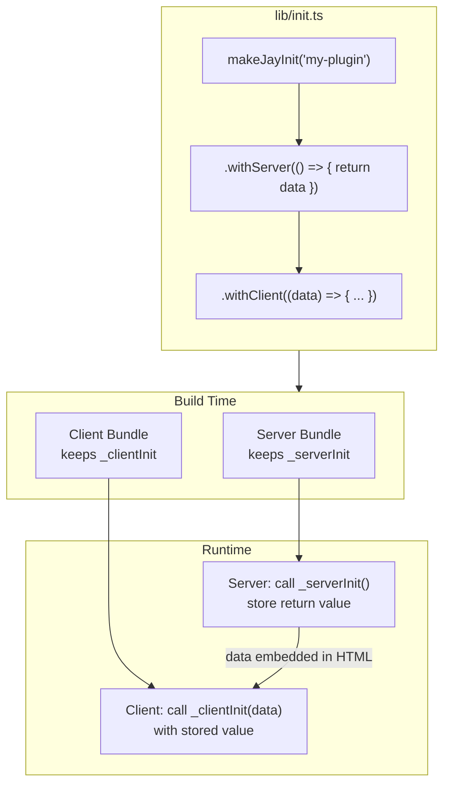

# makeJayInit Builder Pattern

## Background

Design Log #64 introduced plugin initialization with typed markers:

```typescript
// 3 files needed:
// lib/init-marker.ts
export const MY_INIT = createInitMarker<MyData>('my-plugin');

// lib/init/server.ts
serverInit(MY_INIT, async (setClientData) => { ... });

// lib/init/client.ts
clientInit(MY_INIT, (data) => { ... });
```

This works but:
- Requires 3 separate files
- Manual type threading via marker
- Different pattern from `makeJayStackComponent`

## Problem

1. **Too many files** - Server init, client init, and marker file for each plugin
2. **Manual type threading** - Must define interface separately and reference via marker
3. **Inconsistent with component pattern** - `makeJayStackComponent` co-locates all phases in one file

## Proposed Solution

A builder pattern that mirrors `makeJayStackComponent`:

```typescript
// lib/init.ts (single file!)
import { makeJayInit } from '@jay-framework/fullstack-component';

// No key needed - defaults to plugin name from plugin.yaml
export const init = makeJayInit()
    .withServer(async () => {
        registerService(MY_SERVICE, createService());
        
        return {
            apiUrl: process.env.API_URL,
            features: ['cart', 'search'],
        };
    })
    .withClient((data) => {
        // data type inferred from withServer return!
        registerGlobalContext(MY_CONFIG_CONTEXT, data);
    });
```

## Design

### Builder API

```typescript
interface JayInitBuilder<T = void> {
    withServer<R extends Record<string, any>>(
        callback: () => R | Promise<R>
    ): JayInitBuilder<R>;
    
    withClient(
        callback: (data: T) => void | Promise<void>
    ): JayInit<T>;
}

interface JayInit<T> {
    readonly __brand: 'JayInit';
    readonly key: string;  // Filled in by framework from plugin.yaml name
    readonly _serverInit?: () => T | Promise<T>;
    readonly _clientInit?: (data: T) => void | Promise<void>;
}

// Key is optional - defaults to plugin name (from plugin.yaml) or 'project'
function makeJayInit(key?: string): JayInitBuilder<void>;
```

**Note:** The `key` parameter is optional. When omitted:
- For plugins: framework injects the plugin name from `plugin.yaml`
- For project: defaults to `'project'`

### Type Flow

```
withServer return type ─────► withClient data parameter type
         R                              T
```

The return type of `withServer` automatically becomes the input type of `withClient` - no manual type threading needed.

### Compiler Transformation

Similar to `transform-jay-stack-builder.ts`:

**Source:**
```typescript
export const init = makeJayInit('my-plugin')
    .withServer(async () => {
        const config = loadConfig();
        return { apiUrl: config.url };
    })
    .withClient((data) => {
        registerGlobalContext(CTX, data);
    });
```

**Server bundle output:**
```typescript
export const init = {
    __brand: 'JayInit',
    key: 'my-plugin',
    _serverInit: async () => {
        const config = loadConfig();
        return { apiUrl: config.url };
    },
    // _clientInit removed
};
```

**Client bundle output:**
```typescript
export const init = {
    __brand: 'JayInit',
    key: 'my-plugin',
    // _serverInit removed
    _clientInit: (data) => {
        registerGlobalContext(CTX, data);
    },
};
```

### Runtime Execution

**Server (stack-server-runtime):**
```typescript
async function executePluginInit(init: JayInit<any>): Promise<void> {
    if (init._serverInit) {
        const data = await init._serverInit();
        if (data) {
            setClientInitData(init.key, data);
        }
    }
}
```

**Client (stack-client-runtime):**
```typescript
function executeClientInit(init: JayInit<any>, serverData: Record<string, any>): void {
    if (init._clientInit) {
        init._clientInit(serverData);
    }
}
```

### Plugin Discovery

The `plugin.yaml` changes:

```yaml
# Default: auto-discover lib/init.ts, looks for export named 'init'
name: my-plugin
# (no init field needed)

# Override export name (looks for export named 'myCustomInit')
name: my-plugin
init: myCustomInit
```

**Discovery order:**
1. Look for `lib/init.ts` (or `lib/init/index.ts`)
2. Import and get the export named by `init` field (default: `'init'`)
3. The exported `JayInit` object contains `_serverInit` and `_clientInit`

### Dev Server Logging

Log init execution using the plugin name for readability:

```
[DevServer] Running server init: my-plugin
[DevServer] Running server init: @wix/stores
[DevServer] Running server init: project
```

### Plugin Dependencies

If a plugin's init depends on another plugin's init output, use:
- **Server:** Services via `getService()` (available because dependencies run first)
- **Client:** Contexts via `useContext()` (available because dependencies run first)

```typescript
// @wix/stores depends on @wix/auth (declared in package.json)
export const init = makeJayInit()
    .withServer(async () => {
        // @wix/auth init already ran, service is available
        const authService = getService(AUTH_SERVICE);
        const storesService = createStoresService(authService);
        registerService(STORES_SERVICE, storesService);
        
        return { currency: 'USD' };
    })
    .withClient((data) => {
        // @wix/auth client init already ran, context is available
        const authContext = useContext(AUTH_CONTEXT);
        registerGlobalContext(STORES_CONTEXT, {
            ...data,
            isAuthenticated: authContext.isLoggedIn,
        });
    });
```

**Dependency order** is determined by `package.json` dependencies - same as current behavior.

## Data Flow Diagram



## Examples

### Plugin Init

```typescript
// @wix/stores/lib/init.ts
import { makeJayInit } from '@jay-framework/fullstack-component';
import { registerService, registerGlobalContext } from '...';

// No key needed - defaults to plugin name from plugin.yaml
export const init = makeJayInit()
    .withServer(async () => {
        // Register server service
        const wixClient = getWixClient();
        registerService(STORES_SERVICE, createStoresService(wixClient));
        
        // Return data for client (type inferred)
        return {
            currency: 'USD',
            enableCart: true,
            enableSearch: true,
        };
    })
    .withClient((data) => {
        // data is typed as { currency: string, enableCart: boolean, enableSearch: boolean }
        registerGlobalContext(STORES_CONFIG_CONTEXT, data);
        
        if (data.enableCart) {
            // Initialize cart client...
        }
    });
```

### Project Init

```typescript
// src/jay.init.ts
import { makeJayInit } from '@jay-framework/fullstack-component';

// No key needed - defaults to 'project' for project init
export const init = makeJayInit()
    .withServer(async () => {
        const flags = await loadFeatureFlags();
        
        return {
            itemsPerPage: 20,
            featureFlags: flags,
        };
    })
    .withClient((config) => {
        // config is typed as { itemsPerPage: number, featureFlags: ... }
        registerGlobalContext(APP_CONFIG_CONTEXT, config);
    });
```

### Server-Only Init

```typescript
// Just server, no client data
export const init = makeJayInit()
    .withServer(async () => {
        const db = await connectDatabase();
        registerService(DB_SERVICE, db);
        // No return = no client init needed
    });
```

### Client-Only Init

```typescript
// Just client, no server data needed
export const init = makeJayInit()
    .withClient(() => {
        initializeAnalytics();
    });
```

## Implementation Plan

### Phase 1: Builder API
1. Add `makeJayInit` builder to `@jay-framework/fullstack-component`
2. Add `JayInit` and `JayInitBuilder` types
3. Export from package

### Phase 2: Compiler Transform
1. Add `transform-jay-init.ts` in `compiler-jay-stack`
2. Handle server/client bundle splitting
3. Preserve type information

### Phase 3: Runtime Integration
1. Update `plugin-init-discovery.ts` to handle `JayInit` exports
2. Update `generate-client-script.ts` for new format
3. Update dev-server integration

### Phase 4: Migration
1. Update example plugins to new pattern
2. Update documentation
3. Deprecate old APIs (`serverInit`, `clientInit`, `onClientInit`)

## Trade-offs

### Co-located File vs Separate Files

**Co-located (proposed):**
- ✅ Single file to maintain
- ✅ Type flow is automatic
- ✅ Consistent with `makeJayStackComponent`
- ❌ Requires compiler transformation
- ❌ More "magic"

**Separate files (current):**
- ✅ No compiler transformation needed
- ✅ Explicit separation
- ❌ 3 files per plugin
- ❌ Manual type threading

### Compiler Complexity

Adding another transformation increases compiler complexity. However:
- Pattern already established with `makeJayStackComponent`
- Reuse existing infrastructure
- Consistent developer experience

## Questions and Answers

### Q1: Should we support both patterns during transition?
**Answer:** No, just the new pattern. Clean break.

### Q2: How does this interact with plugin.yaml?
**Answer:** Auto-discover `lib/init.ts` exporting `init` by convention. The `init` member in plugin.yaml can override the exported constant name:

```yaml
# Default: looks for export named 'init'
name: my-plugin

# Override: looks for export named 'myCustomInit'
name: my-plugin
init: myCustomInit
```

### Q3: What about project init file name?
**Answer:** Project init should also use the new pattern:

```typescript
// jay.init.ts
export const init = makeJayInit()
    .withServer(async () => { ... })
    .withClient((data) => { ... });
```

### Q4: What should be the default init key?
**Answer:** Use the plugin name as the default key. The `makeJayInit()` call without a key will use the plugin name from `plugin.yaml`:

```typescript
// For plugins: key defaults to plugin name from plugin.yaml
export const init = makeJayInit()  // key = 'my-plugin' (from plugin.yaml)
    .withServer(...)
    .withClient(...);

// For project: key defaults to 'project'
export const init = makeJayInit()  // key = 'project'
    .withServer(...)
    .withClient(...);

// Explicit key override still possible
export const init = makeJayInit('custom-key')
    .withServer(...)
    .withClient(...);
```

### Q5: Should we log init calls in dev server?
**Answer:** Yes, log using the plugin name (more readable than init key):

```
[DevServer] Running server init: my-plugin
[DevServer] Running server init: wix-stores
[DevServer] Running server init: project
...
[Client] Running client init: my-plugin
[Client] Running client init: wix-stores
[Client] Running client init: project
```

