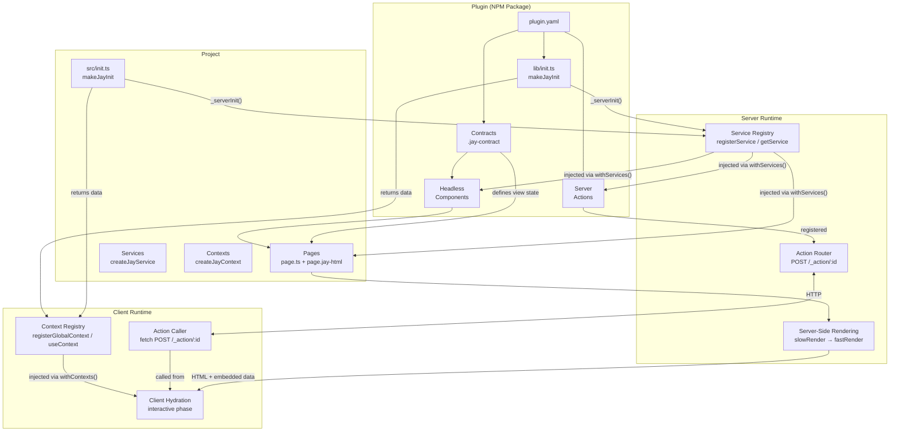
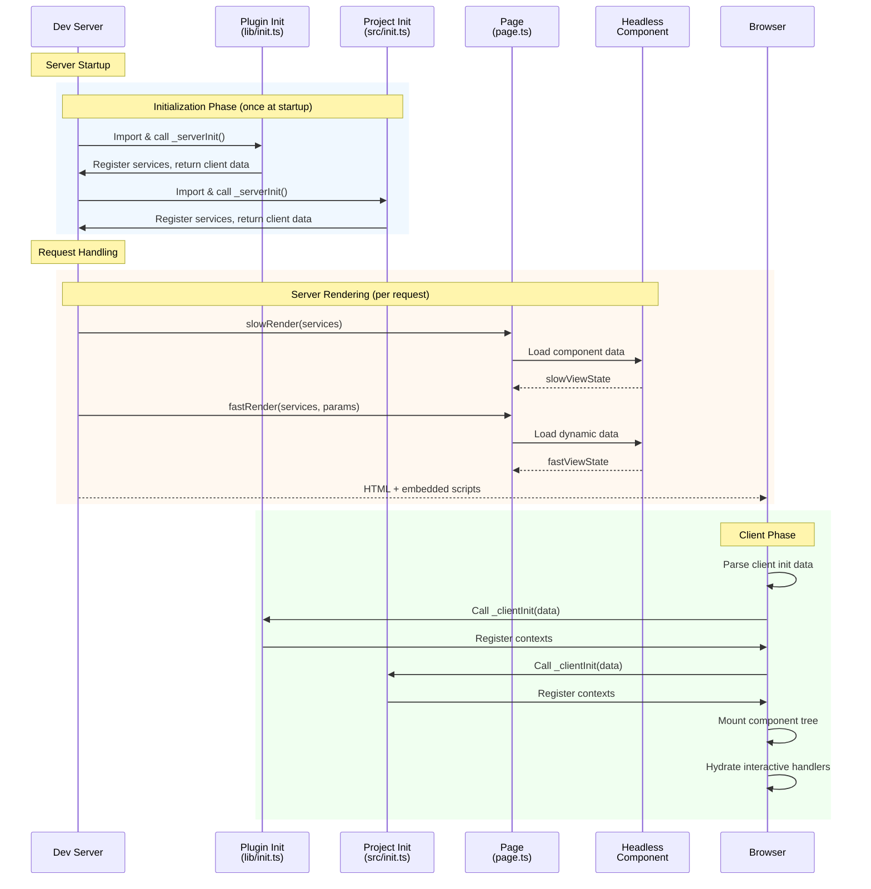
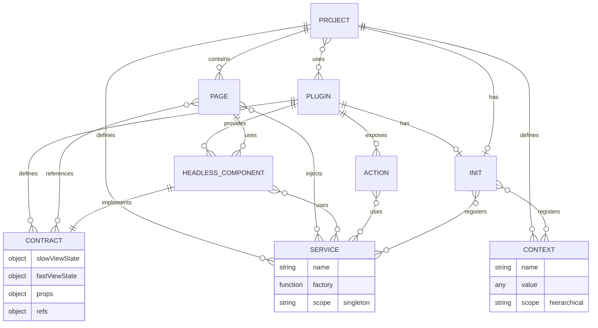
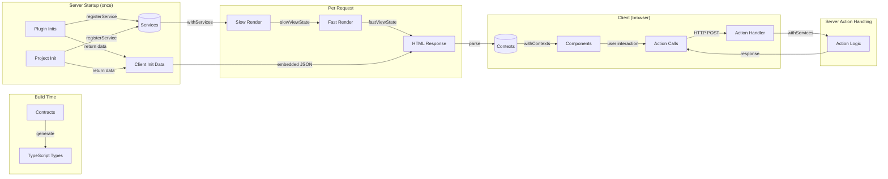

# Jay Stack Conceptual Model

## Overview

This design log provides a conceptual diagram showing the relationships between the key building blocks of Jay Stack:

- **Services** - Server-side singletons (database, API clients)
- **Contexts** - Client-side hierarchical dependency injection
- **Pages** - Page definitions that generate website pages
- **Plugins** - NPM packages providing reusable contracts, components, actions
- **Headless Components** - Plugin-provided components with data contracts
- **Init** - Server and client initialization via `makeJayInit`

## Conceptual Relationships Diagram



## Component Lifecycle Diagram



## Entity Relationships



## Key Concepts Summary

| Concept                | Runtime                       | Scope                       | Lifecycle            | Purpose                                |
| ---------------------- | ----------------------------- | --------------------------- | -------------------- | -------------------------------------- |
| **Service**            | Server                        | Global singleton            | Application lifetime | Database, API clients, config          |
| **Context**            | Client                        | Hierarchical (parent→child) | Page lifetime        | Theme, auth state, feature flags       |
| **Page**               | Both                          | Per-route                   | Per request          | Define website routes and content      |
| **Plugin**             | Both                          | Global                      | Application lifetime | Package reusable functionality         |
| **Headless Component** | Both                          | Per-usage                   | Component lifetime   | Provide data+behavior without template |
| **Init**               | Both                          | Global                      | Application startup  | Register services/contexts             |
| **Action**             | Server (callable from client) | Per-call                    | Stateless            | Server-side mutations/queries          |

## Data Flow Overview



## File Structure Reference

```
project/
├── src/
│   ├── init.ts                    # Project init (makeJayInit)
│   ├── pages/
│   │   └── products/
│   │       ├── page.ts            # Page logic
│   │       ├── page.jay-html      # Page template
│   │       └── page.jay-contract  # Generated contract
│   ├── services/
│   │   └── database.service.ts    # Service definitions
│   ├── contexts/
│   │   └── theme.context.ts       # Context definitions
│   └── actions/
│       └── cart.actions.ts        # Server actions
├── node_modules/
│   └── @wix/stores/               # Example plugin
│       ├── plugin.yaml
│       ├── lib/
│       │   ├── init.ts            # Plugin init
│       │   ├── contracts/
│       │   └── components/
│       └── dist/
└── package.json
```

## Related Design Logs

- [#34 - Jay Stack](./34%20-%20jay%20stack.md) - Overall Jay Stack architecture
- [#48 - Jay Stack Services](./48%20-%20Jay%20Stack%20Services.md) - Server-side services pattern
- [#30 - Jay Context API](./30%20-%20Jay%20Context%20API.md) - Client-side context system
- [#60 - Plugin System Refinement](./60%20-%20plugin%20system%20refinement%20and%20dynamic%20contracts.md) - Plugin structure
- [#63 - Server Actions](./63%20-%20jay-stack%20server%20actions.md) - Client-server action calls
- [#64 - Client Context Init](./64%20-%20client%20context%20initialization%20and%20plugin%20init.md) - Init patterns
- [#65 - makeJayInit Builder](./65%20-%20makeJayInit%20builder%20pattern.md) - Unified init pattern
- [#66 - Transitive Plugin Dependencies](./66%20-%20transitive%20plugin%20dependency%20resolution.md) - Plugin discovery
