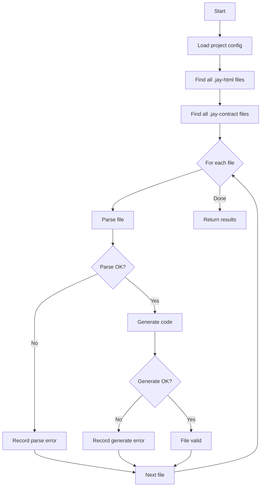

# Design Log #73 - Jay Stack Validate Command

## Background

The `jay-stack` CLI currently has two commands:
- `dev` - starts the development server
- `validate-plugin` - validates a plugin package

When developing with Vite, developers create `.jay-html` files that get compiled on-the-fly. Currently, there's no way to validate all jay-html files in a project without either:
1. Running the dev server and navigating to each page
2. Actually compiling the files (which creates output files)

## Problem

Need a CLI command that:
1. Scans all `.jay-html` files in a jay-stack project
2. Validates they will compile correctly (parsing + code generation)
3. Does NOT create any output files
4. Reports errors with file paths and details
5. Returns non-zero exit code on failure (for CI integration)

## Questions

**Q1: Where should this command live - `jay-cli` or `jay-stack-cli`?**
A: `jay-stack-cli` makes more sense since this is for jay-stack projects that use Vite. The existing CLI already has project-aware commands.

**Q2: Should it also validate `.jay-contract` files?**
A: Yes - contracts are often referenced from jay-html files, and invalid contracts would cause compilation failures anyway.

**Q3: What validation stages should be performed?**
A: 
1. Parse the jay-html file (structure, YAML, imports, types)
2. Generate the code (catches expression compilation errors, template issues)

**Q4: Should the command watch for changes?**
A: Not initially - the primary use case is CI and one-off validation. Watch mode can be added later.

**Q5: What output format should be used?**
A: Similar to `validate-plugin` - human-readable by default, with optional JSON output for tooling integration.

## Design

### Command Interface

```bash
# Validate all .jay-html files in src/pages (default for jay-stack projects)
jay-stack validate [path]

# Options
jay-stack validate --verbose        # Show detailed output including file list
jay-stack validate --json           # Output results as JSON
jay-stack validate ./custom/path    # Validate files in specific directory
```

### Implementation Structure

```typescript
// lib/validate.ts
export interface ValidateOptions {
    path?: string;           // Directory to scan (defaults to config pagesBase)
    verbose?: boolean;       // Show per-file status
    json?: boolean;          // JSON output format
}

export interface ValidationResult {
    valid: boolean;
    filesScanned: number;
    errors: ValidationError[];
    warnings: ValidationWarning[];
}

export interface ValidationError {
    file: string;
    line?: number;
    column?: number;
    message: string;
    stage: 'parse' | 'generate' | 'typecheck';
}

export async function validateJayFiles(options: ValidateOptions): Promise<ValidationResult>
```

### Validation Flow



### File Changes

1. **New file: `lib/validate.ts`** - Main validation logic
2. **Modify: `lib/cli.ts`** - Add `validate` command
3. **New file: `test/validate.test.ts`** - Tests

## Implementation Plan

### Phase 1: Core Validation
1. Create `validate.ts` with file scanning and validation logic
2. Reuse existing `parseJayFile` and `generateElementFile` from compiler packages
3. Collect errors without writing files

### Phase 2: CLI Integration
1. Add `validate` command to `cli.ts`
2. Add output formatting (human-readable and JSON)
3. Handle exit codes

### Phase 3: Tests
1. Test with valid files (should pass)
2. Test with invalid jay-html (should report errors)
3. Test with invalid contract references
4. Test with missing imports

## Examples

### Successful Validation

```
$ jay-stack validate

✅ Jay Stack validation successful!

Scanned 12 .jay-html files, 5 .jay-contract files
No errors found.
```

### Validation with Errors

```
$ jay-stack validate

❌ Jay Stack validation failed

Errors:
  ❌ src/pages/product/page.jay-html
     Line 15: Unknown binding 'product.invalid_field' - field not found in contract
     
  ❌ src/pages/cart/page.jay-html  
     Line 8: jay file should have exactly one jay-data script, found 2

2 files with errors, 10 files valid.
```

### JSON Output

```json
{
  "valid": false,
  "filesScanned": 17,
  "errors": [
    {
      "file": "src/pages/product/page.jay-html",
      "line": 15,
      "message": "Unknown binding 'product.invalid_field' - field not found in contract",
      "stage": "parse"
    }
  ],
  "warnings": []
}
```

## Trade-offs

| Approach | Pros | Cons |
|----------|------|------|
| Parse only | Fast, catches structure errors | Misses code generation bugs |
| Parse + generate | Catches most real errors | Slightly slower |

**Decision**: Parse + generate is sufficient since generated code is expected to be valid TypeScript.

## Verification Criteria

1. Running `jay-stack validate` on a valid project returns exit code 0
2. Running on a project with invalid jay-html returns exit code 1 with clear error messages
3. Error messages include file path and specific issue
4. JSON output is parseable and contains all errors
5. Validation does not create any files in the project

---

## Implementation Results

**Files Created/Modified:**
- `lib/validate.ts` - Core validation logic (reuses `parseJayFile`, `generateElementFile`, `parseContract` from compiler packages)
- `lib/cli.ts` - Added `validate [path]` command with `--verbose` and `--json` options
- `package.json` - Added dependencies: `@jay-framework/compiler-jay-html`, `@jay-framework/compiler-shared`, `glob`
- `test/validate.test.ts` - 7 tests covering valid/invalid files, contracts, and edge cases

**Tests:** 39/39 passing

**Deviations from Design:**
- Function renamed from `printValidationResult` to `printJayValidationResult` to avoid conflict with existing plugin validator function
