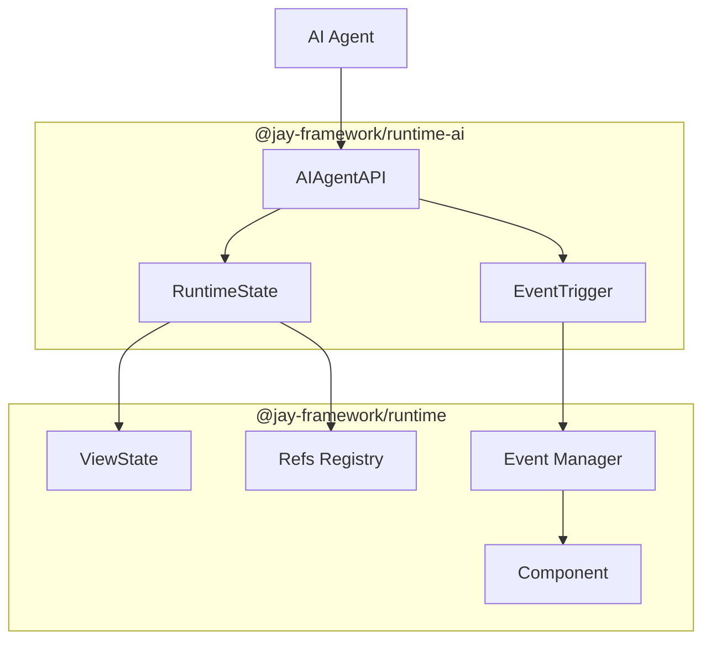

# AI Agent Integration for Jay Components

## Background

Jay components have a clear separation between UI (jay-html) and logic (TypeScript). The UI is driven by ViewState, and user interactions are handled through refs and events. This structured approach makes Jay ideal for AI agent automation:

1. **ViewState** contains all data displayed on the page
2. **Refs** define interactive elements (buttons, inputs, etc.)
3. **Coordinates** identify elements in collections (forEach items)
4. **Events** are triggered with `{event, viewState, coordinate}`

This design log proposes exposing the page state and interactions to AI agents, enabling them to:

- Read current page content (derived from ViewState)
- Discover all possible interactions
- Trigger events, including those on forEach items (e.g., remove from cart)

## Problem Statement

### Current Situation

Jay components are designed for human interaction via DOM events. There's no programmatic API for:

1. Querying the current ViewState
2. Listing available interactions
3. Triggering events from external code (like an AI agent)

### Desired Behavior

```typescript
// AI agent can query page state and interactions
const pageInfo = window.__JAY_AGENT__.getPageState();
// → { viewState: {...}, interactions: [...] }

// AI can trigger events
window.__JAY_AGENT__.triggerEvent('click', ['prod-123', 'remove-btn']);
// → Triggers click on remove button for product prod-123
```

### Use Cases

1. **AI Test Automation**: Agent navigates the app, fills forms, validates states
2. **AI Assistant**: Understands page context to help users
3. **Accessibility**: Alternative interaction methods for assistive tech
4. **E2E Testing**: Programmatic interaction without DOM selectors

## Questions & Answers

### Q1: What data should be exposed in the page state?

**A:** Three levels of information:

1. **ViewState**: The current data driving the UI (product names, prices, cart items)
2. **Interactions**: Available actions with their coordinates and event types
3. **DOM Elements**: Reference to actual DOM elements with their coordinates (for setting values)

```typescript
interface AIPageState {
  viewState: object; // The current ViewState
  interactions: AIInteraction[];
}

interface AIInteraction {
  refName: string; // e.g., "remove-btn"
  coordinate: string[]; // e.g., ["prod-123", "remove-btn"]
  element: Element; // The actual DOM element
  elementType: string; // e.g., "HTMLButtonElement"
  supportedEvents: string[]; // e.g., ["click", "focus"]
  itemContext?: object; // ViewState of the forEach item (if applicable)
}
```

The `element` reference allows the AI to:

- Read current input values directly from DOM
- Set input values before triggering events (e.g., set text, then trigger `input` event)
- Inspect element attributes and state

### Q2: How do we handle forEach items?

**A:** Each item in a collection has a coordinate path. For nested collections:

```html
<ul>
  <li forEach="cartItems" trackBy="productId">
    <span>{productName}</span>
    <button ref="remove">Remove</button>
  </li>
</ul>
```

The interactions would be:

```javascript
[
  { refName: "remove", coordinate: ["prod-123", "remove"], itemContext: { productId: "prod-123", ... } },
  { refName: "remove", coordinate: ["prod-456", "remove"], itemContext: { productId: "prod-456", ... } },
]
```

### Q3: How do we keep the runtime package small?

**A:**

**Option A: Separate package** (Recommended)

- Create `@jay-framework/runtime-ai` package
- Only imported when AI features are needed
- Zero cost when not used

**Option B: Conditional import via entry point**

- `@jay-framework/runtime/ai` separate entry
- Tree-shakeable if not imported

**Option C: Runtime flag**

- `enableAIAgent()` function that adds capability
- Still requires bundling the code

**Recommendation**: Option A (separate package) for complete isolation.

### Q4: How does the AI trigger events?

**A:** The AI needs to:

1. Find the correct element by coordinate
2. Dispatch the appropriate event
3. Handle the result (state change, navigation, etc.)

```typescript
interface AIAgentAPI {
  getPageState(): AIPageState;
  triggerEvent(eventType: string, coordinate: string[], eventData?: object): Promise<void>;
  waitForStateChange(): Promise<AIPageState>;
}
```

### Q5: How do we integrate with the component lifecycle?

**A:** The AI agent attaches to the component instance during initialization (no global singleton):

**Jay (basic) usage:**

```typescript
import { wrapWithAIAgent } from '@jay-framework/runtime-ai';

const target = document.getElementById('target');
const [refs, render2] = render();
const instance = render2({ todoProps: { initialTodos } });

// Wrap the instance with AI agent capabilities
const aiInstance = wrapWithAIAgent(instance);
// aiInstance has both the original API and AI methods

target.appendChild(aiInstance.dom);

// Use AI API directly on the instance
const state = aiInstance.ai.getPageState();
aiInstance.ai.onStateChange((newState) => {
  /* ... */
});
```

**Jay Stack usage:**

```typescript
import { wrapWithAIAgent } from '@jay-framework/runtime-ai';

const target = document.getElementById('target');
const pageComp = makeCompositeJayComponent(render, viewState, fastCarryForward, [], trackByMap);
const instance = pageComp({ ...viewState, ...fastCarryForward });

// Wrap with AI agent (e.g., in dev mode only)
const aiInstance = process.env.DEV ? wrapWithAIAgent(instance) : instance;

target.appendChild(aiInstance.element.dom);
```

**Key points:**

- No `window.__JAY_AGENT__` global
- AI API is a property on the wrapped instance
- Clean separation - original component unchanged
- Can be conditionally applied (dev mode only)

### Q6: Security considerations?

**A:**

1. **Dev only by default**: AI agent API should be disabled in production
2. **No sensitive data**: ViewState should not contain secrets
3. **Rate limiting**: Prevent event flooding
4. **Sandboxing**: AI actions should respect existing security boundaries

### Q7: How to handle async events and state changes?

**A:** Use event-based notification. A single DOM event can trigger multiple ViewState updates (e.g., optimistic update, then server response). The AI should subscribe to state changes:

```typescript
// Subscribe to state changes
const unsubscribe = ai.onStateChange((newState) => {
  console.log('State updated:', newState.viewState);
});

// Trigger event - state changes arrive via callback
ai.triggerEvent('click', ['checkout-btn']);

// Later: unsubscribe when done
unsubscribe();
```

This is better than `waitForStateChange()` because:

- Multiple updates are captured (not just the first)
- No timeout guessing required
- Aligns with reactive nature of Jay components

### Q8: How do we expose input element values and state?

**A:** No special structure needed. ViewState already has a field for each form input value. The AI reads values from ViewState and sets values directly on DOM elements (via the `element` reference in interactions) before triggering events:

```typescript
// ViewState already contains form values
interface CheckoutViewState {
  customerName: string; // Bound to <input ref="name" value="{customerName}">
  email: string; // Bound to <input ref="email" value="{email}">
}

// AI reads current values from ViewState
const state = ai.getPageState();
console.log(state.viewState.customerName); // "John"

// AI sets value on DOM element, then triggers event
const nameInteraction = state.interactions.find((i) => i.refName === 'name');
(nameInteraction.element as HTMLInputElement).value = 'Jane';
ai.triggerEvent('input', ['name']);
```

**Optional**: Metadata mapping ViewState fields to DOM elements could be added later if needed.

### Q9: How do we identify the component/page for multi-component pages?

**A:** Scoping is already built-in via the headless component key field in ViewState and Refs. Each headless component's data is nested under its key:

```typescript
// ViewState with headless components
interface PageViewState {
  pageTitle: string;
  cart: {
    // Headless component key
    items: CartItem[];
    total: number;
  };
  header: {
    // Another headless component
    userName: string;
  };
}

// Refs follow the same structure
interface PageRefs {
  checkout: HTMLButtonElement; // Page-level ref
  cart: {
    // Headless component refs
    removeBtn: HTMLButtonElement[]; // Collection within cart
  };
}
```

The AI agent works with this naturally - coordinates include the component path:

- `['checkout']` - page-level button
- `['cart', 'prod-123', 'removeBtn']` - remove button in cart for product prod-123

### Q10: How do we handle secure sandbox (worker-based) components?

**A:** For secure components (running in worker), the AI API runs in the main thread and communicates via the existing message channel. The coordinator can expose a compatible API:

```typescript
// In secure mode, the coordinator exposes the AI API
// The viewState is sent via message to main thread
// Events are sent back to worker via existing JPMDomEvent
```

## Design

### Architecture



### Package Structure

```
packages/runtime/
├── runtime-ai/           # NEW: AI Agent package
│   ├── lib/
│   │   ├── index.ts
│   │   ├── ai-agent-api.ts
│   │   ├── state-reader.ts
│   │   ├── interaction-collector.ts
│   │   └── event-trigger.ts
│   ├── package.json
│   └── vite.config.ts
└── runtime/              # Existing: no changes needed initially
    └── lib/
        ├── index.ts
        └── ... (exports hooks for AI integration)
```

### Core Types

```typescript
// packages/runtime-ai/lib/types.ts

export type Coordinate = string[];

export interface AIInteraction {
  /** Ref name from jay-html */
  refName: string;

  /** Full coordinate path (for forEach items) */
  coordinate: Coordinate;

  /** The actual DOM element - can be used to read/set values */
  element: Element;

  /** HTML element type (e.g., "HTMLButtonElement") */
  elementType: string;

  /** Events this element can handle (e.g., ["click", "input"]) */
  supportedEvents: string[];

  /** For collection items: the item's ViewState */
  itemContext?: object;

  /** Human-readable description (from contract if available) */
  description?: string;
}

export interface AIPageState {
  /** Current ViewState of the component (includes headless component data under their keys) */
  viewState: object;

  /** All available interactions with their DOM elements */
  interactions: AIInteraction[];

  /** Custom events the component can emit */
  customEvents: Array<{ name: string }>;
}

export interface AIAgentAPI {
  /** Get current page state and available interactions */
  getPageState(): AIPageState;

  /** Trigger an event on an element by coordinate */
  triggerEvent(eventType: string, coordinate: Coordinate, eventData?: object): void;

  /** Subscribe to ViewState changes - called on every ViewState update */
  onStateChange(callback: (state: AIPageState) => void): () => void;

  /** Get a specific interaction by coordinate */
  getInteraction(coordinate: Coordinate): AIInteraction | undefined;

  /** Get list of custom events the component emits */
  getCustomEvents(): Array<{ name: string }>;

  /** Subscribe to a custom component event (e.g., 'AddToCart') */
  onComponentEvent(eventName: string, callback: (eventData: any) => void): () => void;
}
```

**Note:**

- No `setValue` method - AI sets values directly on `interaction.element`
- No `waitForStateChange` - use event-based `onStateChange` instead
- No component ID params - scoping is built into ViewState structure via headless keys
- `triggerEvent` is synchronous - state changes arrive via `onStateChange` callback

````

### Implementation

#### 1. State Access

No separate state-reader module needed - use the component's built-in API:

```typescript
// Read current state
const state = component.viewState;

// Subscribe to changes
component.addEventListener('viewStateChange', (event) => {
    console.log('New state:', event.viewState);
});

// Unsubscribe
component.removeEventListener('viewStateChange', handler);
````

#### 2. Interaction Collector

```typescript
// packages/runtime-ai/lib/interaction-collector.ts

import type { ManagedRefs, Coordinate } from '@jay-framework/runtime';
import type { AIInteraction } from './types';

export function collectInteractions(refs: ManagedRefs): AIInteraction[] {
  const interactions: AIInteraction[] = [];

  // Iterate through all refs in the component
  for (const [refName, refImpl] of Object.entries(refs)) {
    if (refImpl.elements) {
      // Collection ref (forEach)
      for (const elem of refImpl.elements) {
        interactions.push({
          refName,
          coordinate: elem.coordinate,
          element: elem.element, // Direct DOM element reference
          elementType: getElementType(elem.element),
          supportedEvents: getSupportedEvents(elem.element),
          itemContext: elem.viewState,
        });
      }
    } else {
      // Single ref
      interactions.push({
        refName,
        coordinate: refImpl.coordinate,
        element: refImpl.element, // Direct DOM element reference
        elementType: getElementType(refImpl.element),
        supportedEvents: getSupportedEvents(refImpl.element),
      });
    }
  }

  return interactions;
}

function getElementType(element: Element): string {
  return element.constructor.name; // e.g., "HTMLButtonElement"
}

function getSupportedEvents(element: Element): string[] {
  // Common events based on element type
  const base = ['click', 'focus', 'blur'];
  if (element instanceof HTMLInputElement) {
    return [...base, 'input', 'change'];
  }
  if (element instanceof HTMLButtonElement) {
    return ['click'];
  }
  if (element instanceof HTMLSelectElement) {
    return [...base, 'change'];
  }
  if (element instanceof HTMLTextAreaElement) {
    return [...base, 'input', 'change'];
  }
  return base;
}
```

#### 3. Event Trigger

```typescript
// packages/runtime-ai/lib/event-trigger.ts

export function triggerEvent(
  component: JayComponent<any, any, any>,
  eventType: string,
  coordinate: Coordinate,
  eventData?: object,
): Promise<void> {
  return new Promise((resolve, reject) => {
    // Find the element by coordinate
    const element = findElementByCoordinate(component, coordinate);
    if (!element) {
      reject(new Error(`No element found at coordinate: ${coordinate.join('/')}`));
      return;
    }

    // Create and dispatch the event
    const event = new Event(eventType, { bubbles: true });
    Object.assign(event, eventData);

    element.dispatchEvent(event);

    // Use microtask to let the event propagate
    queueMicrotask(resolve);
  });
}

function findElementByCoordinate(
  component: JayComponent<any, any, any>,
  coordinate: Coordinate,
): Element | null {
  // Navigate through refs using coordinate path
  // e.g., ["prod-123", "remove-btn"] → cartItems[prod-123].refs.remove-btn
  // This requires the runtime to expose ref lookup by coordinate
  return component.__findRefByCoordinate?.(coordinate) ?? null;
}
```

#### 4. Main API (Wrapper Pattern)

```typescript
// packages/runtime-ai/lib/ai-agent-api.ts

import type { JayComponent, JayElement } from '@jay-framework/runtime';
import { readViewState, observeViewState } from './state-reader';
import { collectInteractions } from './interaction-collector';
import type { AIAgentAPI, AIPageState, AIInteraction, Coordinate } from './types';

class AIAgent implements AIAgentAPI {
  private stateListeners = new Set<(state: AIPageState) => void>();
  private cachedInteractions: AIInteraction[] | null = null;
  private unsubscribe: (() => void) | null = null;

  constructor(private component: JayComponent<any, any, any>) {
    this.subscribeToUpdates();
  }

  private subscribeToUpdates(): void {
    // Use addEventListener with 'viewStateChange' event
    // This captures ALL ViewState changes (props updates, internal reactive changes, etc.)
    this.viewStateHandler = () => {
      this.cachedInteractions = null; // Invalidate cache
      this.notifyListeners();
    });
  }

  private notifyListeners(): void {
    if (this.stateListeners.size === 0) return;
    const state = this.getPageState();
    this.stateListeners.forEach((callback) => callback(state));
  }

  getPageState(): AIPageState {
    if (!this.cachedInteractions) {
      this.cachedInteractions = collectInteractions(this.component.element.refs);
    }
    return {
      viewState: readViewState(this.component),
      interactions: this.cachedInteractions,
    };
  }

  triggerEvent(eventType: string, coordinate: Coordinate, eventData?: object): void {
    const interaction = this.getInteraction(coordinate);
    if (!interaction) {
      throw new Error(`No element found at coordinate: ${coordinate.join('/')}`);
    }

    const event = new Event(eventType, { bubbles: true });
    Object.assign(event, eventData);
    interaction.element.dispatchEvent(event);
  }

  getInteraction(coordinate: Coordinate): AIInteraction | undefined {
    const state = this.getPageState();
    return state.interactions.find(
      (i) =>
        i.coordinate.length === coordinate.length &&
        i.coordinate.every((c, idx) => c === coordinate[idx]),
    );
  }

  onStateChange(callback: (state: AIPageState) => void): () => void {
    this.stateListeners.add(callback);
    return () => this.stateListeners.delete(callback);
  }

  /** Cleanup - call when component is unmounted */
  dispose(): void {
    this.unsubscribe?.();
    this.stateListeners.clear();
  }
}

/** Wrapper type that adds AI capabilities to a component */
export type AIWrappedComponent<T> = T & { ai: AIAgentAPI };

/**
 * Wraps a Jay component with AI agent capabilities.
 * Uses the addViewStateListener API to capture all state changes.
 */
export function wrapWithAIAgent<T extends JayComponent<any, any, any>>(
  component: T,
): AIWrappedComponent<T> {
  const agent = new AIAgent(component);
  return Object.assign(component, { ai: agent });
}
```

**Key improvements over intercepting `update()`:**

1. Captures ALL ViewState changes, not just props updates
2. Works with internal reactive state (signals, effects)
3. Uses the official hook point from component package
4. Clean unsubscribe mechanism

### JayComponent API

The component package exposes ViewState access as official API, reusing the existing `addEventListener` pattern:

#### API Definition (element-types.ts)

```typescript
/** Event type for ViewState change notifications */
export const VIEW_STATE_CHANGE_EVENT = 'viewStateChange';

export interface JayComponent<Props, ViewState, jayElement extends BaseJayElement<ViewState>> {
  element: jayElement;
  update: updateFunc<Props>;
  mount: MountFunc;
  unmount: MountFunc;
  addEventListener: (type: string, handler: JayEventHandler<any, ViewState, void>) => void;
  removeEventListener: (type: string, handler: JayEventHandler<any, ViewState, void>) => void;

  /** Current ViewState (read-only) */
  readonly viewState: ViewState;
}
```

#### Implementation (component.ts)

```typescript
// Track current ViewState
let currentViewState: ViewState;
let viewStateChangeListener: Function | undefined;

componentContext.reactive.createReaction(() => {
    let viewStateValueOrGetters = renderViewState();
    let viewState = materializeViewState(viewStateValueOrGetters);
    currentViewState = viewState;

    if (!element)
        element = renderWithContexts(..., viewState);
    else element.update(viewState);

    // Notify viewStateChange listener (uses JayEvent format for consistency)
    viewStateChangeListener?.({ event: viewState, viewState, coordinate: [] });
});

// Event handlers - viewStateChange is built-in, others come from component API
let events: Record<string, (handler: Function | undefined) => void> = {
    viewStateChange: (handler) => {
        viewStateChangeListener = handler;
    },
};

// Expose ViewState getter
Object.defineProperty(component, 'viewState', {
    get: () => currentViewState,
    enumerable: false,
});
```

**Component package changes:**

- ~10 lines added to `makeJayComponent`
- No new dependencies
- Reuses existing `addEventListener`/`removeEventListener` pattern

**AI package usage:**

```typescript
function wrapWithAIAgent<T extends JayComponent<any, any, any>>(component: T) {
    // Subscribe using existing addEventListener
    component.addEventListener('viewStateChange', () => {
        notifyListeners({ viewState: component.viewState, interactions: ... });
    });

    // Read current state
    const state = component.viewState;
}
```

**Design Note:** Initially considered a separate `addViewStateListener` method, but reusing `addEventListener('viewStateChange', ...)` is simpler and consistent with existing patterns.

**Option B: Event Emitter Pattern (Not Chosen)**

Use the existing `createEvent` hook infrastructure:

```typescript
// In component-contexts.ts, add to ComponentContext:
interface ComponentContext extends HookContext {
  // ... existing
  viewStateEmitter?: EventEmitter<ViewState, any>;
}

// In makeJayComponent, optionally create emitter:
if (componentContext.viewStateEmitter) {
  componentContext.reactive.createReaction(() => {
    // ... existing
    componentContext.viewStateEmitter.emit(viewState);
  });
}
```

**Tradeoff**: More code, but follows existing event patterns.

**Option C: External Wrapper Only (No Component Changes)**

The AI package wraps the component externally, intercepting `element.update`:

```typescript
function wrapWithAIAgent<T>(component: T) {
  const originalUpdate = component.element.update;
  let lastViewState: ViewState;

  component.element.update = (viewState) => {
    lastViewState = viewState;
    notifyListeners(viewState);
    originalUpdate(viewState);
  };

  // Expose getter
  Object.defineProperty(component, '__viewState', {
    get: () => lastViewState,
  });
}
```

**Tradeoff**:

- ✅ Zero changes to component package
- ❌ Only captures updates, not initial render
- ❌ Doesn't capture internal reactive changes that don't go through `element.update`

#### Recommendation: Option A

**Changes to `component.ts`:**

```typescript
// Add after line 181 (let component = {...})
let currentViewState: ViewState;

// Modify the reaction (lines 165-175):
componentContext.reactive.createReaction(() => {
  let viewStateValueOrGetters = renderViewState();
  let viewState = materializeViewState(viewStateValueOrGetters);
  currentViewState = viewState;

  // Optional observer for AI integration (or other tools)
  (component as any).__viewStateObserver?.(viewState);

  if (!element) element = renderWithContexts(componentContext.provideContexts, render, viewState);
  else element.update(viewState);
});

// Add after component object creation, before return:
Object.defineProperty(component, '__viewState', {
  get: () => currentViewState,
  enumerable: false, // Hidden from normal iteration
  configurable: true,
});
```

**Type additions (minimal, in a separate .d.ts or in element-types.ts):**

```typescript
// Optional AI integration properties
interface JayComponent<Props, ViewState, JayElementT> {
  // ... existing
  __viewState?: ViewState;
  __viewStateObserver?: (viewState: ViewState) => void;
}
```

**Why this is minimal:**

1. ~10 lines added to `makeJayComponent`
2. No new imports or dependencies in component package
3. Properties are optional and hidden (`enumerable: false`)
4. No breaking changes to existing API
5. AI package can work with or without the hooks (graceful degradation)

## Implementation Plan

### Phase 0: Component Package Hook (Prerequisite)

**Package:** `@jay-framework/component`

Add ViewState exposure hooks to `makeJayComponent`:

1. Add `currentViewState` variable to hold latest ViewState
2. Add `__viewStateObserver` callback in reaction
3. Add `__viewState` getter property on component
4. Add types to `element-types.ts`

**Changes to `component.ts` (~10 lines):**

```typescript
// After: let component = {...}
let currentViewState: ViewState;

// In reaction, after materializeViewState:
currentViewState = viewState;
(component as any).__viewStateObserver?.(viewState);

// After component creation:
Object.defineProperty(component, '__viewState', {
  get: () => currentViewState,
  enumerable: false,
  configurable: true,
});
```

**Tests:**

- `__viewState` returns current ViewState
- `__viewStateObserver` called on every state change
- Existing component behavior unchanged

### Phase 1: AI Package Structure

**Package:** `@jay-framework/runtime-ai` (NEW)

1. Create package structure (`lib/`, `test/`, `package.json`)
2. Define types (`types.ts`)
3. Implement `readViewState` and `observeViewState`
4. Implement `wrapWithAIAgent` skeleton

**Tests:**

- Can import from `@jay-framework/runtime-ai`
- `wrapWithAIAgent` returns component with `ai` property

### Phase 2: State Reading & Interaction Collection

1. Implement state reader using `__viewState` hook
2. Implement interaction collector (traverse refs)
3. Include DOM element references in interactions
4. Handle collection refs (forEach items) with coordinates

**Tests:**

- `getPageState()` returns ViewState
- Interactions include all refs with correct coordinates
- forEach items have correct `itemContext`
- DOM elements accessible via `interaction.element`

### Phase 3: Event Triggering

1. Implement `triggerEvent` (dispatch event on element)
2. Implement `getInteraction` (coordinate lookup)
3. Test event propagation and state updates

**Tests:**

- Trigger click on button
- Trigger click on forEach item
- Events update ViewState correctly
- Input value change via element + input event

### Phase 4: State Change Notification

1. Use `observeViewState` to subscribe to changes
2. Implement `onStateChange` callback registration
3. Notify all listeners on ViewState change
4. Implement `dispose()` for cleanup

**Tests:**

- Listener called on state change (props update)
- Listener called on internal reactive change
- Multiple listeners work
- Unsubscribe works correctly
- Listener receives updated state

### Phase 5: Developer Experience

1. Jay Stack dev server integration (auto-wrap in dev mode)
2. TypeScript types for wrapped components
3. Documentation and examples

## Examples

### Example 1: Shopping Cart

```html
<!-- cart.jay-html -->
<ul>
  <li forEach="cartItems" trackBy="productId">
    <span>{productName}</span>
    <span>{quantity} x ${price}</span>
    <button ref="remove">Remove</button>
    <button ref="increase">+</button>
    <button ref="decrease">-</button>
  </li>
</ul>
<button ref="checkout">Checkout (${total})</button>
```

```typescript
// Setup: wrap component with AI agent
import { wrapWithAIAgent } from '@jay-framework/runtime-ai';

const instance = CartPage({ items: initialItems });
const aiInstance = wrapWithAIAgent(instance);
target.appendChild(aiInstance.element.dom);

// AI Agent interaction via instance.ai
const state = aiInstance.ai.getPageState();
console.log(state.viewState);
// → { cartItems: [{ productId: 'abc', productName: 'Widget', ... }], total: 29.99 }

console.log(state.interactions);
// → [
//   { refName: 'remove', coordinate: ['abc', 'remove'], element: <button>, itemContext: {...} },
//   { refName: 'increase', coordinate: ['abc', 'increase'], element: <button>, ... },
//   { refName: 'decrease', coordinate: ['abc', 'decrease'], element: <button>, ... },
//   { refName: 'checkout', coordinate: ['checkout'], element: <button>, ... }
// ]

// Subscribe to state changes
const unsubscribe = aiInstance.ai.onStateChange((newState) => {
  console.log('Cart updated:', newState.viewState.cartItems.length);
});

// Remove item 'abc' from cart
aiInstance.ai.triggerEvent('click', ['abc', 'remove']);
// → Console: "Cart updated: 0"

// Cleanup
unsubscribe();
```

### Example 2: Form Filling

```html
<!-- checkout.jay-html -->
<form>
  <input ref="name" type="text" value="{customerName}" placeholder="Full Name" />
  <input ref="email" type="email" value="{email}" placeholder="Email" />
  <select ref="country" value="{selectedCountry}">
    <option value="us">United States</option>
    <option value="uk">United Kingdom</option>
  </select>
  <button ref="submit">Place Order</button>
</form>
```

```typescript
// AI Agent fills form by setting DOM values directly
const state = aiInstance.ai.getPageState();

// Get the name input element and set its value
const nameInput = aiInstance.ai.getInteraction(['name']).element as HTMLInputElement;
nameInput.value = 'John Doe';
aiInstance.ai.triggerEvent('input', ['name']);

// Get email input and set value
const emailInput = aiInstance.ai.getInteraction(['email']).element as HTMLInputElement;
emailInput.value = 'john@example.com';
aiInstance.ai.triggerEvent('input', ['email']);

// Get country select and set value
const countrySelect = aiInstance.ai.getInteraction(['country']).element as HTMLSelectElement;
countrySelect.value = 'us';
aiInstance.ai.triggerEvent('change', ['country']);

// Submit the form
aiInstance.ai.triggerEvent('click', ['submit']);
```

### Example 3: Nested Collections

```html
<!-- category-page.jay-html -->
<div forEach="categories" trackBy="id">
  <h2>{categoryName}</h2>
  <ul>
    <li forEach="products" trackBy="productId">
      <span>{productName}</span>
      <button ref="addToCart">Add to Cart</button>
    </li>
  </ul>
</div>
```

```typescript
// Coordinate for nested forEach: [categoryId, productId, refName]
aiInstance.ai.triggerEvent('click', ['electronics', 'laptop-123', 'addToCart']);

// Find specific product's add button
const laptopAddBtn = aiInstance.ai.getInteraction(['electronics', 'laptop-123', 'addToCart']);
console.log(laptopAddBtn.itemContext);
// → { productId: 'laptop-123', productName: 'Pro Laptop', price: 999 }
```

### Example 4: Jay Stack Dev Mode Integration

```typescript
// In jay-stack client bootstrap (dev mode only)
import { wrapWithAIAgent } from '@jay-framework/runtime-ai';

const target = document.getElementById('target');
const pageComp = makeCompositeJayComponent(render, viewState, fastCarryForward, [], trackByMap);
let instance = pageComp({ ...viewState, ...fastCarryForward });

// Conditionally wrap in dev mode
if (import.meta.env.DEV) {
  instance = wrapWithAIAgent(instance);
  console.log('AI Agent enabled - access via instance.ai');
}

target.appendChild(instance.element.dom);
```

## Trade-offs

### Advantages

1. **Zero runtime cost when not used**: Separate package, tree-shakeable
2. **No global state**: AI API attached to component instance, not window
3. **Type-safe**: Full TypeScript support
4. **Consistent with Jay architecture**: Uses existing coordinate system and refs
5. **Secure**: Can be disabled in production
6. **Framework-agnostic**: AI agents work with any Jay component

### Disadvantages

1. **Runtime hooks required**: Small additions to core runtime
2. **Coordinate complexity**: Nested collections have long coordinates
3. **Event timing**: Async nature requires careful handling
4. **Security surface**: Potential for automation abuse

### Alternatives Considered

1. **DOM-based automation (Puppeteer-style)**

   - Rejected: Doesn't leverage Jay's structured approach
   - Fragile to styling/layout changes

2. **GraphQL-style query API**

   - Rejected: Over-engineered for the use case
   - Adds complexity without benefit

3. **Built into core runtime**
   - Rejected: Violates "keep runtime small" requirement
   - Always bundled even when not used

## Verification Criteria

1. ✅ Separate package doesn't affect core bundle size
2. ✅ Can read ViewState from any component
3. ✅ Can list all interactions including forEach items
4. ✅ Can trigger events and observe state changes
5. ✅ Works with nested collections
6. ✅ Input elements can be read and modified
7. ✅ Dev mode can auto-enable
8. ✅ Production can disable completely

## Open Questions

### Q1: Should coordinates be human-readable paths?

**Options:**

- Array: `['prod-123', 'remove']`
- String path: `'prod-123.remove'`

**Decision:** Keep arrays only in the core API.

The code that interfaces with LLMs can:

1. Convert arrays to strings before sending to LLM: `coordinate.join('/')`
2. Parse strings back to arrays from LLM responses: `path.split('/')`

This keeps the core API simple and moves formatting concerns to the integration layer where they belong.

```typescript
// Core API - arrays only
ai.triggerEvent('click', ['prod-123', 'remove']);

// LLM integration layer (not part of runtime-ai package)
function formatForLLM(state: AIPageState): string {
  return state.interactions.map((i) => `${i.refName}: ${i.coordinate.join('/')}`).join('\n');
}

function parseFromLLM(path: string): Coordinate {
  return path.split('/');
}
```

---

### Q2: How to handle navigation events?

**Answer:** Ignore navigation listening for now.

- AI can **trigger** navigation (click a link → browser navigates)
- AI **cannot listen** to navigation (page unloads, new page loads)
- This is a browser limitation, not a Jay limitation

For SPA-style navigation within Jay Stack (if implemented), the page component would update its ViewState, which the AI would observe normally.

---

### Q3: Support for custom events?

**Answer:** Yes, AI should be able to listen to component custom events.

Components emit custom events via `createEvent`:

```typescript
// In component
const onAddToCart = createEvent<{ productId: string; quantity: number }>();
onAddToCart.emit({ productId: 'abc', quantity: 2 });
```

**Design for AI integration:**

```typescript
interface AIAgentAPI {
  // ... existing

  /** Subscribe to a custom component event */
  onComponentEvent(
    eventName: string, // e.g., 'AddToCart'
    callback: (eventData: any) => void,
  ): () => void;

  /** Get list of available custom events */
  getCustomEvents(): Array<{ name: string; description?: string }>;
}
```

**Implementation:** The component already exposes custom events via `api[key]` with `.emit`. We can:

1. Collect all event emitters from the component API
2. Allow AI to subscribe to them via `onComponentEvent`
3. Include them in `getPageState()` under a `customEvents` field

```typescript
// In AIAgent
getCustomEvents(): Array<{ name: string }> {
  const events: Array<{ name: string }> = [];
  for (const key in this.component) {
    if (this.component[key]?.emit) {
      events.push({ name: key.replace(/^on/, '') });
    }
  }
  return events;
}

onComponentEvent(eventName: string, callback: (data: any) => void): () => void {
  const handler = this.component[`on${eventName}`];
  if (!handler) throw new Error(`Unknown event: ${eventName}`);
  handler(({ event }) => callback(event));
  return () => handler(undefined);  // Unsubscribe
}
```

---

## Related Design Logs

- **#05 - Events**: Event binding architecture
- **#14 - References API**: Ref implementation
- **#50 - Rendering Phases**: ViewState and phases
- **#75 - Slow Rendering**: slowForEach and coordinates

---

## Implementation Summary (Jan 2026)

### Package Renamed

Originally named `@jay-framework/runtime-ai`, renamed to `@jay-framework/runtime-automation` as the API is useful beyond AI:

- Test automation (Playwright, Cypress)
- Accessibility tools
- E2E testing
- Any programmatic automation

### Files Created

```
packages/runtime/runtime-automation/
├── lib/
│   ├── index.ts                 # Public exports
│   ├── types.ts                 # Interaction, PageState, AutomationAPI
│   ├── automation-agent.ts      # Main wrapWithAutomation implementation
│   └── interaction-collector.ts # Collects refs as interactions
├── test/
│   ├── automation-agent.test.ts # Unit tests (17 tests)
│   └── integration.test.ts      # Real component tests (12 tests)
├── package.json
├── tsconfig.json
├── vite.config.ts
└── readme.md
```

### Component Package Changes

Added to `@jay-framework/component`:

1. `viewState` - read-only getter for current ViewState
2. `viewStateChange` event - via existing `addEventListener` pattern

```typescript
// In element-types.ts
export const VIEW_STATE_CHANGE_EVENT = 'viewStateChange';

export interface JayComponent<Props, ViewState, jayElement> {
  // ... existing
  readonly viewState: ViewState;
}

// In component.ts - ~10 lines added
let currentViewState: ViewState;
let viewStateChangeListener: Function | undefined;

// Inside reaction:
viewStateChangeListener?.({ event: viewState, viewState, coordinate: [] });

// Event registration:
let events = {
  [VIEW_STATE_CHANGE_EVENT]: (handler) => {
    viewStateChangeListener = handler;
  },
};
```

### Public API

```typescript
import { wrapWithAutomation } from '@jay-framework/runtime-automation';

const instance = MyComponent(props);
const wrapped = wrapWithAutomation(instance);

// Read state
wrapped.automation.getPageState();
// → { viewState: {...}, interactions: [...], customEvents: [...] }

// Trigger events
wrapped.automation.triggerEvent('click', ['product-123', 'removeBtn']);

// Subscribe to changes
wrapped.automation.onStateChange((state) => console.log(state));

// Get specific interaction
const btn = wrapped.automation.getInteraction(['addBtn']);
btn.element.value = 'new text'; // Set input values directly

// Clean up
wrapped.automation.dispose();
```

### Browser Console Usage

```javascript
// In app initialization:
window.app = wrapWithAutomation(MyComponent(props));

// From browser console:
app.automation.getPageState();
app.automation.triggerEvent('click', ['item-1', 'removeBtn']);
app.automation.onStateChange((s) => console.log('Changed:', s.viewState));
```

### Test Results

- **Unit tests**: 17 passing (mock-based)
- **Integration tests**: 12 passing (real Jay components including forEach)
- **Component package**: 56 passing (no regressions)
- **Runtime package**: 190 passing (no regressions)

### Example

See `examples/jay/cart-automation/` for a working example with console-based automation.
