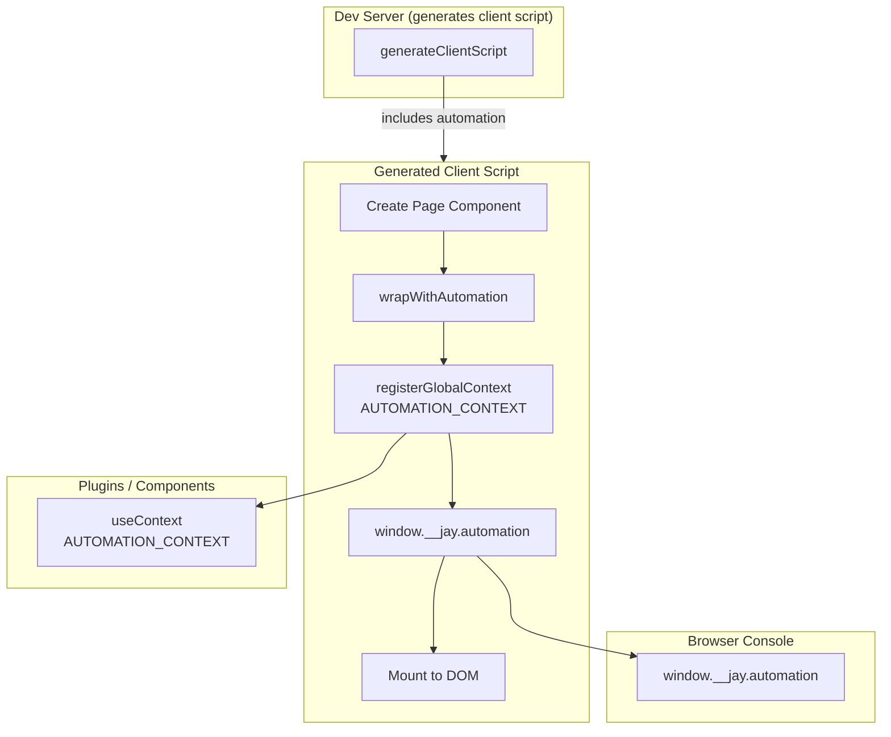

# Automation Dev Server Integration

## Background

Design Log #76 introduced `@jay-framework/runtime-automation` for programmatic UI interaction. The package provides:

- `wrapWithAutomation(component)` - wraps a component with automation API
- `getPageState()` - get current ViewState and interactions
- `triggerEvent(eventType, coordinate)` - trigger events on elements
- `onStateChange(callback)` - subscribe to state changes

Currently, automation must be manually integrated by importing and wrapping components.

## Problem

1. **No automatic dev server integration** - Developers must manually add automation to use it in dev mode
2. **No standard way for plugins to access automation** - Plugins like testing tools, accessibility checkers, or AI assistants cannot easily access the automation API

## Questions and Answers

### Q1: Should automation always load in dev server?

**Answer:** Yes, in dev mode. Automation adds minimal overhead and is useful for:

- Browser console debugging
- Plugin integrations (testing, accessibility, AI)
- Developer tooling

In production builds, it should be optional/tree-shakeable.

### Q2: How should plugins access the automation API?

**Answer:** Via a global context. This follows the existing pattern:

```typescript
import { useContext } from '@jay-framework/runtime';
import { AUTOMATION_CONTEXT } from '@jay-framework/runtime-automation';

// In plugin or component
const automation = useContext(AUTOMATION_CONTEXT);
automation.getPageState();
```

### Q3: Should the automation be exposed on `window` for console access?

**Answer:** Yes, for dev mode convenience:

```javascript
// Browser console
window.__jay.automation.getPageState();
window.__jay.automation.triggerEvent('click', ['addBtn']);
```

## Design

### 1. Export Context from runtime-automation

```typescript
// lib/automation-context.ts
import { createJayContext } from '@jay-framework/runtime';
import type { AutomationAPI } from './types';

export const AUTOMATION_CONTEXT = createJayContext<AutomationAPI>();
```

### 2. Dev Server Integration

The dev server already generates client scripts via `generateClientScript`. We add automation initialization:

```typescript
// In generated client script
import { wrapWithAutomation, AUTOMATION_CONTEXT } from '@jay-framework/runtime-automation';
import { registerGlobalContext } from '@jay-framework/runtime';

// After component creation
const instance = pageComp({ ...viewState, ...fastCarryForward });
const wrapped = wrapWithAutomation(instance);

// Register as global context for plugins
registerGlobalContext(AUTOMATION_CONTEXT, wrapped.automation);

// Expose on window for console access
window.__jay = window.__jay || {};
window.__jay.automation = wrapped.automation;

target.appendChild(wrapped.element.dom);
```

### 3. Option to Disable

Add option in dev server config:

```typescript
interface DevServerOptions {
  // ... existing
  /** Disable automation integration (default: false in dev) */
  disableAutomation?: boolean;
}
```

### 4. Stack Client Runtime Export

Export a helper from `@jay-framework/stack-client-runtime` for consistency:

```typescript
// In stack-client-runtime
export {
  wrapWithAutomation,
  AUTOMATION_CONTEXT,
  type AutomationAPI,
} from '@jay-framework/runtime-automation';
```

## Data Flow



## Implementation Plan

### Phase 1: Add Context Export

1. Create `AUTOMATION_CONTEXT` in `runtime-automation/lib/automation-context.ts`
2. Export from `runtime-automation/lib/index.ts`
3. Add test for context usage

### Phase 2: Update generateClientScript

1. Add `enableAutomation` parameter to `generateClientScript`
2. Generate automation wrapper code when enabled
3. Register global context
4. Expose on `window.__jay`

### Phase 3: Update Dev Server

1. Add `disableAutomation` option to `DevServerOptions`
2. Pass `enableAutomation: true` by default in dev mode
3. Update tests

### Phase 4: Re-export from stack-client-runtime

1. Re-export automation types and context from `stack-client-runtime`
2. Update docs

## Examples

### Plugin Using Automation Context

```typescript
// accessibility-plugin/lib/init.ts
import { makeJayInit } from '@jay-framework/fullstack-component';
import { AUTOMATION_CONTEXT } from '@jay-framework/stack-client-runtime';

export const init = makeJayInit().withClient(() => {
  // Wait for automation to be ready
  setTimeout(() => {
    const automation = useContext(AUTOMATION_CONTEXT);
    if (automation) {
      runAccessibilityCheck(automation);
    }
  }, 0);
});

function runAccessibilityCheck(automation: AutomationAPI) {
  const state = automation.getPageState();
  for (const interaction of state.interactions) {
    // Check each interactive element
    if (!interaction.element.getAttribute('aria-label')) {
      console.warn(`Missing aria-label: ${interaction.refName}`);
    }
  }
}
```

### Browser Console Usage

```javascript
// View current state
window.__jay.automation.getPageState();

// List all interactions
window.__jay.automation.getPageState().interactions.map((i) => i.refName);

// Trigger a click
window.__jay.automation.triggerEvent('click', ['addToCartBtn']);

// Watch state changes
window.__jay.automation.onStateChange((s) => console.log('State:', s.viewState));
```

### Component Using Automation

```typescript
// dev-tools-panel.ts
function DevToolsPanel(props, refs, automation: AutomationAPI) {
  const [interactions, setInteractions] = createSignal<Interaction[]>([]);

  automation.onStateChange((state) => {
    setInteractions(state.interactions);
  });

  return {
    render: () => ({
      interactions: interactions(),
    }),
  };
}

export const DevTools = makeJayComponent(render, DevToolsPanel, AUTOMATION_CONTEXT);
```

## Trade-offs

### Always Loading vs Opt-in

**Always loading in dev (chosen):**

- ✅ Zero config for common case
- ✅ Plugins can assume it's available in dev
- ✅ Console debugging always works
- ❌ Slightly larger dev bundle

**Opt-in:**

- ✅ Smaller bundle if not used
- ❌ More config needed
- ❌ Plugins can't rely on it

### Global Window vs Only Context

**Both (chosen):**

- ✅ Console access for debugging
- ✅ Type-safe access via context for plugins
- ❌ Two access patterns

**Only context:**

- ✅ Cleaner, type-safe only
- ❌ Harder to use from console

## Files to Modify

- `jay/packages/runtime/runtime-automation/lib/automation-context.ts` (new)
- `jay/packages/runtime/runtime-automation/lib/index.ts`
- `jay/packages/jay-stack/stack-server-runtime/lib/generate-client-script.ts`
- `jay/packages/jay-stack/dev-server/lib/dev-server.ts`
- `jay/packages/jay-stack/stack-client-runtime/lib/index.ts`
