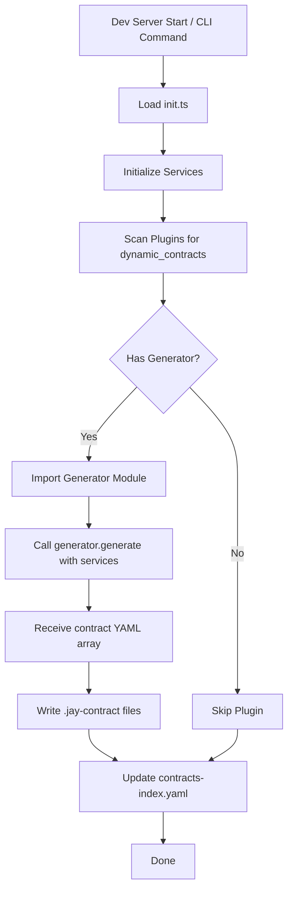

# Materializing Dynamic Contracts for Agentic Page Generation

**Date:** February 1, 2026  
**Status:** Draft  
**Related:** Design Logs #60, #76, #77

**Terminology:** This design uses "materialization" to describe the process of writing dynamic contracts to disk. This follows the database convention where a "materialized view" makes computed/virtual data concrete.

## Background

Jay Stack supports agentic generation of web pages using headless components connected to contracts. When an AI agent has access to contract files, it can:

1. Understand the available data structure (tags, types, phases)
2. Use proper data bindings in jay-html templates (`{products.name}`, `{cart.items}`)
3. Connect multiple headless components on a single page
4. Generate type-safe, working pages

**Current State:**

- **Static contracts**: Exist as `.jay-contract` files in plugins - agents read these directly
- **Dynamic contracts**: Generated at build/dev time via generator functions - **not available as files**

This works well for static contracts because agents can read `.jay-contract` files like any other source file. However, dynamic contracts (e.g., CMS-driven schemas) are generated in-memory and never written to disk.

## Problem Statement

When using headless components with dynamic contracts, the AI agent cannot "see" what contracts are available or their structure. This prevents the agent from:

1. Knowing which dynamic contracts exist
2. Understanding the tag structure for data bindings
3. Generating pages that use dynamic contract data

**Example scenario:**

A CMS plugin generates contracts based on collections (BlogPosts, Products, Authors). The developer wants the agent to generate a blog listing page. The agent needs to know:

- Contract name: `cms/blog-posts-list`
- Available tags: `items` (repeated), `totalCount`
- Item tags: `title` (string), `content` (string), `publishedAt` (string)

Without access to this information, the agent cannot generate correct jay-html.

## Questions and Answers

### Q1: Where should materialized contract files be stored?

**Options:**

A) In the build folder: `build/materialized-contracts/`
B) In the src folder: `src/.materialized-contracts/`

**Considerations:**

| Location                       | Pros                                                                        | Cons                                             |
| ------------------------------ | --------------------------------------------------------------------------- | ------------------------------------------------ |
| `build/`                       | Already gitignored, consistent with `slow-render-cache/` and `jay-runtime/` | Must run materialization before agent can access |
| `src/.materialized-contracts/` | Can optionally commit for read-only agent environments                      | Adds generated files to src/                     |

**Answer:** Option A - `build/materialized-contracts/`

**Rationale:**

- Consistent with existing build artifacts (`build/slow-render-cache/`, `build/jay-runtime/`)
- Already gitignored by default
- Agents running in dev environment can run `jay-stack contracts` to materialize
- Keeps `src/` clean for actual source files
- All contracts (from all plugins) in one place for agent discovery

### Q2: Should we include static contracts in the materialized output?

**Options:**

A) Only dynamic contracts (static ones are already files)
B) All contracts (unified view)
C) Index file pointing to static, materialized dynamic

**Answer:** Option C - index file with references to static, materialized files for dynamic

**Rationale:**

- Agents get a single discovery point
- No duplication of static contract files
- Index provides metadata (plugin, type, path)

### Q3: When should contracts be generated?

**Options:**

A) Dev server startup only
B) CLI command only
C) Both dev server startup and CLI command
D) On-demand (lazy, when first requested)

**Answer:** Option C - both dev server startup and CLI command

**Rationale:**

- Dev server: automatic, always up-to-date during development
- CLI: useful for CI/CD, agent setup scripts, build pipelines
- Flexibility for different workflows

### Q4: What format should the generated files use?

**Options:**

A) YAML (`.jay-contract` format)
B) JSON
C) TypeScript (`.d.ts` or `.ts`)

**Answer:** Option A - YAML (`.jay-contract` format)

**Rationale:**

- Consistent with existing static contracts
- Agents already know how to read `.jay-contract` files
- Human-readable for debugging
- Can be used directly by the compiler if needed

### Q5: How do we handle contract staleness?

**Problem:** Dynamic contracts depend on external systems (CMS, databases). They can become stale.

**Answer:**

- Dev server: re-materialize on startup (no watching)
- CLI: always re-materialize when invoked
- Add timestamp to index file for visibility
- Restart dev server or re-run CLI when external system changes

### Q6: Should agents be able to trigger contract regeneration?

**Answer:** Yes, via CLI command. Agents can run `jay-stack contracts --generate` when they need fresh data.

## Design

### Materialized File Structure

```
build/materialized-contracts/
├── contracts-index.yaml          # Master index of all contracts
├── my-cms/                       # One folder per plugin with dynamic contracts
│   ├── cms-blog-posts-list.jay-contract
│   ├── cms-products-list.jay-contract
│   └── cms-authors-list.jay-contract
└── another-plugin/
    └── dynamic-feature.jay-contract
```

### Index File Format

```yaml
# build/materialized-contracts/contracts-index.yaml
materialized_at: '2026-02-01T10:00:00.000Z'
jay_stack_version: '1.0.0'

contracts:
  # Static contracts - reference existing files
  # plugin: the npm package name or local plugin name
  - plugin: '@wix/stores'
    name: product-list
    type: static
    path: ./node_modules/@wix/stores/contracts/product-list.jay-contract

  - plugin: '@wix/stores'
    name: shopping-cart
    type: static
    path: ./node_modules/@wix/stores/contracts/cart.jay-contract

  # Dynamic contracts - materialized files
  - plugin: my-cms
    name: cms/blog-posts-list
    type: dynamic
    path: ./build/materialized-contracts/my-cms/cms-blog-posts-list.jay-contract

  - plugin: my-cms
    name: cms/products-list
    type: dynamic
    path: ./build/materialized-contracts/my-cms/cms-products-list.jay-contract
```

### CLI Command

```bash
# Materialize all contracts and write to disk
jay-stack contracts

# Output options
jay-stack contracts --output ./custom-path/   # Custom output directory
jay-stack contracts --yaml                     # Output index to stdout as YAML
jay-stack contracts --list                     # Just list contracts, don't write files

# Filtering
jay-stack contracts --plugin my-cms           # Only contracts from specific plugin
jay-stack contracts --dynamic-only            # Only dynamic contracts

# Force re-materialization (useful when external system changed)
jay-stack contracts --force
```

### Dev Server Integration

```typescript
// In dev-server startup sequence
async function startDevServer(options: DevServerOptions) {
  // 1. Load init.ts and services
  const services = await loadServices(options.projectRoot);

  // 2. Materialize dynamic contracts (NEW)
  await materializeContracts({ projectRoot: options.projectRoot }, services);

  // 3. Start file watcher
  // 4. Start HTTP server
  // ...
}
```

### Contract Materialization Flow



### Implementation: Contract Materializer

```typescript
// packages/jay-stack/stack-cli/lib/contract-materializer.ts

import type { PluginManifest, GeneratedContractYaml } from '@jay-framework/fullstack-component';
import { loadPluginManifest, resolveFromPlugin } from '@jay-framework/compiler-shared';
import * as fs from 'fs';
import * as path from 'path';
import YAML from 'yaml';

export interface ContractIndexEntry {
  plugin: string;
  name: string;
  type: 'static' | 'dynamic';
  path: string;
}

export interface ContractsIndex {
  materialized_at: string;
  jay_stack_version: string;
  contracts: ContractIndexEntry[];
}

export interface MaterializeContractsOptions {
  projectRoot: string;
  outputDir?: string; // defaults to build/materialized-contracts
  force?: boolean;
  dynamicOnly?: boolean;
  pluginFilter?: string;
}

export async function materializeContracts(
  options: MaterializeContractsOptions,
  services: Record<string, unknown>,
): Promise<ContractsIndex> {
  const {
    projectRoot,
    outputDir = path.join(projectRoot, 'build', 'materialized-contracts'),
    dynamicOnly = false,
    pluginFilter,
  } = options;

  const contracts: ContractIndexEntry[] = [];

  // 1. Scan for plugins
  const plugins = await scanPlugins(projectRoot);

  for (const [pluginName, manifest] of Object.entries(plugins)) {
    if (pluginFilter && pluginName !== pluginFilter) continue;

    // 2. Add static contracts to index
    if (!dynamicOnly && manifest.contracts) {
      for (const contract of manifest.contracts) {
        const contractPath = resolveContractPath(manifest, contract.contract, projectRoot);
        contracts.push({
          plugin: pluginName,
          name: contract.name,
          type: 'static',
          path: contractPath,
        });
      }
    }

    // 3. Materialize dynamic contracts
    if (manifest.dynamic_contracts) {
      const dynamicContracts = await executeDynamicGenerator(
        manifest,
        pluginName,
        projectRoot,
        services,
      );

      const pluginOutputDir = path.join(outputDir, pluginName);
      fs.mkdirSync(pluginOutputDir, { recursive: true });

      for (const generated of dynamicContracts) {
        const prefix = manifest.dynamic_contracts.prefix;
        const fullName = `${prefix}/${toKebabCase(generated.name)}`;
        const fileName = `${prefix}-${toKebabCase(generated.name)}.jay-contract`;
        const filePath = path.join(pluginOutputDir, fileName);

        // Write the contract file
        fs.writeFileSync(filePath, generated.yaml, 'utf-8');

        contracts.push({
          plugin: pluginName,
          name: fullName,
          type: 'dynamic',
          path: path.relative(projectRoot, filePath),
        });
      }
    }
  }

  // 4. Write index file (YAML format)
  const index: ContractsIndex = {
    materialized_at: new Date().toISOString(),
    jay_stack_version: getJayStackVersion(),
    contracts,
  };

  fs.mkdirSync(outputDir, { recursive: true });
  fs.writeFileSync(path.join(outputDir, 'contracts-index.yaml'), YAML.stringify(index), 'utf-8');

  return index;
}

async function executeDynamicGenerator(
  manifest: PluginManifest,
  pluginName: string,
  projectRoot: string,
  services: Record<string, unknown>,
): Promise<GeneratedContractYaml[]> {
  const generatorPath = resolveFromPlugin(
    manifest,
    manifest.dynamic_contracts!.generator,
    projectRoot,
  );

  // Import the generator module
  const generatorModule = await import(generatorPath);
  const generator = generatorModule.generator || generatorModule.default;

  if (!generator || typeof generator.generate !== 'function') {
    throw new Error(
      `Generator at ${generatorPath} must export a 'generator' with a 'generate' function`,
    );
  }

  // Resolve required services
  const resolvedServices = generator.services.map((marker: symbol) => {
    const service = services[marker.description ?? ''];
    if (!service) {
      throw new Error(
        `Service "${marker.description}" required by ${pluginName} generator not found. ` +
          `Ensure it's registered in init.ts`,
      );
    }
    return service;
  });

  // Execute generator
  const result = await generator.generate(...resolvedServices);
  return result;
}

function toKebabCase(str: string): string {
  return str
    .replace(/([A-Z])/g, '-$1')
    .toLowerCase()
    .replace(/^-/, '');
}
```

### CLI Implementation

```typescript
// packages/jay-stack/stack-cli/lib/commands/contracts.ts

import { Command } from 'commander';
import { materializeContracts } from '../contract-materializer';
import { loadServicesFromInit } from '../service-loader';
import YAML from 'yaml';

export function registerContractsCommand(program: Command): void {
  program
    .command('contracts')
    .description('Materialize and list available contracts from all plugins')
    .option('-o, --output <dir>', 'Output directory for materialized contracts')
    .option('--yaml', 'Output contract index as YAML to stdout')
    .option('--list', 'List contracts without writing files')
    .option('--plugin <name>', 'Filter to specific plugin')
    .option('--dynamic-only', 'Only process dynamic contracts')
    .option('--force', 'Force re-materialization')
    .action(async (options) => {
      const projectRoot = process.cwd();

      try {
        // Load services from init.ts
        const services = await loadServicesFromInit(projectRoot);

        if (options.list) {
          // Just list, don't write files
          const index = await listContracts(projectRoot, services, options);
          if (options.yaml) {
            console.log(YAML.stringify(index));
          } else {
            printContractList(index);
          }
          return;
        }

        // Materialize contracts
        const index = await materializeContracts(
          {
            projectRoot,
            outputDir: options.output,
            force: options.force,
            dynamicOnly: options.dynamicOnly,
            pluginFilter: options.plugin,
          },
          services,
        );

        if (options.yaml) {
          console.log(YAML.stringify(index));
        } else {
          console.log(`✅ Materialized ${index.contracts.length} contracts`);
          console.log(`   Static: ${index.contracts.filter((c) => c.type === 'static').length}`);
          console.log(`   Dynamic: ${index.contracts.filter((c) => c.type === 'dynamic').length}`);
          console.log(`   Output: ${options.output || 'build/materialized-contracts/'}`);
        }
      } catch (error) {
        console.error('❌ Failed to materialize contracts:', error.message);
        process.exit(1);
      }
    });
}

function printContractList(index: ContractsIndex): void {
  console.log('\nAvailable Contracts:\n');

  const byPlugin = groupBy(index.contracts, (c) => c.plugin);

  for (const [plugin, contracts] of Object.entries(byPlugin)) {
    console.log(`📦 ${plugin}`);
    for (const contract of contracts) {
      const typeIcon = contract.type === 'static' ? '📄' : '⚡';
      console.log(`   ${typeIcon} ${contract.name}`);
    }
    console.log();
  }
}
```

### Dev Server Integration

```typescript
// packages/jay-stack/dev-server/lib/dev-server.ts

import { materializeContracts } from '@jay-framework/stack-cli/contract-materializer';

export async function startDevServer(options: DevServerOptions): Promise<void> {
  const { projectRoot } = options;

  // Load services
  const services = await loadServicesFromInit(projectRoot);

  // Materialize dynamic contracts on startup
  console.log('📋 Materializing contracts...');
  try {
    const index = await materializeContracts({ projectRoot }, services);
    const dynamicCount = index.contracts.filter((c) => c.type === 'dynamic').length;
    if (dynamicCount > 0) {
      console.log(`   ⚡ ${dynamicCount} dynamic contracts materialized`);
    }
  } catch (error) {
    console.warn('⚠️  Failed to materialize dynamic contracts:', error.message);
    // Continue - static contracts still work
  }

  // Continue with normal dev server startup...
}
```

### .gitignore Entry

The `build/` directory is already gitignored by default, so no additional configuration is needed. Materialized contracts are stored in `build/materialized-contracts/`.

## Examples

### Example 1: Agent Workflow for Page Generation

```bash
# 1. Start dev server (materializes contracts automatically)
$ jay-stack dev
📋 Materializing contracts...
   ⚡ 3 dynamic contracts materialized
🚀 Dev server running at http://localhost:3000

# 2. Agent reads the contract index
# File: build/materialized-contracts/contracts-index.yaml

# 3. Agent reads specific contract
# File: build/materialized-contracts/my-cms/cms-blog-posts-list.jay-contract

# 4. Agent generates page using contract knowledge
# Creates: src/pages/blog/page.jay-html
```

### Example 2: CI/CD Pipeline

```yaml
# .github/workflows/generate-pages.yml
jobs:
  generate:
    steps:
      - uses: actions/checkout@v4
      - run: npm install

      # Set up CMS credentials
      - run: echo "CMS_API_KEY=${{ secrets.CMS_API_KEY }}" >> .env

      # Generate contracts for agent
      - run: npx jay-stack contracts

      # Run agent to generate pages
      - run: ./scripts/run-page-agent.sh

      # Build and deploy
      - run: npx jay-stack build
```

### Example 3: Materialized Contract File

```yaml
# build/materialized-contracts/my-cms/cms-blog-posts-list.jay-contract
name: BlogPostsList
tags:
  - tag: items
    type: sub-contract
    repeated: true
    tags:
      - tag: _id
        type: data
        dataType: string
        phase: slow
      - tag: title
        type: data
        dataType: string
        phase: slow
      - tag: content
        type: data
        dataType: string
        phase: fast
      - tag: publishedAt
        type: data
        dataType: string
        phase: slow
      - tag: author
        type: sub-contract
        tags:
          - tag: name
            type: data
            dataType: string
          - tag: avatar
            type: data
            dataType: string
  - tag: totalCount
    type: data
    dataType: number
    phase: fast
```

### Example 4: Agent Using Contract for Page Generation

```html
<!-- Generated by agent using contract knowledge -->
<!-- src/pages/blog/page.jay-html -->
<html>
  <head>
    <script
      type="application/jay-headless"
      plugin="my-cms"
      contract="cms/blog-posts-list"
      key="blog"
    ></script>
  </head>
  <body>
    <main class="blog-listing">
      <h1>Our Blog</h1>
      <p>Showing {blog.totalCount} posts</p>

      <div class="posts" forEach="blog.items" trackBy="_id">
        <article class="post-card">
          <h2>{title}</h2>
          <div class="meta">
            
            <span>{author.name}</span>
            <time>{publishedAt}</time>
          </div>
          <p>{content}</p>
        </article>
      </div>
    </main>
  </body>
</html>
```

## Implementation Plan

### Phase 1: Core Materialization Logic

**Package:** `@jay-framework/stack-cli`

1. Create `lib/contract-materializer.ts` with:

   - `materializeContracts()` function
   - `executeDynamicGenerator()` helper
   - Index file writing (YAML format)

2. Create `lib/service-loader.ts` with:
   - `loadServicesFromInit()` function (reuse existing init loading logic)

**Tests:**

- Generator execution with mock services
- Contract file writing
- Index file format (YAML)

### Phase 2: CLI Command

**Package:** `@jay-framework/stack-cli`

1. Add `contracts` command to Commander setup
2. Implement options: `--output`, `--yaml`, `--list`, `--plugin`, `--dynamic-only`, `--force`
3. Add help text and examples

**Tests:**

- CLI argument parsing
- Output formatting
- Error handling

### Phase 3: Dev Server Integration

**Package:** `@jay-framework/dev-server`

1. Call `materializeContracts()` during startup
2. Handle errors gracefully (warn, don't fail)
3. Add console output for materialized contracts

**Tests:**

- Dev server starts with contract materialization
- Graceful handling of generator errors
- Static contracts work even if dynamic fails

### Phase 4: Documentation

1. Update plugin development guide with contract materialization
2. Add agent integration documentation
3. Document build/ folder usage for materialized contracts

## Trade-offs

### Advantages

1. **Simple discovery** - Agents read files, no special APIs needed
2. **Works offline** - No HTTP endpoints required
3. **Consistent location** - Uses existing `build/` directory
4. **Flexible** - CLI for scripts, auto-materialization for dev
5. **Consistent format** - Same YAML format as static contracts

### Disadvantages

1. **File I/O** - Adds disk writes during startup
2. **Staleness** - Files can become out of sync with external systems
3. **Disk space** - Materialized files take space (usually minimal)
4. **Requires init.ts** - Services must be loadable at materialization time

### Alternatives Considered

1. **HTTP API endpoint** - Rejected: requires server running, more complex
2. **MCP server** - Deferred: good future option, more complex now
3. **In-memory only** - Rejected: agents can't access without special tooling
4. **src/ directory** - Considered: would allow committing, but `build/` is cleaner

## Verification Criteria

1. ✅ `jay-stack contracts` materializes all dynamic contracts to disk
2. ✅ `contracts-index.yaml` lists both static and dynamic contracts
3. ✅ Dev server materializes contracts on startup
4. ✅ Materialized `.jay-contract` files are valid and parseable
5. ✅ Agents can read materialized files to understand contract structure
6. ✅ Static contracts are not duplicated (only path references)
7. ✅ Errors in one plugin don't break other plugins
8. ✅ Output goes to `build/materialized-contracts/` (already gitignored)

## Resolved Questions

### Q1: Should we watch for changes and re-materialize?

**Answer:** No watching. Re-materialize on server restart. External system changes are rare enough that restart is acceptable.

### Q2: Should we support incremental materialization?

**Answer:** No. Materialize all contracts. The materialization is fast enough that incremental adds complexity without significant benefit.

### Q3: What happens if generator fails at dev server startup?

**Answer:** Log warning, continue with static contracts. The page using the dynamic contract will fail at compile time with a clear error about missing contract.

---

## Implementation Results

**Date:** February 1, 2026

### What Was Built

1. **Shared Plugin Scanner** (`stack-server-runtime/lib/plugin-scanner.ts`)

   - Unified plugin scanning logic used by both init discovery and contract materialization
   - Eliminates duplicate scanning code
   - Supports local plugins (src/plugins/) and NPM packages

2. **Contract Materializer** (`stack-server-runtime/lib/contract-materializer.ts`)

   - Scans plugins using shared `scanPlugins()`
   - Executes dynamic generators with service injection
   - Writes `.jay-contract` files to `build/materialized-contracts/`
   - Generates `contracts-index.yaml`

3. **Vite Factory for CLI** (`dev-server/lib/vite-factory.ts`)

   - Creates minimal Vite server for CLI tools
   - Enables TypeScript transpilation for init.ts and generators
   - Properly configured with Jay Stack compiler plugins

4. **CLI Command** (`jay-stack contracts`)

   - Full TypeScript support via Vite
   - Service initialization with proper dependency ordering
   - Options: `--list`, `--yaml`, `--verbose`, `--plugin`, `--dynamic-only`

5. **Dev Server Integration**
   - Automatic materialization on startup
   - Uses service registry for dynamic generators

### Architecture Improvements

**Before:** CLI had limited TypeScript support; duplicate plugin scanning in multiple places

**After:**

- CLI uses same Vite infrastructure as dev-server for TypeScript
- Shared `scanPlugins()` function eliminates duplication
- Both `plugin-init-discovery.ts` and `contract-materializer.ts` use the same scanner

### Files Changed

- `stack-server-runtime/lib/plugin-scanner.ts` (NEW)
- `stack-server-runtime/lib/contract-materializer.ts` (NEW)
- `stack-server-runtime/lib/plugin-init-discovery.ts` (refactored to use shared scanner)
- `stack-server-runtime/lib/services.ts` (added `getServiceRegistry()`)
- `dev-server/lib/vite-factory.ts` (NEW)
- `dev-server/lib/dev-server.ts` (integrated materialization)
- `stack-cli/lib/cli.ts` (added `contracts` command)

### Test Results

```
$ jay-stack contracts --verbose
Starting Vite for TypeScript support...
[product-rating] Initializing ratings service...
[mood-tracker-plugin] Initializing server-side services...
[Fake Shop] Initializing services...
Scanning for plugins...
Found 2 plugin(s)

📦 Processing plugin: product-rating
   📄 Static: product-rating

📦 Processing plugin: mood-tracker-plugin
   📄 Static: mood-tracker

✅ Materialized 2 contracts
   Static: 2
   Dynamic: 0
```

### Symbol Identity Fix (February 1, 2026)

**Issue:** Services registered during plugin init were not found when generators accessed them via `getService()`.

**Root Cause:** Vite's `ssrLoadModule()` creates different module instances than Node's native `import()`, even for packages marked as `external`. This caused `createJayService()` to create different Symbols:

- Plugin init runs via Vite → registers with Symbol A
- Generator imports the same service marker → gets Symbol B (different instance)
- `getService(Symbol B)` fails because service was registered with Symbol A

**Solution:** Use native `import()` for NPM packages instead of Vite's `ssrLoadModule()`:

```typescript
// plugin-init-discovery.ts
if (plugin.isLocal && viteServer) {
  // Local plugins may have TypeScript files - use Vite's SSR loader
  pluginModule = await viteServer.ssrLoadModule(modulePath);
} else {
  // NPM plugins: use native import to ensure consistent Symbol identity
  pluginModule = await import(modulePath);
}
```

**Files Changed:**

- `stack-server-runtime/lib/plugin-init-discovery.ts` - Use native import for NPM plugins
- `stack-server-runtime/lib/contract-materializer.ts` - Use native import for export-based generators

### Validation Support for Dynamic Contracts (February 1, 2026)

**Issue:** `jay-stack validate` failed for pages using dynamic contracts with error: "NPM package has no contracts defined in plugin.yaml"

**Root Cause:** The plugin resolver (`compiler-shared`) and contract loader (`compiler-jay-html`) only checked for static `contracts` in plugin.yaml, ignoring `dynamic_contracts`.

**Solution:**

1. Updated `resolvePluginComponent()` to check both static and dynamic contracts by prefix
2. Added `loadPluginContract()` method to `JayImportResolver` that:
   - Tries static contract path first
   - Falls back to materialized location (`build/materialized-contracts/`)
3. Updated `parseHeadlessImports()` to use new loader

**Files Changed:**

- `compiler-shared/lib/plugin-resolution.ts` - Added `findDynamicContract()`, updated both resolvers
- `compiler-jay-html/lib/jay-target/jay-import-resolver.ts` - Added `loadPluginContract()`
- `compiler-jay-html/lib/jay-target/jay-html-parser.ts` - Use `loadPluginContract()` for plugin contracts

### Vite Factory Consolidation (February 1, 2026)

**Issue:** Vite server creation was duplicated between `dev-server.ts` and `vite-factory.ts` with different configs.

**Solution:** Consolidated into single `createViteServer()` function in `vite-factory.ts`:

- Both dev-server and CLI use the same function
- Consistent SSR externalization config
- `createViteForCli()` is now a convenience wrapper

**Files Changed:**

- `dev-server/lib/vite-factory.ts` - Added `createViteServer()`, refactored `createViteForCli()`
- `dev-server/lib/dev-server.ts` - Use `createViteServer()` instead of inline config

---

## Runtime Service Injection for Dynamic Contracts (February 2, 2026)

### Problem

When rendering a page that uses dynamic contract components (e.g., wix-data's `collection-list`), the runtime fails with:

```
Error: Service 'DynamicContract' not found. Did you register it in jay.init.ts?
```

**Root Cause:** Dynamic contract components use `DYNAMIC_CONTRACT_SERVICE` to receive metadata about which contract they're rendering:

```typescript
// In fullstack-component
export interface DynamicContractMetadata {
  contractName: string; // e.g., "list/recipes-list"
  contractYaml: string; // Original YAML contract definition
}

export const DYNAMIC_CONTRACT_SERVICE =
  createJayService<DynamicContractMetadata>('DynamicContract');

// In wix-data component
export const collectionList = makeJayStackComponent()
  .withServices(WIX_DATA_SERVICE_MARKER, DYNAMIC_CONTRACT_SERVICE)
  .withSlowlyRender(async (props, wixData, contractMeta) => {
    // contractMeta.contractName tells us which collection to query
    const collectionId = deriveCollectionId(contractMeta.contractName);
    // ...
  });
```

The problem is:

1. The service registry is global
2. `DYNAMIC_CONTRACT_SERVICE` needs different metadata per headless component
3. Currently, nobody registers this service

### Available Context

The metadata needed is already available in `HeadlessContractInfo`:

```typescript
interface HeadlessContractInfo {
  key: string; // e.g., "productSearch"
  contract: Contract; // Parsed contract object
  contractPath: string; // Path to contract file
}
```

This is populated during `loadPageParts()` from the parsed jay-html:

```html
<script
  type="application/jay-headless"
  plugin="@jay-framework/wix-data"
  contract="list/recipes-list"
  key="recipesList"
></script>
```

### Options

#### Option A: Pass Contract Metadata via Props (Recommended)

Similar to how `PageProps` provides URL/request context, create `DynamicContractProps` that passes contract metadata through the props object.

```typescript
// In fullstack-component types
import type { Contract } from '@jay-framework/compiler-jay-html';

export interface DynamicContractProps {
  /** Contract name (e.g., "list/recipes-list") */
  contractName: string;
  /** Parsed contract object */
  contract: Contract;
}

// Components declare they need dynamic contract props
export const collectionList = makeJayStackComponent<DynamicContractProps>()
  .withServices(WIX_DATA_SERVICE_MARKER)
  .withSlowlyRender(async (props, wixData) => {
    // props.contractName tells us which collection to query
    const collectionId = deriveCollectionId(props.contractName);
    // props.contract has full parsed contract if needed
  });
```

The runtime merges `DynamicContractProps` into the props when rendering:

```typescript
// In slowly-changing-runner.ts
for (const part of parts) {
  const { compDefinition, key } = part;

  // Find matching headless contract by key
  const headlessContract = headlessContracts.find((hc) => hc.key === key);

  // Build props with contract metadata if available
  const partProps = {
    ...pageProps,
    ...pageParams,
    ...(headlessContract && {
      contractName: headlessContract.contract.name,
      contract: headlessContract.contract,
    }),
  };

  const services = resolveServices(compDefinition.services);
  const result = await compDefinition.slowlyRender(partProps, ...services);
}
```

**Pros:**

- No global state mutation
- Follows existing pattern (`PageProps`)
- Type-safe - component declares what props it needs
- No service registry complexity
- Simple data flow
- No disk I/O during render (contract already parsed)

**Cons:**

- Existing components using `DYNAMIC_CONTRACT_SERVICE` need migration
- Props mixing (page props + contract props in same object)

#### Option B: Per-Component Service Registration

Register `DYNAMIC_CONTRACT_SERVICE` just before resolving services for each component.

**Pros:**

- Minimal changes to existing architecture

**Cons:**

- Service registration is mutable global state
- If multiple parts run concurrently, could have race conditions

#### Option C: Scoped Service Registry (per-request)

Create a service scope for each page render that inherits from global but can override.

**Pros:**

- Clean abstraction
- Allows per-request customization

**Cons:**

- More significant refactor
- Need to pass scope through render pipeline

### Questions and Answers

**Q1: Should we deprecate `DYNAMIC_CONTRACT_SERVICE` in favor of props?**

**Answer:** Yes. The service marker is unnecessary with the props-based approach. Components use props directly.

**Q2: Should contract YAML be read from disk or use the parsed contract object?**

**Answer:** Use the parsed `Contract` object. This:

- Is already available (no disk I/O during render)
- Is type-safe
- Guarantees consistency with what the compiler parsed

```typescript
export interface DynamicContractProps {
  contractName: string;
  contract: Contract; // Parsed contract object, not YAML string
}
```

**Q3: How to handle the generic type for `makeJayStackComponent<DynamicContractProps>()`?**

Components that work with dynamic contracts declare this in their type parameter. This is already the pattern.

### Recommendation

**Option A** - Pass contract metadata via props. This:

- Follows the existing `PageProps` pattern
- Avoids global state mutation
- Is simpler than service injection for per-component data
- Makes the data flow explicit

### Migration

Components currently using `DYNAMIC_CONTRACT_SERVICE`:

```typescript
// Before (service-based)
export const collectionList = makeJayStackComponent<SomeContract>()
  .withServices(WIX_DATA_SERVICE_MARKER, DYNAMIC_CONTRACT_SERVICE)
  .withSlowlyRender(async (props, wixData, contractMeta) => {
    const collectionId = deriveCollectionId(contractMeta.contractName);
  });

// After (props-based)
export const collectionList = makeJayStackComponent<SomeContract, DynamicContractProps>()
  .withServices(WIX_DATA_SERVICE_MARKER)
  .withSlowlyRender(async (props, wixData) => {
    const collectionId = deriveCollectionId(props.contractName);
    // props.contract available if full contract object needed
  });
```

### Implementation Plan

1. **Define `DynamicContractProps`** in `fullstack-component/lib/jay-stack-types.ts`
2. **Deprecate `DYNAMIC_CONTRACT_SERVICE`** - add deprecation comment
3. **Update render runners** (`slowly-changing-runner.ts`, `fast-changing-runner.ts`) to:
   - Accept `headlessContracts` parameter
   - Merge contract metadata into props for each part
4. **Update `loadPageParts`** to include contract info in `DevServerPagePart`
5. **Migrate wix-data components** to use props instead of service

### Implementation Results (February 2, 2026)

**What was implemented:**

1. **`DynamicContractProps` interface** added to `fullstack-component`:

   ```typescript
   export interface DynamicContractProps {
     contractName: string;
     contract: unknown; // Contract type from compiler-jay-html
   }
   ```

2. **`DYNAMIC_CONTRACT_SERVICE` deprecated** with migration guidance

3. **`DevServerPagePart` extended** with `contractInfo`:

   ```typescript
   interface DevServerPagePart {
     // ... existing fields
     contractInfo?: {
       contractName: string;
       contract: Contract;
     };
   }
   ```

4. **Render runners updated** to:

   - Register `DYNAMIC_CONTRACT_SERVICE` before resolving services (backward compatibility)
   - Merge `contractName` and `contract` into props (new pattern)

5. **Breaking change**: `DYNAMIC_CONTRACT_SERVICE` is deprecated. Components must use `props.contractName` and `props.contract` instead.

**Files changed:**

- `fullstack-component/lib/jay-stack-types.ts` - Added `DynamicContractProps`, deprecated service
- `stack-server-runtime/lib/load-page-parts.ts` - Added `contractInfo` to `DevServerPagePart`
- `stack-server-runtime/lib/slowly-changing-runner.ts` - Merge contract props, append to loadParams services
- `stack-server-runtime/lib/fast-changing-runner.ts` - Merge contract props

**Wix-data components migrated:**

- `collection-list.ts` - Uses `props.contractName` instead of `DYNAMIC_CONTRACT_SERVICE`
- `collection-item.ts` - Uses `props.contractName` instead of `DYNAMIC_CONTRACT_SERVICE`
- `collection-card.ts` - Uses `props.contractName` instead of `DYNAMIC_CONTRACT_SERVICE`
- `collection-table.ts` - Uses `props.contractName` instead of `DYNAMIC_CONTRACT_SERVICE`

**Test results:** All 66 tests pass in stack-server-runtime. CMS example recipes route renders correctly.

---

### Implementation Update: Metadata Instead of Contract (February 2026)

**Problem:** The initial implementation passed `contract: unknown` to components, which:

1. Required complex type casting (`as unknown as Contract`)
2. Created a dependency on compiler types at runtime
3. Required hacky `deriveCollectionId()` functions to extract collection ID from contract names

**Solution:** Replace `contract` with typed `metadata` from the generator.

#### Changes Made

1. **`GeneratedContractYaml` extended with metadata:**

   ```typescript
   export interface GeneratedContractYaml {
     name: string;
     yaml: string;
     description?: string;
     metadata?: Record<string, unknown>; // NEW
   }
   ```

2. **`DynamicContractProps` made generic:**

   ```typescript
   export interface DynamicContractProps<TMetadata = Record<string, unknown>> {
     contractName: string;
     metadata?: TMetadata; // Changed from contract: unknown
   }
   ```

3. **Deprecated exports removed:**

   - `DYNAMIC_CONTRACT_SERVICE` - deleted
   - `DynamicContractMetadata` - deleted

4. **Metadata propagation through compiler:**

   - `ContractIndexEntry` - added `metadata` field
   - `contracts-index.yaml` - stores metadata per contract
   - `loadPluginContract` - reads metadata from index
   - `JayHeadlessImports` - carries metadata
   - `HeadlessContractInfo` - includes metadata
   - `DevServerPagePart.contractInfo` - passes metadata to runtime

5. **Generators return metadata:**

   ```typescript
   return {
     name: 'RecipesList',
     yaml: buildContract(schema),
     metadata: { collectionId: schema.collectionId }, // NEW
   };
   ```

6. **Components use typed metadata:**

   ```typescript
   interface WixDataMetadata {
     collectionId: string;
   }

   export const collectionList = makeJayStackComponent<any>()
     .withProps<PageProps & DynamicContractProps<WixDataMetadata>>()
     .withSlowlyRender(async (props, wixData) => {
       const { collectionId } = props.metadata!; // Typed correctly!
     });
   ```

#### Files Changed

**Jay Framework:**

- `fullstack-component/lib/jay-stack-types.ts` - Generic `DynamicContractProps`, removed deprecated exports
- `stack-server-runtime/lib/contract-materializer.ts` - Store metadata in index
- `stack-server-runtime/lib/load-page-parts.ts` - Pass metadata instead of contract
- `stack-server-runtime/lib/slowly-changing-runner.ts` - Pass metadata in props
- `stack-server-runtime/lib/fast-changing-runner.ts` - Pass metadata in props
- `compiler-jay-html/lib/jay-target/jay-import-resolver.ts` - Load metadata from index
- `compiler-jay-html/lib/jay-target/jay-html-parser.ts` - Propagate metadata
- `compiler-jay-html/lib/jay-target/jay-html-source-file.ts` - Add metadata to JayHeadlessImports
- `compiler-jay-html/lib/slow-render/slow-render-transform.ts` - Add metadata to HeadlessContractInfo

**Wix-data:**

- All generators (`list`, `item`, `card`, `table`) - Return `metadata: { collectionId }`
- All components - Use `props.metadata.collectionId` with typed interface

### Implementation Fix: Symbol Identity and Metadata Lookup (February 2026)

**Problem:**
After implementing the metadata flow, the cms example still failed with "Service 'Wix Data Service' not found" errors. Two issues discovered:

1. **Symbol identity mismatch**: When Vite SSR loads components, `@jay-framework/fullstack-component` was being bundled separately, causing `createJayService` to create different Symbol instances.

2. **Plugin name mismatch**: The `contracts-index.yaml` stored short plugin names (e.g., `wix-data`) but the lookup used full npm package names (e.g., `@jay-framework/wix-data`).

**Fixes Applied:**

1. **Vite SSR externals** (`dev-server/lib/vite-factory.ts`):

   ```typescript
   ssr: {
     external: [
       '@jay-framework/stack-server-runtime',
       '@jay-framework/fullstack-component', // Added
     ],
   },
   ```

2. **Plugin name matching** (`compiler-jay-html/lib/jay-target/jay-import-resolver.ts`):

   ```typescript
   // Match either full npm name or short name
   const entry = index.contracts?.find(
     (c: { plugin: string; name: string }) =>
       (c.plugin === pluginName || c.plugin === pluginDir) &&
       c.name === contractName,
   );
   ```

**Files Changed:**

- `dev-server/lib/vite-factory.ts` - Add fullstack-component to externals
- `compiler-jay-html/lib/jay-target/jay-import-resolver.ts` - Fix plugin name matching

---

## Related Design Logs

- **#60 - Plugin System Refinement**: Dynamic contract generator API
- **#76 - AI Agent Integration**: Runtime automation API
- **#77 - Automation Dev Server Integration**: Dev tools for agents
