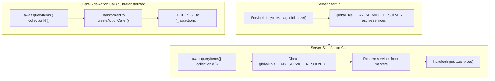

# Automatic Server-Side Action Service Injection

## Background

Jay Stack server actions (design log 63) provide a type-safe RPC mechanism for client-server communication. Actions defined with `makeJayAction`/`makeJayQuery` can declare service dependencies via `.withServices()`.

When an action is called from **client-side code**, the compiler transforms the call to an HTTP request, and the action router on the server resolves services before executing the handler.

However, when an action is called from **server-side code** (e.g., in a render phase), services are NOT automatically injected. The action callable passes an empty array:

```typescript
// jay-action-builder.ts line 186
(input: I): Promise<O> => handler(input, ...([] as unknown as Services)),
```

## Problem

Backend code calling actions directly fails because services aren't injected:

```typescript
// In renderSlowlyChanging - FAILS
const result = await queryItems({ collectionId, limit: 20 });
// ❌ WixDataService is undefined because services = []
```

## Questions and Answers

1. **Q: Why can't fullstack-component import resolveServices from stack-server-runtime?**
   - A: Circular dependency. `stack-server-runtime` depends on `fullstack-component` for types.

2. **Q: Can we detect at runtime if we're on server vs client?**
   - A: Yes, but the service resolver function still needs to be available somehow.

3. **Q: Should we transform server-side action calls at build time?**
   - A: Could work, but adds complexity to the compiler and requires AST analysis of all call sites.

4. **Q: What about using a global resolver?**
   - A: This is the cleanest approach - `fullstack-component` checks for a global resolver, `stack-server-runtime` registers it at startup.

## Design: Global Service Resolver

### Mechanism

1. **Define resolver interface** in `fullstack-component`:
```typescript
// jay-action-builder.ts
type ServiceResolver = (markers: any[]) => any[];

declare global {
    var __JAY_SERVICE_RESOLVER__: ServiceResolver | undefined;
}
```

2. **Register resolver** in `stack-server-runtime` at startup:
```typescript
// services.ts
import { resolveServices } from './services';

globalThis.__JAY_SERVICE_RESOLVER__ = resolveServices;
```

3. **Action callable uses resolver** if available:
```typescript
// jay-action-builder.ts - updated callable
(input: I): Promise<O> => {
    const resolver = globalThis.__JAY_SERVICE_RESOLVER__;
    const services = resolver ? resolver(serviceMarkers) : [];
    return handler(input, ...(services as Services));
}
```

### Flow Diagram



### Benefits

1. **Zero changes needed for action calls** - `await action(input)` just works on server
2. **No circular dependencies** - resolver registered at runtime, not imported
3. **Fail-safe** - if resolver not registered, falls back to empty services (shouldn't happen in normal operation)

### Trade-offs

1. **Global state** - Uses `globalThis`, but this is already common in Node.js server patterns
2. **Runtime check on every call** - Negligible overhead (one property lookup)
3. **Implicit behavior** - Service injection happens automatically, matching client-side behavior

## Implementation Plan

### Phase 1: Core Changes

1. **`fullstack-component/lib/jay-action-builder.ts`**
   - Add `ServiceResolver` type and global declaration
   - Update action callable to use global resolver if available
   - Keep service markers on the action object for resolver access

2. **`stack-server-runtime/lib/services.ts`**
   - Register `resolveServices` on `globalThis.__JAY_SERVICE_RESOLVER__` at module load

### Phase 2: Remove runAction

1. **`stack-server-runtime/lib/action-registry.ts`**
   - Remove `runAction` export

2. **Fix packages using runAction:**
   - `wix/packages/wix-data` - remove runAction imports/calls
   - `wix/packages/wix-stores` - remove runAction imports/calls
   - `wix/packages/wix-stores-v1` - remove runAction imports/calls

### Phase 3: Testing

1. Add test that verifies server-side action calls work without explicit service resolution
2. Verify client-side transforms still work (no change expected)
3. Test that resolver registration happens before any action calls

## Examples

### Before (Current)

```typescript
// collection-list.ts
import { runAction } from '@jay-framework/stack-server-runtime';
import { queryItems } from '../actions/data-actions';

async function renderSlowlyChanging(props, wixData) {
    // Must use runAction for service injection
    const result = await runAction(queryItems, {
        collectionId,
        limit: PAGE_SIZE
    });
}
```

### After (With Enhancement)

```typescript
// collection-list.ts
import { queryItems } from '../actions/data-actions';

async function renderSlowlyChanging(props, wixData) {
    // Just works - services automatically injected on server
    const result = await queryItems({
        collectionId,
        limit: PAGE_SIZE
    });
}
```
