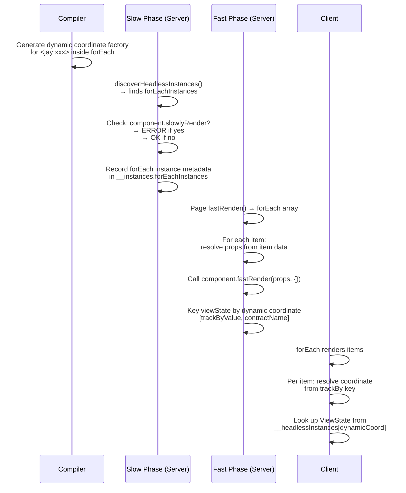

# Headless Instances in Interactive forEach (No Slow Phase)

**Date:** February 11, 2026  
**Status:** Draft  
**Related:** Design Log #84 (headless component props and repeater support), #50 (rendering phases)

## Background

Design Log #84 introduced nested headless component instances (`<jay:xxx>`) with support for `forEach` and `slowForEach` repeaters. During implementation, we added a **compile-time restriction**: headless instances cannot appear inside fast-phase (interactive) `forEach`.

The reason was that headless instances may need server-side `slowlyRender()` calls, but fast-phase forEach items are only known at request time — after the slow phase has already completed. Since the slow phase runs once (and is cached), we can't retroactively call `slowlyRender()` for dynamically-discovered items.

The restriction was implemented as a **compiler error** in `renderHeadlessInstance()` when `insideFastForEach` is true.

## Problem

The restriction is **overly broad**. Not all headless components have a slow phase. A component built with:

```typescript
makeJayStackComponent<MyContract>()
  .withProps<MyProps>()
  .withFastRender(async (props, ...services) => { ... })
  .withInteractive(MyConstructor)
```

...has no `slowlyRender` at all. For such components, the "can't render slow data for dynamic items" concern doesn't apply.

### Current State

```
Compiler: <jay:xxx> inside forEach → always error
```

### Desired State

```
Compiler: <jay:xxx> inside forEach → allowed (defer validation to server)
Server:   <jay:xxx> inside forEach → error ONLY if component has slowlyRender
```

### Key Insight

The slow rendering phase already loads all headless component definitions (via `loadPageParts` → `vite.ssrLoadModule`). At that point, we have access to `compDefinition.slowlyRender` and can check if it's defined. This information is **not available at compile time** (the compiler only sees contracts and jay-html, not runtime component definitions), but **is available at slow render time**.

## Questions and Answers

### Q1: Should the validation move from compile-time to server-time?

**Answer:** Yes. The compiler cannot know whether a component has a slow phase — that's determined by the builder API (`withSlowlyRender`), not by the contract. The server already loads components and checks `compDefinition.slowlyRender` (see `instance-slow-render.ts` line 69). We should:

1. Remove the compile-time `insideFastForEach` error
2. Add a server-time validation when discovering instances inside forEach

### Q2: How do we discover instances inside a preserved forEach at slow-render time?

Currently, `discoverHeadlessInstances` **skips** instances inside preserved `forEach` elements (the `insidePreservedForEach` flag). We need to still discover them, but handle them differently.

**Answer:** Discover them in a separate list. `discoverHeadlessInstances` should return two lists:

1. `instances` — instances with resolved props (existing, outside forEach)
2. `forEachInstances` — instances inside preserved forEach (new, props may have bindings)

For `forEachInstances`, we only need the `contractName` to look up the component definition and validate it has no slow phase. We don't need to call `slowlyRender` for them — they will be rendered entirely in the fast + interactive phases.

### Q3: How does the fast phase render these instances?

Currently, the fast phase for instances (`renderFastChangingDataForInstances`) relies on slow-phase discovery data (`InstancePhaseData.discovered`). For instances inside forEach, there IS no slow-phase data.

**Answer:** These instances need a **different rendering path**. Since forEach items are resolved during fast rendering:

1. The page's `fastRender()` returns the forEach array (e.g., `allProducts.items`)
2. For each item, the props are known (e.g., `productId = item._id`)
3. We can call the nested component's `fastRender(props, {}, ...services)` with empty carryForward (no slow phase → no carryForward)

This happens in the dev server after the page's fast render completes. The flow becomes:

```
Page fastRender() → returns forEach array data
  ↓
For each forEach item:
  → Resolve instance props from item data
  → Call component.fastRender(props, {}, ...services)  (empty carryForward)
  → Collect viewStates keyed by dynamic coordinate
```

### Q4: How do dynamic coordinates work for forEach instances?

Static instances have fixed coordinates (e.g., `product-card:0`). ForEach instances need **per-item coordinates** since the number of items varies at request time.

**Answer:** Use the existing `Coordinate` system from the runtime/secure packages. `Coordinate = string[]` is already defined in `element-types.ts`. The secure package builds coordinates by accumulating `dataIds` — each `sandboxForEach` level pushes `item[matchBy]` onto the array, and the final segment is the ref/component name:

```typescript
// secure/lib/sandbox/sandbox-refs.ts
coordinate: (refName: string) => [...dataIds, refName];

// secure/lib/sandbox/sandbox-element.ts — forEach extends dataIds:
dataIds: [...dataIds, item[matchBy]];
```

Headless instances inside forEach follow the same pattern:

```
Static:  ["product-card"]
ForEach: ["prod-123", "product-card"]
         ["prod-456", "product-card"]
Nested:  ["electronics", "item-42", "product-card"]
```

For `__headlessInstances` ViewState keying, coordinates are joined with `coordinate.toString()` (the existing convention in the secure package, which uses `Map<string, ...>` keyed by `coordinate.toString()`).

### Q5: Does the client-side `makeHeadlessInstanceComponent` need changes?

**Answer:** Yes. Currently it accepts a static `coordinateKey: string`. For forEach instances, it needs a **coordinate factory** that receives the trackBy value and returns the coordinate. The runtime's forEach mechanism already has access to the trackBy key for each item.

Two options:

- A) Overload: `coordinateKey: string | ((trackByKey: string) => string)`
- B) Always use factory, static instances just ignore the argument

**Answer:** Option A — keeps the common (static) case simple while supporting the dynamic case.

### Q6: What about nested forEach with headless instances?

Example:

```html
<div forEach="categories" trackBy="id">
  <div forEach="items" trackBy="_id">
    <jay:product-card productId="{_id}">...</jay:product-card>
  </div>
</div>
```

**Answer:** Supported. Runtime coordinates already handle nested forEach — each level adds the trackBy value as a path segment. The coordinate for the above becomes:

```
["electronics", "item-42", "product-card"]
```

Which is `[category.id, items._id, contractName]`. This matches how the runtime package already builds coordinates for nested repeaters. The server-side rendering iterates nested loops to produce the same coordinate keys.

### Q7: Can a component with a fast phase but no slow phase exist inside forEach?

**Answer:** Yes, that's the primary use case. Example:

```typescript
// No .withSlowlyRender() → no slow phase
makeJayStackComponent<PriceWidgetContract>()
  .withProps<{ productId: string }>()
  .withServices(PRICING_SERVICE)
  .withFastRender(async (props, pricingService) => {
    const price = await pricingService.getPrice(props.productId);
    return {
      viewState: { price, currency: 'USD' },
      carryForward: { productId: props.productId },
    };
  })
  .withInteractive(PriceWidgetConstructor);
```

This component fetches pricing data at request time (fast phase) and has interactive behavior. It can safely appear inside forEach because there's no slow phase data dependency.

### Q8: What about a component with ONLY an interactive phase (no slow, no fast)?

**Answer:** This is technically possible but limited. If a component has neither `slowlyRender` nor `fastRender`, there is no mechanism to generate any ViewState on the server. This means the component **cannot have data tags** in its contract — there's no phase to produce their values. The component can only have `ref` tags and interactive behavior (event handlers, client-side state).

In practice, a purely interactive headless component inside forEach is unlikely to be useful since it can't provide any server-rendered data to its inline template. The primary use case for this design is fast-phase components (Q7).

## Design

### Reference: Secure Package Coordinate System

The `secure` package already implements coordinate-based ViewState routing for element bridges. This is the pattern to follow:

- **Type:** `Coordinate = string[]` (`runtime/lib/element-types.ts`)
- **Building:** `SandboxCreationContext.dataIds` accumulates forEach trackBy values; final coordinate is `[...dataIds, refName]` (`secure/lib/sandbox/sandbox-refs.ts`)
- **forEach extension:** `sandboxForEach` pushes `item[matchBy]` onto `dataIds` for each level (`secure/lib/sandbox/sandbox-element.ts`)
- **Storage:** `Map<string, RefImpl>` keyed by `coordinate.toString()` (`secure/lib/sandbox/sandbox-refs.ts`)
- **Lookup:** `items.get(coordinate.toString())` returns the ViewState for a specific element (`secure/lib/sandbox/sandbox-refs.ts`)
- **Nested:** Each forEach level adds one segment, so nested forEach produces `[outerTrackBy, innerTrackBy, refName]`

The headless instance coordinate system should use the same `Coordinate` type and the same `toString()` keying convention.

### Architecture Change

```
BEFORE:
  Compiler → ERROR if <jay:xxx> inside forEach

AFTER:
  Compiler → allows <jay:xxx> inside forEach (generates dynamic coordinate factory)
  Server (slow phase) → discovers forEach instances, validates no slow phase
  Server (fast phase) → renders forEach instances per item
  Client → resolves dynamic coordinates from trackBy keys
```

### Rendering Flow



### Server-Side Changes

#### 1. `discoverHeadlessInstances` — new `forEachInstances` output

```typescript
export interface ForEachHeadlessInstance {
  contractName: string;
  /** The forEach attribute path (e.g., "allProducts.items") */
  forEachPath: string;
  /** TrackBy key for the forEach */
  trackBy: string;
  /** Prop bindings referencing forEach item fields (e.g., { productId: "{_id}" }) */
  propBindings: Record<string, string>;
  /** Coordinate suffix after trackBy values, e.g., ["product-widget"] */
  coordinateSuffix: string[];
}

export interface HeadlessInstanceDiscoveryResult {
  instances: DiscoveredHeadlessInstance[];
  forEachInstances: ForEachHeadlessInstance[];
  preRenderedJayHtml: string;
}
```

#### 2. Slow phase validation

In `slowRenderInstances` (or a new validation function), after discovering `forEachInstances`:

```typescript
for (const forEachInstance of forEachInstances) {
  const comp = componentByContractName.get(forEachInstance.contractName);
  if (comp?.compDefinition.slowlyRender) {
    validations.push(
      `<jay:${forEachInstance.contractName}> inside forEach requires server-side slow rendering ` +
        `which is not available for dynamically-iterated arrays. ` +
        `Either remove the slow phase from the component or use slowForEach instead.`,
    );
  }
}
```

#### 3. Fast phase rendering for forEach instances

New function: `renderFastChangingDataForForEachInstances`

```typescript
async function renderFastChangingDataForForEachInstances(
  forEachInstances: ForEachHeadlessInstance[],
  headlessInstanceComponents: HeadlessInstanceComponent[],
  fastViewState: object, // page's fast ViewState (contains forEach arrays)
): Promise<Record<string, object> | undefined> {
  const viewStates: Record<string, object> = {};

  for (const instance of forEachInstances) {
    const comp = componentByContractName.get(instance.contractName);
    if (!comp) continue;

    // Resolve the forEach array from the page's fast ViewState
    const items = resolvePathValue(fastViewState, instance.forEachPath) as any[];
    if (!Array.isArray(items)) continue;

    for (const item of items) {
      const trackByValue = item[instance.trackBy];

      // Resolve props from item data
      const props = resolvePropsFromBindings(instance.propBindings, item);

      if (comp.compDefinition.fastRender) {
        const services = resolveServices(comp.compDefinition.services);
        const fastResult = await comp.compDefinition.fastRender(
          props,
          {}, // empty carryForward (no slow phase)
          ...services,
        );

        if (fastResult.kind === 'PhaseOutput') {
          // Coordinate: [trackByValue, ...suffix] → "trackByValue/contract"
          const coord = [trackByValue, ...instance.coordinateSuffix].join('/');
          viewStates[coord] = fastResult.rendered;
        }
      }
    }
  }

  return Object.keys(viewStates).length > 0 ? viewStates : undefined;
}
```

### Compiler Changes

#### 1. Remove `insideFastForEach` compile-time error

In `renderHeadlessInstance`, remove the early return when `insideFastForEach` is true.

#### 2. Generate dynamic coordinate factory

When `insideFastForEach` is true, instead of a static coordinate string:

```typescript
// Static (existing):
makeHeadlessInstanceComponent(render, comp, 'product-widget:0', contexts);

// Dynamic (new, inside forEach — uses trackBy value as coordinate prefix):
makeHeadlessInstanceComponent(
  render,
  comp,
  (trackByKey) => `${trackByKey}/product-widget`,
  contexts,
);

// Nested forEach — each level adds its trackBy value:
makeHeadlessInstanceComponent(
  render,
  comp,
  (trackByKey) => `${trackByKey}/product-card`, // trackByKey already includes outer levels
  contexts,
);
```

### Client-Side Changes

#### 1. `makeHeadlessInstanceComponent` — support coordinate factory

```typescript
export function makeHeadlessInstanceComponent(
  preRender: Function,
  interactiveConstructor: Function,
  coordinateKey: string | ((trackByKey: string) => string),
  pluginContexts?: ContextMarkers<any>,
): JayComponentConstructor {
  // ...
  // When coordinateKey is a function, resolve it from the forEach item's trackBy
  const resolvedKey =
    typeof coordinateKey === 'function'
      ? coordinateKey(currentTrackByKey()) // from forEach runtime context
      : coordinateKey;
  // ...
}
```

#### 2. forEach runtime — expose trackBy key

The runtime's `forEach` mechanism needs to expose the current item's trackBy value so `makeHeadlessInstanceComponent` can access it. This could be via:

- A context value set during forEach iteration
- A parameter passed through `childComp`

## Implementation Plan

### Phase 1: Remove compile-time restriction

1. Remove `insideFastForEach` check in `renderHeadlessInstance`
2. Keep `insideFastForEach` flag on `RenderContext` (still useful for coordinate generation)
3. When `insideFastForEach`, generate dynamic coordinate factory instead of static string
4. Update `makeHeadlessInstanceComponent` type to accept `string | ((key: string) => string)`

### Phase 2: Server-side discovery and validation

1. Update `discoverHeadlessInstances` to return `forEachInstances` alongside `instances`
2. Add validation: `forEachInstances` whose components have `slowlyRender` produce errors
3. Store `forEachInstances` metadata in `InstancePhaseData` for the fast phase

### Phase 3: Server-side fast rendering for forEach instances

1. Implement `renderFastChangingDataForForEachInstances`
2. Wire it into `handleDirectRequest`, `handlePreRenderRequest`, and `handleCachedRequest`
3. Dynamic coordinate keys in `__headlessInstances` ViewState

### Phase 4: Client-side dynamic coordinate resolution

1. Update `makeHeadlessInstanceComponent` to support coordinate factory
2. Expose forEach trackBy key in runtime context
3. Wire up: forEach item → trackBy key → coordinate factory → ViewState lookup

### Phase 5: Fake-shop example

1. Add a new headless component to the fake-shop plugin **without a slow phase** (fast + interactive only, e.g., a `price-badge` or `stock-status` widget)
2. Add a contract for the new component (only fast-phase data tags, props for `productId`)
3. Use `<jay:new-component>` inside an interactive `forEach` on the fake-shop products page
4. Verify end-to-end: server fast-renders per item, client hydrates with correct ViewState per forEach item

### Phase 6: Tests

1. Compiler test: `<jay:xxx>` inside forEach compiles without error, generates dynamic coordinate
2. Slow-render test: forEach instances discovered with prop bindings
3. Slow-render test: validation error when component has `slowlyRender`
4. Slow-render test: no error when component lacks `slowlyRender`
5. Dev server test: end-to-end fast-only component inside forEach
6. Client runtime test: dynamic coordinate resolution

## Examples

### Allowed: fast-only component inside forEach

```html
<div forEach="allProducts.items" trackBy="_id">
  <jay:price-widget productId="{_id}">
    <span class="price">{price} {currency}</span>
  </jay:price-widget>
</div>
```

```typescript
// price-widget: NO slow phase
makeJayStackComponent<PriceWidgetContract>()
  .withProps<{ productId: string }>()
  .withFastRender(async (props, ...services) => ({ ... }))
  .withInteractive(PriceWidgetConstructor);
```

### Allowed: nested forEach with fast-only component

```html
<div forEach="categories" trackBy="id">
  <h2>{name}</h2>
  <div forEach="items" trackBy="_id">
    <jay:price-widget productId="{_id}">
      <span class="price">{price} {currency}</span>
    </jay:price-widget>
  </div>
</div>
```

Coordinate for an item: `["electronics", "item-42", "price-widget"]` → key `"electronics/item-42/price-widget"`

### Disallowed: slow-phase component inside forEach (server error)

```html
<div forEach="productIds" trackBy="id">
  <jay:product-card productId="{id}">
    <h2>{name}</h2>
    <!-- slow-phase data -->
    <span>{price}</span>
    <!-- fast-phase data -->
  </jay:product-card>
</div>
```

```
Server error: <jay:product-card> inside forEach has a slow rendering phase.
Headless components with slow phases cannot be used inside forEach because
forEach items are only known at request time, after slow rendering completes.
Use slowForEach instead, or remove the slow phase from the component.
```

## Trade-offs

### Advantages

1. **Unlocks common pattern** — fast-only widgets (pricing, availability, ratings) inside dynamic lists
2. **No unnecessary limitation** — only restricts when technically impossible (slow phase)
3. **Server-validated** — error message at render time is more helpful than a generic compile-time error
4. **Incremental** — doesn't change existing behavior for static instances or slowForEach

### Disadvantages

1. **Late error detection** — validation moves from compile-time to server-time (user sees error later in the workflow)
2. **Dynamic coordinates** — adds complexity to coordinate system and ViewState delivery
3. **forEach trackBy required** — instances inside forEach must have trackBy (already required for forEach, but now also used for coordinates)
4. **Server-side prop resolution** — need to resolve prop bindings from forEach item data on the server

### Alternatives Considered

1. **Contract-level phase declaration** — mark the contract itself as "no slow phase" so the compiler can validate. Rejected: the contract doesn't control which builder methods the component uses; it only describes the data shape.

2. **Client-side rendering for forEach instances** — skip server fast rendering, let the client call an API. Rejected for now: adds latency (extra round-trip) and doesn't leverage existing infrastructure. Could be a future enhancement.

3. **Keep compile-time error, add explicit opt-in** — e.g., `<jay:xxx noSlow>` attribute. Rejected: leaks implementation details into the template.

## Verification Criteria

1. [x] `<jay:xxx>` inside `forEach` compiles successfully (no compiler error)
2. [x] Compiled output uses dynamic coordinate factory (trackBy-based) for forEach instances
3. [x] Server discovers forEach instances during slow phase
4. [x] Server emits error if forEach instance's component has `slowlyRender`
5. [x] Server renders fast phase for forEach instances (per item, empty carryForward)
6. [x] Client resolves dynamic coordinates from trackBy keys
7. [ ] ViewState correctly delivered to each forEach item's headless instance (needs E2E verification)
8. [ ] Interactive phase works for forEach instances (signals, refs, events) (needs E2E verification)
9. [x] Existing static instances and slowForEach instances unaffected
10. [x] Nested forEach with headless instances produces correct multi-segment coordinates

## Implementation Results

### Files Modified

**Compiler:**

- `packages/compiler/compiler-jay-html/lib/jay-target/jay-html-compiler.ts` — Removed `insideFastForEach` compile-time error in `renderHeadlessInstance`; when inside forEach, generates `(dataIds) => [...dataIds, 'contractName:ref'].toString()` factory instead of static string
- `packages/compiler/compiler-jay-html/lib/slow-render/slow-render-transform.ts` — Updated `discoverHeadlessInstances` to return both `instances` (static) and `forEachInstances` (inside preserved forEach); added `ForEachHeadlessInstance` interface
- `packages/compiler/compiler-jay-html/lib/index.ts` — Exported `ForEachHeadlessInstance` type

**Server:**

- `packages/jay-stack/stack-server-runtime/lib/instance-slow-render.ts` — Added `validateForEachInstances()` function; added `forEachInstances` field to `InstancePhaseData`; re-exported `ForEachHeadlessInstance`
- `packages/jay-stack/dev-server/lib/dev-server.ts` — Integrated forEach instance validation in all three request handlers (direct, pre-render, cached); added `renderFastChangingDataForForEachInstances()` for per-item fast rendering; added helper functions `resolvePathValue()` and `resolveBinding()`

**Client:**

- `packages/runtime/runtime/lib/context.ts` — Added `dataIds` getter on `ConstructContext` to expose coordinate base
- `packages/jay-stack/stack-client-runtime/lib/headless-instance-context.ts` — Updated `makeHeadlessInstanceComponent` to accept `string | ((dataIds: string[]) => string)` for coordinate key; resolves dynamic coordinates using `currentConstructionContext().dataIds`

**Example:**

- `examples/jay-stack/fake-shop/src/plugins/stock-status/` — New fast-only headless component (`stock-status`) with contract, component, plugin.yaml, and `.d.ts`
- `examples/jay-stack/fake-shop/src/pages/page.jay-html` — Added `<jay:stock-status>` inside interactive `forEach="allProducts"` section

**Tests:**

- `packages/compiler/compiler-jay-html/test/jay-target/generate-element.test.ts` — Updated forEach test from expecting validation error to expecting successful compilation
- `packages/compiler/compiler-jay-html/test/fixtures/contracts/page-with-headless-in-foreach/page-with-headless-in-foreach.jay-html.ts` — Updated fixture to use dynamic coordinate factory
- `packages/compiler/compiler-jay-html/test/slow-render/slow-render-transform.test.ts` — Updated forEach discovery test to verify both `instances` and `forEachInstances`; added nested forEach discovery test
- `packages/jay-stack/stack-server-runtime/test/validate-foreach-instances.test.ts` — New test file with 5 tests for `validateForEachInstances`

### Test Results

- compiler-jay-html: 514 passed, 4 skipped (518 total)
- stack-server-runtime: 71 passed (71 total)
- stack-client-runtime: 19 passed (19 total)
- fake-shop: 6 passed (6 total)

### Deviations from Design

1. **Coordinate format**: Design proposed `[trackByValue, contractName]` but implementation uses `[trackByValue, contractName:ref]` — keeping the `:ref` suffix for consistency with static instance coordinates and to disambiguate multiple instances of the same contract inside one forEach
2. **Factory receives `dataIds` not `trackByKey`**: The coordinate factory `(dataIds: string[]) => string` receives the full coordinate base (all accumulated trackBy values from ancestor forEach loops), not just the immediate trackBy value. This naturally supports nested forEach without additional logic
3. **`ConstructContext.dataIds` getter added**: Instead of a separate runtime context for forEach trackBy values, we reused the existing `ConstructContext.coordinateBase` which already accumulates trackBy values via `forItem()`. The new `dataIds` getter exposes this cleanly
