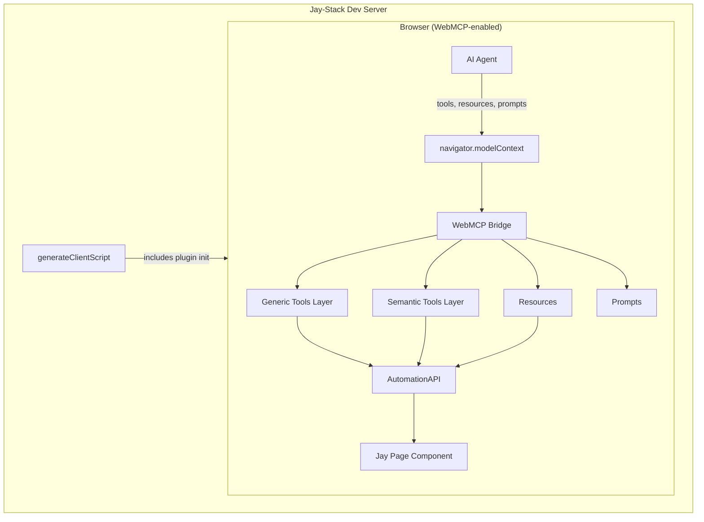

# WebMCP Plugin for Jay-Stack

## Background

### What exists today

1. **`@jay-framework/runtime-automation`** (Design Log #76, #77) — wraps Jay components with `AutomationAPI`:

   - `getPageState()` → `{ viewState, interactions, customEvents }`
   - `triggerEvent(eventType, coordinate)` → trigger UI events
   - `onStateChange(callback)` → subscribe to changes
   - `getInteraction(coordinate)` → find specific interaction

2. **Dev server automation integration** — already wraps every page in dev mode:

   - `wrapWithAutomation(instance)` in generated client script
   - `window.__jay.automation` for console access
   - `AUTOMATION_CONTEXT` for plugin access via `useContext`

3. **`cart-webmcp` example** — manually wires 6 hand-written WebMCP tools:

   - `get-cart-state`, `get-interactions`, `add-item`, `remove-item`, `update-quantity`, `clear-cart`
   - Uses `navigator.modelContext.registerTool()` to register each
   - Each tool calls `automation.getPageState()` or `automation.triggerEvent()`

4. **WebMCP browser API** (`navigator.modelContext`) supports three primitives:
   - **Tools** — callable functions with JSON Schema input, returning content items
   - **Resources** — readable data endpoints with URI schemes (static or template)
   - **Prompts** — reusable message templates for AI conversations

### Server actions (Design Log #63)

Jay-stack exposes server-side RPC via `makeJayAction`/`makeJayQuery`:

- Actions registered in `plugin.yaml` or `src/actions/*.actions.ts`
- Served at `/_jay/actions/:actionName`
- Called from client via `createActionCaller(name, method)`

### Contract system

`.jay-contract` files declare page structure including interactive refs:

```yaml
- tag: addToCart
  type: interactive
  elementType: HTMLButtonElement
  description: 'Add the product to cart'
```

The `Interaction` type at runtime already includes `description` from contracts.

---

## Problem

The `cart-webmcp` example requires **manual, per-page wiring** of WebMCP tools. Every tool is hand-written with specific knowledge of the component's data shape. This doesn't scale.

**What we want:** Any jay-stack page, with zero or minimal configuration, automatically exposes its capabilities to WebMCP-enabled browsers. An AI agent visiting the page can:

1. **Read** the current page state (ViewState)
2. **Discover** all available interactions (buttons, inputs, selects)
3. **Trigger** interactions (click, fill, select)
4. **Call** server actions (if the page uses them)
5. **Subscribe** to state changes (via resource updates)

---

## Questions and Answers

### Q1: Should we generate generic tools or semantic tools from contracts?

**Answer:** Both, in two layers.

**Generic layer** (always available, no contract needed):

- Works with any Jay page out of the box
- Tools like `get-page-state`, `list-interactions`, `trigger-interaction`
- The AI agent reads state, discovers what's available, and acts

**Semantic layer** (auto-generated from runtime `Interaction` data):

- Analyze interactions at runtime → generate named tools
- Button refs → `click-{refName}` tools
- Input refs → `fill-{refName}` tools
- forEach refs → tools that accept item identifiers
- Use `interaction.description` from contracts when available

The generic layer is always the foundation. The semantic layer enriches it with domain-specific tool names and descriptions. Both can coexist.

### Q2: Can we generate semantic tools purely from client-side data?

**Answer:** Yes. The `AutomationAPI.getPageState().interactions` array already contains everything needed:

```typescript
interface Interaction {
  refName: string; // "removeBtn"
  coordinate: Coordinate; // ["item-1", "removeBtn"]
  element: HTMLElement; // actual DOM element
  elementType: string; // "HTMLButtonElement"
  supportedEvents: string[]; // ["click"]
  itemContext?: object; // forEach item data
  description?: string; // from contract
}
```

From this, we can derive:

- Tool name from `refName` (e.g., `click-remove-btn`)
- Whether it's in a forEach (coordinate length > 1 → needs item parameter)
- Input type from `elementType` (button → click, input → fill)
- Description from `description` field (contract-provided)

**No server-side contract metadata transfer needed** for the core use case.

### Q3: What about exposing server actions as tools?

**Answer:** Server actions should be discoverable and callable as WebMCP tools.

**Challenge:** Currently there's no client-side API to list available actions with their schemas.

**Solution:** The dev server (or plugin server init) should provide action metadata via `clientInitData`:

```typescript
// Server init collects action metadata
const actions = actionRegistry.getAll();
// → [{ name: 'cart.addToCart', method: 'POST', inputSchema: {...}, description: '...' }]

setClientInitData('webmcp', { actions: actionMetadata });
```

**New capability needed:** Action metadata (name, method, inputSchema, description) must be discoverable from the action registry. Currently actions just have a name and handler — they'd need optional schema metadata for good WebMCP tool descriptions.

**Alternatively:** Start without action-as-tools. The generic `trigger-interaction` tools already cover UI-driven actions. Server action tools can be added incrementally.

### Q4: How does the plugin get access to AutomationAPI?

**Answer:** No special hook needed. Use the existing `AUTOMATION_CONTEXT` with deferred access.

Current client script execution order:

1. Plugin client inits run (`await jayInit._clientInit(data)`)
2. Page component is created
3. `wrapWithAutomation(instance)` is called
4. `registerGlobalContext(AUTOMATION_CONTEXT, wrapped.automation)`
5. `window.__jay.automation = wrapped.automation`

The WebMCP plugin's client init runs at step 1, but automation isn't ready until step 3-5.

**Solution:** The plugin registers `AUTOMATION_CONTEXT` as a dependency (via plugin ordering or similar). In its client init, it sets up a deferred bridge — subscribing to the context and initializing WebMCP tools once the automation instance is populated:

```typescript
// Plugin client init
export function clientInit() {
    // Automation context isn't populated yet, but we can set up
    // to run when it becomes available (after component mount)
    queueMicrotask(() => {
        const automation = window.__jay?.automation;
        if (automation) {
            setupWebMCP(automation);
        }
    });
}
```

Since plugin client inits are `await`ed and the component creation + automation wrap happens synchronously right after, a microtask runs after the current synchronous block completes — by which time automation is ready.

**No new framework capabilities required.**

### Q5: How should we handle page navigation / SPA transitions?

**Answer:** Defer. Jay-stack currently serves full pages (no SPA routing). When a user navigates, the page reloads and tools are re-registered. If SPA is added later, the plugin would need to:

- Unregister old tools
- Re-analyze new page interactions
- Register new tools

The `onStateChange` callback handles within-page changes (forEach items appearing/disappearing).

### Q6: Should the plugin use `provideContext` or `registerTool`?

**Answer:** Use `registerTool` for each tool individually. This follows WebMCP best practices:

- Tools can be individually unregistered
- Automatic cleanup support
- Works well with component lifecycles
- Better for dynamic tool sets (forEach items changing)

For resources and prompts, use `registerResource` and `registerPrompt`.

### Q7: What WebMCP resources should we expose?

**Answer:**

| Resource URI             | Description                        |
| ------------------------ | ---------------------------------- |
| `state://page-viewstate` | Complete current ViewState as JSON |
| `state://interactions`   | Available interactions (grouped by ref) |

Resources are read-only and always return current state. They complement tools by giving the AI passive context without requiring tool calls.

**Dropped `state://page-summary`** — generating a meaningful human-readable summary without AI or page-specific templates isn't feasible. The ViewState JSON and the `page-guide` prompt cover this need.

**Interactions grouping:** The raw `AutomationAPI` repeats each interaction per-coordinate (one entry per forEach item × per ref). For the resource, we **group by refName** and list the available item IDs, rather than repeating the full entry. This compresses the data significantly — see [Concrete Example](#concrete-example-cart-page) below.

### Q8: What WebMCP prompts should we expose?

**Answer:** One contextual prompt:

- `page-interaction-guide` — Returns a message describing the page, its current state, and how to interact with it. Generated from ViewState + interactions + contract descriptions.

This gives the AI a structured starting point for interacting with the page.

---

## Design

### Architecture



### Mapping: AutomationAPI → WebMCP

#### Generic Tools (always registered)

| Tool Name             | Description                                         | Input Schema                           | Maps to                                           |
| --------------------- | --------------------------------------------------- | -------------------------------------- | ------------------------------------------------- |
| `get-page-state`      | Get current page state including all data displayed | `{}`                                   | `automation.getPageState().viewState`             |
| `list-interactions`   | List all available UI interactions                  | `{}`                                   | `automation.getPageState().interactions`          |
| `trigger-interaction` | Trigger an event on a UI element                    | `{coordinate: string, event?: string}` | `automation.triggerEvent(event, coord)`           |
| `fill-input`          | Set a value on an input and trigger update          | `{coordinate: string, value: string}`  | `element.value = v; triggerEvent('input', coord)` |

Note: `coordinate` is a `/`-separated string (e.g., `"item-1/removeBtn"`) — friendlier for LLMs than arrays.

#### Semantic Tools (auto-generated from interactions)

For each **unique `refName`** in the interactions list:

| Interaction Pattern     | Generated Tool     | Input                                       |
| ----------------------- | ------------------ | ------------------------------------------- |
| Button (not in forEach) | `click-{refName}`  | `{}`                                        |
| Button in forEach       | `click-{refName}`  | `{itemId: string}` with enum of current IDs |
| Input (not in forEach)  | `fill-{refName}`   | `{value: string}`                           |
| Input in forEach        | `fill-{refName}`   | `{itemId: string, value: string}`           |
| Select (not in forEach) | `select-{refName}` | `{value: string}` with enum of options      |

**Tool naming:** Convert camelCase refNames to kebab-case for tool names: `removeBtn` → `click-remove-btn`.

**Dynamic updates:** When `onStateChange` fires and interactions change (e.g., forEach items added/removed), unregister old semantic tools and register updated ones.

#### Resources

```typescript
registerResource({
  uri: 'state://viewstate',
  name: 'Page ViewState',
  description: 'Current page state as JSON — all data displayed on the page',
  mimeType: 'application/json',
  async read() {
    const { viewState } = automation.getPageState();
    return {
      contents: [{ uri: 'state://viewstate', text: JSON.stringify(viewState, null, 2), mimeType: 'application/json' }],
    };
  },
});

// groupInteractions imported from @jay-framework/runtime-automation
registerResource({
  uri: 'state://interactions',
  name: 'Available Interactions',
  description: 'Interactive elements on the page, grouped by ref name',
  mimeType: 'application/json',
  async read() {
    const { interactions } = automation.getPageState();
    const grouped = groupInteractions(interactions);
    return {
      contents: [{ uri: 'state://interactions', text: JSON.stringify(grouped, null, 2), mimeType: 'application/json' }],
    };
  },
});
```

See [Concrete Example](#concrete-example-cart-page) for the grouped interactions data shape.

#### Prompt

```typescript
registerPrompt({
  name: 'page-guide',
  description: 'Guide for interacting with the current page',
  async get() {
    const { viewState, interactions } = automation.getPageState();
    const interactionSummary = interactions
      .map(
        (i) =>
          `- ${i.description || i.refName} (${i.elementType.replace('HTML', '').replace('Element', '')}): coordinate "${i.coordinate.join('/')}"`,
      )
      .join('\n');

    return {
      messages: [
        {
          role: 'user',
          content: {
            type: 'text',
            text: `This page has the following state:\n${JSON.stringify(viewState, null, 2)}\n\nAvailable interactions:\n${interactionSummary}\n\nUse the provided tools to read state and interact with the page.`,
          },
        },
      ],
    };
  },
});
```

### Plugin Structure

```
packages/jay-stack/webmcp-plugin/
├── plugin.yaml
├── lib/
│   ├── index.ts              # Plugin module exports
│   ├── init.ts               # Server init (action metadata collection)
│   ├── webmcp-bridge.ts      # Main bridge: AutomationAPI → WebMCP
│   ├── generic-tools.ts      # Generic tool generators
│   ├── semantic-tools.ts     # Semantic tool generators from interactions
│   ├── resources.ts          # Resource registrations
│   ├── prompts.ts            # Prompt registrations
│   ├── webmcp-types.ts       # WebMCP type declarations
│   └── util.ts               # Helpers (coordinate formatting, naming)
├── test/
│   ├── generic-tools.test.ts
│   ├── semantic-tools.test.ts
│   └── bridge.test.ts
├── package.json
└── tsconfig.json
```

```yaml
# plugin.yaml
name: webmcp
module: ./index
init:
  handler: ./init
```

### New Capabilities Needed from Jay-Stack

**Minimal.** One addition to `@jay-framework/runtime-automation`, no changes to jay-stack core:

- **`groupInteractions()` utility** in `runtime-automation` — groups raw interactions by refName, collapsing forEach items. This is not WebMCP-specific; any automation consumer (test tools, accessibility, console debugging) needs the same grouping. See [groupInteractions implementation](#groupinteractions-implementation) below.

Everything else uses existing capabilities:

- `AUTOMATION_CONTEXT` / `window.__jay.automation` — already available in dev mode
- `Interaction.description` — already populated from contracts when available
- Plugin client init with `makeJayInit().withClient()` — existing API
- `queueMicrotask` for deferred access to automation after mount

### WebMCP Bridge Implementation

```typescript
// webmcp-bridge.ts
import type { AutomationAPI, Interaction } from '@jay-framework/runtime-automation';

/**
 * Main entry point. Called from plugin client init via deferred access.
 */
export function setupWebMCP(automation: AutomationAPI): () => void {
    if (!navigator.modelContext) {
        console.warn('[WebMCP] navigator.modelContext not available');
        return () => {};
    }

    const mc = navigator.modelContext;
    const registrations: Array<{ unregister(): void }> = [];

    // Generic tools (always registered, stable set)
    registrations.push(mc.registerTool(makeGetPageStateTool(automation)));
    registrations.push(mc.registerTool(makeListInteractionsTool(automation)));
    registrations.push(mc.registerTool(makeTriggerInteractionTool(automation)));
    registrations.push(mc.registerTool(makeFillInputTool(automation)));

    // Resources
    registrations.push(mc.registerResource(makeViewStateResource(automation)));
    registrations.push(mc.registerResource(makeInteractionsResource(automation)));

    // Prompt
    registrations.push(mc.registerPrompt(makePageGuidePrompt(automation)));

    // Semantic tools (regenerated when interactions change)
    let semanticRegs = registerSemanticTools(mc, automation);
    let lastInteractionKey = interactionKey(automation);

    automation.onStateChange(() => {
        const newKey = interactionKey(automation);
        if (newKey !== lastInteractionKey) {
            // Interactions changed (items added/removed) — regenerate
            semanticRegs.forEach(r => r.unregister());
            semanticRegs = registerSemanticTools(mc, automation);
            lastInteractionKey = newKey;
        }
    });

    console.log(`[WebMCP] Registered ${4 + semanticRegs.length} tools, 2 resources, 1 prompt`);

    return () => {
        registrations.forEach(r => r.unregister());
        semanticRegs.forEach(r => r.unregister());
    };
}

/** Quick fingerprint of interaction structure (not values) to detect changes */
function interactionKey(automation: AutomationAPI): string {
    return automation.getPageState().interactions
        .map(i => i.coordinate.join('/'))
        .sort()
        .join('|');
}
```

#### Plugin init (deferred automation access)

```typescript
// init.ts
import { makeJayInit } from '@jay-framework/full-stack-component';
import { setupWebMCP } from './webmcp-bridge';

export const init = makeJayInit().withClient(() => {
    // Automation isn't ready yet during client init.
    // After all client inits complete, the component mounts and
    // automation wraps synchronously. A microtask fires after that.
    queueMicrotask(() => {
        const automation = (window as any).__jay?.automation;
        if (automation) {
            const cleanup = setupWebMCP(automation);
            window.addEventListener('beforeunload', cleanup);
        }
    });
});
```

### Semantic Tool Generation

```typescript
// semantic-tools.ts
function registerSemanticTools(mc: ModelContextContainer, automation: AutomationAPI) {
  const { interactions } = automation.getPageState();
  const registrations = [];

  // Group interactions by refName
  const byRef = groupBy(interactions, (i) => i.refName);

  for (const [refName, items] of Object.entries(byRef)) {
    const sample = items[0];
    const isForEach = items.length > 1 || sample.coordinate.length > 1;
    const isInput =
      sample.elementType === 'HTMLInputElement' || sample.elementType === 'HTMLTextAreaElement';
    const isSelect = sample.elementType === 'HTMLSelectElement';

    const toolName = isInput || isSelect ? `fill-${toKebab(refName)}` : `click-${toKebab(refName)}`;

    const description =
      sample.description ||
      `${isInput ? 'Fill' : 'Click'} ${toHumanReadable(refName)}${isForEach ? ' for a specific item' : ''}`;

    const properties: Record<string, any> = {};
    const required: string[] = [];

    if (isForEach) {
      const itemIds = items.map((i) => i.coordinate[0]);
      properties.itemId = {
        type: 'string',
        description: `Item identifier. Available: ${itemIds.join(', ')}`,
        enum: itemIds,
      };
      required.push('itemId');
    }

    if (isInput || isSelect) {
      properties.value = {
        type: 'string',
        description: `Value to set`,
      };
      required.push('value');
    }

    registrations.push(
      mc.registerTool({
        name: toolName,
        description,
        inputSchema: { type: 'object', properties, required },
        execute: (params) => {
          const coord = isForEach ? [params.itemId as string, refName] : [refName];

          if (isInput || isSelect) {
            const interaction = automation.getInteraction(coord);
            if (!interaction) return errorResult(`Element not found: ${coord.join('/')}`);
            (interaction.element as HTMLInputElement).value = params.value as string;
            automation.triggerEvent(isSelect ? 'change' : 'input', coord);
          } else {
            automation.triggerEvent('click', coord);
          }

          return jsonResult('Done', automation.getPageState().viewState);
        },
        annotations: {
          readOnlyHint: false,
          idempotentHint: false,
        },
      }),
    );
  }

  return registrations;
}
```

---

## Implementation Plan

### Phase 1: WebMCP plugin package (core)

1. Create `packages/jay-stack/webmcp-plugin/` with package structure
2. Implement `webmcp-types.ts` (from cart-webmcp, extended with resources/prompts)
3. Implement generic tools (`get-page-state`, `list-interactions`, `trigger-interaction`, `fill-input`)
4. Implement `webmcp-bridge.ts` — main `setupWebMCP` function with deferred automation access
5. Unit tests with mock AutomationAPI and mock `navigator.modelContext`

### Phase 2: Resources and prompts

1. Implement `state://viewstate` and `state://interactions` resources (grouped format)
2. Implement `page-guide` prompt
3. Tests

### Phase 3: Semantic tool generation

1. Implement `semantic-tools.ts` — analyze interactions, generate tools
2. Handle dynamic updates (onStateChange → re-register only when interactions change)
3. Tests with various page shapes (single refs, forEach, nested, inputs)

### Phase 4: Example and docs

1. Create `examples/jay-stack/webmcp-shop/` — fake-shop with webmcp plugin enabled
2. Compare with cart-webmcp: same capabilities, zero manual tool code

---

## Examples

### Installing the plugin

```json
// package.json
{
  "dependencies": {
    "@jay-framework/webmcp-plugin": "workspace:*"
  }
}
```

The plugin auto-discovers via package.json. No code changes needed. Every page automatically exposes WebMCP tools.

### Concrete Example: Cart Page

Using the cart from `cart-webmcp` as the example:

```html
<!-- cart.jay-html -->
<div class="cart-items">
    <div class="cart-item" forEach="items" trackBy="id">
        <span>{name}</span>
        <span>${price}</span>
        <button ref="decreaseBtn">-</button>
        <span>{quantity}</span>
        <button ref="increaseBtn">+</button>
        <button ref="removeBtn">Remove</button>
    </div>
</div>
<div class="add-section">
    <input ref="nameInput" type="text" placeholder="Item name" />
    <input ref="priceInput" type="number" placeholder="Price" />
    <button ref="addBtn">Add to Cart</button>
</div>
```

With ViewState:
```json
{
    "items": [
        { "id": "item-1", "name": "Wireless Mouse", "price": 29.99, "quantity": 1 },
        { "id": "item-2", "name": "USB-C Hub", "price": 49.99, "quantity": 2 },
        { "id": "item-3", "name": "Mechanical Keyboard", "price": 89.99, "quantity": 1 }
    ],
    "total": 219.96,
    "itemCount": 3
}
```

#### Raw interactions from AutomationAPI (what exists today)

`automation.getPageState().interactions` returns **15 entries** (5 refs × 3 forEach items, plus 3 non-forEach refs):

```json
[
    { "refName": "decreaseBtn", "coordinate": ["item-1", "decreaseBtn"], "elementType": "HTMLButtonElement", "supportedEvents": ["click"], "itemContext": { "id": "item-1", "name": "Wireless Mouse", "price": 29.99, "quantity": 1 } },
    { "refName": "increaseBtn", "coordinate": ["item-1", "increaseBtn"], "elementType": "HTMLButtonElement", "supportedEvents": ["click"], "itemContext": { "id": "item-1", "name": "Wireless Mouse", "price": 29.99, "quantity": 1 } },
    { "refName": "removeBtn",   "coordinate": ["item-1", "removeBtn"],   "elementType": "HTMLButtonElement", "supportedEvents": ["click"], "itemContext": { "id": "item-1", "name": "Wireless Mouse", "price": 29.99, "quantity": 1 } },
    { "refName": "decreaseBtn", "coordinate": ["item-2", "decreaseBtn"], "elementType": "HTMLButtonElement", "supportedEvents": ["click"], "itemContext": { "id": "item-2", "name": "USB-C Hub", "price": 49.99, "quantity": 2 } },
    { "refName": "increaseBtn", "coordinate": ["item-2", "increaseBtn"], "elementType": "HTMLButtonElement", "supportedEvents": ["click"], "itemContext": { "id": "item-2", "name": "USB-C Hub", "price": 49.99, "quantity": 2 } },
    { "refName": "removeBtn",   "coordinate": ["item-2", "removeBtn"],   "elementType": "HTMLButtonElement", "supportedEvents": ["click"], "itemContext": { "id": "item-2", "name": "USB-C Hub", "price": 49.99, "quantity": 2 } },
    { "refName": "decreaseBtn", "coordinate": ["item-3", "decreaseBtn"], "elementType": "HTMLButtonElement", "supportedEvents": ["click"], "itemContext": { "id": "item-3", "name": "Mechanical Keyboard", "price": 89.99, "quantity": 1 } },
    { "refName": "increaseBtn", "coordinate": ["item-3", "increaseBtn"], "elementType": "HTMLButtonElement", "supportedEvents": ["click"], "itemContext": { "id": "item-3", "name": "Mechanical Keyboard", "price": 89.99, "quantity": 1 } },
    { "refName": "removeBtn",   "coordinate": ["item-3", "removeBtn"],   "elementType": "HTMLButtonElement", "supportedEvents": ["click"], "itemContext": { "id": "item-3", "name": "Mechanical Keyboard", "price": 89.99, "quantity": 1 } },
    { "refName": "nameInput",   "coordinate": ["nameInput"],             "elementType": "HTMLInputElement",  "supportedEvents": ["click", "input", "change"] },
    { "refName": "priceInput",  "coordinate": ["priceInput"],            "elementType": "HTMLInputElement",  "supportedEvents": ["click", "input", "change"] },
    { "refName": "addBtn",      "coordinate": ["addBtn"],                "elementType": "HTMLButtonElement", "supportedEvents": ["click"] }
]
```

That's 12 entries. With 100 items it would be 302 entries — mostly repetitive.

#### Grouped interactions (for the `state://interactions` resource)

The plugin groups by `refName`, collapses forEach items into an `items` array:

```json
[
    {
        "ref": "decreaseBtn",
        "type": "Button",
        "events": ["click"],
        "inForEach": true,
        "items": [
            { "id": "item-1", "label": "Wireless Mouse" },
            { "id": "item-2", "label": "USB-C Hub" },
            { "id": "item-3", "label": "Mechanical Keyboard" }
        ]
    },
    {
        "ref": "increaseBtn",
        "type": "Button",
        "events": ["click"],
        "inForEach": true,
        "items": [
            { "id": "item-1", "label": "Wireless Mouse" },
            { "id": "item-2", "label": "USB-C Hub" },
            { "id": "item-3", "label": "Mechanical Keyboard" }
        ]
    },
    {
        "ref": "removeBtn",
        "type": "Button",
        "events": ["click"],
        "inForEach": true,
        "items": [
            { "id": "item-1", "label": "Wireless Mouse" },
            { "id": "item-2", "label": "USB-C Hub" },
            { "id": "item-3", "label": "Mechanical Keyboard" }
        ]
    },
    {
        "ref": "nameInput",
        "type": "TextInput",
        "events": ["input", "change"]
    },
    {
        "ref": "priceInput",
        "type": "NumberInput",
        "events": ["input", "change"]
    },
    {
        "ref": "addBtn",
        "type": "Button",
        "events": ["click"]
    }
]
```

**6 entries** instead of 12 (or 6 instead of 302 with 100 items). The `items` array is shared across all forEach refs.

The `label` field is derived from `itemContext` — using the first string-valued field (heuristic) or configurable. It gives the AI human-readable context for each item ID.

#### `groupInteractions` implementation

Lives in `@jay-framework/runtime-automation` — not WebMCP-specific. Any automation consumer (test tools, accessibility checkers, console debugging) benefits from the same grouping.

```typescript
// packages/runtime/runtime-automation/lib/group-interactions.ts

export interface GroupedInteraction {
    ref: string;
    type: string;              // "Button", "TextInput", "NumberInput", "Select", etc.
    events: string[];
    description?: string;      // from contract
    inForEach?: true;
    items?: Array<{ id: string; label: string }>;
}

export function groupInteractions(interactions: Interaction[]): GroupedInteraction[] {
    const byRef = new Map<string, Interaction[]>();
    for (const i of interactions) {
        const group = byRef.get(i.refName) || [];
        group.push(i);
        byRef.set(i.refName, group);
    }

    return Array.from(byRef.entries()).map(([refName, items]) => {
        const sample = items[0];
        const isForEach = items.length > 1 || sample.coordinate.length > 1;
        const result: GroupedInteraction = {
            ref: refName,
            type: friendlyType(sample.elementType),
            events: sample.supportedEvents.filter(e => e !== 'click' || sample.elementType === 'HTMLButtonElement'),
            description: sample.description,
        };
        if (isForEach) {
            result.inForEach = true;
            result.items = items.map(i => ({
                id: i.coordinate[0],
                label: guessLabel(i.itemContext),
            }));
        }
        return result;
    });
}

function friendlyType(elementType: string): string {
    switch (elementType) {
        case 'HTMLButtonElement': return 'Button';
        case 'HTMLInputElement': return 'TextInput';    // could inspect type attr
        case 'HTMLTextAreaElement': return 'TextArea';
        case 'HTMLSelectElement': return 'Select';
        default: return elementType.replace('HTML', '').replace('Element', '');
    }
}

function guessLabel(ctx?: object): string {
    if (!ctx) return '';
    // Use 'name', 'title', 'label', or first string field as label
    for (const key of ['name', 'title', 'label']) {
        if (key in ctx && typeof (ctx as any)[key] === 'string') return (ctx as any)[key];
    }
    const firstString = Object.values(ctx).find(v => typeof v === 'string');
    return firstString || '';
}
```

**Usage from any consumer:**

```typescript
import { groupInteractions } from '@jay-framework/runtime-automation';

const { interactions } = automation.getPageState();
const grouped = groupInteractions(interactions);
// 6 entries instead of 302
```

#### Resulting WebMCP tools (what the AI agent sees)

**Generic tools (4):**

| Tool | Description | Input |
|---|---|---|
| `get-page-state` | Get current page state (items, total, itemCount) | `{}` |
| `list-interactions` | List available interactions (grouped by ref) | `{}` |
| `trigger-interaction` | Trigger any interaction by coordinate | `{ coordinate: "item-1/removeBtn", event?: "click" }` |
| `fill-input` | Set a value on an input element | `{ coordinate: "nameInput", value: "Laptop Stand" }` |

**Semantic tools (6) — auto-generated from the 6 grouped interactions:**

| Tool | Description | Input Schema |
|---|---|---|
| `click-decrease-btn` | Click decrease btn for a specific item | `{ itemId: { enum: ["item-1","item-2","item-3"] } }` |
| `click-increase-btn` | Click increase btn for a specific item | `{ itemId: { enum: ["item-1","item-2","item-3"] } }` |
| `click-remove-btn` | Click remove btn for a specific item | `{ itemId: { enum: ["item-1","item-2","item-3"] } }` |
| `fill-name-input` | Fill the name input | `{ value: string }` |
| `fill-price-input` | Fill the price input | `{ value: string }` |
| `click-add-btn` | Click add btn | `{}` |

**Total: 10 tools** (4 generic + 6 semantic). Stable count regardless of how many forEach items exist.

**Note:** Semantic tools always have one tool per unique `refName`. The forEach item count only affects the `enum` values in `itemId`, not the number of tools.

#### What an AI agent session looks like

```
Agent reads state:  get-page-state → { items: [...], total: 219.96, itemCount: 3 }
Agent removes item: click-remove-btn({ itemId: "item-2" }) → { items: [...], total: 119.98, itemCount: 2 }
Agent adds item:    fill-name-input({ value: "Monitor" })
                    fill-price-input({ value: "299.99" })
                    click-add-btn({}) → { items: [..., { name: "Monitor", ... }], total: 419.97, itemCount: 3 }
Agent checks state: get-page-state → { items: [...], total: 419.97, itemCount: 3 }
```

### Comparison: manual vs plugin

**Before (cart-webmcp — 150+ lines of manual wiring):**

```typescript
navigator.modelContext.registerTool({
  name: 'add-item',
  description: 'Add a new item to the shopping cart...',
  inputSchema: {
    type: 'object',
    properties: {
      name: { type: 'string', description: '...' },
      price: { type: 'number', description: '...' },
      quantity: { type: 'number', description: '...' },
    },
    required: ['name', 'price'],
  },
  execute: ({ name, price, quantity }) => {
    // 20 lines of manual code per tool
  },
});
// ... repeat for 5 more tools
```

**After (webmcp plugin — 0 lines):**

```json
{ "dependencies": { "@jay-framework/webmcp-plugin": "..." } }
```

Tools are auto-generated from the page's interactions. Semantic tools have meaningful names, forEach items have enum parameters, input fields have fill tools.

---

## Trade-offs

### Generic tools vs semantic tools

| Approach          | Pro                                                                           | Con                                                        |
| ----------------- | ----------------------------------------------------------------------------- | ---------------------------------------------------------- |
| **Generic only**  | Simple, always correct, no generation logic                                   | AI must understand coordinates, less intuitive             |
| **Semantic only** | Intuitive names, domain-specific                                              | Complex generation, may miss edge cases                    |
| **Both (chosen)** | Best of both worlds, AI can use semantic when available, fall back to generic | More tools registered (but WebMCP recommends <50 per page) |

### Plugin vs dev server built-in

| Approach                | Pro                                                        | Con                                                 |
| ----------------------- | ---------------------------------------------------------- | --------------------------------------------------- |
| **Plugin** (chosen)     | Opt-in, doesn't affect apps that don't need it, extensible, no framework changes | Must be installed per project                        |
| **Dev server built-in** | No plugin needed, always available                         | Bloats dev server, opinionated, harder to customize |

### Regenerating semantic tools on state change

| Approach                                              | Pro                                            | Con                                                |
| ----------------------------------------------------- | ---------------------------------------------- | -------------------------------------------------- |
| **Regenerate on every state change**                  | Always up-to-date (forEach items change)       | Frequent register/unregister, potential flickering |
| **Regenerate only when interactions change** (chosen) | Efficient, only updates when structure changes | Needs diffing logic                                |
| **Static (register once)**                            | Simple                                         | Stale tools when forEach items change              |

---

## Verification Criteria

1. A jay-stack page with the webmcp plugin installed exposes working WebMCP tools with **zero configuration**
2. Generic tools (`get-page-state`, `trigger-interaction`, etc.) work on any page
3. Semantic tools are auto-generated from page interactions with meaningful names
4. forEach items generate tools with `itemId` enum parameters
5. Input elements generate `fill-*` tools
6. Resources return current ViewState and interactions as JSON
7. Tools update when page state changes (items added/removed)
8. Plugin cleanup: all tools/resources/prompts unregistered on page unload
9. No errors when `navigator.modelContext` is absent (graceful degradation)
10. Works alongside manually registered tools (additive, not exclusive)

## Open Questions

### Q1: Should semantic tools expose forEach item context in descriptions?

For example, instead of `click-remove-btn (itemId: "item-1" | "item-2")`, should it say:
`click-remove-btn (itemId: "item-1" [Wireless Mouse, $29.99] | "item-2" [USB-C Hub, $49.99])`?

This makes tools more useful but descriptions get long. Could be a config option.

### Q2: Should the plugin support custom tool definitions alongside auto-generated ones?

A page might want to add app-specific tools (like `clear-cart` that removes all items). Options:

- **Ignore:** generic `trigger-interaction` covers any action
- **Page-level config:** export a `webmcpTools` from `page.ts`
- **Plugin hooks:** allow plugins to extend the tool set

### Q3: Tool count management for complex pages

A page with 20 refs across 10 forEach items could generate 200+ semantic tools. WebMCP recommends <50 per page.

Options:

- Only generate semantic tools for non-forEach refs; forEach refs use generic `trigger-interaction`
- Limit semantic tools to a configurable number
- Use tool annotations to prioritize

---

## Related Design Logs

- **#76** — AI Agent Integration (AutomationAPI design)
- **#77** — Automation Dev Server Integration (dev server wiring)
- **#63** — Jay-Stack Server Actions (action system)
- **#84** — Headless Component Props (MCP tool references for actions)
- **#80** — Materializing Dynamic Contracts (agent discovery)
