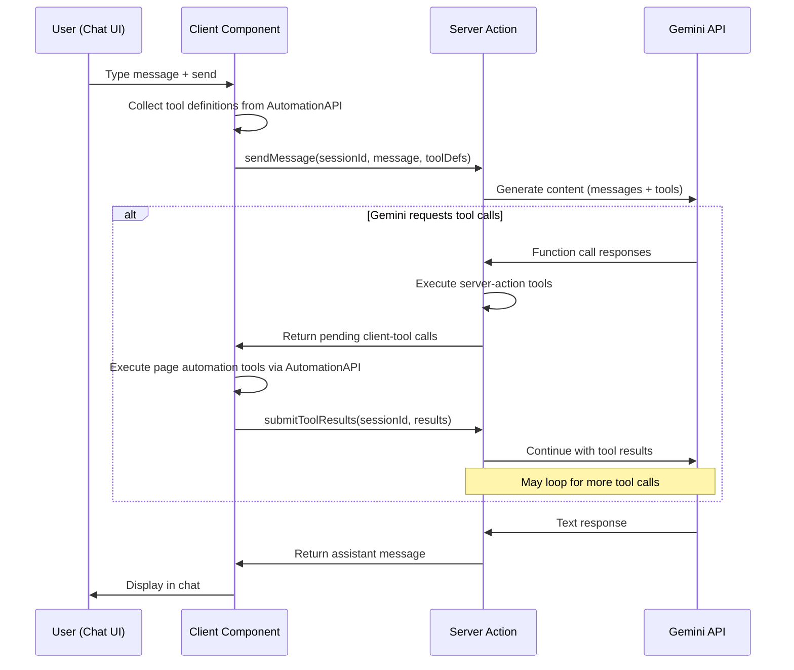

# Gemini Agent Plugin for Jay-Stack

## Background

### What exists today

1. **WebMCP plugin** (Design Log #91) — automatically exposes page interactions as WebMCP tools to browsers with `navigator.modelContext`. Client-only plugin. Relies on an external AI agent (browser-side) to call the tools.

2. **AutomationAPI** (`@jay-framework/runtime-automation`) — wraps Jay components:
   - `getPageState()` → `{ viewState, interactions, customEvents }`
   - `triggerEvent(eventType, coordinate)` → trigger UI events
   - `getInteraction(coordinate)` → find specific interaction (returns DOM element)
   - `onStateChange(callback)` → subscribe to changes

3. **Server Actions** — `makeJayAction`/`makeJayQuery` exported from plugins, discovered at startup, served at `/_jay/actions/:actionName`. Client calls via `createActionCaller(name, method)` → HTTP fetch.

4. **Action Registry** (`ActionRegistry`) — server-side registry. `actionRegistry.getNames()` lists all registered actions. `actionRegistry.execute(name, input)` runs them.

5. **Plugin config pattern** — plugins read config from `config/<filename>.yaml` (see `wix-server-client`). Setup handler creates template, validates credentials.

6. **WebMCP tools architecture** — the webmcp plugin builds `ToolDescriptor[]` from `AutomationAPI`:
   - Generic tools: `get-page-state`, `list-interactions`, `trigger-interaction`, `fill-input`
   - Semantic tools: `click-{refName}`, `fill-{refName}`, `toggle-{refName}` auto-generated per interaction
   - Same `ToolDescriptor` type: `{ name, description, inputSchema, execute }`

---

## Problem

The WebMCP plugin requires a **WebMCP-enabled browser** (Chrome Canary). Most users don't have that. We want to bring an AI agent **directly into any jay-stack page** — a chat interface where users can interact with a Gemini-powered agent that can:

1. **Read** current page state
2. **Drive page interactions** (click buttons, fill inputs, select options) — same capabilities as webmcp
3. **Call server actions** exposed by any plugin
4. **Converse** with the user via a chat UI

The plugin should:
- Use the **Gemini API** (server-side, with function calling)
- Expose a **contract** for building a chat UI in jay-html
- Reuse the same tool infrastructure as webmcp (same `ToolDescriptor` type and generation logic)
- Accept config (API key) via the standard plugin config pattern

---

## Questions and Answers

### Q1: Where does the LLM call happen — client or server?

**Answer:** Server. The Gemini API key must stay server-side. The flow:

1. User types message in chat UI (client)
2. Client sends message to server action
3. Server calls Gemini API with message + tool definitions
4. Gemini may request tool calls → server executes them (page automation tools run on client, server actions run on server)
5. Results returned to Gemini → may generate more tool calls or a text response
6. Final text response sent back to client → displayed in chat

### Q2: How do page automation tools (which need DOM access) run from the server?

**Answer:** They can't run on the server directly. The flow is:

1. Server sends a **tool call request** to the client (via the action response)
2. Client executes the tool against `AutomationAPI` (same code as webmcp)
3. Client sends tool results back to server (via another action call)
4. Server continues the Gemini conversation with the tool results

This means a single user message may require **multiple round-trips**:
- Client → Server (user message) → Gemini → tool calls needed
- Server → Client (pending tool calls) → Client executes → Client → Server (tool results)
- Server → Gemini (tool results) → final response or more tool calls
- Eventually: Server → Client (final text response)

### Q3: Should we use streaming or request/response?

**Answer:** Start with request/response. The multi-round-trip nature (Q2) already provides incremental feedback. Streaming adds complexity (SSE/WebSocket) that we can add later.

### Q4: How does the plugin discover available tools?

**Answer:** Two categories:

**Page automation tools** (client-side): Generated from `AutomationAPI` exactly like the webmcp plugin — reuse `buildSemanticTools()` and the generic tool builders from `@jay-framework/webmcp-plugin`. Serialized as tool definitions (name, description, inputSchema) and sent to the server.

**Server actions** (server-side): Discovered from the `ActionRegistry` at runtime. `actionRegistry.getNames()` + metadata for each action. These run server-side and don't need client round-trips.

### Q5: How is the Gemini tool schema derived from our ToolDescriptor?

**Answer:** Direct mapping. Our `ToolInputSchema` is already JSON Schema (`type: 'object', properties, required`) — Gemini's function calling accepts this format. The mapping:

```
ToolDescriptor.name → FunctionDeclaration.name
ToolDescriptor.description → FunctionDeclaration.description
ToolDescriptor.inputSchema → FunctionDeclaration.parameters
```

### Q6: What does the chat contract look like?

**Answer:** The contract exposes tags for building a chat UI:

- Messages list (repeated sub-contract): role, content, timestamp
- Text input for user message
- Send button
- Loading state variant
- Error state

### Q7: How does the plugin manage conversation state?

**Answer:** Server-side, per-session. The component's interactive phase holds a `sessionId`. Server maintains a `Map<sessionId, ConversationState>` with message history. In the future, this could be backed by a real store, but in-memory is fine for now.

### Q8: Should action metadata (input schema, description) be available for the LLM?

**Answer:** Yes. Currently `RegisteredAction` has `actionName`, `method`, `handler`, but no `inputSchema` or `description`. Design Log #84 Q5b designed an `.action.yaml` format but it was never implemented.

We introduce **`.jay-action` files** — one file per action, mirroring the one-file-per-contract pattern (`.jay-contract`). Each file describes an action's input schema, output schema, and purpose in a format that maps directly to Gemini function declarations.

#### `.jay-action` file format

```yaml
# search-products.jay-action
name: searchProducts
description: Search for products by query string. Returns matching products with IDs, names, and prices.

inputSchema:
  type: object
  properties:
    query:
      type: string
      description: Search query text
    limit:
      type: number
      description: Maximum results to return
      default: 10
  required:
    - query

outputSchema:
  type: array
  items:
    type: object
    properties:
      _id:
        type: string
      name:
        type: string
      price:
        type: number
```

#### Referenced from `plugin.yaml`

Actions in `plugin.yaml` currently list export names as strings. We extend this to support file references (similar to how contracts reference `.jay-contract` files):

```yaml
# plugin.yaml
name: wix-stores
actions:
  - name: searchProducts
    action: ./actions/search-products.jay-action   # metadata file
  - name: getProductBySlug
    action: ./actions/get-product-by-slug.jay-action
  - submitRating          # backward compat: string = export name, no metadata
```

When `action` points to a `.jay-action` file, the framework loads metadata at init time. Actions without a `.jay-action` file still work — they just get a generic tool definition for the LLM ("call action X with JSON input").

#### How it flows to Gemini

1. Plugin init discovers `.jay-action` files from `plugin.yaml`
2. Metadata stored in `ActionRegistry` alongside the handler
3. Gemini agent plugin reads metadata from registry → converts to `FunctionDeclaration`
4. LLM gets proper parameter names, types, descriptions — much better tool use

#### Why `.jay-action` files (not builder methods)

- **Declarative, not code** — same philosophy as `.jay-contract`
- **One file per action** — easy to find, review, version
- **Agent-readable** — `jay-stack agent-kit` can materialize action metadata for coding agents too
- **No TypeScript dependency** — schema is JSON Schema in YAML, not TS types

### Q9: What should the system prompt include?

**Answer:** The system prompt should describe:
1. The current page state (ViewState snapshot)
2. Available page interactions (from `list-interactions`)
3. Available server actions (names + descriptions from `.jay-action` files when available)
4. Instructions: "You are an assistant helping the user interact with this web page..."

This is regenerated per conversation turn (page state changes between turns).

### Q10: Should `.jay-action` files generate TypeScript types like `.jay-contract` does?

**Answer:** Not initially. `.jay-contract` generates ViewState/Refs/Props interfaces because they're used at compile time in component code. `.jay-action` metadata is consumed at runtime by the gemini agent (and potentially other tools). The action's TypeScript types already exist inline in the `withHandler` call. The `.jay-action` file is a parallel declaration for external consumers (LLMs, CLI, agent-kit), not for the TS compiler.

If we later want type-checking between the `.jay-action` schema and the handler signature, we can add a validation step to `jay-stack validate`.

---

## Design

### Architecture



### Tool Categories

| Category | Runs on | Examples | Discovery |
|----------|---------|----------|-----------|
| Page automation (generic) | Client | `get-page-state`, `trigger-interaction`, `fill-input` | From AutomationAPI, sent to server |
| Page automation (semantic) | Client | `click-add-to-cart`, `fill-search-input` | From AutomationAPI, sent to server |
| Server actions | Server | `moodTracker.submitMood`, `cart.addToCart` | From ActionRegistry |

### Contract: `gemini-chat`

```yaml
name: gemini-chat
tags:
  - tag: messages
    type: sub-contract
    repeated: true
    trackBy: id
    phase: fast+interactive
    tags:
      - tag: id
        type: data
        dataType: string
      - tag: role
        type: variant
        dataType: "enum (user | assistant | system)"
      - tag: content
        type: data
        dataType: string
      - tag: timestamp
        type: data
        dataType: string

  - tag: messageInput
    type: interactive
    elementType: HTMLTextAreaElement

  - tag: sendMessage
    type: interactive
    elementType: HTMLButtonElement

  - tag: isLoading
    type: variant
    dataType: boolean
    phase: fast+interactive

  - tag: error
    type: data
    dataType: string
    phase: fast+interactive
```

### Plugin Structure

```
packages/jay-stack-plugins/gemini-agent/
├── plugin.yaml
├── package.json
├── tsconfig.json
├── vite.config.ts
├── lib/
│   ├── index.ts                    # Plugin exports
│   ├── init.ts                     # makeJayInit — server: load config + create service; client: noop
│   ├── gemini-chat.ts              # makeJayStackComponent — the headless chat component
│   ├── gemini-chat.jay-contract    # Contract file
│   ├── gemini-chat.jay-contract.d.ts
│   ├── config-loader.ts            # Load config/.gemini.yaml
│   ├── setup.ts                    # Setup handler (create config template)
│   ├── gemini-service.ts           # Server-side Gemini API wrapper
│   ├── conversation-manager.ts     # Server-side conversation state management
│   ├── tool-bridge.ts              # Convert ToolDescriptor ↔ Gemini FunctionDeclaration
│   ├── action-metadata-loader.ts   # Load .jay-action files from plugin.yaml references
│   ├── actions/
│   │   ├── send-message.ts         # sendMessage action handler
│   │   ├── send-message.jay-action # sendMessage metadata
│   │   ├── submit-tool-results.ts  # submitToolResults action handler
│   │   └── submit-tool-results.jay-action
│   └── actions.ts                  # Re-exports action handlers
├── test/
│   ├── tool-bridge.test.ts
│   ├── conversation-manager.test.ts
│   ├── action-metadata-loader.test.ts
│   └── gemini-chat.test.ts
└── config/
    └── .gemini.yaml.template       # Template for jay-stack setup
```

### plugin.yaml

```yaml
name: gemini-agent
global: true
contracts:
  - name: gemini-chat
    contract: gemini-chat.jay-contract
    component: geminiChat
    description: AI chat agent powered by Gemini with page automation capabilities
actions:
  - name: sendMessage
    action: ./actions/send-message.jay-action
  - name: submitToolResults
    action: ./actions/submit-tool-results.jay-action
setup:
  handler: setupGeminiAgent
  description: Configure Gemini API key
```

### Config: `config/.gemini.yaml`

```yaml
# Gemini Agent Configuration
apiKey: "<your-gemini-api-key>"

# Optional: model name (default: gemini-2.0-flash)
# model: gemini-2.0-flash

# Optional: system prompt prefix
# systemPrompt: "You are a helpful assistant for this web application."
```

### Server Actions

**`sendMessage`** — Main entry point for chat messages

```typescript
interface SendMessageInput {
    sessionId: string;
    message: string;
    // Client sends tool definitions (page automation tools) serialized
    toolDefinitions: SerializedToolDef[];
}

interface SerializedToolDef {
    name: string;
    description: string;
    inputSchema: ToolInputSchema;
    category: 'page-automation';  // distinguishes from server actions
}

type SendMessageOutput =
    | { type: 'response'; message: string; messages: ChatMessage[] }
    | { type: 'tool-calls'; calls: PendingToolCall[]; messages: ChatMessage[] };

interface PendingToolCall {
    id: string;
    name: string;
    args: Record<string, unknown>;
    category: 'page-automation' | 'server-action';
}
```

**`submitToolResults`** — Continue after client executes page automation tools

```typescript
interface SubmitToolResultsInput {
    sessionId: string;
    results: ToolCallResult[];
    toolDefinitions: SerializedToolDef[];  // resend (page state may have changed)
}

interface ToolCallResult {
    callId: string;
    result: string;  // JSON stringified
    isError?: boolean;
}

type SubmitToolResultsOutput = SendMessageOutput;  // same shape
```

### Component Flow

The interactive phase of `gemini-chat`:

1. User types in `messageInput`, clicks `sendMessage`
2. Component calls `sendMessage` action with current `sessionId` + message + serialized tool definitions from AutomationAPI
3. If response is `{ type: 'response' }` → add assistant message, done
4. If response is `{ type: 'tool-calls' }`:
   a. Execute server-action tools (already done server-side, results included)
   b. For page-automation tools: execute via `AutomationAPI` on client
   c. Collect all results → call `submitToolResults`
   d. Repeat until we get a `{ type: 'response' }`

### Gemini API Integration

```typescript
// gemini-service.ts
import { GoogleGenAI } from '@google/genai';

interface GeminiServiceConfig {
    apiKey: string;
    model: string;
    systemPrompt?: string;
}

class GeminiService {
    private client: GoogleGenAI;
    
    constructor(private config: GeminiServiceConfig) {
        this.client = new GoogleGenAI({ apiKey: config.apiKey });
    }

    async generateWithTools(
        messages: GeminiMessage[],
        tools: GeminiFunctionDeclaration[],
        systemPrompt: string,
    ): Promise<GeminiResponse> {
        const response = await this.client.models.generateContent({
            model: this.config.model,
            contents: messages,
            tools: [{ functionDeclarations: tools }],
            config: { systemInstruction: systemPrompt },
        });
        return response;
    }
}
```

### Tool Bridge

Converts between jay-stack tools and Gemini `FunctionDeclaration`:

```typescript
// tool-bridge.ts

interface GeminiFunctionDeclaration {
    name: string;
    description: string;
    parameters: {
        type: 'object';
        properties: Record<string, any>;
        required?: string[];
    };
}

/** Loaded from .jay-action file */
interface ActionMetadata {
    name: string;
    description: string;
    inputSchema: { type: 'object'; properties: Record<string, any>; required?: string[] };
    outputSchema?: object;
}

function toGeminiTools(
    clientTools: SerializedToolDef[],
    serverActions: Array<{ actionName: string; metadata?: ActionMetadata }>,
): GeminiFunctionDeclaration[] {
    const tools: GeminiFunctionDeclaration[] = [];

    // Client page-automation tools → Gemini functions (already have schema)
    for (const tool of clientTools) {
        tools.push({
            name: tool.name,
            description: tool.description,
            parameters: tool.inputSchema,
        });
    }

    // Server actions → Gemini functions
    for (const { actionName, metadata } of serverActions) {
        if (metadata) {
            // Rich metadata from .jay-action file
            tools.push({
                name: `action_${actionName.replace(/\./g, '_')}`,
                description: metadata.description,
                parameters: metadata.inputSchema,
            });
        } else {
            // Fallback: no .jay-action file — generic JSON input
            tools.push({
                name: `action_${actionName.replace(/\./g, '_')}`,
                description: `Call server action: ${actionName}`,
                parameters: {
                    type: 'object',
                    properties: {
                        input: {
                            type: 'string',
                            description: 'JSON-encoded input for the action',
                        },
                    },
                    required: ['input'],
                },
            });
        }
    }

    return tools;
}
```

### System Prompt Generation

```typescript
function buildSystemPrompt(
    pageState: object,
    interactions: SerializedToolDef[],
    serverActions: string[],
    customPrefix?: string,
): string {
    const parts = [
        customPrefix || 'You are a helpful assistant for this web application.',
        '',
        'Current page state:',
        JSON.stringify(pageState, null, 2),
        '',
        `Available page interactions: ${interactions.map(t => t.name).join(', ')}`,
        `Available server actions: ${serverActions.join(', ')}`,
        '',
        'Use the provided tools to help the user. After using tools, describe what you did.',
        'For page automation tools, the results include the updated page state.',
    ];
    return parts.join('\n');
}
```

---

## Implementation Plan

### Phase 0: `.jay-action` file support (framework-level)

Add `.jay-action` file loading to the core framework — this benefits all plugins, not just gemini-agent.

1. **Define `.jay-action` format** — YAML with `name`, `description`, `inputSchema`, `outputSchema` (optional)
2. **Extend `PluginManifest`** — `actions` entries can be `string` (export name, backward compat) or `{ name, action }` (with `.jay-action` file path)
3. **Action metadata loader** — `loadActionMetadata(jayActionPath)` in `stack-server-runtime`, parses `.jay-action` YAML
4. **Extend `ActionRegistry`** — `RegisteredAction` gains optional `metadata?: ActionMetadata` (description, inputSchema, outputSchema)
5. **Wire into action discovery** — when a plugin declares `action: ./foo.jay-action`, load metadata and attach to the registered action
6. **Agent-kit integration** — `jay-stack agent-kit` materializes action metadata alongside contracts (writes `actions-index.yaml` or includes in `plugins-index.yaml`)
7. Tests for loader, registry extension, backward compat with string-only actions

### Phase 1: Plugin scaffolding + config

1. Create `packages/jay-stack-plugins/gemini-agent/` with package structure
2. Implement `config-loader.ts` — load `config/.gemini.yaml`
3. Implement `setup.ts` — create config template with placeholders
4. Implement `init.ts` — `makeJayInit().withServer()` loads config, creates + registers `GeminiService`
5. `plugin.yaml` with `global: true`, contracts, actions (with `.jay-action` files), setup handler

### Phase 2: Gemini service + tool bridge

1. Implement `gemini-service.ts` — wrapper around `@google/genai` SDK
2. Implement `tool-bridge.ts` — `SerializedToolDef` + `ActionMetadata` → Gemini `FunctionDeclaration`
3. Implement `conversation-manager.ts` — in-memory session state
4. Unit tests for tool bridge and conversation manager

### Phase 3: Server actions

1. Implement `sendMessage` action + `.jay-action` file
2. Implement `submitToolResults` action + `.jay-action` file
3. Server-action tool execution via `actionRegistry.execute()` (server-side, no HTTP)
4. Tests with mocked Gemini API

### Phase 4: Chat component + contract

1. Create `gemini-chat.jay-contract`
2. Implement `gemini-chat.ts` — the headless component:
   - Fast render: empty messages, not loading
   - Interactive: wire `sendMessage`/`submitToolResults` refs, manage tool execution loop
   - Collects tool definitions from AutomationAPI (via `window.__jay.automation`)
3. Generate `.jay-contract.d.ts` types

### Phase 5: Testing + example

1. Integration tests with mock Gemini responses
2. Add to an example project (e.g., fake-shop) with a chat page

---

## Trade-offs

### Multi-round-trip vs WebSocket

| Approach | Pro | Con |
|----------|-----|-----|
| **Multi-round-trip (chosen)** | Simple, uses existing action infrastructure, no new transport | Higher latency for tool-heavy conversations |
| **WebSocket/SSE** | Lower latency, real-time streaming | New infrastructure, complexity, connection management |

We choose multi-round-trip for simplicity. The action system already handles request/response. Streaming can be added later as an optimization.

### Server-side conversation state vs client-side

| Approach | Pro | Con |
|----------|-----|-----|
| **Server-side (chosen)** | API key secure, conversation history stays server-side, simpler client | Memory usage on server, needs session cleanup |
| **Client-side** | Stateless server, scales easily | API key exposure risk, large payloads on every request |

### Reusing webmcp tool builders vs independent implementation

| Approach | Pro | Con |
|----------|-----|-----|
| **Reuse (chosen)** | DRY, consistent tool names/schemas, proven code | Dependency on webmcp-plugin package |
| **Independent** | No dependency, can diverge | Duplication, risk of inconsistency |

We import and reuse `buildSemanticTools` and the generic tool builders from `@jay-framework/webmcp-plugin`. The gemini-agent plugin depends on webmcp-plugin as a library (not as a global plugin — it doesn't need `navigator.modelContext`).

---

## Verification Criteria

### `.jay-action` infrastructure (Phase 0)
1. `.jay-action` files are loaded from paths in `plugin.yaml`
2. Action metadata (description, inputSchema) is available in `ActionRegistry`
3. Plugins with string-only action declarations still work (backward compat)
4. `jay-stack agent-kit` materializes action metadata for coding agents

### Gemini agent plugin (Phases 1–5)
5. Plugin loads config from `config/.gemini.yaml` (API key)
6. `jay-stack setup gemini-agent` creates config template
7. Chat component renders messages list, input, send button via contract
8. User message → Gemini API call → assistant response displayed
9. Gemini can call page automation tools (click, fill, get state) via client round-trip
10. Gemini can call server actions directly on the server — with proper input schemas from `.jay-action` files
11. Multi-turn conversation maintains context
12. Loading state shown during API calls
13. Error handling: API errors, invalid config, tool execution failures
14. Tool definitions include current page state (updated per turn)
