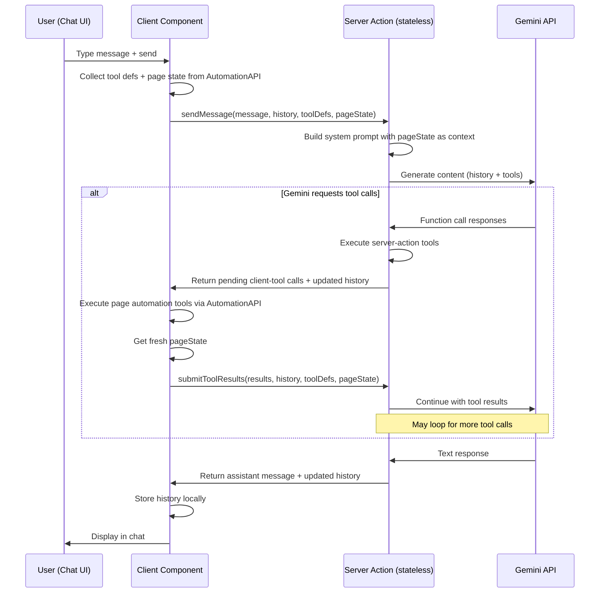

# Gemini Agent Plugin for Jay-Stack

## Background

### What exists today

1. **WebMCP plugin** (Design Log #91) — automatically exposes page interactions as WebMCP tools to browsers with `navigator.modelContext`. Client-only plugin. Relies on an external AI agent (browser-side) to call the tools.

2. **AutomationAPI** (`@jay-framework/runtime-automation`) — wraps Jay components:

   - `getPageState()` → `{ viewState, interactions, customEvents }`
   - `triggerEvent(eventType, coordinate)` → trigger UI events
   - `getInteraction(coordinate)` → find specific interaction (returns DOM element)
   - `onStateChange(callback)` → subscribe to changes

3. **Server Actions** — `makeJayAction`/`makeJayQuery` exported from plugins, discovered at startup, served at `/_jay/actions/:actionName`. Client calls via `createActionCaller(name, method)` → HTTP fetch.

4. **Action Registry** (`ActionRegistry`) — server-side registry. `actionRegistry.getNames()` lists all registered actions. `actionRegistry.execute(name, input)` runs them.

5. **Plugin config pattern** — plugins read config from `config/<filename>.yaml` (see `wix-server-client`). Setup handler creates template, validates credentials.

6. **WebMCP tools architecture** — the webmcp plugin builds `ToolDescriptor[]` from `AutomationAPI`:
   - Generic tools: `get-page-state`, `list-interactions`, `trigger-interaction`, `fill-input`
   - Semantic tools: `click-{refName}`, `fill-{refName}`, `toggle-{refName}` auto-generated per interaction
   - Same `ToolDescriptor` type: `{ name, description, inputSchema, execute }`
   - Tools only (no resources or prompts) — aligned with Chrome Canary's `modelContext` API

---

## Problem

The WebMCP plugin requires a **WebMCP-enabled browser** (Chrome Canary). Most users don't have that. We want to bring an AI agent **directly into any jay-stack page** — a chat interface where users can interact with a Gemini-powered agent that can:

1. **Read** current page state
2. **Drive page interactions** (click buttons, fill inputs, select options) — same capabilities as webmcp
3. **Call server actions** exposed by any plugin
4. **Converse** with the user via a chat UI

The plugin should:

- Use the **Gemini API** (server-side, with function calling)
- Expose a **contract** for building a chat UI in jay-html
- Reuse the same tool infrastructure as webmcp (same `ToolDescriptor` type and generation logic)
- Accept config (API key) via the standard plugin config pattern

---

## Questions and Answers

### Q1: Where does the LLM call happen — client or server?

**Answer:** Server. The Gemini API key must stay server-side. The flow:

1. User types message in chat UI (client)
2. Client sends message to server action
3. Server calls Gemini API with message + tool definitions
4. Gemini may request tool calls → server executes them (page automation tools run on client, server actions run on server)
5. Results returned to Gemini → may generate more tool calls or a text response
6. Final text response sent back to client → displayed in chat

### Q2: How do page automation tools (which need DOM access) run from the server?

**Answer:** They can't run on the server directly. The flow is:

1. Server sends a **tool call request** to the client (via the action response)
2. Client executes the tool against `AutomationAPI` (same code as webmcp)
3. Client sends tool results back to server (via another action call)
4. Server continues the Gemini conversation with the tool results

This means a single user message may require **multiple round-trips**:

- Client → Server (user message) → Gemini → tool calls needed
- Server → Client (pending tool calls) → Client executes → Client → Server (tool results)
- Server → Gemini (tool results) → final response or more tool calls
- Eventually: Server → Client (final text response)

### Q3: Should we use streaming or request/response?

**Answer:** Start with request/response. The multi-round-trip nature (Q2) already provides incremental feedback. Streaming adds complexity (SSE/WebSocket) that we can add later.

### Q4: How does the plugin discover available tools?

**Answer:** Two categories:

**Page automation tools** (client-side): Generated from `AutomationAPI` exactly like the webmcp plugin — reuse `buildSemanticTools()` and the generic tool builders from `@jay-framework/webmcp-plugin`. Serialized as tool definitions (name, description, inputSchema) and sent to the server.

**Server actions** (server-side): Discovered from the `ActionRegistry` at runtime. `actionRegistry.getNames()` + metadata for each action. These run server-side and don't need client round-trips.

### Q5: How is the Gemini tool schema derived from our ToolDescriptor?

**Answer:** Direct mapping. Our `ToolInputSchema` is already JSON Schema (`type: 'object', properties, required`) — Gemini's function calling accepts this format. The mapping:

```
ToolDescriptor.name → FunctionDeclaration.name
ToolDescriptor.description → FunctionDeclaration.description
ToolDescriptor.inputSchema → FunctionDeclaration.parameters
```

### Q6: What does the chat contract look like?

**Answer:** The contract exposes tags for building a chat UI with two display modes:

**Full mode:** Shows all messages in a scrollable list (classic chat UI).

**Compact mode:** Shows only the input + the last question/answer pair. An expand button reveals full history. This is useful for embedding the agent as a small widget on a page without dominating the layout.

Tags:

- Messages list (repeated sub-contract): role, content, timestamp
- Text input for user message
- Send button
- Loading state variant
- Error state
- `isExpanded` variant (boolean) — controls full vs compact view
- `toggleExpand` interactive button — switches between modes
- `lastUserMessage` / `lastAssistantMessage` data — shortcut for compact mode (avoids iterating the full list)

### Q7: How does the plugin manage conversation state?

**Answer:** Client-side. The server is **stateless** — no session map, no memory cleanup, no scaling concerns.

The client component holds the full `ConversationState` (message history in the Gemini format). On each request, the client sends the entire conversation history to the server action. The server passes it to Gemini, gets the response, and returns the updated history back to the client.

**Why client-side:**

- Server is stateless — no session management, no memory leaks, no cleanup timers
- Scales trivially (any server instance can handle any request)
- Page refresh / navigation loses state naturally (expected for a chat widget)
- The API key is still server-side — only conversation messages travel over the wire

**Trade-off:** Larger payloads (full history on every request). Acceptable for a chat widget — typical conversations are tens of messages, not thousands. If conversations get very long, we can truncate older messages or summarize.

### Q8: Should action metadata (input schema, description) be available for the LLM?

**Answer:** Yes. Currently `RegisteredAction` has `actionName`, `method`, `handler`, but no `inputSchema` or `description`. Design Log #84 Q5b designed an `.action.yaml` format but it was never implemented.

We introduce **`.jay-action` files** — one file per action, mirroring the one-file-per-contract pattern (`.jay-contract`). Each file describes an action's input schema, output schema, and purpose in a format that maps directly to Gemini function declarations.

#### `.jay-action` file format

```yaml
# search-products.jay-action
name: searchProducts
description: Search for products by query string. Returns matching products with IDs, names, and prices.

inputSchema:
  type: object
  properties:
    query:
      type: string
      description: Search query text
    limit:
      type: number
      description: Maximum results to return
      default: 10
  required:
    - query

outputSchema:
  type: array
  items:
    type: object
    properties:
      _id:
        type: string
      name:
        type: string
      price:
        type: number
```

#### Referenced from `plugin.yaml`

Actions in `plugin.yaml` currently list export names as strings. We extend this to support file references (similar to how contracts reference `.jay-contract` files):

```yaml
# plugin.yaml
name: wix-stores
actions:
  - name: searchProducts
    action: ./actions/search-products.jay-action # metadata file
  - name: getProductBySlug
    action: ./actions/get-product-by-slug.jay-action
  - submitRating # backward compat: string = export name, no metadata
```

When `action` points to a `.jay-action` file, the framework loads metadata at init time. Actions without a `.jay-action` file still work as normal server actions — they are simply **not exposed to the AI agent**. Only actions with `.jay-action` metadata become Gemini tools. This is intentional: not every action should be callable by the LLM (e.g., internal framework actions, auth actions).

#### How it flows to Gemini

1. Plugin init discovers `.jay-action` files from `plugin.yaml`
2. Metadata stored in `ActionRegistry` alongside the handler
3. Gemini agent plugin reads metadata from registry → converts to `FunctionDeclaration`
4. LLM gets proper parameter names, types, descriptions — much better tool use

#### TypeScript type generation

Like `.jay-contract`, `.jay-action` files generate a `.d.ts` file with `Input` and `Output` interfaces:

```
send-message.jay-action → send-message.jay-action.d.ts
```

```typescript
// send-message.jay-action.d.ts (generated)
export interface SendMessageInput {
    message: string;
    history: GeminiMessage[];
    toolDefinitions: SerializedToolDef[];
    pageState: object;
}
export interface SendMessageOutput { ... }
```

The action handler imports these types, making the `.jay-action` file the single source of truth:

```typescript
import type { SendMessageInput, SendMessageOutput } from './send-message.jay-action';
export const sendMessage = makeJayAction<SendMessageInput, SendMessageOutput>()
    .withHandler(async (input) => { ... });
```

#### Why `.jay-action` files (not builder methods)

- **Declarative, not code** — same philosophy as `.jay-contract`
- **One file per action** — easy to find, review, version
- **Agent-readable** — `jay-stack agent-kit` can materialize action metadata for coding agents too
- **Single source of truth** — generates both TS types (for handler code) and Gemini function declarations (for LLM)

### Q9: What should the system prompt include?

**Answer:** The system prompt should describe:

1. The current page state (ViewState snapshot) — included as **context**, not a tool (see Q11)
2. Available page interactions summary
3. Available server actions (only those with `.jay-action` files — names + descriptions)
4. Instructions: "You are an assistant helping the user interact with this web page..."

This is regenerated per conversation turn (page state changes between turns).

In the future, the system prompt should be configurable — plugins or page authors may want to customize it (e.g., add domain-specific instructions, restrict behavior). For now, we use a sensible default and accept an optional `systemPrompt` prefix from `config/.gemini.yaml`.

### Q10: Should `.jay-action` files generate TypeScript types like `.jay-contract` does?

**Answer:** Yes. Generate `Input` and `Output` interfaces from the `.jay-action` file, similar to how `.jay-contract` generates ViewState/Refs types. The `.jay-action` file becomes the **single source of truth** for the schema — both the TypeScript types and the Gemini function declarations are derived from it.

Generated file: `send-message.jay-action.d.ts`

```typescript
export interface SendMessageInput { ... }  // from inputSchema
export interface SendMessageOutput { ... } // from outputSchema
```

The action handler imports and uses these types:

```typescript
import type { SendMessageInput, SendMessageOutput } from './send-message.jay-action';
export const sendMessage = makeJayAction<SendMessageInput, SendMessageOutput>()
    .withHandler(async (input) => { ... });
```

This gives us:

- Single source of truth (`.jay-action` file)
- Type safety in action handlers
- Same schema sent to Gemini for tool calling
- Validation: `jay-stack validate` can check handler signature vs `.jay-action` schema

### Q11: Should `get-page-state` be a tool or context?

**Answer:** Context. Instead of making the LLM waste a tool call to read page state, we include the current page state snapshot directly in the system prompt / conversation context. The LLM always knows what's on the page.

**What stays as tools:** Only interactive operations — `trigger-interaction`, `fill-input`, and semantic tools (`click-*`, `fill-*`, `toggle-*`). These are actions that change state.

**Why not `list-interactions` as a tool either?** The available interactions are already described by the tool definitions themselves (each semantic tool like `click-add-to-cart` implies an interaction). Plus, we include a summary in the system prompt. No need for a separate discovery tool.

This reduces unnecessary tool calls and makes the agent faster (fewer round-trips).

---

## Design

### Architecture



### Tool Categories

| Category                   | Runs on | Examples                                   | Discovery                          |
| -------------------------- | ------- | ------------------------------------------ | ---------------------------------- |
| Page automation (generic)  | Client  | `trigger-interaction`, `fill-input`        | From AutomationAPI, sent to server |
| Page automation (semantic) | Client  | `click-add-to-cart`, `fill-search-input`   | From AutomationAPI, sent to server |
| Server actions             | Server  | `moodTracker.submitMood`, `cart.addToCart` | From ActionRegistry                |

**Context (not tools):** Page state (`getPageState()`) and available interactions are included in the system prompt as context, not as callable tools. This avoids wasting tool calls on read-only operations.

### Contract: `gemini-chat`

```yaml
name: gemini-chat
tags:
  - tag: messages
    type: sub-contract
    repeated: true
    trackBy: id
    phase: fast+interactive
    tags:
      - tag: id
        type: data
        dataType: string
      - tag: role
        type: variant
        dataType: 'enum (user | assistant | system)'
      - tag: content
        type: data
        dataType: string
      - tag: timestamp
        type: data
        dataType: string

  - tag: messageInput
    type: interactive
    elementType: HTMLTextAreaElement

  - tag: sendMessage
    type: interactive
    elementType: HTMLButtonElement

  - tag: isLoading
    type: variant
    dataType: boolean
    phase: fast+interactive

  - tag: error
    type: data
    dataType: string
    phase: fast+interactive

  # Compact mode support
  - tag: isExpanded
    type: variant
    dataType: boolean
    phase: interactive

  - tag: toggleExpand
    type: interactive
    elementType: HTMLButtonElement

  - tag: lastUserMessage
    type: data
    dataType: string
    phase: interactive

  - tag: lastAssistantMessage
    type: data
    dataType: string
    phase: interactive
```

### Plugin Structure

```
packages/jay-stack-plugins/gemini-agent/
├── plugin.yaml
├── package.json
├── tsconfig.json
├── vite.config.ts
├── lib/
│   ├── index.ts                    # Plugin exports
│   ├── init.ts                     # makeJayInit — server: load config + create service; client: noop
│   ├── gemini-chat.ts              # makeJayStackComponent — the headless chat component
│   ├── gemini-chat.jay-contract    # Contract file
│   ├── gemini-chat.jay-contract.d.ts
│   ├── config-loader.ts            # Load config/.gemini.yaml
│   ├── setup.ts                    # Setup handler (create config template)
│   ├── gemini-service.ts           # Server-side Gemini API wrapper (stateless)
│   ├── tool-bridge.ts              # Convert ToolDescriptor ↔ Gemini FunctionDeclaration
│   ├── system-prompt.ts            # Build system prompt with page state context
│   ├── action-metadata-loader.ts   # Load .jay-action files from plugin.yaml references
│   ├── actions/
│   │   ├── send-message.ts         # sendMessage action handler
│   │   ├── send-message.jay-action # sendMessage metadata
│   │   ├── submit-tool-results.ts  # submitToolResults action handler
│   │   └── submit-tool-results.jay-action
│   └── actions.ts                  # Re-exports action handlers
├── test/
│   ├── tool-bridge.test.ts
│   ├── system-prompt.test.ts
│   ├── action-metadata-loader.test.ts
│   └── gemini-chat.test.ts
└── config/
    └── .gemini.yaml.template       # Template for jay-stack setup
```

### plugin.yaml

```yaml
name: gemini-agent
global: true
contracts:
  - name: gemini-chat
    contract: gemini-chat.jay-contract
    component: geminiChat
    description: AI chat agent powered by Gemini with page automation capabilities
actions:
  - name: sendMessage
    action: ./actions/send-message.jay-action
  - name: submitToolResults
    action: ./actions/submit-tool-results.jay-action
setup:
  handler: setupGeminiAgent
  description: Configure Gemini API key
```

### Config: `config/.gemini.yaml`

```yaml
# Gemini Agent Configuration
apiKey: '<your-gemini-api-key>'
# Optional: model name (default: gemini-2.0-flash)
# model: gemini-2.0-flash

# Optional: system prompt prefix
# systemPrompt: "You are a helpful assistant for this web application."
```

### Server Actions

The server is stateless — conversation history is managed client-side and sent with every request.

**`sendMessage`** — Main entry point for chat messages

```typescript
interface SendMessageInput {
  message: string;
  // Full conversation history (Gemini format)
  history: GeminiMessage[];
  // Client sends tool definitions (page automation tools) serialized
  toolDefinitions: SerializedToolDef[];
  // Current page state snapshot (included in system prompt)
  pageState: object;
}

interface SerializedToolDef {
  name: string;
  description: string;
  inputSchema: ToolInputSchema;
  category: 'page-automation'; // distinguishes from server actions
}

type SendMessageOutput =
  | { type: 'response'; message: string; history: GeminiMessage[] }
  | { type: 'tool-calls'; calls: PendingToolCall[]; history: GeminiMessage[] };

interface PendingToolCall {
  id: string;
  name: string;
  args: Record<string, unknown>;
  category: 'page-automation' | 'server-action';
}
```

**`submitToolResults`** — Continue after client executes page automation tools

```typescript
interface SubmitToolResultsInput {
  results: ToolCallResult[];
  // Full conversation history (including the tool call turn)
  history: GeminiMessage[];
  toolDefinitions: SerializedToolDef[]; // resend (page state may have changed)
  pageState: object; // re-sent (may have changed after tool execution)
}

interface ToolCallResult {
  callId: string;
  result: string; // JSON stringified
  isError?: boolean;
}

type SubmitToolResultsOutput = SendMessageOutput; // same shape
```

### Component Flow

The interactive phase of `gemini-chat`:

1. User types in `messageInput`, clicks `sendMessage`
2. Component calls `sendMessage` action with message + full conversation `history` + serialized tool definitions + current `pageState` from AutomationAPI
3. If response is `{ type: 'response' }` → update local `history`, display assistant message, done
4. If response is `{ type: 'tool-calls' }`:
   a. Update local `history` from response
   b. Execute server-action tools (already done server-side, results included)
   c. For page-automation tools: execute via `AutomationAPI` on client
   d. Collect all results → call `submitToolResults` with results + updated `history` + fresh `pageState`
   e. Repeat until we get a `{ type: 'response' }`
5. Compact mode: only renders `lastUserMessage` / `lastAssistantMessage` unless `isExpanded`

### Gemini API Integration

```typescript
// gemini-service.ts
import { GoogleGenAI } from '@google/genai';

interface GeminiServiceConfig {
  apiKey: string;
  model: string;
  systemPrompt?: string;
}

class GeminiService {
  private client: GoogleGenAI;

  constructor(private config: GeminiServiceConfig) {
    this.client = new GoogleGenAI({ apiKey: config.apiKey });
  }

  async generateWithTools(
    messages: GeminiMessage[],
    tools: GeminiFunctionDeclaration[],
    systemPrompt: string,
  ): Promise<GeminiResponse> {
    const response = await this.client.models.generateContent({
      model: this.config.model,
      contents: messages,
      tools: [{ functionDeclarations: tools }],
      config: { systemInstruction: systemPrompt },
    });
    return response;
  }
}
```

### Tool Bridge

Converts between jay-stack tools and Gemini `FunctionDeclaration`:

```typescript
// tool-bridge.ts

interface GeminiFunctionDeclaration {
  name: string;
  description: string;
  parameters: {
    type: 'object';
    properties: Record<string, any>;
    required?: string[];
  };
}

/** Loaded from .jay-action file */
interface ActionMetadata {
  name: string;
  description: string;
  inputSchema: { type: 'object'; properties: Record<string, any>; required?: string[] };
  outputSchema?: object;
}

function toGeminiTools(
  clientTools: SerializedToolDef[],
  serverActions: Array<{ actionName: string; metadata: ActionMetadata }>,
): GeminiFunctionDeclaration[] {
  const tools: GeminiFunctionDeclaration[] = [];

  // Client page-automation tools → Gemini functions (already have schema)
  for (const tool of clientTools) {
    tools.push({
      name: tool.name,
      description: tool.description,
      parameters: tool.inputSchema,
    });
  }

  // Server actions → Gemini functions (only actions with .jay-action metadata)
  for (const { actionName, metadata } of serverActions) {
    if (metadata) {
      tools.push({
        name: `action_${actionName.replace(/\./g, '_')}`,
        description: metadata.description,
        parameters: metadata.inputSchema,
      });
    }
    // No fallback: actions without .jay-action files are not exposed to AI
  }

  return tools;
}
```

### System Prompt Generation

Page state and interaction summary are included as **context** (not tools), so the LLM always knows the current state without wasting tool calls.

```typescript
function buildSystemPrompt(
  pageState: object,
  serverActions: Array<{ name: string; description?: string }>,
  customPrefix?: string,
): string {
  const parts = [
    customPrefix || 'You are a helpful assistant for this web application.',
    '',
    '## Current Page State',
    JSON.stringify(pageState, null, 2),
    '',
    '## Available Server Actions',
    ...serverActions.map((a) => `- ${a.name}${a.description ? `: ${a.description}` : ''}`),
    '',
    'Use the provided tools to interact with the page. After using tools, describe what you did.',
    'The page state above is refreshed each turn — use it to understand what the user sees.',
  ];
  return parts.join('\n');
}
```

---

## Implementation Plan

### Phase 0: `.jay-action` file support (framework-level)

Add `.jay-action` file loading to the core framework — this benefits all plugins, not just gemini-agent.

1. **Define `.jay-action` format** — YAML with `name`, `description`, `inputSchema`, `outputSchema` (optional)
2. **Extend `PluginManifest`** — `actions` entries can be `string` (export name, backward compat) or `{ name, action }` (with `.jay-action` file path)
3. **Action metadata loader** — `loadActionMetadata(jayActionPath)` in `stack-server-runtime`, parses `.jay-action` YAML
4. **Extend `ActionRegistry`** — `RegisteredAction` gains optional `metadata?: ActionMetadata` (description, inputSchema, outputSchema)
5. **Wire into action discovery** — when a plugin declares `action: ./foo.jay-action`, load metadata and attach to the registered action
6. **Type generation** — generate `.jay-action.d.ts` files with `Input`/`Output` interfaces from the schema (similar to `.jay-contract.d.ts`)
7. **Agent-kit integration** — `jay-stack agent-kit` materializes action metadata alongside contracts (writes `actions-index.yaml` or includes in `plugins-index.yaml`)
8. Tests for loader, registry extension, type generation, backward compat with string-only actions

### Phase 1: Plugin scaffolding + config

1. Create `packages/jay-stack-plugins/gemini-agent/` with package structure
2. Implement `config-loader.ts` — load `config/.gemini.yaml`
3. Implement `setup.ts` — create config template with placeholders
4. Implement `init.ts` — `makeJayInit().withServer()` loads config, creates + registers `GeminiService`
5. `plugin.yaml` with `global: true`, contracts, actions (with `.jay-action` files), setup handler

### Phase 2: Gemini service + tool bridge

1. Implement `gemini-service.ts` — stateless wrapper around `@google/genai` SDK (receives full history per call)
2. Implement `tool-bridge.ts` — `SerializedToolDef` + `ActionMetadata` → Gemini `FunctionDeclaration`
3. Implement `system-prompt.ts` — builds system prompt with page state as context + action descriptions
4. Unit tests for tool bridge and system prompt builder

### Phase 3: Server actions

1. Implement `sendMessage` action + `.jay-action` file
2. Implement `submitToolResults` action + `.jay-action` file
3. Server-action tool execution via `actionRegistry.execute()` (server-side, no HTTP)
4. Tests with mocked Gemini API

### Phase 4: Chat component + contract

1. Create `gemini-chat.jay-contract`
2. Implement `gemini-chat.ts` — the headless component:
   - Fast render: empty messages, not loading
   - Interactive: wire `sendMessage`/`submitToolResults` refs, manage tool execution loop
   - Collects tool definitions from AutomationAPI (via `window.__jay.automation`)
3. Generate `.jay-contract.d.ts` types

### Phase 5: Testing + example

1. Integration tests with mock Gemini responses
2. Add to an example project (e.g., fake-shop) with a chat page

---

## Trade-offs

### Multi-round-trip vs WebSocket

| Approach                      | Pro                                                           | Con                                                   |
| ----------------------------- | ------------------------------------------------------------- | ----------------------------------------------------- |
| **Multi-round-trip (chosen)** | Simple, uses existing action infrastructure, no new transport | Higher latency for tool-heavy conversations           |
| **WebSocket/SSE**             | Lower latency, real-time streaming                            | New infrastructure, complexity, connection management |

We choose multi-round-trip for simplicity. The action system already handles request/response. Streaming can be added later as an optimization.

### Client-side conversation state vs server-side

| Approach                 | Pro                                                                     | Con                                                                                   |
| ------------------------ | ----------------------------------------------------------------------- | ------------------------------------------------------------------------------------- |
| **Client-side (chosen)** | Stateless server, scales trivially, no session cleanup, no memory leaks | Larger payloads (full history per request)                                            |
| **Server-side**          | Smaller payloads                                                        | Memory on server, session management, cleanup timers, can't scale horizontally easily |

API key stays server-side regardless — only conversation messages travel. For typical chat conversations (tens of messages), payload size is not a concern.

### Reusing webmcp tool builders vs independent implementation

| Approach           | Pro                                             | Con                                 |
| ------------------ | ----------------------------------------------- | ----------------------------------- |
| **Reuse (chosen)** | DRY, consistent tool names/schemas, proven code | Dependency on webmcp-plugin package |
| **Independent**    | No dependency, can diverge                      | Duplication, risk of inconsistency  |

We import and reuse `buildSemanticTools` and the generic tool builders from `@jay-framework/webmcp-plugin`. The gemini-agent plugin depends on webmcp-plugin as a library (not as a global plugin — it doesn't need `navigator.modelContext`).

---

## Verification Criteria

### `.jay-action` infrastructure (Phase 0)

1. `.jay-action` files are loaded from paths in `plugin.yaml`
2. Action metadata (description, inputSchema) is available in `ActionRegistry`
3. `.jay-action.d.ts` files generated with `Input`/`Output` interfaces
4. Plugins with string-only action declarations still work (backward compat)
5. `jay-stack agent-kit` materializes action metadata for coding agents

### Gemini agent plugin (Phases 1–5)

6. Plugin loads config from `config/.gemini.yaml` (API key)
7. `jay-stack setup gemini-agent` creates config template
8. Chat component renders messages list, input, send button via contract
9. Compact mode: shows last Q&A + expand button; full mode: shows all messages
10. User message → Gemini API call → assistant response displayed
11. Gemini can call page automation tools (click, fill) via client round-trip
12. Gemini can call server actions directly on the server — with proper input schemas from `.jay-action` files
13. Page state included as context in system prompt (not as a tool)
14. Multi-turn conversation maintained client-side (stateless server)
15. Loading state shown during API calls
16. Error handling: API errors, invalid config, tool execution failures

---

## Implementation Results

### Phase 0: `.jay-action` file support — DONE

**Test results:** 86/86 passing (stack-server-runtime), 530/530 passing (compiler-jay-html)

#### Files modified

| File                                       | Change                                                                                                                               |
| ------------------------------------------ | ------------------------------------------------------------------------------------------------------------------------------------ |
| `compiler-shared/lib/constants.ts`         | Added `JAY_ACTION_EXTENSION`, `JAY_ACTION_DTS_EXTENSION`                                                                             |
| `compiler-shared/lib/plugin-resolution.ts` | Changed `actions?: string[]` → `actions?: ActionManifestEntry[]`, added `ActionManifestEntry` type + `normalizeActionEntry()` helper |

#### Files created

| File                                              | Purpose                                                                                                    |
| ------------------------------------------------- | ---------------------------------------------------------------------------------------------------------- |
| `stack-server-runtime/lib/action-metadata.ts`     | `ActionMetadata` interface, `parseActionMetadata()`, `loadActionMetadata()`, `resolveActionMetadataPath()` |
| `compiler-jay-html/lib/action/action-parser.ts`   | `parseAction()` — YAML → `ActionDefinition` with validations                                               |
| `compiler-jay-html/lib/action/action-compiler.ts` | `compileAction()` — `ActionDefinition` → TypeScript `.d.ts` string                                         |
| `compiler-jay-html/lib/action/index.ts`           | Barrel export                                                                                              |

#### Files extended

| File                                                    | Change                                                                                                                             |
| ------------------------------------------------------- | ---------------------------------------------------------------------------------------------------------------------------------- |
| `stack-server-runtime/lib/action-registry.ts`           | Added `metadata?: ActionMetadata` to `RegisteredAction`, `setMetadata()` and `getActionsWithMetadata()` methods                    |
| `stack-server-runtime/lib/action-discovery.ts`          | Handles `{ name, action }` entries, loads `.jay-action` metadata, calls `registry.setMetadata()` — both local and NPM plugin paths |
| `stack-server-runtime/lib/contract-materializer.ts`     | Collects action metadata during plugin scan, writes to `plugins-index.yaml` with `actions` array                                   |
| `stack-server-runtime/lib/index.ts`                     | Exports `action-metadata` module                                                                                                   |
| `compiler-jay-html/lib/index.ts`                        | Exports `action` module                                                                                                            |
| `rollup-plugin/lib/definitions/definitions-compiler.ts` | Handles `.jay-action` → `.jay-action.d.ts` generation in `jayDefinitions` plugin                                                   |
| `cli/lib/find-all-jay-element-contract-files.ts`        | Includes `.jay-action` in file discovery glob                                                                                      |

#### Tests added

| File                                                    | Tests                                                                                        |
| ------------------------------------------------------- | -------------------------------------------------------------------------------------------- |
| `stack-server-runtime/test/action-metadata.test.ts`     | 10 tests: parse valid/invalid YAML, load from file, resolve paths                            |
| `stack-server-runtime/test/action-registry.test.ts`     | 4 new tests: setMetadata, getActionsWithMetadata, no-op on missing action, default undefined |
| `stack-server-runtime/test/action-discovery.test.ts`    | 1 new test: mixed action format parsing                                                      |
| `compiler-jay-html/test/action/action-parser.test.ts`   | 7 tests: valid YAML, missing fields, malformed input                                         |
| `compiler-jay-html/test/action/action-compiler.test.ts` | 9 tests: input/output interfaces, enums, nested objects, arrays, empty props                 |

#### Deviations from design

None — implementation follows the design exactly.

### Phases 1–4: Gemini Agent Plugin — DONE

**Test results:** 36/36 passing (gemini-agent plugin)

#### Package structure

Created `packages/jay-stack-plugins/gemini-agent/` with:

| File             | Purpose                                                                      |
| ---------------- | ---------------------------------------------------------------------------- |
| `package.json`   | Package config, deps: `@google/genai`, `js-yaml`, framework packages         |
| `tsconfig.json`  | Extends `library-dom` config                                                 |
| `vite.config.ts` | Client/server builds via `jayStackCompiler`                                  |
| `plugin.yaml`    | `global: true`, contracts, actions (with `.jay-action` files), setup handler |

#### Phase 1: Plugin scaffolding + config

| File                   | Purpose                                                                                                |
| ---------------------- | ------------------------------------------------------------------------------------------------------ |
| `lib/config-loader.ts` | Loads `config/.gemini.yaml`, validates apiKey, returns `GeminiAgentConfig`                             |
| `lib/setup.ts`         | `setupGeminiAgent()` — creates config template, validates config status                                |
| `lib/init.ts`          | `makeJayInit().withServer()` — loads config, creates `GeminiService`, registers via `createJayService` |
| `lib/gemini-types.ts`  | Shared types: `GeminiMessage`, `SerializedToolDef`, `SendMessageInput/Output`, `PendingToolCall`, etc. |

#### Phase 2: Gemini service + tool bridge

| File                    | Purpose                                                                                                                                   |
| ----------------------- | ----------------------------------------------------------------------------------------------------------------------------------------- |
| `lib/gemini-service.ts` | Stateless `GeminiService` class wrapping `@google/genai` SDK — `generateWithTools()`                                                      |
| `lib/tool-bridge.ts`    | `toGeminiTools()` — converts client tools + server action metadata → `FunctionDeclaration[]`; `resolveToolCallTarget()` — reverse mapping |
| `lib/system-prompt.ts`  | `buildSystemPrompt()` — page state as JSON context, server action descriptions, custom prefix support                                     |

#### Phase 3: Server actions

| File                                         | Purpose                                                                                                                                                                                      |
| -------------------------------------------- | -------------------------------------------------------------------------------------------------------------------------------------------------------------------------------------------- |
| `lib/gemini-actions.ts`                      | `sendMessage` + `submitToolResults` — `makeJayAction` with `GEMINI_SERVICE` injection                                                                                                        |
| `lib/message-handler.ts`                     | `handleConversation()` + `processGeminiTurn()` — core loop: call Gemini, execute server-action tools immediately, return page-automation tool calls to client, recurse on all-server results |
| `lib/actions/send-message.jay-action`        | Action metadata for AI agent discovery                                                                                                                                                       |
| `lib/actions/submit-tool-results.jay-action` | Action metadata for AI agent discovery                                                                                                                                                       |

#### Phase 4: Chat component + contract

| File                           | Purpose                                                                                                                                                                                                                  |
| ------------------------------ | ------------------------------------------------------------------------------------------------------------------------------------------------------------------------------------------------------------------------ |
| `lib/gemini-chat.jay-contract` | Contract with: `messages` (repeated), `messageInput`, `sendMessage`, `toggleExpand`, `isLoading`/`isExpanded`/`hasError`/`hasMessages` variants, `lastUserMessage`/`lastAssistantMessage` (compact mode), `errorMessage` |
| `lib/gemini-chat.ts`           | Headless component: client-side history management, tool building from `AutomationAPI`, tool execution loop, `createActionCaller` for server actions                                                                     |
| `lib/index.ts`                 | Barrel exports: init, setup, actions, types, service, component, tool-bridge, system-prompt                                                                                                                              |

#### Tests

| File                           | Tests                                                                                                 |
| ------------------------------ | ----------------------------------------------------------------------------------------------------- |
| `test/config-loader.test.ts`   | 8 tests: valid config, defaults, missing/empty/placeholder apiKey                                     |
| `test/setup.test.ts`           | 9 tests: template creation, placeholder detection, init errors, configured status                     |
| `test/tool-bridge.test.ts`     | 7 tests: client tools, server actions, mixed, reverse resolution                                      |
| `test/system-prompt.test.ts`   | 6 tests: page state, server actions, custom/default prefix, instructions                              |
| `test/message-handler.test.ts` | 6 tests: text response, tool calls, server action execution + recursion, mixed calls, empty responses |

#### Deviations from design

1. **Independent tool building** — the component builds serialized tools from `AutomationAPI` directly instead of importing `buildSemanticTools` from webmcp-plugin. This removes the dependency on webmcp-plugin and avoids coupling the two plugins. The tool name format (click-/fill-/toggle- prefix) is kept consistent.
2. **No `conversation-manager.ts`** — conversation state is managed inline in the component (as simple signals), which is simpler than a separate file.
3. **`gemini-types.ts` shared types** — types are in a single file rather than scattered across modules, providing a single import point.
