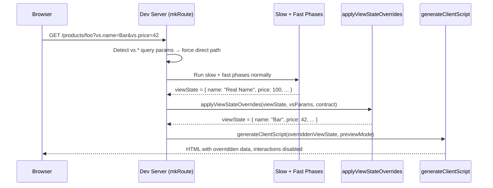

# Design Log #96: ViewState Query Params in Dev Server

## Background

The Jay dev server renders jay-html pages by running headless component logic (plugins, page.ts) through a three-phase pipeline (slow → fast → interactive). The resulting ViewState data fills `{binding}` expressions in jay-html templates.

Currently, the only way to see a page with specific data is to have the headless component produce it — either from a real backend/API or from hardcoded values. There is no way to quickly preview a page with arbitrary ViewState values without writing component code.

## Problem

When developing or reviewing jay-html templates, designers and developers need to see how a page looks with specific data — different product names, prices, stock states, long text, edge cases, etc. Today, this requires:

1. Modifying headless component code to return test values, or
2. Having a real backend that serves the desired data

This is slow and breaks the design-to-code workflow. We need a way to **override ViewState values via URL query parameters** so that browsing to:

```
/products/my-product?vs.name=Test+Product&vs.price=99.99&vs.inStock=true
```

fills the template's `{name}`, `{price}`, and `{inStock}` bindings with those override values instead of the values produced by headless component logic.

---

## How It Works

### Overview

The developer adds `vs.` prefixed query parameters to any jay-html page URL. The dev server detects these, runs the normal rendering phases to produce a base ViewState, then **overrides** the specified fields with values from the query params. The page renders in **preview mode** — data is visible but interactive elements are disabled to prevent real actions with mock data.



### The `vs.` Prefix

All ViewState query params use a `vs.` prefix to avoid collisions with route params, `_input`, or other framework query params:

```
/products/my-product?vs.title=Hello&vs.price=42&vs.inStock=false
```

The prefix is stripped before resolving the path: `vs.title` → `title`, `vs.product.name` → `product.name`.

Repeated params use last-wins: `?vs.name=A&vs.name=B` → `"B"`.

### Pipeline Integration

When `vs.*` params are detected in `mkRoute`:

1. **Bypass the slow render cache** — always use the direct rendering path (`handleDirectRequest`). This is a dev-time tool; caching adds complexity for no benefit.
2. **Run phases normally** — slow and fast phases execute as usual, producing the base ViewState. Phases are not skipped because the page may have multiple headless components and the user likely overrides only some fields. CarryForward data between phases is needed for non-overridden fields.
3. **Apply overrides** — after `deepMergeViewStates(slow, fast)`, apply the `vs.*` overrides on top of the final ViewState. This is a post-processing step in `handleDirectRequest`.
4. **Render in preview mode** — pass `previewMode: true` to `generateClientScript`.

### Dot-Path Notation

Nested ViewState fields are addressed with dot-separated paths:

```
vs.product.priceData.formatted.price=$99.00
```

This sets `viewState.product.priceData.formatted.price` to `"$99.00"`. The `setNestedValue` function walks the path, auto-creating intermediate objects as needed.

### Type Coercion

Query params are always strings, but ViewState fields have typed contracts. The contract (`<script type="application/jay-data" contract="...">`) is loaded and each param's path is looked up to find the declared `dataType`. Coercion rules:

| dataType | Coercion | On failure |
|----------|----------|------------|
| `string` | Use as-is | — |
| `number` | `Number(value)`, only if `Number.isFinite(result)` | Skip, warn |
| `boolean` | Only exact `"true"` → `true`, `"false"` → `false` | Skip, warn |
| `date` | `new Date(value).toISOString()`, only if valid (not `NaN`). Stored as ISO string | Skip, warn |
| `enum(a \| b \| c)` | Name → numeric index. Only valid indices accepted (0 to values.length-1) | Skip, warn |
| JSON value | `JSON.parse(value)` if starts with `[` or `{` | Skip, warn |

If no contract type is found (or the path doesn't match a contract tag), the raw string value is used.

`coerceValue` receives the full `ContractTag` (not just `dataType` string), since enum values are stored in `JayEnumType`. Contract tag lookup uses **camelCase comparison** — contract tags use `tag: "product type"`, but ViewState paths use `productType`. Uses the existing `camelCase` util from `compiler-jay-html/lib/case-utils`.

### Variant and Enum Support

**Boolean variants** (`type: variant, dataType: boolean`) — e.g., `isLoading`, `inStock`. These are just `boolean` in ViewState. `vs.isLoading=true` → `true`.

**Enum variants** (`type: variant, dataType: enum(digital | physical)`) — compile to TypeScript numeric enums (`digital = 0`, `physical = 1`). The coercion maps name to a valid index:

```
vs.productType=physical  →  1  (index in ["digital", "physical"])
vs.productType=1         →  1  (valid index: integer, 0 ≤ n < 2)
vs.productType=5         →  SKIP  (out of range)
vs.productType=1.5       →  SKIP  (not an integer)
```

**Dual-type tags** (`type: [data, variant]`) work identically — `dataType` determines coercion.

### Array Support

Arrays are included in v1. A key use case is previewing empty-vs-filled states and testing layout with varying item counts. Two mechanisms:

**Dot-path with auto-creation.** Numeric path segments are treated as array indices. `setNestedValue` auto-creates intermediate arrays and objects — if the array is empty or doesn't exist, items are created up to the required index. Array holes are filled with `{}` (no sparse arrays).

```
vs.products.0.name=Shirt&vs.products.0.price=25&vs.products.1.name=Pants
```

**JSON value for whole-array replacement.** If a value starts with `[` or `{`, it's parsed as JSON:

```
vs.products=[{"name":"Shirt","price":25},{"name":"Pants","price":50}]
```

JSON values also work for objects: `vs.priceData={"currency":"USD","price":42}`.

**Mixed methods** are supported. Processing order: JSON replacements first (sorted by path length, shortest first), then dot-path overrides. This allows setting a complex object via JSON then tweaking specific fields.

### Headless Component Support

**Key-based headless components** (`key="product"`) — ✅ works automatically. Their ViewState lives at `viewState.product.*`, so `vs.product.name=Foo` works through the normal dot-path mechanism.

**Keyless inline instances** (`<jay:productCard>`) — ❌ deferred. Their ViewState is stored in `viewState.__headlessInstances` keyed by internal DOM coordinates (e.g., `"0:3"`), which are not meaningful in a URL. Future options: `vs-instance.productCard.0.title=Foo` (name+index) or explicit `id` attributes on instances.

### Preview Mode

When `vs.*` overrides are active, the page enters **preview mode** to prevent real actions (Add to Cart, Submit, Delete) from firing with mock data:

1. **No interactive components** — `generateClientScript` receives `[]` for `compositeParts`. No client-side event handlers are mounted. Ref elements render but are inert. This is already a supported pattern in the architecture (Design Log #72: components without `.withInteractive()`).
2. **Visual banner** — a small banner at the top: "ViewState Preview Mode — interactions disabled".
3. **Disabled ref styling** — injected CSS: `[ref] { pointer-events: none; opacity: 0.6; }`.

### Safety

**Prototype pollution prevention.** `setNestedValue` rejects paths containing `__proto__`, `constructor`, or `prototype` segments. Blocked overrides are skipped with a warning.

```typescript
const BLOCKED_SEGMENTS = new Set(['__proto__', 'constructor', 'prototype']);
```

**Non-fatal error handling.** All coercion failures are graceful — the override is skipped, the original ViewState value is preserved, and a warning is logged. The page always renders. `coerceValue` returns a `CoerceResult` discriminated union so the caller can log structured warnings:

| Failure | Behavior |
|---------|----------|
| `Number("abc")` → `NaN` | Skip override, log warning |
| `"tru"` for boolean field | Skip override, log warning (only exact `"true"`/`"false"` accepted) |
| `new Date("bad")` → Invalid Date | Skip override, log warning |
| `JSON.parse("{bad")` → SyntaxError | Skip override, log warning |
| Enum value not in list, or numeric but out of range / non-integer | Skip override, log warning |
| Blocked path segment (`__proto__`) | Skip override, log warning |

---

## Design

### Key Components

#### 1. Query Param Extraction (`extractViewStateParams`)

```typescript
function extractViewStateParams(
    query: Record<string, string | string[]>
): Record<string, string> | undefined
```

- Filters query params starting with `vs.`
- Strips the prefix: `vs.product.name` → `product.name`
- Last-wins for repeated params (takes last element if array)
- Returns `undefined` if no `vs.` params found (normal request flow)

#### 2. Type-Aware Override Application (`applyViewStateOverrides`)

```typescript
function applyViewStateOverrides(
    viewState: object,
    overrides: Record<string, string>,
    contract?: Contract,
    headlessContracts?: HeadlessContractInfo[],
): object
```

- Sorts overrides: JSON replacements first (by path length), then dot-path overrides
- For each override entry:
  1. Split the path by `.`, check path safety (blocklist)
  2. Look up the contract tag at that path to find `dataType`
  3. Coerce the string value to the correct type
  4. If coercion succeeds, set the value at the nested path
  5. If coercion fails, skip and log warning

#### 3. Contract Tag Lookup (`findContractTag`)

```typescript
function findContractTag(
    path: string[],
    contract?: Contract,
    headlessContracts?: HeadlessContractInfo[],
): ContractTag | undefined
```

- Walks path segments through the contract tag tree
- First segment may match a headless contract key (e.g., `product` → headless key `product`)
- **camelCase-compares** path segments against contract tag names
- Numeric segments (array indices) skip into the sub-contract's tags (the repeated container)
- Returns the tag for type information, or `undefined` if not found

#### 4. Type Coercion (`coerceValue`)

Pseudocode — actual implementation should use `JayTypeKind` enum values and `isEnumType()` from `compiler-shared`. Returns `{ value, ok }` so caller can log on failure:

```typescript
type CoerceResult = { value: unknown; ok: true } | { ok: false; reason: string };

function coerceValue(rawValue: string, tag?: ContractTag): CoerceResult {
    // JSON values (arrays or objects) — parse regardless of contract type
    if (rawValue.startsWith('[') || rawValue.startsWith('{')) {
        try { return { value: JSON.parse(rawValue), ok: true }; }
        catch { return { ok: false, reason: `invalid JSON: ${rawValue}` }; }
    }

    const dataType = tag?.dataType;
    if (!dataType) return { value: rawValue, ok: true }; // no type info → string

    // Enum type: match by name → index, or accept valid integer index
    if (isEnumType(dataType)) {
        const idx = dataType.values.indexOf(rawValue);
        if (idx !== -1) return { value: idx, ok: true };
        const num = Number(rawValue);
        if (Number.isInteger(num) && num >= 0 && num < dataType.values.length) return { value: num, ok: true };
        return { ok: false, reason: `"${rawValue}" is not a valid enum value (${dataType.values.join(', ')})` };
    }

    switch (dataType.kind) {
        case 'number': {
            const num = Number(rawValue);
            if (Number.isFinite(num)) return { value: num, ok: true };
            return { ok: false, reason: `"${rawValue}" is not a valid number` };
        }
        case 'boolean': {
            if (rawValue === 'true') return { value: true, ok: true };
            if (rawValue === 'false') return { value: false, ok: true };
            return { ok: false, reason: `"${rawValue}" is not a valid boolean (expected "true" or "false")` };
        }
        case 'date': {
            const date = new Date(rawValue);
            if (isNaN(date.getTime())) return { ok: false, reason: `"${rawValue}" is not a valid date` };
            return { value: date.toISOString(), ok: true };
        }
        default: return { value: rawValue, ok: true };
    }
}
```

#### 5. Integration Points

In `mkRoute` handler — detect overrides and force direct path:

```typescript
const vsParams = extractViewStateParams(req.query);

if (vsParams) {
    await handleDirectRequest(/* ... with vsParams ... */);
} else {
    // Existing cache/pre-render/direct logic
}
```

In `handleDirectRequest` — apply overrides after merge:

```typescript
if (vsParams) {
    viewState = applyViewStateOverrides(viewState, vsParams, pageContract, headlessContracts);
}
```

In `sendResponse` — enable preview mode:

```typescript
await sendResponse(vite, res, url, jayHtmlPath, pageParts, viewState, carryForward,
    clientTrackByMap, projectInit, pluginsForPage, options, undefined, timing,
    { previewMode: !!vsParams });
```

### File Changes

| File | Change |
|------|--------|
| `dev-server/lib/dev-server.ts` | Extract `vs.*` params in `mkRoute`, pass to `handleDirectRequest`, apply overrides after merge |
| `dev-server/lib/viewstate-query-params.ts` | **New file**: `extractViewStateParams`, `applyViewStateOverrides`, `findContractTag`, `coerceValue`, `isPathSafe` |
| `dev-server/lib/dev-server.ts` (`handleDirectRequest`) | Accept optional `vsParams`, load contract for type lookup, apply overrides |
| `stack-server-runtime/lib/generate-client-script.ts` | Accept `previewMode` option: skip `compositeParts`, inject preview banner + disabled ref styles |

---

## Implementation Plan

### Phase 1: Core Override Logic

1. Create `dev-server/lib/viewstate-query-params.ts` with:
   - `extractViewStateParams(query)` — filter and strip `vs.` prefix. Last-wins for repeated params
   - `isPathSafe(segments)` — block `__proto__`, `constructor`, `prototype`
   - `coerceValue(value, tag)` → `CoerceResult` — type coercion with strict validation: NaN check for numbers, exact true/false for booleans, valid Date check, try/catch for JSON
   - `setNestedValue(obj, path, value)` — deep set by dot-path with auto-creation of intermediate arrays/objects. Ensure array holes are filled with empty objects `{}`
   - `applyViewStateOverrides(viewState, overrides, contract, headlessContracts)` — main orchestration. Sort keys to apply JSON replacements before dot-path overrides. Log warnings for failed coercions and blocked paths
   - `findContractTag(path, contract, headlessContracts)` — contract tag lookup for type info

2. Write unit tests for each function

### Phase 2: Dev Server Integration

1. In `mkRoute` handler:
   - Extract `vs.*` params from `req.query`
   - If present, force the direct request path (bypass cache)
2. In `handleDirectRequest`:
   - Accept optional `vsParams` parameter
   - Load the page's main contract via `fs.readFile` + `parseContract` on the `.jay-contract` file (same pattern as `preRenderJayHtml`)
   - Use headless contracts already available from `loadPageParts` result (`headlessContracts`)
   - After final ViewState merge, apply overrides: `applyViewStateOverrides(viewState, vsParams, contract, headlessContracts)`
   - Log applied overrides via `getDevLogger()`: field names, coerced types (consistent with Design Log #83)
3. In `sendResponse` / `generateClientScript`:
   - When vs overrides are active, pass `previewMode: true` to `generateClientScript`
   - In preview mode: pass `[]` for `compositeParts` (disables interactive components), inject preview banner and `[ref] { pointer-events: none; opacity: 0.6; }` style

### Phase 3: Testing

1. Unit tests for `viewstate-query-params.ts`:
   - `extractViewStateParams`: prefix filtering, no vs params, mixed params, repeated params (last-wins), array values
   - `isPathSafe`: block `__proto__`, `constructor`, `prototype`; allow normal segments
   - `coerceValue`: string, number, boolean, date, enum (name→index and valid integer index), JSON arrays, JSON objects, fallback to string. Failure cases: NaN, invalid bool, invalid date, bad JSON, unknown enum, **enum out-of-range, enum non-integer, enum negative** — all return `{ ok: false }`. **Date produces ISO string, not Date object**
   - `setNestedValue`: flat, nested, missing intermediate objects, auto-create arrays for numeric segments, create items beyond array bounds (verify no undefined holes), blocked paths are never reached (caller skips)
   - `applyViewStateOverrides`: full integration with contract-based coercion; mixed JSON/dot-path precedence; failed coercions don't mutate ViewState; blocked paths don't mutate ViewState
   - `findContractTag`: page contract, headless contract, nested tags, missing paths

2. Integration test (if feasible with dev server test mode):
   - Start dev server, request page with `vs.*` params, verify rendered output contains overridden values
   - Verify preview mode: interactive elements are inert, banner is visible

---

## Examples

### Simple override

Contract:
```yaml
data:
  - tag: title
    type: data
    dataType: string
  - tag: price
    type: data
    dataType: number
    phase: fast
  - tag: inStock
    type: data
    dataType: boolean
    phase: fast
```

Jay-html:
```html
<h1>{title}</h1>
<span>{price}</span>
<span if="inStock">In Stock</span>
```

Request:
```
GET /product/123?vs.title=Custom+Title&vs.price=42.5&vs.inStock=false
```

Result: ViewState `{ title: "Custom Title", price: 42.5, inStock: false, ... }` (other fields from headless component).

### Nested headless component override

Jay-html with headless component:
```html
<script type="application/jay" src="..." key="product" />
...
<div>{product.name}</div>
<div>{product.priceData.formatted.price}</div>
```

Request:
```
GET /product/123?vs.product.name=Test&vs.product.priceData.formatted.price=$99.00
```

Result: `product.name` and `product.priceData.formatted.price` overridden; rest of product data from headless component.

### Variant override — boolean

Contract:
```yaml
data:
  - tag: isLoading
    type: variant
    dataType: boolean
    phase: fast+interactive
```

Request:
```
GET /dashboard?vs.isLoading=true
```

Result: `isLoading` → `true` (boolean, not string). Jay-html `<div if="isLoading">` renders.

### Variant override — enum

Contract:
```yaml
data:
  - tag: productType
    type: [data, variant]
    dataType: enum (digital | physical)
```

Request:
```
GET /product/123?vs.productType=digital
```

Result: `productType` → `0` (numeric enum index for `"digital"`). Jay-html `<span if="productType.digital">` renders.

### Array — override existing items

Phases produce `products: [{id: "1", name: "Shirt", price: 25}, {id: "2", name: "Pants", price: 50}]`.

```
GET /shop?vs.products.0.name=Custom+Shirt&vs.products.1.price=99
```

Result: `products[0].name` → `"Custom Shirt"`, `products[1].price` → `99`. Other fields untouched.

### Array — create items from empty state (dot-path)

Phases produce `products: []` (empty list). User wants to test how layout looks with items:

```
GET /shop?vs.products.0.name=Shirt&vs.products.0.price=25&vs.products.1.name=Pants&vs.products.1.price=50
```

Result: `products` → `[{name: "Shirt", price: 25}, {name: "Pants", price: 50}]`. Items created from scratch.

### Array — create items from empty state (JSON)

Same scenario, but using JSON for a more complete override:

```
GET /shop?vs.products=[{"id":"1","name":"Shirt","price":25},{"id":"2","name":"Pants","price":50}]
```

Result: `products` replaced entirely with the JSON array.

### Mixed Method Override

```
GET /shop?vs.products=[{"name":"A"},{"name":"B"}]&vs.products.1.name=Modified
```

Result: `products` is first set to `[{"name":"A"},{"name":"B"}]`, then `products[1].name` is updated to `"Modified"`. Final: `[{"name":"A"},{"name":"Modified"}]`.

### No vs params — normal flow

```
GET /product/123
```

No `vs.*` params detected → existing behavior, no changes.

---

## Trade-offs

| Decision | Pro | Con |
|----------|-----|-----|
| `vs.` prefix | No collision with route/framework params | Slightly more typing |
| Always use direct path | Simple, no cache invalidation concerns | Slower than cached path for override requests |
| Run phases then override | Full ViewState available, simple merge | Wasted computation on overridden fields |
| Contract-based type coercion | Correct types for number/boolean | Requires contract loading; graceful fallback to string |
| Arrays via dot-path + JSON | Covers both tweaking existing items and creating from scratch | Dot-path for many items is verbose; JSON values need URL encoding |
| Mixed method precedence | Powerful flexibility (reset then tweak) | Requires stricter processing order |
| Auto-fill array holes | Prevents runtime crashes on sparse arrays | Might create "dummy" objects that look valid but are incomplete |
| Non-fatal coercion errors | Page always renders; developer gets warnings | Silently ignored bad values might confuse |
| Path segment blocklist | Prevents prototype pollution | Minimal; only blocks 3 well-known keys |
| Disable interactive refs in preview | Prevents real actions with mock data | Page looks slightly different from normal mode (disabled buttons, banner) |
| No keyless headless instance support in v1 | Avoids exposing internal coordinates | Can't override `<jay:xxx>` instance data (key-based headless already works via dot-path) |

---

## Verification Criteria

**Functional:**
1. A page requested with `vs.title=Foo` renders "Foo" in the `{title}` binding
2. A page requested with `vs.price=42` renders `42` (number, not string "42") in the `{price}` binding
3. A page requested without `vs.*` params behaves identically to today
4. Nested paths (`vs.product.name=Bar`) correctly set the nested field
5. Unknown paths (not in contract) are applied as string values without error
6. Boolean variant coercion: `vs.isLoading=true` → `true`, `vs.isLoading=false` → `false`
7. Enum variant coercion: `vs.productType=digital` → `0` (numeric enum index)
8. Array item override: `vs.products.0.name=Foo` sets the first product's name
9. Array creation from empty: `vs.products.0.name=Foo` when `products` is `[]` creates `[{name: "Foo"}]`
10. JSON value: `vs.products=[...]` replaces the entire array with parsed JSON
11. JSON value: `vs.priceData={...}` replaces the entire object with parsed JSON
12. Mixed methods: `vs.list=[...]` AND `vs.list.0.val=X` works correctly (list set, then item updated)
13. Array holes: `vs.list.2.val=X` on empty list creates 3 items, where index 0 and 1 are `{}` (not undefined)
14. Repeated params: `vs.name=A&vs.name=B` → last wins (`"B"`)

**Safety:**
15. Prototype pollution: `vs.__proto__.polluted=true` is blocked and logged as warning
16. `vs.constructor.polluted=true` is blocked
17. Invalid number: `vs.price=abc` → override skipped, warning logged, original value preserved
18. Invalid boolean: `vs.inStock=tru` → override skipped, warning logged
19. Invalid date: `vs.date=not-a-date` → override skipped, warning logged
20. Invalid JSON: `vs.data={bad` → override skipped, warning logged
21. Enum out-of-range: `vs.productType=5` for `enum(digital | physical)` → override skipped, warning logged
22. Enum non-integer: `vs.productType=1.5` → override skipped, warning logged
23. Enum negative: `vs.productType=-1` → override skipped, warning logged
24. Date coercion produces ISO string: `vs.date=2024-01-15` → `"2024-01-15T00:00:00.000Z"` (string, not Date object)

**Preview mode:**
25. When vs overrides are active, interactive components (buttons, inputs) do not fire event handlers
26. A visual banner indicates "ViewState Preview Mode"
27. Ref elements appear visually disabled (reduced opacity, no pointer events)

---

## Appendix: Q&A Reference

Design decisions captured as questions during the design process. The answers are reflected in the design above; this section preserves the original reasoning.

### Q1: Should query param overrides replace the entire ViewState or merge into it?

**A: Merge.** Query params override only the specified fields. The rest of the ViewState still comes from headless components. This lets you override just `inStock=false` while keeping all other product data from the real source.

### Q2: Should we skip running headless component phases entirely when query params are present?

**A: No.** Run the phases normally, then override the specified fields. Reasons:
- The page may have multiple headless components; query params likely target only some fields
- CarryForward data between phases may be needed for fields the user isn't overriding
- Headless instances (`<jay:xxx>`) have their own ViewState that wouldn't make sense to skip
- Simpler implementation: the override is a post-processing step

### Q3: How do we handle nested paths like `product.priceData.formatted.price`?

**A: Dot-notation in query param names.** Example: `?vs.product.name=Foo&vs.product.price=42`. The dot-separated path (after stripping the `vs.` prefix) is used to set the value at the correct nesting level in the ViewState object.

### Q4: How do we handle type coercion? Query params are always strings, but ViewState fields can be `number`, `boolean`, etc.

**A: Use the contract for type inference.** The jay-html already references a contract. Load it, look up each query param path, find the declared `dataType`, and coerce. If no contract type is found, keep the raw string value. All failures are non-fatal (see Q15).

### Q5: Should this work for headless components?

**A: Two cases — one works already, one is deferred.**

**Key-based headless components** (declared with `key="product"`): ✅ Works automatically. Their ViewState lives under their key in the top-level ViewState, so `vs.product.name=Foo` works through the normal dot-path mechanism.

**Keyless inline instances** (`<jay:productCard>`): ❌ Deferred. Their ViewState is stored in `viewState.__headlessInstances` keyed by DOM coordinate strings like `"0:3"`. These coordinates are internal and not meaningful to the user.

**Future approach for keyless instances:** Introduce a `vs-instance.` prefix with a stable addressing scheme:
- **By component name + index**: `vs-instance.productCard.0.title=Foo`
- **By explicit id attribute**: `<jay:productCard id="featured">` → `vs-instance.featured.title=Foo`

### Q6: Should we support arrays/repeated sub-contracts?

**A: Yes, include in v1.** Arrays are common and a key use case is previewing empty-vs-filled states. Two mechanisms: dot-path with auto-creation (numeric path segments as array indices), and JSON value for whole-array replacement.

### Q7: How do we avoid conflicts with existing query param usage?

**A: Use a `vs.` prefix.** Avoids collision with route params, `_input`, or any future framework query params.

### Q8: Should this affect the slow render cache?

**A: No.** Bypass the slow render cache entirely when `vs.*` params are present. Use the direct rendering path.

### Q9: Where exactly in the pipeline should overrides be applied?

**A: After the final ViewState is computed, before `sendResponse`.** Since we bypass the cache (Q8), overrides only need to go in `handleDirectRequest`.

### Q10: Should the pre-rendered (slow-baked) jay-html also reflect overrides?

**A: N/A** — per Q8, we bypass the cache path entirely. The direct path sends the full merged ViewState to the client.

### Q11: How do variant tags and enum types work with query param overrides?

**A: Variant tags work naturally based on their `dataType`.** Boolean variants use boolean coercion. Enum variants map name to numeric index (`"physical"` → `1`); numeric values are only accepted if they are valid integer indices within the enum's range. Dual-type tags (`type: [data, variant]`) work identically.

### Q12: Can we mix JSON and dot-path overrides? Which takes precedence?

**A: Yes, with specific precedence.** JSON replacements first (sorted by path length, shortest first), then dot-path overrides. This allows setting a complex object via JSON then tweaking specific fields.

### Q13: How do we handle "holes" when creating arrays?

**A: Auto-create objects with defaults.** If `vs.items.2.name=foo` on an empty array, indices 0 and 1 are filled with `{}` (no sparse arrays). For V1, `{}` is the baseline; future improvement could populate defaults from the contract.

### Q14: How do we prevent prototype pollution via dot-path injection?

**A: Blocklist dangerous path segments.** Reject paths containing `__proto__`, `constructor`, or `prototype` before any object traversal. Skip the override and log a warning.

### Q15: What happens when coercion fails? (error handling policy)

**A: Non-fatal. Keep original value, log warning.** All coercion failures are gracefully handled — the override is skipped, the original ViewState value is preserved, and a warning is logged. The page always renders.

### Q16: Should interactive refs (buttons, inputs) be disabled when overrides are active?

**A: Yes.** Preview mode: pass `[]` for `compositeParts` (no event handlers), inject a visual banner, and disable pointer events on ref elements. This prevents real backend actions with mock data.

### Q17: What happens when the same vs.* param appears multiple times?

**A: Last value wins.** `extractViewStateParams` takes the last element when the value is an array. Deterministic and consistent with standard HTTP convention.
