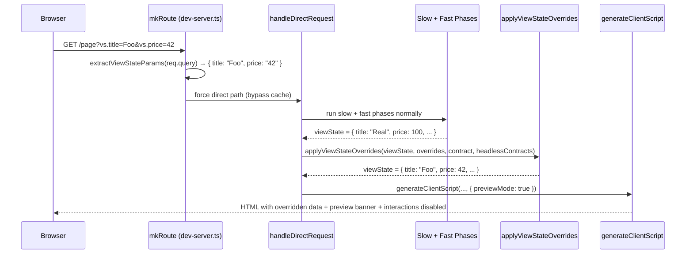

# ViewState Query Params — System Design

> Companion to Design Log #96. This document is the engineering reference for implementation.

---

## 1. What We're Building

A dev-time feature that lets anyone override ViewState values via URL query parameters. Navigate to:

```
/products/my-product?vs.name=Test+Product&vs.price=99.99&vs.inStock=true
```

The page renders with the overridden values instead of the values produced by headless component logic. A preview banner indicates that interactions are disabled.

**This is a dev-server-only feature.** It does not affect production builds.

---

## 2. Architecture Overview



**No `vs.*` params?** → Existing behavior, zero changes to the normal path.

---

## 3. Components

### 3.1 New File: `dev-server/lib/viewstate-query-params.ts`

All new logic lives in a **single new file** — pure functions, fully unit-testable, no side effects.

#### `extractViewStateParams`

```typescript
function extractViewStateParams(
    query: Record<string, string | string[]>
): Record<string, string> | undefined
```

- Filters keys starting with `vs.`, strips prefix
- Last-wins for repeated params (takes last element if array)
- Returns `undefined` when no `vs.*` keys found (signals normal flow)

#### `isPathSafe`

```typescript
function isPathSafe(segments: string[]): boolean
```

- Returns `false` if any segment is `__proto__`, `constructor`, or `prototype`
- Prevents prototype pollution attacks

#### `coerceValue`

```typescript
type CoerceResult =
    | { value: unknown; ok: true }
    | { ok: false; reason: string };

function coerceValue(rawValue: string, tag?: ContractTag): CoerceResult
```

Type coercion based on `ContractTag.dataType`:

| dataType | Coercion | Failure |
|----------|----------|---------|
| _(none / unknown type)_ | Return raw string | — |
| `string` | As-is | — |
| `number` | `Number(value)` + `Number.isFinite` check | `{ ok: false }` |
| `boolean` | Only exact `"true"` / `"false"` | `{ ok: false }` |
| `Date` | `new Date(value).toISOString()` if valid | `{ ok: false }` |
| `enum(a\|b\|c)` | Name → index, or valid integer index (0 ≤ n < length) | `{ ok: false }` |

**JSON shortcut:** If value starts with `[` or `{`, attempt `JSON.parse` regardless of declared type.

**Critical type system detail:** All primitive types (`string`, `number`, `boolean`, `Date`) are `JayAtomicType` instances with `kind = JayTypeKind.atomic`. They are distinguished by `name`, not `kind`. Use `isAtomicType(dataType)` guard first, then switch on `dataType.name`. Note that date is `'Date'` (capital D), matching `JayDate.name`.

```typescript
if (isEnumType(dataType)) { /* enum logic using dataType.values */ }
else if (isAtomicType(dataType)) {
    switch (dataType.name) {
        case 'number': { /* Number() + isFinite check */ }
        case 'boolean': { /* exact "true"/"false" */ }
        case 'Date':   { /* new Date() + isNaN check → toISOString() */ }
        default: return { value: rawValue, ok: true }; // string, Unknown, etc.
    }
}
```

Uses `isEnumType()` and `isAtomicType()` type guards from `@jay-framework/compiler-shared`.

#### `setNestedValue`

```typescript
function setNestedValue(obj: Record<string, unknown>, path: string[], value: unknown): void
```

- Walks dot-separated path segments, auto-creating intermediates
- Numeric segments → array indices; creates intermediate arrays
- Fills array holes with `{}` (no sparse arrays)
- Mutates `obj` in place

#### `findContractTag`

```typescript
function findContractTag(
    path: string[],
    contract?: Contract,
    headlessContracts?: HeadlessContractInfo[],
): ContractTag | undefined
```

- Walks path through contract tag tree
- First segment may match a headless contract key
- Uses **camelCase comparison** (import `camelCase` from `@jay-framework/compiler-jay-html` — see prerequisites in Key Imports)
- Numeric segments skip into the sub-contract's tags (array items)
- Returns tag for type info, or `undefined` if path not in contract

#### `applyViewStateOverrides`

```typescript
function applyViewStateOverrides(
    viewState: object,
    overrides: Record<string, string>,
    contract?: Contract,
    headlessContracts?: HeadlessContractInfo[],
): object
```

Orchestration function:
1. Partition overrides into JSON replacements (value starts with `[` or `{`) and dot-path overrides
2. Apply JSON replacements first, sorted by path length (shortest first)
3. Apply dot-path overrides
4. For each override: check `isPathSafe` → `findContractTag` → `coerceValue` → `setNestedValue`
5. On failure: skip, log warning, preserve original value

Returns the mutated viewState object.

### 3.2 Modified: `dev-server/lib/dev-server.ts`

**Three surgical changes:**

| Location | Change |
|----------|--------|
| `mkRoute` | Call `extractViewStateParams(req.query)`. If result is defined, force `handleDirectRequest` (bypass cache) and pass `vsParams`. |
| `handleDirectRequest` | Accept optional `vsParams`. After ViewState merge, if `vsParams`: load page contract via `parseContract`, call `applyViewStateOverrides`. |
| `sendResponse` call | Pass `{ previewMode: !!vsParams }` to `generateClientScript` options. |

**Contract loading:**
- **Page contract:** Read the `.jay-contract` file (same path as `.jay-html` with extension swap), parse with `parseContract` + `checkValidationErrors`. Graceful if file doesn't exist (return `undefined`).
- **Headless contracts:** Already available from `loadPageParts` return value. The `pagePartsResult.val` object has a `headlessContracts: HeadlessContractInfo[]` field (key-based headless components with their parsed contracts). Currently `handleDirectRequest` only destructures `parts`, `serverTrackByMap`, `clientTrackByMap`, `usedPackages` — add `headlessContracts` to the destructuring.

### 3.3 Modified: `stack-server-runtime/lib/generate-client-script.ts`

**One option added to `GenerateClientScriptOptions`:**

```typescript
export interface GenerateClientScriptOptions {
    enableAutomation?: boolean;
    slowViewState?: object;
    previewMode?: boolean;  // NEW
}
```

When `previewMode: true`, inside `generateClientScript`:
1. Override the local `compositeParts` variable to `'[]'` (this is a string variable built from the `parts` parameter — it controls whether client-side event handlers mount). The `parts` parameter itself is unchanged; we just short-circuit the local variable.
2. Inject preview banner HTML at top of body
3. Inject CSS: `<style>[ref] { pointer-events: none; opacity: 0.6; }</style>`

### 3.4 Modified: `dev-server/lib/dev-server.ts` — `sendResponse`

`sendResponse` (line 783) constructs the `GenerateClientScriptOptions` object inline before calling `generateClientScript`. It needs to receive `previewMode` and pass it through.

**Two options (pick one):**

- **A (Recommended): Add a parameter.** Add `previewMode?: boolean` as the last parameter of `sendResponse`. Pass it into the options object:
  ```typescript
  { enableAutomation: !options.disableAutomation, slowViewState, previewMode }
  ```
  The two callers (`handleCachedRequest`, `handleDirectRequest`) pass `undefined` / `false` normally, and `handleDirectRequest` passes `!!vsParams` when overrides are active.

- **B: Use an options object.** Replace the last few positional params with an options bag. Cleaner long-term but larger diff — avoid for this feature.

---

## 4. Data Flow Detail

```
req.query                           Contract (YAML)
    │                                    │
    ▼                                    ▼
extractViewStateParams()          parseContract()
    │                                    │
    ▼                                    ▼
overrides: Record<string,string>   contract: Contract
    │                                    │
    └─────────────┬──────────────────────┘
                  ▼
       applyViewStateOverrides()
           │
           ├─ for each override:
           │   ├─ isPathSafe(segments)         → skip if unsafe
           │   ├─ findContractTag(segments)    → ContractTag | undefined
           │   ├─ coerceValue(value, tag)      → CoerceResult
           │   └─ setNestedValue(obj, path, v) → mutate viewState
           │
           ▼
       overridden viewState
```

---

## 5. Key Imports

```typescript
// From compiler-jay-html (all re-exported from main index)
import { Contract, ContractTag, parseContract } from '@jay-framework/compiler-jay-html';
import type { HeadlessContractInfo } from '@jay-framework/compiler-jay-html';

// From compiler-shared
import { isEnumType, isAtomicType, checkValidationErrors } from '@jay-framework/compiler-shared';
import type { JayType, JayEnumType, JayAtomicType } from '@jay-framework/compiler-shared';
```

**`camelCase` import — requires a prerequisite change:**

`camelCase` lives in `compiler-jay-html/lib/case-utils.ts` but is NOT re-exported from the package's main index, and the package only has a `"."` export in its `exports` map.

**Required:** Add `camelCase` to `compiler-jay-html/lib/index.ts`:

```typescript
export { camelCase } from './case-utils';
```

Then import as: `import { camelCase } from '@jay-framework/compiler-jay-html';`

This is a one-line, non-breaking change to a stable internal utility. Do this at the start of Phase 1 before writing any override logic.

---

## 6. What's NOT in Scope (v1)

| Feature | Why deferred |
|---------|-------------|
| Keyless headless instances (`<jay:xxx>`) | Internal DOM coordinates not meaningful in URLs |
| Linked sub-contract deep resolution | Adds complexity; can be added later |
| Contract defaults for array holes | v1 fills with `{}`, future can use contract defaults |
| Production support | Dev-time tool only |

---

## 7. Safety Guarantees

1. **Prototype pollution**: Blocked path segments (`__proto__`, `constructor`, `prototype`)
2. **Non-fatal errors**: All coercion failures skip the override, log warning, preserve original value. The page always renders.
3. **No side effects with mock data**: Preview mode disables all interactive components and ref event handlers
4. **Cache bypass**: `vs.*` params always use direct rendering path — no stale cache issues

---

## 8. Dependencies

| Package | Used for |
|---------|----------|
| `@jay-framework/compiler-jay-html` | `Contract`, `ContractTag`, `HeadlessContractInfo`, `parseContract`, `camelCase` |
| `@jay-framework/compiler-shared` | `isEnumType`, `isAtomicType`, `JayEnumType`, `JayAtomicType` |
| `@jay-framework/logger` | `getDevLogger()` for warning output |

No new external dependencies needed.
