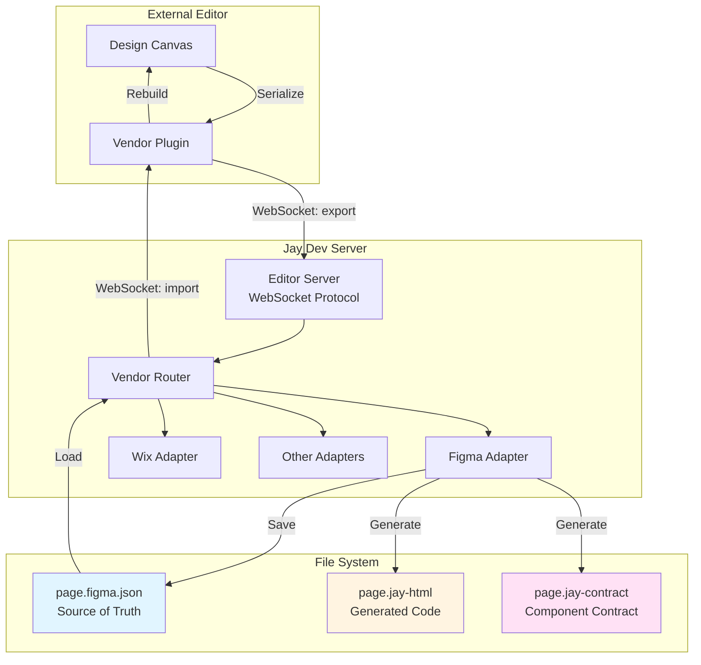
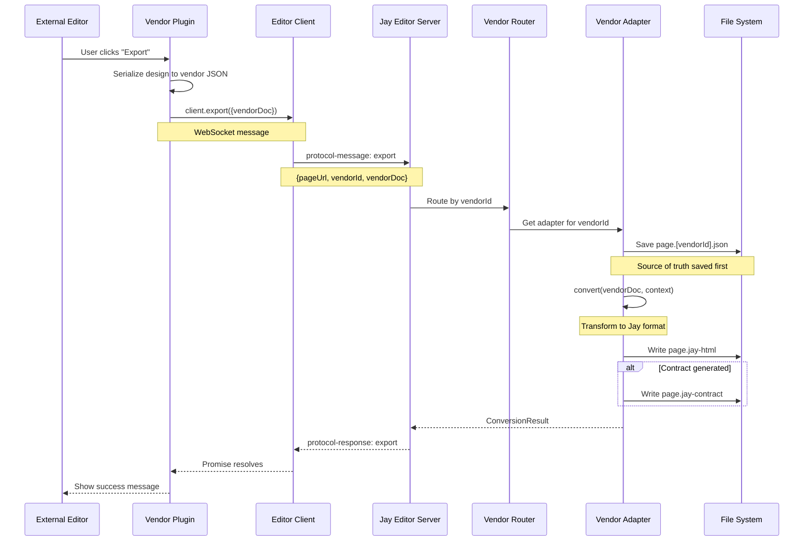
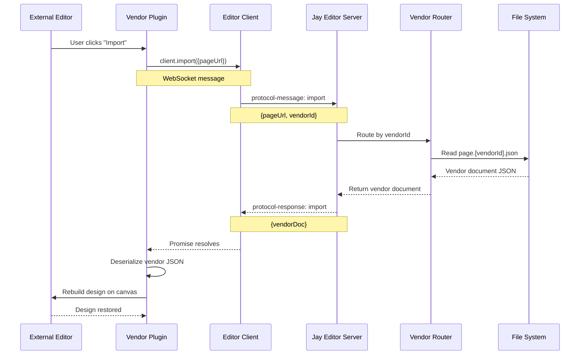
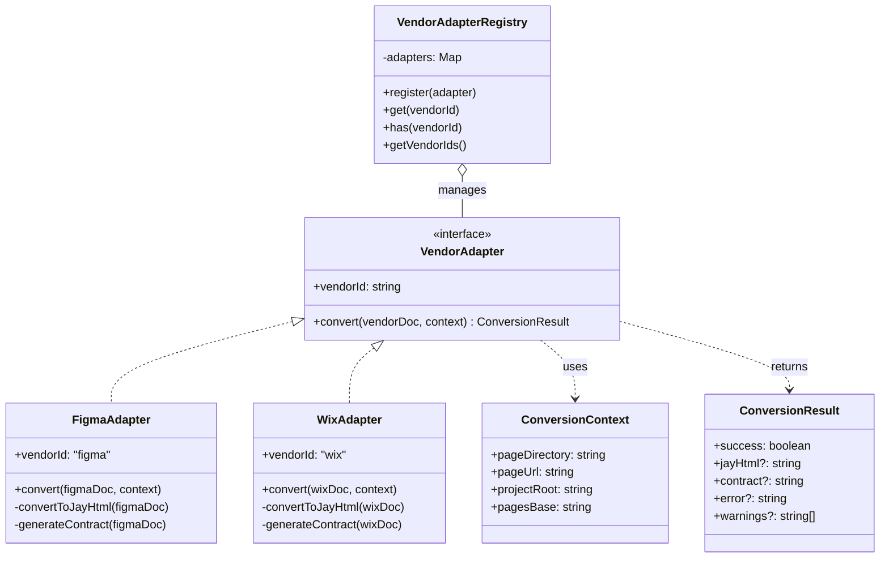
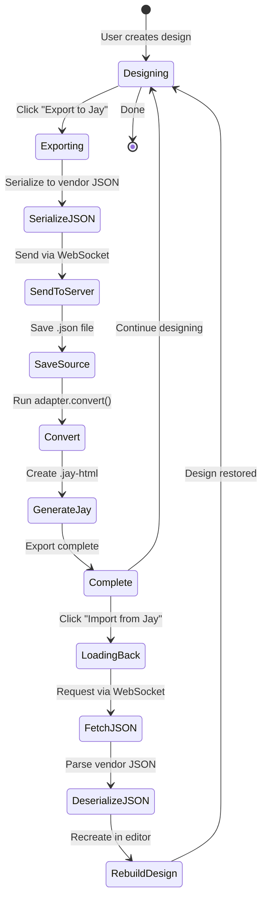
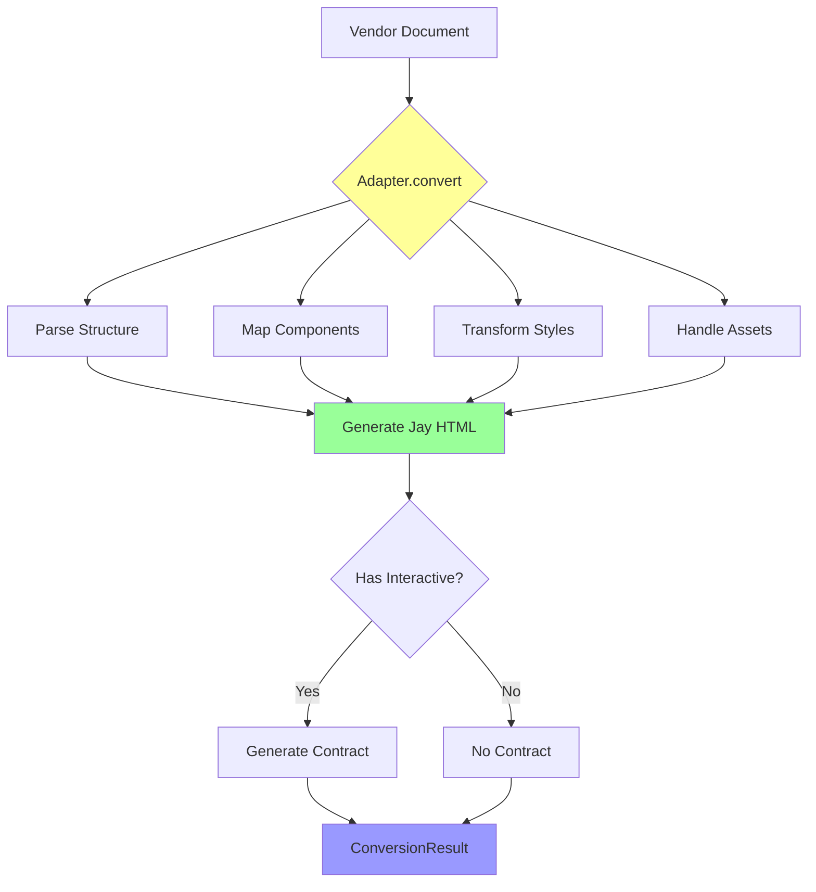
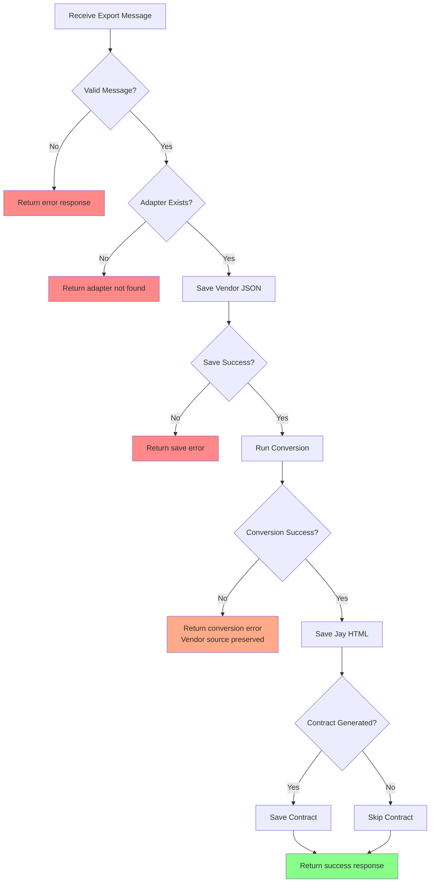

# Vendor Integration Architecture Diagrams

## System Overview



## Export Flow (Editor → Jay)



## Import Flow (Jay → Editor)



## Adapter Architecture



## File Structure After Export

```mermaid
graph LR
    subgraph "Project Root"
        A[src/pages/]

        subgraph "home/"
            B[page.figma.json]
            C[page.jay-html]
            D[page.jay-contract]
            E[page.ts]
        end

        subgraph "products/[id]/"
            F[page.figma.json]
            G[page.jay-html]
            H[page.jay-contract]
        end
    end

    A --> home/
    A --> products/[id]/

    style B fill:#e1f5ff
    style C fill:#fff4e1
    style D fill:#ffe1f5
    style F fill:#e1f5ff
    style G fill:#fff4e1
    style H fill:#ffe1f5
```

## Data Flow: Design Changes



## Vendor Adapter Extension Points



## Error Handling Flow


