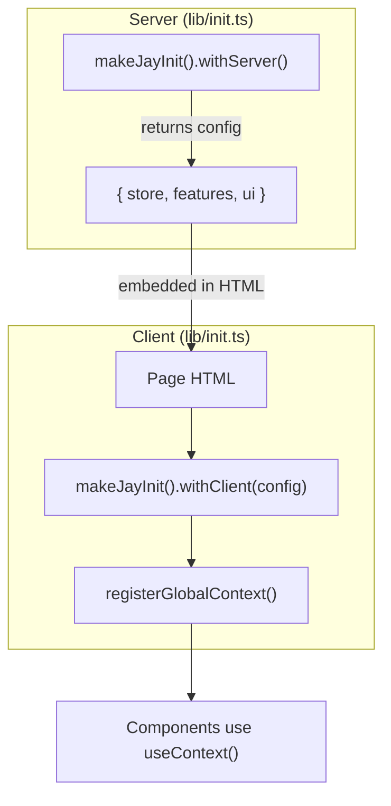

# Jay Stack Fake Shop Example

This example demonstrates how to use Jay Stack with **services dependency injection** for server-side infrastructure.

## Services Architecture

This example showcases the new services pattern for managing server-side dependencies like databases and business logic services.

## Configuration

The `.jay` file in this directory configures the port ranges for both servers (YAML format):

```yaml
devServer:
  portRange: [3000, 3010]
  pagesBase: './src/pages' # Directory containing your Jay pages
  publicFolder: './public' # Directory for static files (CSS, JS, images, etc.)
editorServer:
  portRange: [3011, 3020]
  # editorId will be automatically set when an editor connects
```

## Usage

1. Install dependencies:
   ```bash
   npm install
   ```
2. Start the dev and editor servers:
   ```bash
   npm run dev
   ```

The CLI will automatically find available ports within the specified ranges and start both servers. You should see output like:

```
🚀 Jay Stack CLI started successfully!
📱 Dev Server: http://localhost:3000
🎨 Editor Server: http://localhost:3011 (ID: init)
📁 Pages directory: ./src/pages
📁 Public folder: ./public
```

You can now develop and edit your Jay app using these servers. Static files in the `public` folder will be served automatically.

## Services

The fake-shop uses two services:

### 1. ProductsDatabaseService (`src/products-database.ts`)

Manages the product catalog with methods:

- `getProducts()` - Returns all products
- `getProductBySlug(slug)` - Finds a product by its slug

### 2. InventoryService (`src/inventory-service.ts`)

Tracks product inventory with methods:

- `getAvailableUnits(productId)` - Returns stock count
- `isInStock(productId)` - Checks if product is available

### Project Initialization (`src/lib/init.ts`)

Project initialization uses the `makeJayInit` pattern to define both server and client initialization in a single file:

```typescript
import { makeJayInit } from '@jay-framework/fullstack-component';
import { registerService, onShutdown } from '@jay-framework/stack-server-runtime';
import { createJayContext, registerGlobalContext } from '@jay-framework/runtime';

// Context definitions
export const STORE_CONFIG_CONTEXT = createJayContext<StoreConfig>();
export const FEATURE_FLAGS_CONTEXT = createJayContext<FeatureFlags>();

export const init = makeJayInit()
  .withServer(async () => {
    // Register services
    registerService(PRODUCTS_DATABASE_SERVICE, createProductsDatabaseService());
    registerService(INVENTORY_SERVICE, createInventoryService());

    // Return config to pass to client (type flows automatically!)
    return {
      store: { storeName: 'Fake Shop', currency: 'USD', currencySymbol: '$' },
      features: { enableWishlist: true, enableProductComparison: false },
      ui: { itemsPerPage: 12, analyticsEnabled: false },
    };
  })
  .withClient((config) => {
    // config is typed based on what withServer returns
    registerGlobalContext(STORE_CONFIG_CONTEXT, config.store);
    registerGlobalContext(FEATURE_FLAGS_CONTEXT, config.features);
  });
```

The dev server automatically loads this file on startup.

### Server-to-Client Data Flow



### Using Services in Pages

Pages declare dependencies with `withServices()`:

```typescript
export const page = makeJayStackComponent<PageContract>()
  .withServices(PRODUCTS_DATABASE_SERVICE, INVENTORY_SERVICE)
  .withSlowlyRender(async (props, productsDb, inventory) => {
    const products = await productsDb.getProducts();
    // ...
  });
```

## Plugins

This example uses two plugins that demonstrate plugin initialization:

### 1. Mood Tracker Plugin (NPM Package)

An external plugin (`example-jay-mood-tracker-plugin`) that demonstrates:

- Server init: Registers `MOOD_ANALYTICS_SERVICE` and passes analytics config to client
- Client init: Registers `MOOD_TRACKER_CONFIG_CONTEXT` with the server config

### 2. Product Rating Plugin (Local)

A local plugin in `src/plugins/product-rating` that demonstrates:

- Server init: Registers `RATINGS_SERVICE` and passes UI config to client
- Client init: Registers `RATING_UI_CONFIG_CONTEXT` with the server config

### Plugin Initialization Order

Plugins are initialized in dependency order (from `package.json`), followed by the project:

```
1. mood-tracker-plugin (init.ts)
2. product-rating (init.ts)
3. project (lib/init.ts)
```

### Plugin init.ts Example

```typescript
// src/plugins/product-rating/init.ts
import { makeJayInit } from '@jay-framework/fullstack-component';
import { registerService } from '@jay-framework/stack-server-runtime';
import { registerGlobalContext } from '@jay-framework/stack-client-runtime';

export const init = makeJayInit()
  .withServer(async () => {
    registerService(RATINGS_SERVICE, createRatingsService());
    return { maxStars: 5, allowHalfStars: false };
  })
  .withClient((data) => {
    registerGlobalContext(RATING_UI_CONFIG_CONTEXT, data);
  });
```

### Plugin plugin.yaml Configuration

```yaml
name: product-rating
# init is auto-discovered from lib/init.ts (or init.ts)
# Optional: override the export name
init: init
```

## Contract Files

This example demonstrates the use of **contract files** (`.jay-contract`) to define component interfaces with **rendering phases**. Each page has an associated contract file that specifies:

- **View State properties** - What data the component needs
- **Rendering phases** - When each property is rendered (slow, fast, or fast+interactive)
- **Interactive elements** - References to UI elements (buttons, inputs, etc.)

### Pages with Contracts

1. **Homepage** (`src/pages/page.jay-contract`) - Basic structure
2. **Products List** (`src/pages/products/page.jay-contract`) - Product catalog (slow phase)
3. **Product Detail** (`src/pages/products/[slug]/page.jay-contract`) - Product info (slow) + inventory (fast)
4. **Shopping Cart** (`src/pages/cart/page.jay-contract`) - Cart items (fast+interactive)
5. **Checkout** (`src/pages/checkout/page.jay-contract`) - Form fields (fast+interactive) + summary (fast)
6. **Thank You** (`src/pages/thankyou/page.jay-contract`) - Order confirmation (fast)

### Rendering Phases

- **Slow (build time)** - Static product data, pre-rendered HTML
- **Fast (request time)** - Dynamic inventory, calculated values
- **Fast+Interactive (client)** - Cart items, form inputs, user selections

**For detailed information**, see:

- [`CONTRACTS.md`](./CONTRACTS.md) - Comprehensive guide to contract files
- [`CONTRACT_FILES_SUMMARY.md`](./CONTRACT_FILES_SUMMARY.md) - Implementation summary

## Project Structure

```
fake-shop/
├── src/
│   ├── lib/
│   │   └── init.ts               # Consolidated server+client initialization
│   ├── products-database.ts      # Products service
│   ├── inventory-service.ts      # Inventory service
│   ├── actions/
│   │   ├── cart.actions.ts       # Cart actions
│   │   └── search.actions.ts     # Search actions
│   ├── pages/
│   │   ├── page.jay-html         # Homepage
│   │   ├── products/             # Products listing
│   │   ├── cart/                 # Shopping cart
│   │   └── checkout/             # Checkout flow
│   └── plugins/
│       └── product-rating/       # Local plugin
│           ├── plugin.yaml
│           ├── product-rating.ts
│           ├── product-rating.jay-contract
│           ├── init.ts           # Plugin init (makeJayInit pattern)
│           └── README.md
├── .jay                          # Jay configuration
└── package.json
```

## Benefits

- ✅ **Type-safe** - Full TypeScript support for services and rendering phases
- ✅ **Automatic type flow** - Server return type flows to client callback
- ✅ **Single file init** - Server and client init in one file with `makeJayInit`
- ✅ **Testable** - Services can be easily mocked
- ✅ **Hot reload** - Services reload automatically during development
- ✅ **Clean architecture** - Clear separation between UI and business logic
- ✅ **Phase validation** - Compile-time checks for rendering boundaries
- ✅ **Performance** - Optimal caching strategy with phase separation
- ✅ **Plugin system** - Modular plugins with their own services and contexts
