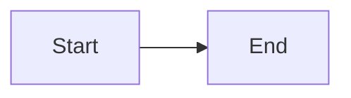

# Markdown Plugin

The `@jay-framework/markdown` plugin renders markdown content as HTML in jay-html pages. It provides three headless components.

## Components

### markdown-pages — Directory to pages

Scans a directory of `.md` files and provides page data. Each file becomes a routable page.

```html
<script type="application/jay-headless"
  plugin="@jay-framework/markdown"
  contract="markdown-pages"
  key="post">
  contentDir: ./content
</script>
```

The component provides these ViewState fields (all slow phase):
- `{post.title}` — title from frontmatter
- `{post.content}` — rendered HTML
- `{post.description}` — description from frontmatter
- `{post.date}` — ISO date string
- `{post.tags}` — array with `{name}` field (use with forEach)
- `{post.frontmatter}` — full frontmatter as JSON string

SEO head tags (`<title>`, `<meta description>`, `og:title`, etc.) are injected automatically from frontmatter.

### markdown-content — Static inline renderer

Renders a markdown string at build time. Use for static content embedded in a page.

```html
<jay:markdown-content markdown="{myMarkdownField}">
  <div class="md">{html}</div>
</jay:markdown-content>
```

### markdown-live — Dynamic renderer

Renders markdown that can change at request time or on the client. Ships the parser to the browser.

```html
<jay:markdown-live markdown="{dynamicContent}">
  <div class="md">{html}</div>
</jay:markdown-live>
```

## Markdown File Format

```markdown
---
title: Getting Started
date: 2026-07-15
description: A guide to getting started
author: Jane Doe
tags: [tutorial, beginner]
---

# Getting Started

Your content here with **bold**, *italic*, and [links](https://example.com).
```

### Frontmatter Fields

| Field | Purpose | Auto-injected as |
|---|---|---|
| `title` | Page title | `<title>`, `og:title` |
| `description` | SEO description | `<meta description>`, `og:description` |
| `date` | Publish date | `article:published_time` |
| `author` | Author name | `<meta author>` |
| `image` | Cover image | `og:image` |
| `canonical` | Canonical URL | `<link canonical>` |

Any other field (e.g., `category: guides`) becomes `<meta name="category" content="guides">`.

## Code Highlighting

Code fences are highlighted with CSS classes. Supported languages: JavaScript/TypeScript, HTML, CSS, YAML, JSON, Bash, Python.

````markdown
```typescript
const hello = 'world';
```
````

Output: `<pre class="md-code"><code class="language-typescript">...</code></pre>` with `<span class="token keyword">`, `<span class="token string">`, etc.

## Mermaid Diagrams

Mermaid fences render as styled blocks:

````markdown

````

Output: `<div class="md-mermaid"><pre class="md-mermaid-source">...</pre></div>`

## Theme CSS

Import a theme in your project CSS:

```css
@import '@jay-framework/markdown/themes/markdown-blog.css';
```

Available themes:
- `markdown-default.css` — clean, neutral
- `markdown-docs.css` — documentation style (narrower, tighter)
- `markdown-blog.css` — blog style (wider body text, generous spacing)

Override via CSS custom properties:

```css
.md {
  --md-color-link: var(--accent);
  --md-color-heading: var(--text-primary);
  --md-color-code-bg: var(--bg-secondary);
}
```
