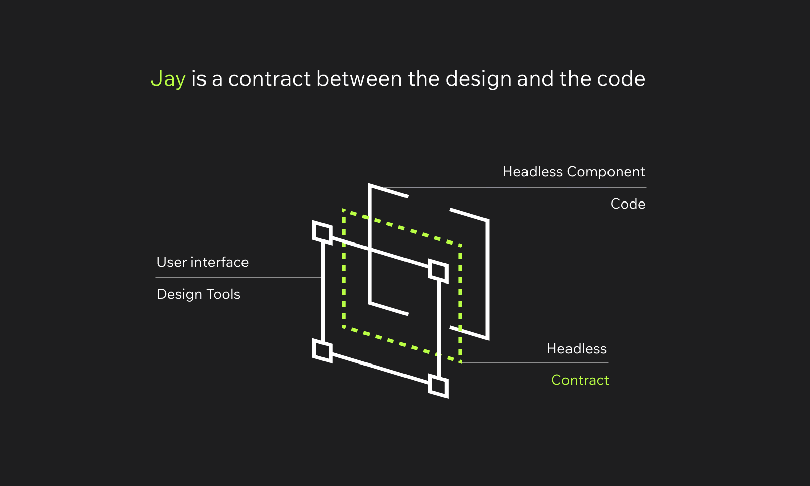

# The Jay Project

**Experimental Framework!!**



**Experimental Framework!!**

Jay is aiming to solve the design to code challenge. How designers and developers cooperate on a software project.
**The designer to use any design tool, from which `jay-html` files are generated. The `jay-html` files include the UI as well
as the contract between design and code, which the developer imports when coding Headless Components**, or
**The developer creates an Headless Component from which a contract is extracted, loaded into the designer design tool to
build the UI with**.

# Key Concepts of Jay

- Jay is a contract between design tools and headless components.
- Jay allows the designer, in their design tools, to create the user interface and deploy the application (yes, the designer)
  pending CI flows.
- Jay frees the developer from writing HTML, CSS and JSX.
- Jay Components are headless components, who can be tested and verified regardless of the UI.
- Jay can generate React applications, reusing all the existing React ecosystem
- Jay can generate Jay native applications, which enables way more aggressive optimizations
- Jay can generate safe 3rd party applications, allowing to incorporate 3rd party components and plugins in isolation,
  with next to zero performance and DevEx impact.
- **Jay can have headless components in packages and build a website without coding, just reusing headless components from packages, providing only the design in the website.**

# Component Types in Jay

Jay supports three types of components, each serving different use cases:

## Headless Components

- **Definition**: Components that define only the contract (data structure and behavior) without any UI
- **Created with**: `makeJayComponent` + contract files (`.jay-contract`)
- **Use case**: Reusable logic that can be used across different UI designs
- **Example**: A counter component that provides count state and increment/decrement functions

## Headfull Components

- **Definition**: Components that include both the contract and the UI design
- **Created with**: `makeJayComponent` + jay-html files (`.jay-html`)
- **Use case**: Complete components with specific UI design that can be reused
- **Example**: A counter component with specific styling and layout

## Fullstack Components

- **Definition**: Components that support server-side rendering with client-side interactivity
- **Created with**: `makeJayStackComponent` + either jay-html files or contract files
- **Use case**: Web applications that need SEO, performance, and interactivity
- **Features**:
  - Slow rendering (semi-static data)
  - Fast rendering (dynamic data)
  - Client-side interactivity
  - URL parameter handling
  - Context injection

# Why Jay?

Jay set out to solve the
[Design handover problem](./design-log/000%20-%20design%20handover%20problem.md).
The solution for the handover problem, introducing a contract, is actually a solution for another problem of
[Extending user interface with 3rd party components](./design-log/001%20-%203rd%20party%20code%20problem.md).

# Quick intro to Jay

## Jay Contract

A Jay Contract includes 3 elements

1. The `view state` - data that a headless Jay Component hands over to the view or Jay Element to render
2. The `refs` - named html elements or components in the view (Jay Element) to interact with
3. The `variants` - design variations or states that appear in the contract as booleans or enumerations.

## Jay Element / the view

The jay element is a `jay-html` file is **expected to be generated from design tools** of an extended HTML format.
**No developers should write HTML / CSS / JSX anymore!**

```html
<html>
  <head>
    <script type="application/yaml-jay">
      data:
        count: number
    </script>
  </head>
  <body>
    <div>
      <button ref="subtracter">-</button>
      <span style="margin: 0 16px">{count}</span>
      <button ref="adder-button">+</button>
    </div>
  </body>
</html>
```

Read more about Jay Elements format in [jay-file.md](packages%2Fcompiler%2Fcompiler%2Fdocs%2Fjay-file.md)

## Jay Component / the headless component

Jay Components are headless component working with the contract TS `.d.ts` files generated from the `jay-html`.

```typescript
import { render, CounterElementRefs } from './counter.jay-html';
import { createSignal, makeJayComponent, Props } from 'jay-component';

export interface CounterProps {
  initialValue: number;
}

function CounterConstructor({ initialValue }: Props<CounterProps>, refs: CounterElementRefs) {
  const [count, setCount] = createSignal(initialValue);

  refs.subtracter.onclick(() => setCount(count() - 1));
  refs.adderButton.onclick(() => setCount(count() + 1));

  return {
    render: () => ({ count }),
  };
}

export const Counter = makeJayComponent(render, CounterConstructor);
```

Read more about Jay Components in [readme.md](packages%2Fruntime%2Fcomponent%2Freadme.md)

## Jay Stack Component / the fullstack component

Jay Stack Components provide server-side rendering with client-side interactivity using the fluent builder API.

### Headfull Fullstack Component (with jay-html)

```typescript
import { PageContract, PageElementRefs } from './page.jay-html';
import { makeJayStackComponent, partialRender } from 'jay-fullstack-component';

export const page = makeJayStackComponent<PageContract>()
  .withProps<PageProps>()
  .withSlowlyRender(async (props) => {
    return partialRender({ title: 'My Page', content: 'Static content' }, { pageId: '1' });
  })
  .withFastRender(async (props) => {
    return partialRender({ dynamicData: 'Fast changing data' }, { pageId: '1' });
  })
  .withInteractive((props, refs) => {
    return {
      render: () => ({ interactiveData: 'Client-side data' }),
    };
  });
```

### Headless Fullstack Component (with contract)

```typescript
import { ComponentContract } from './component.jay-contract';
import { makeJayStackComponent, partialRender } from 'jay-fullstack-component';

export const component = makeJayStackComponent<ComponentContract>()
  .withProps()
  .withSlowlyRender(async () => {
    return partialRender({ content: 'This is from the headless component' }, {});
  });
```

Read more about Jay Stack Components in [readme.md](packages%2Fjay-stack%2Ffull-stack-component%2FREADME.md)

# Examples

Jay example projects can be found at the examples folder.

To build and run the examples, run in the jay project root:

```shell
yarn install
yarn build
```

Then, under each example open the `html` files under the `dist` folder.

The examples are organized into 5 categories

- Jay examples
  - [counter](examples%2Fjay%2Fcounter) - simple counter
  - [form](examples%2Fjay%2Fform) - simple form
  - [mini-benchmark](examples%2Fjay%2Fmini-benchmark) - mini benchmark to show Jay performance, with and without security
  - [scrum-board](examples%2Fjay%2Fscrum-board) - scrum board showing 3 levels of nested components
  - [todo](examples%2Fjay%2Ftodo) - todo list as two levels of nested components
  - [todo-one-flat-component](examples%2Fjay%2Ftodo-one-flat-component) - todo list as one big component
  - [todo-rollup-build](examples%2Fjay%2Ftodo-rollup-build) - todo list built using rollup and not using vite
  - [tree](examples%2Fjay%2Ftree) - a recursive tree example
- Jay Context
  - [scrum-board-with-context](examples%2Fjay-context%2Fscrum-board-with-context) - the same scrum board example using jay context
  - [todo-with-context](examples%2Fjay-context%2Ftodo-with-context) - the same todo list example using jay context
- Jay Low Leven APIs
  - [counter-raw](examples%2Fjay-low-level-apis%2Fcounter-raw) - counter example not using the Jay Component APIs. Only using jay-runtime.
  - [todo-raw](examples%2Fjay-low-level-apis%2Ftodo-raw) - todo list not using the Jay Component APIs. Only using jay-runtime.
- Jay Stack
  - [fake-shop](examples%2Fjay-stack%2Ffake-shop) - fullstack e-commerce example
  - [mood-tracker-plugin](examples%2Fjay-stack%2Fmood-tracker-plugin) - plugin system example
- React
  - [mini-benchmark-react](examples%2Freact%2Fmini-benchmark-react) - the same mini benchmark implemented as a React application for comparison.

# Design log

The design log is a log of design decisions taken when building Jay.
It is organized in chronological order.

- The design log is not documentation of Jay. It documents the design decisions taken over time, not the current product.
- Each document is true to the time it was written. If that was updated later on, a new document will introduce the reasons why.

# Contribution

## Development Environment Setup

Install Node version from [./.nvmrc]. Recommended to use [nvm](https://github.com/nvm-sh/nvm).

```shell
# setup yarn
npm i -g npm # making sure you're using newest npm
npm i -g corepack
corepack enable
yarn set version 3.6.4
npm run reinstall

yarn run build
```

Mark `.yarn` directory as excluded in IntelliJ.

## Development Environment Setup

For IntelliJ IDEA, copy vitest runtime configuration to show console logs in test results:

```shell
cp -r dev-environment/editor-setup/idea .idea/
```

Afterward, delete all the Vitest configurations (Run -> Edit Configurations) and restart IntelliJ.

During development, it's convenient to watch for changes.
You can run the following command from root to watch for all the packages,
or run it from the specific package.

```shell
yarn build:watch
```

### Running commands from packages

If you get errors of some dependency not found when running commands from packages, try running them with yarn:

```bash
yarn run build # for commands
```

### Creating a pull request

Before creating a pull request, make sure that all the code compilers and tests pass.
There is a single command to do it for all the packages.
Run it from jay project root:

```bash
yarn confirm
```
